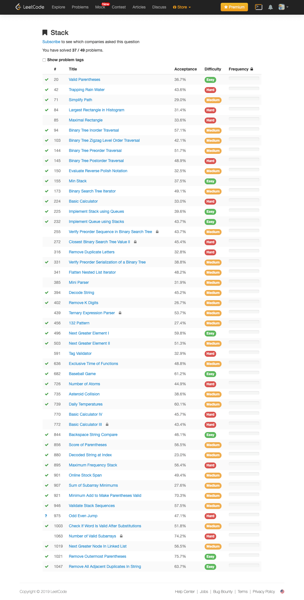
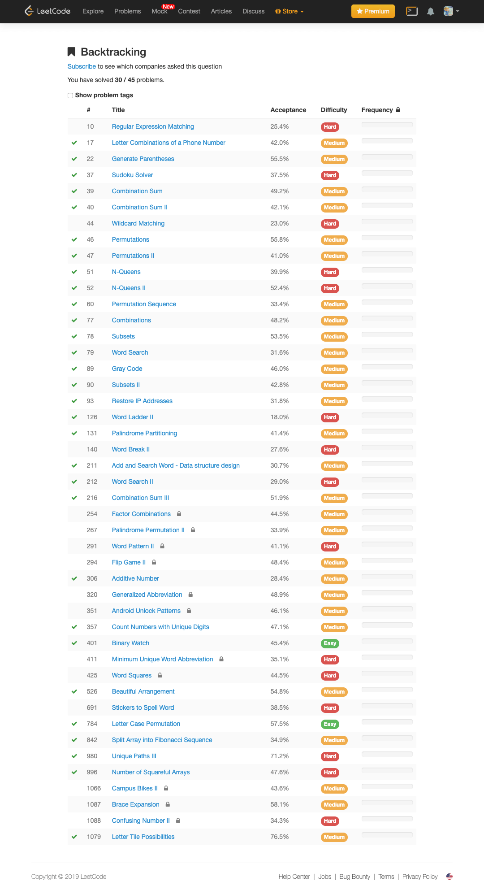
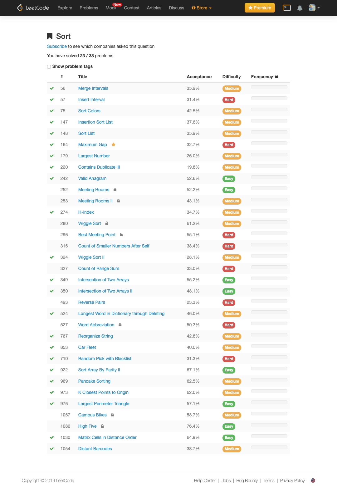
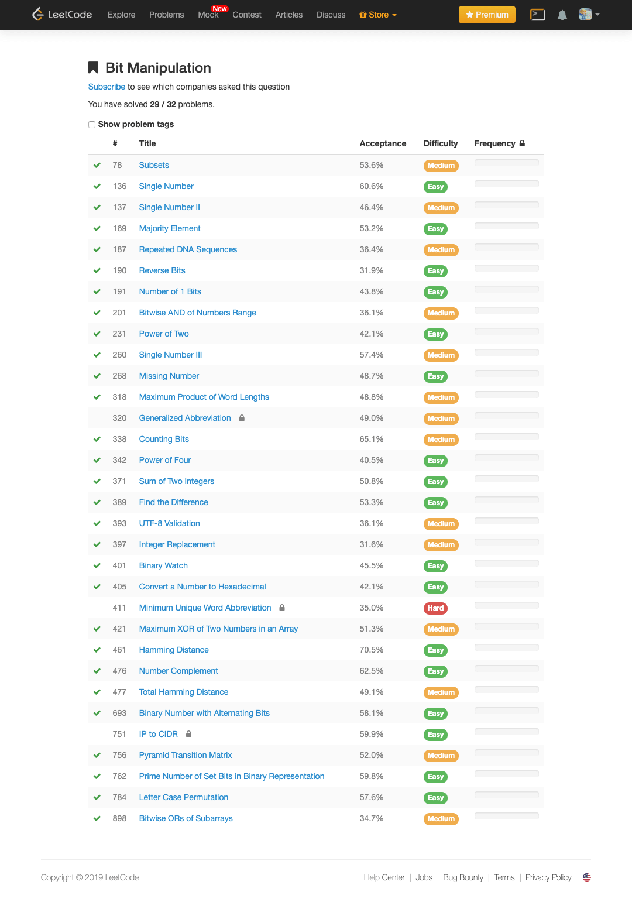
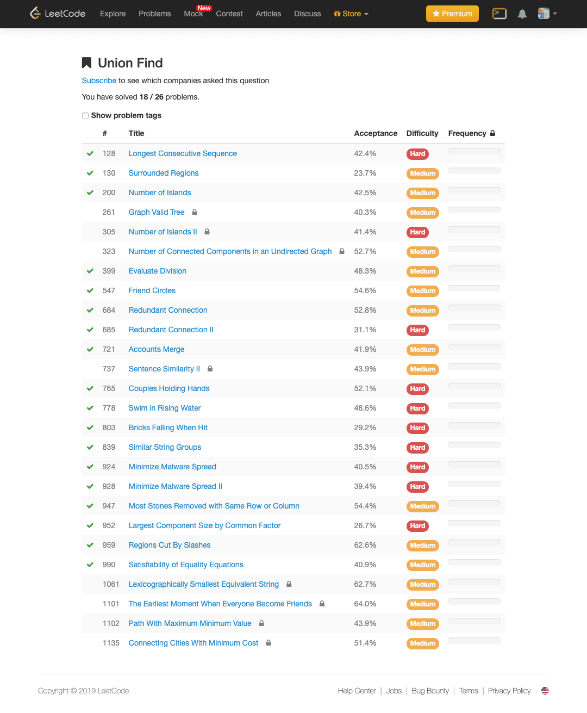
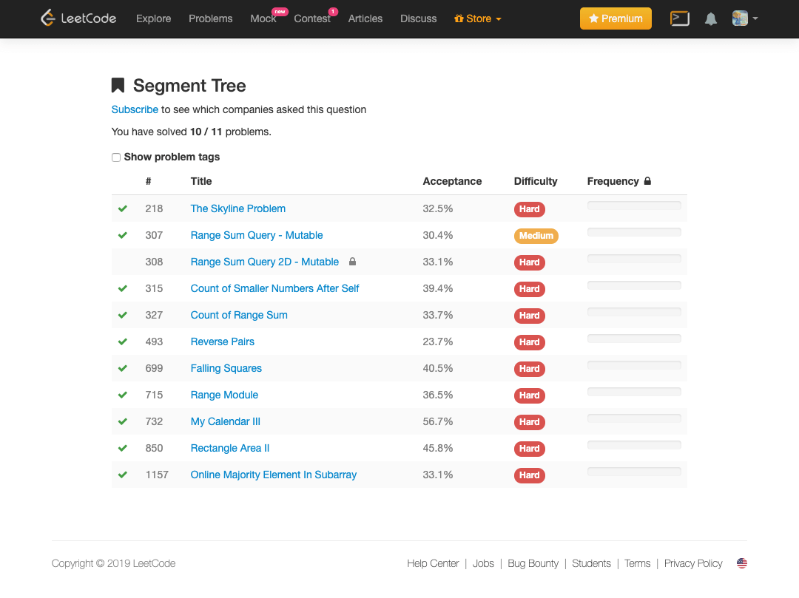
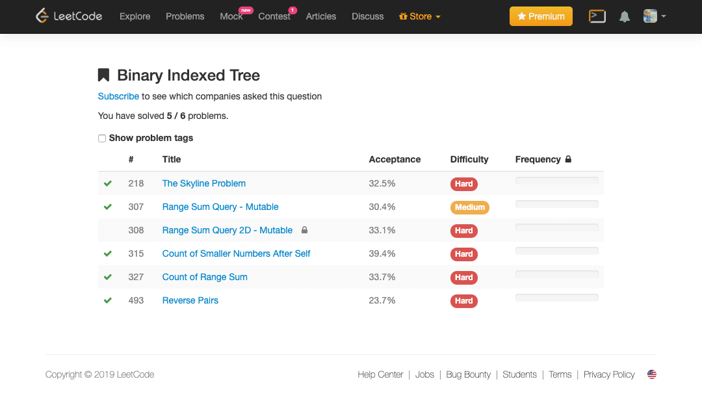

# LeetCode in Go
[LeetCode Online Judge](https://leetcode.com/) is a website containing many **algorithm questions**. Most of them are real interview questions of **Google, Facebook, LinkedIn, Apple**, etc. This repo shows my solutions in Go with the code style strictly follows the [Google Golang Style Guide](https://github.com/golang/go/wiki/CodeReviewComments). Please feel free to reference and **STAR** to support this repo, thank you!


<p align='center'>

</p>

<p align='center'>
<a href="https://github.com/halfrost/LeetCode-Go/releases/" rel="nofollow"></a>


<!---->


</p>

<p align='center'>
<a href="https://github.com/halfrost/LeetCode-Go/blob/master/LICENSE"></a>

<a href="https://leetcode.com/halfrost/">

<a href="https://halfrost.com"></a>
<a href="http://weibo.com/halfrost"></a>
<a href="https://twitter.com/halffrost"></a>
<a href="https://www.zhihu.com/people/halfrost/activities"></a>

<a href="https://github.com/halfrost/LeetCode-Go/pulls"></a>
</p>

支持 Progressive Web Apps 和 Dark Mode 的题解电子书《LeetCode Cookbook》 <a href="https://books.halfrost.com/leetcode/" rel="nofollow">Online Reading</a>

<p align='center'>
<a href="https://books.halfrost.com/leetcode/"></a>
<a href="https://books.halfrost.com/leetcode/"></a>
</p>

离线版本的电子书《LeetCode Cookbook》PDF <a href="https://github.com/halfrost/LeetCode-Go/releases/" rel="nofollow">Download here</a>

<p align='center'>
<a href="https://github.com/halfrost/LeetCode-Go/releases/"></a>
</p>

通过 iOS / Android 浏览器安装 PWA 版《LeetCode Cookbook》至设备桌面随时学习

<p align='center'>
<a href="https://books.halfrost.com/leetcode/"></a>
<a href="https://books.halfrost.com/leetcode/"></a>
<a href="https://books.halfrost.com/leetcode/"></a>
</p>


## Data Structures

> 标识了 ✅ 的专题是完成所有题目了的，没有标识的是还没有做完所有题目的

<a href="https://books.halfrost.com/leetcode/"></a>

* [Array](#array)
* [String](#string)
* [✅ Two Pointers](#two-pointers)
* [✅ Linked List](#linked-list)
* [✅ Stack](#stack)
* [Tree](#tree)
* [Dynamic programming](#dynamic-programming)
* [✅ Backtracking](#backtracking)
* [Depth First Search](#depth-first-search)
* [Breadth First Search](#breadth-first-search)
* [Binary Search](#binary-search)
* [Math](#math)
* [Hash Table](#hash-table)
* [✅ Sort](#sort)
* [✅ Bit Manipulation](#bit-manipulation)
* [✅ Union Find](#union-find)
* [✅ Sliding Window](#sliding-window)
* [✅ Segment Tree](#segment-tree)
* [✅ Binary Indexed Tree](#binary-indexed-tree)

| 数据结构 | 变种 | 相关题目 | 讲解文章 | 
|:-------:|:-------|:------|:------|
|顺序线性表：向量||||
|单链表|1. 双向链表<br>2. 静态链表<br>3. 对称矩阵<br>4. 稀疏矩阵|||
|哈希表|1. 散列函数<br>2. 解决碰撞/填充因子<br>|||
|栈和队列|1. 广义栈<br>2. 双端队列<br>|||
|队列|1. 链表实现<br>2. 循环数组实现<br>3. 双端队列|||
|字符串|1. KMP算法<br>2. 有限状态自动机<br>3. 模式匹配有限状态自动机<br>4. BM 模式匹配算法<br>5. BM-KMP 算法<br>6. BF 算法|||
|树|1. 二叉树<br>2. 并查集<br>3. Huffman 树|||
|数组实现的堆|1. 极大堆和极小堆<br>2. 极大极小堆<br>3. 双端堆<br>4. d 叉堆|||
|树实现的堆|1. 左堆<br>2. 扁堆<br>3. 二项式堆<br>4. 斐波那契堆<br>5. 配对堆|||
|查找|1. 哈希表<br>2. 跳跃表<br>3. 排序二叉树<br>4. AVL 树<br>5. B 树 / B+ 树 / B* 树<br>6. AA 树<br>7. 红黑树<br>8. 排序二叉堆<br>9. Splay 树<br>10. 双链树<br>11. Trie 树<br>12. R 树|||
|--------------------------------------------|--------------------------------------------------------------------------------------------|---------------------------|-----------------------------------|


## Algorithm


| 算法 | 具体类型 | 相关题目 | 讲解文章 | 
|:-------:|:-------|:------|:------|
|排序算法|1. 冒泡排序<br>2. 插入排序<br>3. 选择排序<br>4. 希尔 Shell 排序<br>5. 快速排序<br>6. 归并排序<br>7. 堆排序<br>8. 线性排序算法<br>9. 自省排序<br>10. 间接排序<br>11. 计数排序<br>12. 基数排序<br>13. 桶排序<br>14. 外部排序 - k 路归并败者树<br>15. 外部排序 - 最佳归并树|||
|递归与分治||1. 二分搜索/查找<br>2. 大整数的乘法<br>3. Strassen 矩阵乘法<br>4. 棋盘覆盖<br>5. 合并排序<br>6. 快速排序<br>7. 线性时间选择<br>8. 最接近点对问题<br>9. 循环赛日程表<br>||
|动态规划||1. 矩阵连乘问题<br>2. 最长公共子序列<br>3. 最大子段和<br>4. 凸多边形最优三角剖分<br>5. 多边形游戏<br>6. 图像压缩<br>7. 电路布线<br>8. 流水作业调度<br>9. 0-1 背包问题/背包九讲<br>10. 最优二叉搜索树<br>11. 动态规划加速原理<br>12. 树型 DP<br>||
|贪心||1. 活动安排问题<br>2. 最优装载<br>3. 哈夫曼编码<br>4. 单源最短路径<br>5. 最小生成树<br>6. 多机调度问题<br>||
|回溯法||1. 装载问题<br>2. 批处理作业调度<br>3. 符号三角形问题<br>4. n 后问题<br>5. 0-1 背包问题<br>6. 最大团问题<br>7. 图的 m 着色问题<br>8. 旅行售货员问题<br>9. 圆排列问题<br>10. 电路板排列问题<br>11. 连续邮资问题<br>||
|搜索|1. 枚举<br>2. DFS<br>3. BFS<br>4. 启发式搜索<br>|||
|随机化|1. 随机数<br>2. 数值随机化算法<br>3. Sherwood 舍伍德算法<br>4. Las Vegas 拉斯维加斯算法<br>5. Monte Carlo 蒙特卡罗算法<br>|1. 计算 π 值<br>2. 计算定积分<br>3. 解非线性方程组<br>4. 线性时间选择算法<br>5. 跳跃表<br>6. n 后问题<br>7. 整数因子分解<br>8. 主元素问题<br>9. 素数测试<br>||
|图论|1. 遍历 DFS / BFS<br>2. AOV / AOE 网络<br>3. Kruskal 算法(最小生成树)<br>4. Prim 算法(最小生成树)<br>5. Boruvka 算法(最小生成树)<br>6. Dijkstra 算法(单源最短路径)<br>7. Bellman-Ford 算法(单源最短路径)<br>8. SPFA 算法(单源最短路径)<br>9. Floyd 算法(多源最短路径)<br>10. Johnson 算法(多源最短路径)<br>11. Fleury 算法(欧拉回路)<br>12. Ford-Fulkerson 算法(最大网络流增广路)<br>13. Edmonds-Karp 算法(最大网络流)<br>14. Dinic 算法(最大网络流)<br>15. 一般预流推进算法<br>16. 最高标号预流推进 HLPP 算法<br>17. Primal-Dual 原始对偶算法(最小费用流)18. Kosaraju 算法(有向图强连通分量)<br>19. Tarjan 算法(有向图强连通分量)<br>20. Gabow 算法(有向图强连通分量)<br>21. 匈牙利算法(二分图匹配)<br>22. Hopcroft－Karp 算法(二分图匹配)<br>23. kuhn munkras 算法(二分图最佳匹配)<br>24. Edmonds’ Blossom-Contraction 算法(一般图匹配)<br>|1. 图遍历<br>2. 有向图和无向图的强弱连通性<br>3. 割点/割边<br>3. AOV 网络和拓扑排序<br>4. AOE 网络和关键路径<br>5. 最小代价生成树/次小生成树<br>6. 最短路径问题/第 K 短路问题<br>7. 最大网络流问题<br>8. 最小费用流问题<br>9. 图着色问题<br>10. 差分约束系统<br>11. 欧拉回路<br>12. 中国邮递员问题<br>13. 汉密尔顿回路<br>14. 最佳边割集/最佳点割集/最小边割集/最小点割集/最小路径覆盖/最小点集覆盖 <br>15. 边覆盖集<br>16. 二分图完美匹配和最大匹配问题<br>17. 仙人掌图<br>18. 弦图<br>19. 稳定婚姻问题<br>20. 最大团问题<br>||
|数论||1. 最大公约数<br> 2. 最小公倍数<br>3. 分解质因数<br>4. 素数判定<br>5. 进制转换<br>6. 高精度计算<br>7. 整除问题<br>8. 同余问题<br>9. 欧拉函数<br>10. 扩展欧几里得<br>11. 置换群<br>12. 母函数<br>13. 离散变换<br>14. 康托展开<br>15. 矩阵<br>16. 向量<br>17. 线性方程组<br>18. 线性规划<br> ||
|几何||1. 凸包 - Gift wrapping<br>2. 凸包 - Graham scan<br>3. 线段问题<br> 4. 多边形和多面体相关问题<br>||
|NP 完全|1. 计算模型<br>2. P 类与 NP 类问题<br>3. NP 完全问题<br>4. NP 完全问题的近似算法<br>|1. 随机存取机 RAM<br>2. 随机存取存储程序机 RASP<br>3. 图灵机<br>4. 非确定性图灵机<br>5. P 类与 NP 类语言<br>6. 多项式时间验证<br>7. 多项式时间变换<br>8. Cook定理<br>9. 合取范式的可满足性问题 CNF-SAT<br>10. 3 元合取范式的可满足性问题 3-SAT<br>11. 团问题 CLIQUE<br>12. 顶点覆盖问题 VERTEX-COVER<br>13. 子集和问题 SUBSET-SUM<br>14. 哈密顿回路问题 HAM-CYCLE<br>15. 旅行售货员问题 TSP<br>16. 顶点覆盖问题的近似算法<br>17. 旅行售货员问题近似算法<br>18. 具有三角不等式性质的旅行售货员问题<br>19. 一般的旅行售货员问题<br>20. 集合覆盖问题的近似算法<br>21. 子集和问题的近似算法<br>22. 子集和问题的指数时间算法<br>23. 子集和问题的多项式时间近似格式<br>||
|------------|------------------------------------------------------------------|-----------------------------------------------------------------|--------------------|


## LeetCode Problems

## 一. 目录

| #    |  Title                                                       |  Solution                                                                                                                                           |  Acceptance |  Difficulty |  Frequency |
|:--------:|:--------------------------------------------------------------|:--------:|:--------:|:--------:|:--------:|
| 0001 | Two Sum                                                                             | [Go](https://github.com/halfrost/LeetCode-Go/tree/master/leetcode/0001.Two-Sum)                                                    | 45.6%      | Easy       |           |
| 0002 | Add Two Numbers                                                                     | [Go](https://github.com/halfrost/LeetCode-Go/tree/master/leetcode/0002.Add-Two-Numbers)                                            | 33.9%      | Medium     |           |
| 0003 | Longest Substring Without Repeating Characters                                      | [Go](https://github.com/halfrost/LeetCode-Go/tree/master/leetcode/0003.Longest-Substring-Without-Repeating-Characters)             | 30.4%      | Medium     |           |
| 0004 | Median of Two Sorted Arrays                                                         | [Go](https://github.com/halfrost/LeetCode-Go/tree/master/leetcode/0004.Median-of-Two-Sorted-Arrays)                                | 29.6%      | Hard       |           |
| 0005 | Longest Palindromic Substring                                                       |                                                                                                                                    | 29.4%      | Medium     |           |
| 0006 | ZigZag Conversion                                                                   |                                                                                                                                    | 36.3%      | Medium     |           |
| 0007 | Reverse Integer                                                                     | [Go](https://github.com/halfrost/LeetCode-Go/tree/master/leetcode/0007.Reverse-Integer)                                            | 25.8%      | Easy       |           |
| 0008 | String to Integer (atoi)                                                            |                                                                                                                                    | 15.4%      | Medium     |           |
| 0009 | Palindrome Number                                                                   | [Go](https://github.com/halfrost/LeetCode-Go/tree/master/leetcode/0009.Palindrome-Number)                                                                                                                                    | 48.4%      | Easy       |           |
| 0010 | Regular Expression Matching                                                         |                                                                                                                                    | 26.8%      | Hard       |           |
| 0011 | Container With Most Water                                                           | [Go](https://github.com/halfrost/LeetCode-Go/tree/master/leetcode/0011.Container-With-Most-Water)                                  | 50.8%      | Medium     |           |
| 0012 | Integer to Roman                                                                    |                                                                                                                                    | 55.0%      | Medium     |           |
| 0013 | Roman to Integer                                                                    | [Go](https://github.com/halfrost/LeetCode-Go/tree/master/leetcode/0013.Roman-to-Integer)                                                                                                                                   | 55.7%      | Easy       |           |
| 0014 | Longest Common Prefix                                                               |                                                                                                                                    | 35.4%      | Easy       |           |
| 0015 | 3Sum                                                                                | [Go](https://github.com/halfrost/LeetCode-Go/tree/master/leetcode/0015.3Sum)                                                       | 26.8%      | Medium     |           |
| 0016 | 3Sum Closest                                                                        | [Go](https://github.com/halfrost/LeetCode-Go/tree/master/leetcode/0016.3Sum-Closest)                                               | 46.0%      | Medium     |           |
| 0017 | Letter Combinations of a Phone Number                                               | [Go](https://github.com/halfrost/LeetCode-Go/tree/master/leetcode/0017.Letter-Combinations-of-a-Phone-Number)                      | 46.8%      | Medium     |           |
| 0018 | 4Sum                                                                                | [Go](https://github.com/halfrost/LeetCode-Go/tree/master/leetcode/0018.4Sum)                                                       | 33.6%      | Medium     |           |
| 0019 | Remove Nth Node From End of List                                                    | [Go](https://github.com/halfrost/LeetCode-Go/tree/master/leetcode/0019.Remove-Nth-Node-From-End-of-List)                           | 35.2%      | Medium     |           |
| 0020 | Valid Parentheses                                                                   | [Go](https://github.com/halfrost/LeetCode-Go/tree/master/leetcode/0020.Valid-Parentheses)                                          | 38.9%      | Easy       |           |
| 0021 | Merge Two Sorted Lists                                                              | [Go](https://github.com/halfrost/LeetCode-Go/tree/master/leetcode/0021.Merge-Two-Sorted-Lists)                                     | 53.5%      | Easy       |           |
| 0022 | Generate Parentheses                                                                | [Go](https://github.com/halfrost/LeetCode-Go/tree/master/leetcode/0022.Generate-Parentheses)                                       | 62.6%      | Medium     |           |
| 0023 | Merge k Sorted Lists                                                                | [Go](https://github.com/halfrost/LeetCode-Go/tree/master/leetcode/0023.Merge-k-Sorted-Lists)                                       | 40.2%      | Hard       |           |
| 0024 | Swap Nodes in Pairs                                                                 | [Go](https://github.com/halfrost/LeetCode-Go/tree/master/leetcode/0024.Swap-Nodes-in-Pairs)                                        | 50.3%      | Medium     |           |
| 0025 | Reverse Nodes in k-Group                                                            | [Go](https://github.com/halfrost/LeetCode-Go/tree/master/leetcode/0025.Reverse-Nodes-in-k-Group)                                   | 42.0%      | Hard       |           |
| 0026 | Remove Duplicates from Sorted Array                                                 | [Go](https://github.com/halfrost/LeetCode-Go/tree/master/leetcode/0026.Remove-Duplicates-from-Sorted-Array)                        | 45.1%      | Easy       |           |
| 0027 | Remove Element                                                                      | [Go](https://github.com/halfrost/LeetCode-Go/tree/master/leetcode/0027.Remove-Element)                                             | 48.2%      | Easy       |           |
| 0028 | Implement strStr()                                                                  | [Go](https://github.com/halfrost/LeetCode-Go/tree/master/leetcode/0028.Implement-strStr)                                           | 34.5%      | Easy       |           |
| 0029 | Divide Two Integers                                                                 | [Go](https://github.com/halfrost/LeetCode-Go/tree/master/leetcode/0029.Divide-Two-Integers)                                        | 16.4%      | Medium     |           |
| 0030 | Substring with Concatenation of All Words                                           | [Go](https://github.com/halfrost/LeetCode-Go/tree/master/leetcode/0030.Substring-with-Concatenation-of-All-Words)(是否还有更优解)         | 25.4%      | Hard       |           |
| 0031 | Next Permutation                                                                    |                                                                                                                                    | 32.6%      | Medium     |           |
| 0032 | Longest Valid Parentheses                                                           |                                                                                                                                    | 28.4%      | Hard       |           |
| 0033 | Search in Rotated Sorted Array                                                      | [Go](https://github.com/halfrost/LeetCode-Go/tree/master/leetcode/0033.Search-in-Rotated-Sorted-Array)                             | 34.5%      | Medium     |           |
| 0034 | Find First and Last Position of Element in Sorted Array                             | [Go](https://github.com/halfrost/LeetCode-Go/tree/master/leetcode/0034.Find-First-and-Last-Position-of-Element-in-Sorted-Array)    | 36.1%      | Medium     |           |
| 0035 | Search Insert Position                                                              | [Go](https://github.com/halfrost/LeetCode-Go/tree/master/leetcode/0035.Search-Insert-Position)                                     | 42.6%      | Easy       |           |
| 0036 | Valid Sudoku                                                                        | [Go](https://github.com/halfrost/LeetCode-Go/tree/master/leetcode/0036.Valid-Sudoku)                                               | 48.7%      | Medium     |           |
| 0037 | Sudoku Solver                                                                       | [Go](https://github.com/halfrost/LeetCode-Go/tree/master/leetcode/0037.Sudoku-Solver)                                              | 43.5%      | Hard       |           |
| 0038 | Count and Say                                                                       |                                                                                                                                    | 44.6%      | Easy       |           |
| 0039 | Combination Sum                                                                     | [Go](https://github.com/halfrost/LeetCode-Go/tree/master/leetcode/0039.Combination-Sum)                                            | 56.0%      | Medium     |           |
| 0040 | Combination Sum II                                                                  | [Go](https://github.com/halfrost/LeetCode-Go/tree/master/leetcode/0040.Combination-Sum-II)                                         | 48.1%      | Medium     |           |
| 0041 | First Missing Positive                                                              | [Go](https://github.com/halfrost/LeetCode-Go/tree/master/leetcode/0041.First-Missing-Positive)                                     | 32.0%      | Hard       |           |
| 0042 | Trapping Rain Water                                                                 | [Go](https://github.com/halfrost/LeetCode-Go/tree/master/leetcode/0042.Trapping-Rain-Water)                                        | 48.8%      | Hard       |           |
| 0043 | Multiply Strings                                                                    |                                                                                                                                    | 33.9%      | Medium     |           |
| 0044 | Wildcard Matching                                                                   |                                                                                                                                    | 24.7%      | Hard       |           |
| 0045 | Jump Game II                                                                        |                                                                                                                                    | 30.5%      | Hard       |           |
| 0046 | Permutations                                                                        | [Go](https://github.com/halfrost/LeetCode-Go/tree/master/leetcode/0046.Permutations)                                               | 63.5%      | Medium     |           |
| 0047 | Permutations II                                                                     | [Go](https://github.com/halfrost/LeetCode-Go/tree/master/leetcode/0047.Permutations-II)                                            | 46.4%      | Medium     |           |
| 0048 | Rotate Image                                                                        | [Go](https://github.com/halfrost/LeetCode-Go/tree/master/leetcode/0048.Rotate-Image)                                               | 56.6%      | Medium     |           |
| 0049 | Group Anagrams                                                                      | [Go](https://github.com/halfrost/LeetCode-Go/tree/master/leetcode/0049.Group-Anagrams)                                             | 56.8%      | Medium     |           |
| 0050 | Pow(x, n)                                                                           | [Go](https://github.com/halfrost/LeetCode-Go/tree/master/leetcode/0050.Powx-n)                                                     | 30.3%      | Medium     |           |
| 0051 | N-Queens                                                                            | [Go](https://github.com/halfrost/LeetCode-Go/tree/master/leetcode/0051.N-Queens)                                                   | 46.6%      | Hard       |           |
| 0052 | N-Queens II                                                                         | [Go](https://github.com/halfrost/LeetCode-Go/tree/master/leetcode/0052.N-Queens-II)                                                | 57.8%      | Hard       |           |
| 0053 | Maximum Subarray                                                                    | [Go](https://github.com/halfrost/LeetCode-Go/tree/master/leetcode/0053.Maximum-Subarray)                                           | 46.5%      | Easy       |           |
| 0054 | Spiral Matrix                                                                       | [Go](https://github.com/halfrost/LeetCode-Go/tree/master/leetcode/0054.Spiral-Matrix)                                              | 34.1%      | Medium     |           |
| 0055 | Jump Game                                                                           | [Go](https://github.com/halfrost/LeetCode-Go/tree/master/leetcode/0055.Jump-Game)                                                  | 34.6%      | Medium     |           |
| 0056 | Merge Intervals                                                                     | [Go](https://github.com/halfrost/LeetCode-Go/tree/master/leetcode/0056.Merge-Intervals)                                            | 39.3%      | Medium     |           |
| 0057 | Insert Interval                                                                     | [Go](https://github.com/halfrost/LeetCode-Go/tree/master/leetcode/0057.Insert-Interval)                                            | 33.5%      | Hard       |           |
| 0058 | Length of Last Word                                                                 |                                                                                                                                    | 32.6%      | Easy       |           |
| 0059 | Spiral Matrix II                                                                    | [Go](https://github.com/halfrost/LeetCode-Go/tree/master/leetcode/0059.Spiral-Matrix-II)                                           | 53.8%      | Medium     |           |
| 0060 | Permutation Sequence                                                                | [Go](https://github.com/halfrost/LeetCode-Go/tree/master/leetcode/0060.Permutation-Sequence)                                       | 38.4%      | Hard       |           |
| 0061 | Rotate List                                                                         | [Go](https://github.com/halfrost/LeetCode-Go/tree/master/leetcode/0061.Rotate-List)                                                | 30.0%      | Medium     |           |
| 0062 | Unique Paths                                                                        | [Go](https://github.com/halfrost/LeetCode-Go/tree/master/leetcode/0062.Unique-Paths)                                               | 54.1%      | Medium     |           |
| 0063 | Unique Paths II                                                                     | [Go](https://github.com/halfrost/LeetCode-Go/tree/master/leetcode/0063.Unique-Paths-II)                                            | 34.5%      | Medium     |           |
| 0064 | Minimum Path Sum                                                                    | [Go](https://github.com/halfrost/LeetCode-Go/tree/master/leetcode/0064.Minimum-Path-Sum)                                           | 54.4%      | Medium     |           |
| 0065 | Valid Number                                                                        |                                                                                                                                    | 15.3%      | Hard       |           |
| 0066 | Plus One                                                                            | [Go](https://github.com/halfrost/LeetCode-Go/tree/master/leetcode/0066.Plus-One)                                                   | 43.0%      | Easy       |           |
| 0067 | Add Binary                                                                          | [Go](https://github.com/halfrost/LeetCode-Go/tree/master/leetcode/0067.Add-Binary)                                                                                                                                    | 45.2%      | Easy       |           |
| 0068 | Text Justification                                                                  |                                                                                                                                    | 27.7%      | Hard       |           |
| 0069 | Sqrt(x)                                                                             | [Go](https://github.com/halfrost/LeetCode-Go/tree/master/leetcode/0069.Sqrtx)                                                      | 33.9%      | Easy       |           |
| 0070 | Climbing Stairs                                                                     | [Go](https://github.com/halfrost/LeetCode-Go/tree/master/leetcode/0070.Climbing-Stairs)                                            | 47.8%      | Easy       |           |
| 0071 | Simplify Path                                                                       | [Go](https://github.com/halfrost/LeetCode-Go/tree/master/leetcode/0071.Simplify-Path)                                              | 32.6%      | Medium     |           |
| 0072 | Edit Distance                                                                       |                                                                                                                                    | 44.8%      | Hard       |           |
| 0073 | Set Matrix Zeroes                                                                   |                                                                                                                                    | 43.1%      | Medium     |           |
| 0074 | Search a 2D Matrix                                                                  | [Go](https://github.com/halfrost/LeetCode-Go/tree/master/leetcode/0074.Search-a-2D-Matrix)                                         | 36.5%      | Medium     |           |
| 0075 | Sort Colors                                                                         | [Go](https://github.com/halfrost/LeetCode-Go/tree/master/leetcode/0075.Sort-Colors)                                                | 47.3%      | Medium     |           |
| 0076 | Minimum Window Substring                                                            | [Go](https://github.com/halfrost/LeetCode-Go/tree/master/leetcode/0076.Minimum-Window-Substring)                                   | 34.6%      | Hard       |           |
| 0077 | Combinations                                                                        | [Go](https://github.com/halfrost/LeetCode-Go/tree/master/leetcode/0077.Combinations)                                               | 54.7%      | Medium     |           |
| 0078 | Subsets                                                                             | [Go](https://github.com/halfrost/LeetCode-Go/tree/master/leetcode/0078.Subsets)                                                    | 61.9%      | Medium     |           |
| 0079 | Word Search                                                                         | [Go](https://github.com/halfrost/LeetCode-Go/tree/master/leetcode/0079.Word-Search)                                                | 35.6%      | Medium     |           |
| 0080 | Remove Duplicates from Sorted Array II                                              | [Go](https://github.com/halfrost/LeetCode-Go/tree/master/leetcode/0080.Remove-Duplicates-from-Sorted-Array-II)                     | 43.9%      | Medium     |           |
| 0081 | Search in Rotated Sorted Array II                                                   | [Go](https://github.com/halfrost/LeetCode-Go/tree/master/leetcode/0081.Search-in-Rotated-Sorted-Array-II)                          | 33.0%      | Medium     |           |
| 0082 | Remove Duplicates from Sorted List II                                               | [Go](https://github.com/halfrost/LeetCode-Go/tree/master/leetcode/0082.Remove-Duplicates-from-Sorted-List-II)                      | 36.8%      | Medium     |           |
| 0083 | Remove Duplicates from Sorted List                                                  | [Go](https://github.com/halfrost/LeetCode-Go/tree/master/leetcode/0083.Remove-Duplicates-from-Sorted-List)                         | 45.4%      | Easy       |           |
| 0084 | Largest Rectangle in Histogram                                                      | [Go](https://github.com/halfrost/LeetCode-Go/tree/master/leetcode/0084.Largest-Rectangle-in-Histogram)                             | 35.1%      | Hard       |           |
| 0085 | Maximal Rectangle                                                                   |                                                                                                                                    | 37.7%      | Hard       |           |
| 0086 | Partition List                                                                      | [Go](https://github.com/halfrost/LeetCode-Go/tree/master/leetcode/0086.Partition-List)                                             | 41.4%      | Medium     |           |
| 0087 | Scramble String                                                                     |                                                                                                                                    | 33.7%      | Hard       |           |
| 0088 | Merge Sorted Array                                                                  | [Go](https://github.com/halfrost/LeetCode-Go/tree/master/leetcode/0088.Merge-Sorted-Array)                                         | 39.4%      | Easy       |           |
| 0089 | Gray Code                                                                           | [Go](https://github.com/halfrost/LeetCode-Go/tree/master/leetcode/0089.Gray-Code)                                                  | 49.1%      | Medium     |           |
| 0090 | Subsets II                                                                          | [Go](https://github.com/halfrost/LeetCode-Go/tree/master/leetcode/0090.Subsets-II)                                                 | 47.1%      | Medium     |           |
| 0091 | Decode Ways                                                                         | [Go](https://github.com/halfrost/LeetCode-Go/tree/master/leetcode/0091.Decode-Ways)                                                | 24.6%      | Medium     |           |
| 0092 | Reverse Linked List II                                                              | [Go](https://github.com/halfrost/LeetCode-Go/tree/master/leetcode/0092.Reverse-Linked-List-II)                                     | 38.8%      | Medium     |           |
| 0093 | Restore IP Addresses                                                                | [Go](https://github.com/halfrost/LeetCode-Go/tree/master/leetcode/0093.Restore-IP-Addresses)                                       | 35.6%      | Medium     |           |
| 0094 | Binary Tree Inorder Traversal                                                       | [Go](https://github.com/halfrost/LeetCode-Go/tree/master/leetcode/0094.Binary-Tree-Inorder-Traversal)                              | 63.3%      | Medium     |           |
| 0095 | Unique Binary Search Trees II                                                       | [Go](https://github.com/halfrost/LeetCode-Go/tree/master/leetcode/0095.Unique-Binary-Search-Trees-II)                              | 40.6%      | Medium     |           |
| 0096 | Unique Binary Search Trees                                                          | [Go](https://github.com/halfrost/LeetCode-Go/tree/master/leetcode/0096.Unique-Binary-Search-Trees)                                 | 52.9%      | Medium     |           |
| 0097 | Interleaving String                                                                 |                                                                                                                                    | 31.5%      | Hard       |           |
| 0098 | Validate Binary Search Tree                                                         | [Go](https://github.com/halfrost/LeetCode-Go/tree/master/leetcode/0098.Validate-Binary-Search-Tree)                                | 27.8%      | Medium     |           |
| 0099 | Recover Binary Search Tree                                                          | [Go](https://github.com/halfrost/LeetCode-Go/tree/master/leetcode/0099.Recover-Binary-Search-Tree)                                 | 39.6%      | Hard       |           |
| 0100 | Same Tree                                                                           | [Go](https://github.com/halfrost/LeetCode-Go/tree/master/leetcode/0100.Same-Tree)                                                  | 53.4%      | Easy       |           |
| 0101 | Symmetric Tree                                                                      | [Go](https://github.com/halfrost/LeetCode-Go/tree/master/leetcode/0101.Symmetric-Tree)                                             | 46.8%      | Easy       |           |
| 0102 | Binary Tree Level Order Traversal                                                   | [Go](https://github.com/halfrost/LeetCode-Go/tree/master/leetcode/0102.Binary-Tree-Level-Order-Traversal)                          | 54.5%      | Medium     |           |
| 0103 | Binary Tree Zigzag Level Order Traversal                                            | [Go](https://github.com/halfrost/LeetCode-Go/tree/master/leetcode/0103.Binary-Tree-Zigzag-Level-Order-Traversal)                   | 48.3%      | Medium     |           |
| 0104 | Maximum Depth of Binary Tree                                                        | [Go](https://github.com/halfrost/LeetCode-Go/tree/master/leetcode/0104.Maximum-Depth-of-Binary-Tree)                               | 66.0%      | Easy       |           |
| 0105 | Construct Binary Tree from Preorder and Inorder Traversal                           | [Go](https://github.com/halfrost/LeetCode-Go/tree/master/leetcode/0105.Construct-Binary-Tree-from-Preorder-and-Inorder-Traversal)  | 48.8%      | Medium     |           |
| 0106 | Construct Binary Tree from Inorder and Postorder Traversal                          | [Go](https://github.com/halfrost/LeetCode-Go/tree/master/leetcode/0106.Construct-Binary-Tree-from-Inorder-and-Postorder-Traversal) | 47.1%      | Medium     |           |
| 0107 | Binary Tree Level Order Traversal II                                                | [Go](https://github.com/halfrost/LeetCode-Go/tree/master/leetcode/0107.Binary-Tree-Level-Order-Traversal-II)                       | 53.5%      | Easy       |           |
| 0108 | Convert Sorted Array to Binary Search Tree                                          | [Go](https://github.com/halfrost/LeetCode-Go/tree/master/leetcode/0108.Convert-Sorted-Array-to-Binary-Search-Tree)                 | 57.9%      | Easy       |           |
| 0109 | Convert Sorted List to Binary Search Tree                                           | [Go](https://github.com/halfrost/LeetCode-Go/tree/master/leetcode/0109.Convert-Sorted-List-to-Binary-Search-Tree)                  | 47.6%      | Medium     |           |
| 0110 | Balanced Binary Tree                                                                | [Go](https://github.com/halfrost/LeetCode-Go/tree/master/leetcode/0110.Balanced-Binary-Tree)                                       | 43.5%      | Easy       |           |
| 0111 | Minimum Depth of Binary Tree                                                        | [Go](https://github.com/halfrost/LeetCode-Go/tree/master/leetcode/0111.Minimum-Depth-of-Binary-Tree)                               | 37.4%      | Easy       |           |
| 0112 | Path Sum                                                                            | [Go](https://github.com/halfrost/LeetCode-Go/tree/master/leetcode/0112.Path-Sum)                                                   | 41.1%      | Easy       |           |
| 0113 | Path Sum II                                                                         | [Go](https://github.com/halfrost/LeetCode-Go/tree/master/leetcode/0113.Path-Sum-II)                                                | 46.6%      | Medium     |           |
| 0114 | Flatten Binary Tree to Linked List                                                  | [Go](https://github.com/halfrost/LeetCode-Go/tree/master/leetcode/0114.Flatten-Binary-Tree-to-Linked-List)                         | 49.2%      | Medium     |           |
| 0115 | Distinct Subsequences                                                               |                                                                                                                                    | 38.2%      | Hard       |           |
| 0116 | Populating Next Right Pointers in Each Node                                         |                                                                                                                                    | 45.2%      | Medium     |           |
| 0117 | Populating Next Right Pointers in Each Node II                                      |                                                                                                                                    | 39.1%      | Medium     |           |
| 0118 | Pascal's Triangle                                                                   |                                                                                                                                    | 52.4%      | Easy       |           |
| 0119 | Pascal's Triangle II                                                                |                                                                                                                                    | 49.0%      | Easy       |           |
| 0120 | Triangle                                                                            | [Go](https://github.com/halfrost/LeetCode-Go/tree/master/leetcode/0120.Triangle)                                                   | 44.1%      | Medium     |           |
| 0121 | Best Time to Buy and Sell Stock                                                     | [Go](https://github.com/halfrost/LeetCode-Go/tree/master/leetcode/0121.Best-Time-to-Buy-and-Sell-Stock)                            | 50.4%      | Easy       |           |
| 0122 | Best Time to Buy and Sell Stock II                                                  | [Go](https://github.com/halfrost/LeetCode-Go/tree/master/leetcode/0122.Best-Time-to-Buy-and-Sell-Stock-II)                         | 56.9%      | Easy       |           |
| 0123 | Best Time to Buy and Sell Stock III                                                 |                                                                                                                                    | 37.4%      | Hard       |           |
| 0124 | Binary Tree Maximum Path Sum                                                        | [Go](https://github.com/halfrost/LeetCode-Go/tree/master/leetcode/0124.Binary-Tree-Maximum-Path-Sum)                               | 34.3%      | Hard       |           |
| 0125 | Valid Palindrome                                                                    | [Go](https://github.com/halfrost/LeetCode-Go/tree/master/leetcode/0125.Valid-Palindrome)                                           | 36.7%      | Easy       |           |
| 0126 | Word Ladder II                                                                      | [Go](https://github.com/halfrost/LeetCode-Go/tree/master/leetcode/0126.Word-Ladder-II)                                             | 22.1%      | Hard       |           |
| 0127 | Word Ladder                                                                         | [Go](https://github.com/halfrost/LeetCode-Go/tree/master/leetcode/0127.Word-Ladder)                                                | 29.5%      | Medium     |           |
| 0128 | Longest Consecutive Sequence                                                        | [Go](https://github.com/halfrost/LeetCode-Go/tree/master/leetcode/0128.Longest-Consecutive-Sequence)                               | 45.1%      | Hard       |           |
| 0129 | Sum Root to Leaf Numbers                                                            | [Go](https://github.com/halfrost/LeetCode-Go/tree/master/leetcode/0129.Sum-Root-to-Leaf-Numbers)                                   | 49.0%      | Medium     |           |
| 0130 | Surrounded Regions                                                                  | [Go](https://github.com/halfrost/LeetCode-Go/tree/master/leetcode/0130.Surrounded-Regions)                                         | 28.1%      | Medium     |           |
| 0131 | Palindrome Partitioning                                                             | [Go](https://github.com/halfrost/LeetCode-Go/tree/master/leetcode/0131.Palindrome-Partitioning)                                    | 47.5%      | Medium     |           |
| 0132 | Palindrome Partitioning II                                                          |                                                                                                                                    | 30.2%      | Hard       |           |
| 0133 | Clone Graph                                                                         |                                                                                                                                    | 34.7%      | Medium     |           |
| 0134 | Gas Station                                                                         |                                                                                                                                    | 38.5%      | Medium     |           |
| 0135 | Candy                                                                               |                                                                                                                                    | 31.6%      | Hard       |           |
| 0136 | Single Number                                                                       | [Go](https://github.com/halfrost/LeetCode-Go/tree/master/leetcode/0136.Single-Number)                                              | 65.5%      | Easy       |           |
| 0137 | Single Number II                                                                    | [Go](https://github.com/halfrost/LeetCode-Go/tree/master/leetcode/0137.Single-Number-II)                                           | 52.4%      | Medium     |           |
| 0138 | Copy List with Random Pointer                                                       |                                                                                                                                    | 36.3%      | Medium     |           |
| 0139 | Word Break                                                                          |                                                                                                                                    | 40.0%      | Medium     |           |
| 0140 | Word Break II                                                                       |                                                                                                                                    | 32.6%      | Hard       |           |
| 0141 | Linked List Cycle                                                                   | [Go](https://github.com/halfrost/LeetCode-Go/tree/master/leetcode/0141.Linked-List-Cycle)                                          | 41.1%      | Easy       |           |
| 0142 | Linked List Cycle II                                                                | [Go](https://github.com/halfrost/LeetCode-Go/tree/master/leetcode/0142.Linked-List-Cycle-II)                                       | 37.3%      | Medium     |           |
| 0143 | Reorder List                                                                        | [Go](https://github.com/halfrost/LeetCode-Go/tree/master/leetcode/0143.Reorder-List)                                               | 37.0%      | Medium     |           |
| 0144 | Binary Tree Preorder Traversal                                                      | [Go](https://github.com/halfrost/LeetCode-Go/tree/master/leetcode/0144.Binary-Tree-Preorder-Traversal)                             | 55.6%      | Medium     |           |
| 0145 | Binary Tree Postorder Traversal                                                     | [Go](https://github.com/halfrost/LeetCode-Go/tree/master/leetcode/0145.Binary-Tree-Postorder-Traversal)                            | 54.9%      | Hard       |           |
| 0146 | LRU Cache                                                                           |                                                                                                                                    | 33.1%      | Medium     |           |
| 0147 | Insertion Sort List                                                                 | [Go](https://github.com/halfrost/LeetCode-Go/tree/master/leetcode/0147.Insertion-Sort-List)                                        | 41.1%      | Medium     |           |
| 0148 | Sort List                                                                           | [Go](https://github.com/halfrost/LeetCode-Go/tree/master/leetcode/0148.Sort-List)                                                  | 42.3%      | Medium     |           |
| 0149 | Max Points on a Line                                                                |                                                                                                                                    | 16.9%      | Hard       |           |
| 0150 | Evaluate Reverse Polish Notation                                                    | [Go](https://github.com/halfrost/LeetCode-Go/tree/master/leetcode/0150.Evaluate-Reverse-Polish-Notation)                           | 36.3%      | Medium     |           |
| 0151 | Reverse Words in a String                                                           | [Go](https://github.com/halfrost/LeetCode-Go/tree/master/leetcode/0151.Reverse-Words-in-a-String)                                  | 21.9%      | Medium     |           |
| 0152 | Maximum Product Subarray                                                            | [Go](https://github.com/halfrost/LeetCode-Go/tree/master/leetcode/0152.Maximum-Product-Subarray)                                   | 31.7%      | Medium     |           |
| 0153 | Find Minimum in Rotated Sorted Array                                                | [Go](https://github.com/halfrost/LeetCode-Go/tree/master/leetcode/0153.Find-Minimum-in-Rotated-Sorted-Array)                       | 45.1%      | Medium     |           |
| 0154 | Find Minimum in Rotated Sorted Array II                                             | [Go](https://github.com/halfrost/LeetCode-Go/tree/master/leetcode/0154.Find-Minimum-in-Rotated-Sorted-Array-II)                    | 41.6%      | Hard       |           |
| 0155 | Min Stack                                                                           | [Go](https://github.com/halfrost/LeetCode-Go/tree/master/leetcode/0155.Min-Stack)                                                  | 44.4%      | Easy       |           |
| 0156 | Binary Tree Upside Down                                                             |                                                                                                                                    | 55.0%      | Medium     |           |
| 0157 | Read N Characters Given Read4                                                       |                                                                                                                                    | 34.2%      | Easy       |           |
| 0158 | Read N Characters Given Read4 II - Call multiple times                              |                                                                                                                                    | 33.7%      | Hard       |           |
| 0159 | Longest Substring with At Most Two Distinct Characters                              |                                                                                                                                    | 49.4%      | Medium     |           |
| 0160 | Intersection of Two Linked Lists                                                    | [Go](https://github.com/halfrost/LeetCode-Go/tree/master/leetcode/0160.Intersection-of-Two-Linked-Lists)                           | 40.5%      | Easy       |           |
| 0161 | One Edit Distance                                                                   |                                                                                                                                    | 32.3%      | Medium     |           |
| 0162 | Find Peak Element                                                                   | [Go](https://github.com/halfrost/LeetCode-Go/tree/master/leetcode/0162.Find-Peak-Element)                                          | 43.3%      | Medium     |           |
| 0163 | Missing Ranges                                                                      |                                                                                                                                    | 24.3%      | Medium     |           |
| 0164 | Maximum Gap                                                                         | [Go](https://github.com/halfrost/LeetCode-Go/tree/master/leetcode/0164.Maximum-Gap)                                                | 35.4%      | Hard       |           |
| 0165 | Compare Version Numbers                                                             |                                                                                                                                    | 27.4%      | Medium     |           |
| 0166 | Fraction to Recurring Decimal                                                       |                                                                                                                                    | 21.6%      | Medium     |           |
| 0167 | Two Sum II - Input array is sorted                                                  | [Go](https://github.com/halfrost/LeetCode-Go/tree/master/leetcode/0167.Two-Sum-II---Input-array-is-sorted)                         | 54.0%      | Easy       |           |
| 0168 | Excel Sheet Column Title                                                            | [Go](https://github.com/halfrost/LeetCode-Go/tree/master/leetcode/0168.Excel-Sheet-Column-Title)                                                                                                                                   | 31.0%      | Easy       |           |
| 0169 | Majority Element                                                                    | [Go](https://github.com/halfrost/LeetCode-Go/tree/master/leetcode/0169.Majority-Element)                                           | 58.7%      | Easy       |           |
| 0170 | Two Sum III - Data structure design                                                 |                                                                                                                                    | 33.5%      | Easy       |           |
| 0171 | Excel Sheet Column Number                                                           | [Go](https://github.com/halfrost/LeetCode-Go/tree/master/leetcode/0171.Excel-Sheet-Column-Number)                                                                                                                                   | 54.6%      | Easy       |           |
| 0172 | Factorial Trailing Zeroes                                                           | [Go](https://github.com/halfrost/LeetCode-Go/tree/master/leetcode/0172.Factorial-Trailing-Zeroes)                                  | 37.8%      | Easy       |           |
| 0173 | Binary Search Tree Iterator                                                         | [Go](https://github.com/halfrost/LeetCode-Go/tree/master/leetcode/0173.Binary-Search-Tree-Iterator)                                | 56.5%      | Medium     |           |
| 0174 | Dungeon Game                                                                        | [Go](https://github.com/halfrost/LeetCode-Go/tree/master/leetcode/0174.Dungeon-Game)                                               | 32.3%      | Hard       |           |
| 0175 | Combine Two Tables                                                                  |                                                                                                                                    | 60.7%      | Easy       |           |
| 0176 | Second Highest Salary                                                               |                                                                                                                                    | 31.6%      | Easy       |           |
| 0177 | Nth Highest Salary                                                                  |                                                                                                                                    | 31.3%      | Medium     |           |
| 0178 | Rank Scores                                                                         |                                                                                                                                    | 45.8%      | Medium     |           |
| 0179 | Largest Number                                                                      | [Go](https://github.com/halfrost/LeetCode-Go/tree/master/leetcode/0179.Largest-Number)                                             | 28.7%      | Medium     |           |
| 0180 | Consecutive Numbers                                                                 |                                                                                                                                    | 39.7%      | Medium     |           |
| 0181 | Employees Earning More Than Their Managers                                          |                                                                                                                                    | 56.8%      | Easy       |           |
| 0182 | Duplicate Emails                                                                    |                                                                                                                                    | 62.0%      | Easy       |           |
| 0183 | Customers Who Never Order                                                           |                                                                                                                                    | 53.4%      | Easy       |           |
| 0184 | Department Highest Salary                                                           |                                                                                                                                    | 36.6%      | Medium     |           |
| 0185 | Department Top Three Salaries                                                       |                                                                                                                                    | 34.5%      | Hard       |           |
| 0186 | Reverse Words in a String II                                                        |                                                                                                                                    | 43.3%      | Medium     |           |
| 0187 | Repeated DNA Sequences                                                              | [Go](https://github.com/halfrost/LeetCode-Go/tree/master/leetcode/0187.Repeated-DNA-Sequences)                                     | 38.9%      | Medium     |           |
| 0188 | Best Time to Buy and Sell Stock IV                                                  |                                                                                                                                    | 28.0%      | Hard       |           |
| 0189 | Rotate Array                                                                        |                                                                                                                                    | 34.7%      | Easy       |           |
| 0190 | Reverse Bits                                                                        | [Go](https://github.com/halfrost/LeetCode-Go/tree/master/leetcode/0190.Reverse-Bits)                                               | 39.7%      | Easy       |           |
| 0191 | Number of 1 Bits                                                                    | [Go](https://github.com/halfrost/LeetCode-Go/tree/master/leetcode/0191.Number-of-1-Bits)                                           | 49.8%      | Easy       |           |
| 0192 | Word Frequency                                                                      |                                                                                                                                    | 25.8%      | Medium     |           |
| 0193 | Valid Phone Numbers                                                                 |                                                                                                                                    | 25.3%      | Easy       |           |
| 0194 | Transpose File                                                                      |                                                                                                                                    | 24.1%      | Medium     |           |
| 0195 | Tenth Line                                                                          |                                                                                                                                    | 33.0%      | Easy       |           |
| 0196 | Delete Duplicate Emails                                                             |                                                                                                                                    | 41.0%      | Easy       |           |
| 0197 | Rising Temperature                                                                  |                                                                                                                                    | 38.4%      | Easy       |           |
| 0198 | House Robber                                                                        | [Go](https://github.com/halfrost/LeetCode-Go/tree/master/leetcode/0198.House-Robber)                                               | 42.0%      | Easy       |           |
| 0199 | Binary Tree Right Side View                                                         | [Go](https://github.com/halfrost/LeetCode-Go/tree/master/leetcode/0199.Binary-Tree-Right-Side-View)                                | 54.0%      | Medium     |           |
| 0200 | Number of Islands                                                                   | [Go](https://github.com/halfrost/LeetCode-Go/tree/master/leetcode/0200.Number-of-Islands)                                          | 46.8%      | Medium     |           |
| 0201 | Bitwise AND of Numbers Range                                                        | [Go](https://github.com/halfrost/LeetCode-Go/tree/master/leetcode/0201.Bitwise-AND-of-Numbers-Range)                               | 39.3%      | Medium     |           |
| 0202 | Happy Number                                                                        | [Go](https://github.com/halfrost/LeetCode-Go/tree/master/leetcode/0202.Happy-Number)                                               | 50.4%      | Easy       |           |
| 0203 | Remove Linked List Elements                                                         | [Go](https://github.com/halfrost/LeetCode-Go/tree/master/leetcode/0203.Remove-Linked-List-Elements)                                | 38.6%      | Easy       |           |
| 0204 | Count Primes                                                                        | [Go](https://github.com/halfrost/LeetCode-Go/tree/master/leetcode/0204.Count-Primes)                                               | 31.5%      | Easy       |           |
| 0205 | Isomorphic Strings                                                                  | [Go](https://github.com/halfrost/LeetCode-Go/tree/master/leetcode/0205.Isomorphic-Strings)                                         | 39.8%      | Easy       |           |
| 0206 | Reverse Linked List                                                                 | [Go](https://github.com/halfrost/LeetCode-Go/tree/master/leetcode/0206.Reverse-Linked-List)                                        | 62.5%      | Easy       |           |
| 0207 | Course Schedule                                                                     | [Go](https://github.com/halfrost/LeetCode-Go/tree/master/leetcode/0207.Course-Schedule)                                            | 43.1%      | Medium     |           |
| 0208 | Implement Trie (Prefix Tree)                                                        | [Go](https://github.com/halfrost/LeetCode-Go/tree/master/leetcode/0208.Implement-Trie-Prefix-Tree)                                 | 49.3%      | Medium     |           |
| 0209 | Minimum Size Subarray Sum                                                           | [Go](https://github.com/halfrost/LeetCode-Go/tree/master/leetcode/0209.Minimum-Size-Subarray-Sum)                                  | 38.1%      | Medium     |           |
| 0210 | Course Schedule II                                                                  | [Go](https://github.com/halfrost/LeetCode-Go/tree/master/leetcode/0210.Course-Schedule-II)                                         | 40.7%      | Medium     |           |
| 0211 | Add and Search Word - Data structure design                                         | [Go](https://github.com/halfrost/LeetCode-Go/tree/master/leetcode/0211.Add-and-Search-Word---Data-structure-design)                | 38.1%      | Medium     |           |
| 0212 | Word Search II                                                                      | [Go](https://github.com/halfrost/LeetCode-Go/tree/master/leetcode/0212.Word-Search-II)                                             | 34.8%      | Hard       |           |
| 0213 | House Robber II                                                                     | [Go](https://github.com/halfrost/LeetCode-Go/tree/master/leetcode/0213.House-Robber-II)                                            | 36.5%      | Medium     |           |
| 0214 | Shortest Palindrome                                                                 |                                                                                                                                    | 29.8%      | Hard       |           |
| 0215 | Kth Largest Element in an Array                                                     | [Go](https://github.com/halfrost/LeetCode-Go/tree/master/leetcode/0215.Kth-Largest-Element-in-an-Array)                            | 55.3%      | Medium     |           |
| 0216 | Combination Sum III                                                                 | [Go](https://github.com/halfrost/LeetCode-Go/tree/master/leetcode/0216.Combination-Sum-III)                                        | 56.5%      | Medium     |           |
| 0217 | Contains Duplicate                                                                  | [Go](https://github.com/halfrost/LeetCode-Go/tree/master/leetcode/0217.Contains-Duplicate)                                         | 56.0%      | Easy       |           |
| 0218 | The Skyline Problem                                                                 | [Go](https://github.com/halfrost/LeetCode-Go/tree/master/leetcode/0218.The-Skyline-Problem)                                        | 34.5%      | Hard       |           |
| 0219 | Contains Duplicate II                                                               | [Go](https://github.com/halfrost/LeetCode-Go/tree/master/leetcode/0219.Contains-Duplicate-II)                                      | 37.7%      | Easy       |           |
| 0220 | Contains Duplicate III                                                              | [Go](https://github.com/halfrost/LeetCode-Go/tree/master/leetcode/0220.Contains-Duplicate-III)                                     | 20.9%      | Medium     |           |
| 0221 | Maximal Square                                                                      |                                                                                                                                    | 37.7%      | Medium     |           |
| 0222 | Count Complete Tree Nodes                                                           | [Go](https://github.com/halfrost/LeetCode-Go/tree/master/leetcode/0222.Count-Complete-Tree-Nodes)                                  | 46.7%      | Medium     |           |
| 0223 | Rectangle Area                                                                      | [Go](https://github.com/halfrost/LeetCode-Go/tree/master/leetcode/0223.Rectangle-Area)                                             | 37.8%      | Medium     |           |
| 0224 | Basic Calculator                                                                    | [Go](https://github.com/halfrost/LeetCode-Go/tree/master/leetcode/0224.Basic-Calculator)                                           | 36.8%      | Hard       |           |
| 0225 | Implement Stack using Queues                                                        | [Go](https://github.com/halfrost/LeetCode-Go/tree/master/leetcode/0225.Implement-Stack-using-Queues)                               | 45.1%      | Easy       |           |
| 0226 | Invert Binary Tree                                                                  | [Go](https://github.com/halfrost/LeetCode-Go/tree/master/leetcode/0226.Invert-Binary-Tree)                                         | 64.9%      | Easy       |           |
| 0227 | Basic Calculator II                                                                 |                                                                                                                                    | 36.9%      | Medium     |           |
| 0228 | Summary Ranges                                                                      |                                                                                                                                    | 39.5%      | Medium     |           |
| 0229 | Majority Element II                                                                 | [Go](https://github.com/halfrost/LeetCode-Go/tree/master/leetcode/0229.Majority-Element-II)                                        | 35.6%      | Medium     |           |
| 0230 | Kth Smallest Element in a BST                                                       | [Go](https://github.com/halfrost/LeetCode-Go/tree/master/leetcode/0230.Kth-Smallest-Element-in-a-BST)                              | 60.2%      | Medium     |           |
| 0231 | Power of Two                                                                        | [Go](https://github.com/halfrost/LeetCode-Go/tree/master/leetcode/0231.Power-of-Two)                                               | 43.7%      | Easy       |           |
| 0232 | Implement Queue using Stacks                                                        | [Go](https://github.com/halfrost/LeetCode-Go/tree/master/leetcode/0232.Implement-Queue-using-Stacks)                               | 49.5%      | Easy       |           |
| 0233 | Number of Digit One                                                                 |                                                                                                                                    | 31.3%      | Hard       |           |
| 0234 | Palindrome Linked List                                                              | [Go](https://github.com/halfrost/LeetCode-Go/tree/master/leetcode/0234.Palindrome-Linked-List)                                     | 39.2%      | Easy       |           |
| 0235 | Lowest Common Ancestor of a Binary Search Tree                                      | [Go](https://github.com/halfrost/LeetCode-Go/tree/master/leetcode/0235.Lowest-Common-Ancestor-of-a-Binary-Search-Tree)             | 49.9%      | Easy       |           |
| 0236 | Lowest Common Ancestor of a Binary Tree                                             | [Go](https://github.com/halfrost/LeetCode-Go/tree/master/leetcode/0236.Lowest-Common-Ancestor-of-a-Binary-Tree)                    | 45.6%      | Medium     |           |
| 0237 | Delete Node in a Linked List                                                        | [Go](https://github.com/halfrost/LeetCode-Go/tree/master/leetcode/0237.Delete-Node-in-a-Linked-List)                               | 63.7%      | Easy       |           |
| 0238 | Product of Array Except Self                                                        |                                                                                                                                    | 60.1%      | Medium     |           |
| 0239 | Sliding Window Maximum                                                              | [Go](https://github.com/halfrost/LeetCode-Go/tree/master/leetcode/0239.Sliding-Window-Maximum)                                     | 43.0%      | Hard       |           |
| 0240 | Search a 2D Matrix II                                                               | [Go](https://github.com/halfrost/LeetCode-Go/tree/master/leetcode/0240.Search-a-2D-Matrix-II)                                      | 43.1%      | Medium     |           |
| 0241 | Different Ways to Add Parentheses                                                   |                                                                                                                                    | 55.2%      | Medium     |           |
| 0242 | Valid Anagram                                                                       | [Go](https://github.com/halfrost/LeetCode-Go/tree/master/leetcode/0242.Valid-Anagram)                                              | 56.8%      | Easy       |           |
| 0243 | Shortest Word Distance                                                              |                                                                                                                                    | 61.0%      | Easy       |           |
| 0244 | Shortest Word Distance II                                                           |                                                                                                                                    | 52.3%      | Medium     |           |
| 0245 | Shortest Word Distance III                                                          |                                                                                                                                    | 55.3%      | Medium     |           |
| 0246 | Strobogrammatic Number                                                              |                                                                                                                                    | 45.0%      | Easy       |           |
| 0247 | Strobogrammatic Number II                                                           |                                                                                                                                    | 47.6%      | Medium     |           |
| 0248 | Strobogrammatic Number III                                                          |                                                                                                                                    | 39.6%      | Hard       |           |
| 0249 | Group Shifted Strings                                                               |                                                                                                                                    | 55.0%      | Medium     |           |
| 0250 | Count Univalue Subtrees                                                             |                                                                                                                                    | 51.9%      | Medium     |           |
| 0251 | Flatten 2D Vector                                                                   |                                                                                                                                    | 45.7%      | Medium     |           |
| 0252 | Meeting Rooms                                                                       |                                                                                                                                    | 54.6%      | Easy       |           |
| 0253 | Meeting Rooms II                                                                    |                                                                                                                                    | 45.7%      | Medium     |           |
| 0254 | Factor Combinations                                                                 |                                                                                                                                    | 46.7%      | Medium     |           |
| 0255 | Verify Preorder Sequence in Binary Search Tree                                      |                                                                                                                                    | 45.7%      | Medium     |           |
| 0256 | Paint House                                                                         |                                                                                                                                    | 52.1%      | Easy       |           |
| 0257 | Binary Tree Paths                                                                   | [Go](https://github.com/halfrost/LeetCode-Go/tree/master/leetcode/0257.Binary-Tree-Paths)                                          | 51.4%      | Easy       |           |
| 0258 | Add Digits                                                                          | [Go](https://github.com/halfrost/LeetCode-Go/tree/master/leetcode/0258.Add-Digits)                                                                                                                                   | 57.6%      | Easy       |           |
| 0259 | 3Sum Smaller                                                                        |                                                                                                                                    | 47.6%      | Medium     |           |
| 0260 | Single Number III                                                                   | [Go](https://github.com/halfrost/LeetCode-Go/tree/master/leetcode/0260.Single-Number-III)                                          | 64.3%      | Medium     |           |
| 0261 | Graph Valid Tree                                                                    |                                                                                                                                    | 42.2%      | Medium     |           |
| 0262 | Trips and Users                                                                     |                                                                                                                                    | 32.6%      | Hard       |           |
| 0263 | Ugly Number                                                                         | [Go](https://github.com/halfrost/LeetCode-Go/tree/master/leetcode/0263.Ugly-Number)                                                | 41.6%      | Easy       |           |
| 0264 | Ugly Number II                                                                      |                                                                                                                                    | 42.0%      | Medium     |           |
| 0265 | Paint House II                                                                      |                                                                                                                                    | 44.6%      | Hard       |           |
| 0266 | Palindrome Permutation                                                              |                                                                                                                                    | 61.9%      | Easy       |           |
| 0267 | Palindrome Permutation II                                                           |                                                                                                                                    | 36.4%      | Medium     |           |
| 0268 | Missing Number                                                                      | [Go](https://github.com/halfrost/LeetCode-Go/tree/master/leetcode/0268.Missing-Number)                                             | 51.7%      | Easy       |           |
| 0269 | Alien Dictionary                                                                    |                                                                                                                                    | 33.3%      | Hard       |           |
| 0270 | Closest Binary Search Tree Value                                                    |                                                                                                                                    | 48.1%      | Easy       |           |
| 0271 | Encode and Decode Strings                                                           |                                                                                                                                    | 31.5%      | Medium     |           |
| 0272 | Closest Binary Search Tree Value II                                                 |                                                                                                                                    | 50.5%      | Hard       |           |
| 0273 | Integer to English Words                                                            |                                                                                                                                    | 27.0%      | Hard       |           |
| 0274 | H-Index                                                                             | [Go](https://github.com/halfrost/LeetCode-Go/tree/master/leetcode/0274.H-Index)                                                    | 35.9%      | Medium     |           |
| 0275 | H-Index II                                                                          | [Go](https://github.com/halfrost/LeetCode-Go/tree/master/leetcode/0275.H-Index-II)                                                 | 35.9%      | Medium     |           |
| 0276 | Paint Fence                                                                         |                                                                                                                                    | 38.3%      | Easy       |           |
| 0277 | Find the Celebrity                                                                  |                                                                                                                                    | 41.8%      | Medium     |           |
| 0278 | First Bad Version                                                                   |                                                                                                                                    | 35.7%      | Easy       |           |
| 0279 | Perfect Squares                                                                     |                                                                                                                                    | 47.3%      | Medium     |           |
| 0280 | Wiggle Sort                                                                         |                                                                                                                                    | 63.8%      | Medium     |           |
| 0281 | Zigzag Iterator                                                                     |                                                                                                                                    | 58.4%      | Medium     |           |
| 0282 | Expression Add Operators                                                            |                                                                                                                                    | 35.5%      | Hard       |           |
| 0283 | Move Zeroes                                                                         | [Go](https://github.com/halfrost/LeetCode-Go/tree/master/leetcode/0283.Move-Zeroes)                                                | 57.8%      | Easy       |           |
| 0284 | Peeking Iterator                                                                    |                                                                                                                                    | 45.6%      | Medium     |           |
| 0285 | Inorder Successor in BST                                                            |                                                                                                                                    | 40.3%      | Medium     |           |
| 0286 | Walls and Gates                                                                     |                                                                                                                                    | 54.5%      | Medium     |           |
| 0287 | Find the Duplicate Number                                                           | [Go](https://github.com/halfrost/LeetCode-Go/tree/master/leetcode/0287.Find-the-Duplicate-Number)                                  | 55.5%      | Medium     |           |
| 0288 | Unique Word Abbreviation                                                            |                                                                                                                                    | 21.9%      | Medium     |           |
| 0289 | Game of Life                                                                        |                                                                                                                                    | 54.4%      | Medium     |           |
| 0290 | Word Pattern                                                                        | [Go](https://github.com/halfrost/LeetCode-Go/tree/master/leetcode/0290.Word-Pattern)                                               | 37.0%      | Easy       |           |
| 0291 | Word Pattern II                                                                     |                                                                                                                                    | 43.4%      | Hard       |           |
| 0292 | Nim Game                                                                            |                                                                                                                                    | 54.9%      | Easy       |           |
| 0293 | Flip Game                                                                           |                                                                                                                                    | 60.6%      | Easy       |           |
| 0294 | Flip Game II                                                                        |                                                                                                                                    | 50.0%      | Medium     |           |
| 0295 | Find Median from Data Stream                                                        |                                                                                                                                    | 44.3%      | Hard       |           |
| 0296 | Best Meeting Point                                                                  |                                                                                                                                    | 57.5%      | Hard       |           |
| 0297 | Serialize and Deserialize Binary Tree                                               |                                                                                                                                    | 47.4%      | Hard       |           |
| 0298 | Binary Tree Longest Consecutive Sequence                                            |                                                                                                                                    | 47.1%      | Medium     |           |
| 0299 | Bulls and Cows                                                                      |                                                                                                                                    | 42.4%      | Easy       |           |
| 0300 | Longest Increasing Subsequence                                                      | [Go](https://github.com/halfrost/LeetCode-Go/tree/master/leetcode/0300.Longest-Increasing-Subsequence)                             | 42.6%      | Medium     |           |
| 0301 | Remove Invalid Parentheses                                                          |                                                                                                                                    | 43.3%      | Hard       |           |
| 0302 | Smallest Rectangle Enclosing Black Pixels                                           |                                                                                                                                    | 51.6%      | Hard       |           |
| 0303 | Range Sum Query - Immutable                                                         | [Go](https://github.com/halfrost/LeetCode-Go/tree/master/leetcode/0303.Range-Sum-Query---Immutable)                                | 44.7%      | Easy       |           |
| 0304 | Range Sum Query 2D - Immutable                                                      |                                                                                                                                    | 38.5%      | Medium     |           |
| 0305 | Number of Islands II                                                                |                                                                                                                                    | 40.1%      | Hard       |           |
| 0306 | Additive Number                                                                     | [Go](https://github.com/halfrost/LeetCode-Go/tree/master/leetcode/0306.Additive-Number)                                            | 29.3%      | Medium     |           |
| 0307 | Range Sum Query - Mutable                                                           | [Go](https://github.com/halfrost/LeetCode-Go/tree/master/leetcode/0307.Range-Sum-Query---Mutable)                                  | 34.6%      | Medium     |           |
| 0308 | Range Sum Query 2D - Mutable                                                        |                                                                                                                                    | 35.6%      | Hard       |           |
| 0309 | Best Time to Buy and Sell Stock with Cooldown                                       | [Go](https://github.com/halfrost/LeetCode-Go/tree/master/leetcode/0309.Best-Time-to-Buy-and-Sell-Stock-with-Cooldown)              | 47.4%      | Medium     |           |
| 0310 | Minimum Height Trees                                                                |                                                                                                                                    | 32.3%      | Medium     |           |
| 0311 | Sparse Matrix Multiplication                                                        |                                                                                                                                    | 61.8%      | Medium     |           |
| 0312 | Burst Balloons                                                                      |                                                                                                                                    | 51.7%      | Hard       |           |
| 0313 | Super Ugly Number                                                                   |                                                                                                                                    | 45.0%      | Medium     |           |
| 0314 | Binary Tree Vertical Order Traversal                                                |                                                                                                                                    | 45.2%      | Medium     |           |
| 0315 | Count of Smaller Numbers After Self                                                 | [Go](https://github.com/halfrost/LeetCode-Go/tree/master/leetcode/0315.Count-of-Smaller-Numbers-After-Self)                        | 41.5%      | Hard       |           |
| 0316 | Remove Duplicate Letters                                                            |                                                                                                                                    | 35.8%      | Hard       |           |
| 0317 | Shortest Distance from All Buildings                                                |                                                                                                                                    | 41.4%      | Hard       |           |
| 0318 | Maximum Product of Word Lengths                                                     | [Go](https://github.com/halfrost/LeetCode-Go/tree/master/leetcode/0318.Maximum-Product-of-Word-Lengths)                            | 51.2%      | Medium     |           |
| 0319 | Bulb Switcher                                                                       |                                                                                                                                    | 45.4%      | Medium     |           |
| 0320 | Generalized Abbreviation                                                            |                                                                                                                                    | 52.0%      | Medium     |           |
| 0321 | Create Maximum Number                                                               |                                                                                                                                    | 27.0%      | Hard       |           |
| 0322 | Coin Change                                                                         | [Go](https://github.com/halfrost/LeetCode-Go/tree/master/leetcode/0322.Coin-Change)                                                | 35.4%      | Medium     |           |
| 0323 | Number of Connected Components in an Undirected Graph                               |                                                                                                                                    | 56.0%      | Medium     |           |
| 0324 | Wiggle Sort II                                                                      | [Go](https://github.com/halfrost/LeetCode-Go/tree/master/leetcode/0324.Wiggle-Sort-II)                                             | 29.9%      | Medium     |           |
| 0325 | Maximum Size Subarray Sum Equals k                                                  |                                                                                                                                    | 46.8%      | Medium     |           |
| 0326 | Power of Three                                                                      | [Go](https://github.com/halfrost/LeetCode-Go/tree/master/leetcode/0326.Power-of-Three)                                             | 42.1%      | Easy       |           |
| 0327 | Count of Range Sum                                                                  | [Go](https://github.com/halfrost/LeetCode-Go/tree/master/leetcode/0327.Count-of-Range-Sum)                                         | 35.1%      | Hard       |           |
| 0328 | Odd Even Linked List                                                                | [Go](https://github.com/halfrost/LeetCode-Go/tree/master/leetcode/0328.Odd-Even-Linked-List)                                       | 55.7%      | Medium     |           |
| 0329 | Longest Increasing Path in a Matrix                                                 | [Go](https://github.com/halfrost/LeetCode-Go/tree/master/leetcode/0329.Longest-Increasing-Path-in-a-Matrix)                        | 43.4%      | Hard       |           |
| 0330 | Patching Array                                                                      |                                                                                                                                    | 34.5%      | Hard       |           |
| 0331 | Verify Preorder Serialization of a Binary Tree                                      | [Go](https://github.com/halfrost/LeetCode-Go/tree/master/leetcode/0331.Verify-Preorder-Serialization-of-a-Binary-Tree)             | 40.4%      | Medium     |           |
| 0332 | Reconstruct Itinerary                                                               |                                                                                                                                    | 36.7%      | Medium     |           |
| 0333 | Largest BST Subtree                                                                 |                                                                                                                                    | 35.8%      | Medium     |           |
| 0334 | Increasing Triplet Subsequence                                                      |                                                                                                                                    | 40.0%      | Medium     |           |
| 0335 | Self Crossing                                                                       |                                                                                                                                    | 28.0%      | Hard       |           |
| 0336 | Palindrome Pairs                                                                    |                                                                                                                                    | 33.7%      | Hard       |           |
| 0337 | House Robber III                                                                    | [Go](https://github.com/halfrost/LeetCode-Go/tree/master/leetcode/0337.House-Robber-III)                                           | 50.6%      | Medium     |           |
| 0338 | Counting Bits                                                                       | [Go](https://github.com/halfrost/LeetCode-Go/tree/master/leetcode/0338.Counting-Bits)                                              | 69.5%      | Medium     |           |
| 0339 | Nested List Weight Sum                                                              |                                                                                                                                    | 73.9%      | Easy       |           |
| 0340 | Longest Substring with At Most K Distinct Characters                                |                                                                                                                                    | 44.0%      | Hard       |           |
| 0341 | Flatten Nested List Iterator                                                        |                                                                                                                                    | 52.9%      | Medium     |           |
| 0342 | Power of Four                                                                       | [Go](https://github.com/halfrost/LeetCode-Go/tree/master/leetcode/0342.Power-of-Four)                                              | 41.7%      | Easy       |           |
| 0343 | Integer Break                                                                       | [Go](https://github.com/halfrost/LeetCode-Go/tree/master/leetcode/0343.Integer-Break)                                              | 50.4%      | Medium     |           |
| 0344 | Reverse String                                                                      | [Go](https://github.com/halfrost/LeetCode-Go/tree/master/leetcode/0344.Reverse-String)                                             | 68.5%      | Easy       |           |
| 0345 | Reverse Vowels of a String                                                          | [Go](https://github.com/halfrost/LeetCode-Go/tree/master/leetcode/0345.Reverse-Vowels-of-a-String)                                 | 44.2%      | Easy       |           |
| 0346 | Moving Average from Data Stream                                                     |                                                                                                                                    | 70.9%      | Easy       |           |
| 0347 | Top K Frequent Elements                                                             | [Go](https://github.com/halfrost/LeetCode-Go/tree/master/leetcode/0347.Top-K-Frequent-Elements)                                    | 61.2%      | Medium     |           |
| 0348 | Design Tic-Tac-Toe                                                                  |                                                                                                                                    | 54.3%      | Medium     |           |
| 0349 | Intersection of Two Arrays                                                          | [Go](https://github.com/halfrost/LeetCode-Go/tree/master/leetcode/0349.Intersection-of-Two-Arrays)                                 | 62.5%      | Easy       |           |
| 0350 | Intersection of Two Arrays II                                                       | [Go](https://github.com/halfrost/LeetCode-Go/tree/master/leetcode/0350.Intersection-of-Two-Arrays-II)                              | 51.3%      | Easy       |           |
| 0351 | Android Unlock Patterns                                                             |                                                                                                                                    | 48.4%      | Medium     |           |
| 0352 | Data Stream as Disjoint Intervals                                                   |                                                                                                                                    | 47.3%      | Hard       |           |
| 0353 | Design Snake Game                                                                   |                                                                                                                                    | 34.1%      | Medium     |           |
| 0354 | Russian Doll Envelopes                                                              | [Go](https://github.com/halfrost/LeetCode-Go/tree/master/leetcode/0354.Russian-Doll-Envelopes)                                     | 35.6%      | Hard       |           |
| 0355 | Design Twitter                                                                      |                                                                                                                                    | 30.3%      | Medium     |           |
| 0356 | Line Reflection                                                                     |                                                                                                                                    | 31.8%      | Medium     |           |
| 0357 | Count Numbers with Unique Digits                                                    | [Go](https://github.com/halfrost/LeetCode-Go/tree/master/leetcode/0357.Count-Numbers-with-Unique-Digits)                           | 48.4%      | Medium     |           |
| 0358 | Rearrange String k Distance Apart                                                   |                                                                                                                                    | 34.9%      | Hard       |           |
| 0359 | Logger Rate Limiter                                                                 |                                                                                                                                    | 70.8%      | Easy       |           |
| 0360 | Sort Transformed Array                                                              |                                                                                                                                    | 48.8%      | Medium     |           |
| 0361 | Bomb Enemy                                                                          |                                                                                                                                    | 46.0%      | Medium     |           |
| 0362 | Design Hit Counter                                                                  |                                                                                                                                    | 63.6%      | Medium     |           |
| 0363 | Max Sum of Rectangle No Larger Than K                                               |                                                                                                                                    | 37.3%      | Hard       |           |
| 0364 | Nested List Weight Sum II                                                           |                                                                                                                                    | 62.7%      | Medium     |           |
| 0365 | Water and Jug Problem                                                               |                                                                                                                                    | 30.6%      | Medium     |           |
| 0366 | Find Leaves of Binary Tree                                                          |                                                                                                                                    | 70.6%      | Medium     |           |
| 0367 | Valid Perfect Square                                                                | [Go](https://github.com/halfrost/LeetCode-Go/tree/master/leetcode/0367.Valid-Perfect-Square)                                       | 41.7%      | Easy       |           |
| 0368 | Largest Divisible Subset                                                            |                                                                                                                                    | 38.1%      | Medium     |           |
| 0369 | Plus One Linked List                                                                |                                                                                                                                    | 58.2%      | Medium     |           |
| 0370 | Range Addition                                                                      |                                                                                                                                    | 62.8%      | Medium     |           |
| 0371 | Sum of Two Integers                                                                 | [Go](https://github.com/halfrost/LeetCode-Go/tree/master/leetcode/0371.Sum-of-Two-Integers)                                        | 50.7%      | Medium     |           |
| 0372 | Super Pow                                                                           | [Go](https://github.com/halfrost/LeetCode-Go/tree/master/leetcode/0372.Super-Pow)                                                  | 36.4%      | Medium     |           |
| 0373 | Find K Pairs with Smallest Sums                                                     | [Go](https://github.com/halfrost/LeetCode-Go/tree/master/leetcode/0373.Find-K-Pairs-with-Smallest-Sums)                            | 36.7%      | Medium     |           |
| 0374 | Guess Number Higher or Lower                                                        |                                                                                                                                    | 43.0%      | Easy       |           |
| 0375 | Guess Number Higher or Lower II                                                     |                                                                                                                                    | 40.3%      | Medium     |           |
| 0376 | Wiggle Subsequence                                                                  |                                                                                                                                    | 39.6%      | Medium     |           |
| 0377 | Combination Sum IV                                                                  |                                                                                                                                    | 45.3%      | Medium     |           |
| 0378 | Kth Smallest Element in a Sorted Matrix                                             | [Go](https://github.com/halfrost/LeetCode-Go/tree/master/leetcode/0378.Kth-Smallest-Element-in-a-Sorted-Matrix)                    | 54.3%      | Medium     |           |
| 0379 | Design Phone Directory                                                              |                                                                                                                                    | 46.8%      | Medium     |           |
| 0380 | Insert Delete GetRandom O(1)                                                        |                                                                                                                                    | 47.5%      | Medium     |           |
| 0381 | Insert Delete GetRandom O(1) - Duplicates allowed                                   |                                                                                                                                    | 34.1%      | Hard       |           |
| 0382 | Linked List Random Node                                                             |                                                                                                                                    | 52.1%      | Medium     |           |
| 0383 | Ransom Note                                                                         |                                                                                                                                    | 53.1%      | Easy       |           |
| 0384 | Shuffle an Array                                                                    |                                                                                                                                    | 52.8%      | Medium     |           |
| 0385 | Mini Parser                                                                         | [Go](https://github.com/halfrost/LeetCode-Go/tree/master/leetcode/0385.Mini-Parser)                                                | 33.8%      | Medium     |           |
| 0386 | Lexicographical Numbers                                                             | [Go](https://github.com/halfrost/LeetCode-Go/tree/master/leetcode/0386.Lexicographical-Numbers)                                    | 51.6%      | Medium     |           |
| 0387 | First Unique Character in a String                                                  | [Go](https://github.com/halfrost/LeetCode-Go/tree/master/leetcode/0387.First-Unique-Character-in-a-String)                         | 53.3%      | Easy       |           |
| 0388 | Longest Absolute File Path                                                          |                                                                                                                                    | 41.7%      | Medium     |           |
| 0389 | Find the Difference                                                                 | [Go](https://github.com/halfrost/LeetCode-Go/tree/master/leetcode/0389.Find-the-Difference)                                        | 55.3%      | Easy       |           |
| 0390 | Elimination Game                                                                    |                                                                                                                                    | 44.5%      | Medium     |           |
| 0391 | Perfect Rectangle                                                                   |                                                                                                                                    | 30.4%      | Hard       |           |
| 0392 | Is Subsequence                                                                      | [Go](https://github.com/halfrost/LeetCode-Go/tree/master/leetcode/0392.Is-Subsequence)                                             | 49.2%      | Easy       |           |
| 0393 | UTF-8 Validation                                                                    | [Go](https://github.com/halfrost/LeetCode-Go/tree/master/leetcode/0393.UTF-8-Validation)                                           | 37.5%      | Medium     |           |
| 0394 | Decode String                                                                       | [Go](https://github.com/halfrost/LeetCode-Go/tree/master/leetcode/0394.Decode-String)                                              | 49.9%      | Medium     |           |
| 0395 | Longest Substring with At Least K Repeating Characters                              |                                                                                                                                    | 41.4%      | Medium     |           |
| 0396 | Rotate Function                                                                     |                                                                                                                                    | 36.3%      | Medium     |           |
| 0397 | Integer Replacement                                                                 | [Go](https://github.com/halfrost/LeetCode-Go/tree/master/leetcode/0397.Integer-Replacement)                                        | 32.9%      | Medium     |           |
| 0398 | Random Pick Index                                                                   |                                                                                                                                    | 55.9%      | Medium     |           |
| 0399 | Evaluate Division                                                                   | [Go](https://github.com/halfrost/LeetCode-Go/tree/master/leetcode/0399.Evaluate-Division)                                          | 51.6%      | Medium     |           |
| 0400 | Nth Digit                                                                           |                                                                                                                                    | 31.7%      | Medium     |           |
| 0401 | Binary Watch                                                                        | [Go](https://github.com/halfrost/LeetCode-Go/tree/master/leetcode/0401.Binary-Watch)                                               | 47.5%      | Easy       |           |
| 0402 | Remove K Digits                                                                     | [Go](https://github.com/halfrost/LeetCode-Go/tree/master/leetcode/0402.Remove-K-Digits)                                            | 28.4%      | Medium     |           |
| 0403 | Frog Jump                                                                           |                                                                                                                                    | 39.7%      | Hard       |           |
| 0404 | Sum of Left Leaves                                                                  | [Go](https://github.com/halfrost/LeetCode-Go/tree/master/leetcode/0404.Sum-of-Left-Leaves)                                         | 50.9%      | Easy       |           |
| 0405 | Convert a Number to Hexadecimal                                                     | [Go](https://github.com/halfrost/LeetCode-Go/tree/master/leetcode/0405.Convert-a-Number-to-Hexadecimal)                            | 43.9%      | Easy       |           |
| 0406 | Queue Reconstruction by Height                                                      |                                                                                                                                    | 66.8%      | Medium     |           |
| 0407 | Trapping Rain Water II                                                              |                                                                                                                                    | 42.4%      | Hard       |           |
| 0408 | Valid Word Abbreviation                                                             |                                                                                                                                    | 30.6%      | Easy       |           |
| 0409 | Longest Palindrome                                                                  | [Go](https://github.com/halfrost/LeetCode-Go/tree/master/leetcode/0409.Longest-Palindrome)                                         | 50.3%      | Easy       |           |
| 0410 | Split Array Largest Sum                                                             | [Go](https://github.com/halfrost/LeetCode-Go/tree/master/leetcode/0410.Split-Array-Largest-Sum)                                    | 44.5%      | Hard       |           |
| 0411 | Minimum Unique Word Abbreviation                                                    |                                                                                                                                    | 36.3%      | Hard       |           |
| 0412 | Fizz Buzz                                                                           | [Go](https://github.com/halfrost/LeetCode-Go/tree/master/leetcode/0412.Fizz-Buzz)                                                  | 62.3%      | Easy       |           |
| 0413 | Arithmetic Slices                                                                   |                                                                                                                                    | 57.9%      | Medium     |           |
| 0414 | Third Maximum Number                                                                | [Go](https://github.com/halfrost/LeetCode-Go/tree/master/leetcode/0414.Third-Maximum-Number)                                       | 30.5%      | Easy       |           |
| 0415 | Add Strings                                                                         |                                                                                                                                    | 47.5%      | Easy       |           |
| 0416 | Partition Equal Subset Sum                                                          | [Go](https://github.com/halfrost/LeetCode-Go/tree/master/leetcode/0416.Partition-Equal-Subset-Sum)                                 | 43.7%      | Medium     |           |
| 0417 | Pacific Atlantic Water Flow                                                         |                                                                                                                                    | 41.1%      | Medium     |           |
| 0418 | Sentence Screen Fitting                                                             |                                                                                                                                    | 32.6%      | Medium     |           |
| 0419 | Battleships in a Board                                                              |                                                                                                                                    | 70.0%      | Medium     |           |
| 0420 | Strong Password Checker                                                             |                                                                                                                                    | 14.1%      | Hard       |           |
| 0421 | Maximum XOR of Two Numbers in an Array                                              | [Go](https://github.com/halfrost/LeetCode-Go/tree/master/leetcode/0421.Maximum-XOR-of-Two-Numbers-in-an-Array)                     | 53.5%      | Medium     |           |
| 0422 | Valid Word Square                                                                   |                                                                                                                                    | 37.7%      | Easy       |           |
| 0423 | Reconstruct Original Digits from English                                            |                                                                                                                                    | 46.9%      | Medium     |           |
| 0424 | Longest Repeating Character Replacement                                             | [Go](https://github.com/halfrost/LeetCode-Go/tree/master/leetcode/0424.Longest-Repeating-Character-Replacement)                    | 47.0%      | Medium     |           |
| 0425 | Word Squares                                                                        |                                                                                                                                    | 47.6%      | Hard       |           |
| 0426 | Convert Binary Search Tree to Sorted Doubly Linked List                             |                                                                                                                                    | 59.1%      | Medium     |           |
| 0427 | Construct Quad Tree                                                                 |                                                                                                                                    | 61.4%      | Medium     |           |
| 0428 | Serialize and Deserialize N-ary Tree                                                |                                                                                                                                    | 59.4%      | Hard       |           |
| 0429 | N-ary Tree Level Order Traversal                                                    |                                                                                                                                    | 65.0%      | Medium     |           |
| 0430 | Flatten a Multilevel Doubly Linked List                                             |                                                                                                                                    | 55.1%      | Medium     |           |
| 0431 | Encode N-ary Tree to Binary Tree                                                    |                                                                                                                                    | 70.8%      | Hard       |           |
| 0432 | All O`one Data Structure                                                            |                                                                                                                                    | 32.4%      | Hard       |           |
| 0433 | Minimum Genetic Mutation                                                            | [Go](https://github.com/halfrost/LeetCode-Go/tree/master/leetcode/0433.Minimum-Genetic-Mutation)                                   | 41.8%      | Medium     |           |
| 0434 | Number of Segments in a String                                                      |                                                                                                                                    | 37.7%      | Easy       |           |
| 0435 | Non-overlapping Intervals                                                           | [Go](https://github.com/halfrost/LeetCode-Go/tree/master/leetcode/0435.Non-overlapping-Intervals)                                  | 42.9%      | Medium     |           |
| 0436 | Find Right Interval                                                                 | [Go](https://github.com/halfrost/LeetCode-Go/tree/master/leetcode/0436.Find-Right-Interval)                                        | 45.4%      | Medium     |           |
| 0437 | Path Sum III                                                                        | [Go](https://github.com/halfrost/LeetCode-Go/tree/master/leetcode/0437.Path-Sum-III)                                               | 46.5%      | Medium     |           |
| 0438 | Find All Anagrams in a String                                                       | [Go](https://github.com/halfrost/LeetCode-Go/tree/master/leetcode/0438.Find-All-Anagrams-in-a-String)                              | 43.3%      | Medium     |           |
| 0439 | Ternary Expression Parser                                                           |                                                                                                                                    | 55.9%      | Medium     |           |
| 0440 | K-th Smallest in Lexicographical Order                                              |                                                                                                                                    | 29.1%      | Hard       |           |
| 0441 | Arranging Coins                                                                     | [Go](https://github.com/halfrost/LeetCode-Go/tree/master/leetcode/0441.Arranging-Coins)                                            | 41.8%      | Easy       |           |
| 0442 | Find All Duplicates in an Array                                                     |                                                                                                                                    | 67.7%      | Medium     |           |
| 0443 | String Compression                                                                  |                                                                                                                                    | 41.3%      | Easy       |           |
| 0444 | Sequence Reconstruction                                                             |                                                                                                                                    | 22.2%      | Medium     |           |
| 0445 | Add Two Numbers II                                                                  | [Go](https://github.com/halfrost/LeetCode-Go/tree/master/leetcode/0445.Add-Two-Numbers-II)                                         | 54.5%      | Medium     |           |
| 0446 | Arithmetic Slices II - Subsequence                                                  |                                                                                                                                    | 32.7%      | Hard       |           |
| 0447 | Number of Boomerangs                                                                | [Go](https://github.com/halfrost/LeetCode-Go/tree/master/leetcode/0447.Number-of-Boomerangs)                                       | 51.8%      | Easy       |           |
| 0448 | Find All Numbers Disappeared in an Array                                            | [Go](https://github.com/halfrost/LeetCode-Go/tree/master/leetcode/0448.Find-All-Numbers-Disappeared-in-an-Array)                                                                                                                                   | 55.9%      | Easy       |           |
| 0449 | Serialize and Deserialize BST                                                       |                                                                                                                                    | 52.0%      | Medium     |           |
| 0450 | Delete Node in a BST                                                                |                                                                                                                                    | 43.1%      | Medium     |           |
| 0451 | Sort Characters By Frequency                                                        | [Go](https://github.com/halfrost/LeetCode-Go/tree/master/leetcode/0451.Sort-Characters-By-Frequency)                               | 63.0%      | Medium     |           |
| 0452 | Minimum Number of Arrows to Burst Balloons                                          |                                                                                                                                    | 49.6%      | Medium     |           |
| 0453 | Minimum Moves to Equal Array Elements                                               | [Go](https://github.com/halfrost/LeetCode-Go/tree/master/leetcode/0453.Minimum-Moves-to-Equal-Array-Elements)                                                                                                                                   | 50.2%      | Easy       |           |
| 0454 | 4Sum II                                                                             | [Go](https://github.com/halfrost/LeetCode-Go/tree/master/leetcode/0454.4Sum-II)                                                    | 53.1%      | Medium     |           |
| 0455 | Assign Cookies                                                                      | [Go](https://github.com/halfrost/LeetCode-Go/tree/master/leetcode/0455.Assign-Cookies)                                             | 49.9%      | Easy       |           |
| 0456 | 132 Pattern                                                                         | [Go](https://github.com/halfrost/LeetCode-Go/tree/master/leetcode/0456.132-Pattern)                                                | 28.9%      | Medium     |           |
| 0457 | Circular Array Loop                                                                 | [Go](https://github.com/halfrost/LeetCode-Go/tree/master/leetcode/0457.Circular-Array-Loop)                                        | 29.4%      | Medium     |           |
| 0458 | Poor Pigs                                                                           |                                                                                                                                    | 47.4%      | Hard       |           |
| 0459 | Repeated Substring Pattern                                                          |                                                                                                                                    | 42.2%      | Easy       |           |
| 0460 | LFU Cache                                                                           |                                                                                                                                    | 34.2%      | Hard       |           |
| 0461 | Hamming Distance                                                                    | [Go](https://github.com/halfrost/LeetCode-Go/tree/master/leetcode/0461.Hamming-Distance)                                           | 72.8%      | Easy       |           |
| 0462 | Minimum Moves to Equal Array Elements II                                            |                                                                                                                                    | 53.8%      | Medium     |           |
| 0463 | Island Perimeter                                                                    | [Go](https://github.com/halfrost/LeetCode-Go/tree/master/leetcode/0463.Island-Perimeter)                                           | 65.7%      | Easy       |           |
| 0464 | Can I Win                                                                           |                                                                                                                                    | 28.8%      | Medium     |           |
| 0465 | Optimal Account Balancing                                                           |                                                                                                                                    | 46.8%      | Hard       |           |
| 0466 | Count The Repetitions                                                               |                                                                                                                                    | 28.2%      | Hard       |           |
| 0467 | Unique Substrings in Wraparound String                                              |                                                                                                                                    | 35.6%      | Medium     |           |
| 0468 | Validate IP Address                                                                 |                                                                                                                                    | 24.0%      | Medium     |           |
| 0469 | Convex Polygon                                                                      |                                                                                                                                    | 37.0%      | Medium     |           |
| 0470 | Implement Rand10() Using Rand7()                                                    | [Go](https://github.com/halfrost/LeetCode-Go/tree/master/leetcode/0470.Implement-Rand10-Using-Rand7)                               | 46.3%      | Medium     |           |
| 0471 | Encode String with Shortest Length                                                  |                                                                                                                                    | 47.1%      | Hard       |           |
| 0472 | Concatenated Words                                                                  |                                                                                                                                    | 43.6%      | Hard       |           |
| 0473 | Matchsticks to Square                                                               |                                                                                                                                    | 37.7%      | Medium     |           |
| 0474 | Ones and Zeroes                                                                     | [Go](https://github.com/halfrost/LeetCode-Go/tree/master/leetcode/0474.Ones-and-Zeroes)                                            | 42.8%      | Medium     |           |
| 0475 | Heaters                                                                             | [Go](https://github.com/halfrost/LeetCode-Go/tree/master/leetcode/0475.Heaters)                                                    | 33.1%      | Easy       |           |
| 0476 | Number Complement                                                                   | [Go](https://github.com/halfrost/LeetCode-Go/tree/master/leetcode/0476.Number-Complement)                                          | 64.8%      | Easy       |           |
| 0477 | Total Hamming Distance                                                              | [Go](https://github.com/halfrost/LeetCode-Go/tree/master/leetcode/0477.Total-Hamming-Distance)                                     | 50.5%      | Medium     |           |
| 0478 | Generate Random Point in a Circle                                                   |                                                                                                                                    | 38.5%      | Medium     |           |
| 0479 | Largest Palindrome Product                                                          |                                                                                                                                    | 29.0%      | Hard       |           |
| 0480 | Sliding Window Median                                                               | [Go](https://github.com/halfrost/LeetCode-Go/tree/master/leetcode/0480.Sliding-Window-Median)                                      | 37.2%      | Hard       |           |
| 0481 | Magical String                                                                      |                                                                                                                                    | 47.5%      | Medium     |           |
| 0482 | License Key Formatting                                                              |                                                                                                                                    | 43.1%      | Easy       |           |
| 0483 | Smallest Good Base                                                                  | [Go](https://github.com/halfrost/LeetCode-Go/tree/master/leetcode/0483.Smallest-Good-Base)                                         | 35.7%      | Hard       |           |
| 0484 | Find Permutation                                                                    |                                                                                                                                    | 60.5%      | Medium     |           |
| 0485 | Max Consecutive Ones                                                                | [Go](https://github.com/halfrost/LeetCode-Go/tree/master/leetcode/0485.Max-Consecutive-Ones)                                                                                                                                   | 54.7%      | Easy       |           |
| 0486 | Predict the Winner                                                                  |                                                                                                                                    | 47.9%      | Medium     |           |
| 0487 | Max Consecutive Ones II                                                             |                                                                                                                                    | 48.5%      | Medium     |           |
| 0488 | Zuma Game                                                                           |                                                                                                                                    | 39.8%      | Hard       |           |
| 0489 | Robot Room Cleaner                                                                  |                                                                                                                                    | 69.7%      | Hard       |           |
| 0490 | The Maze                                                                            |                                                                                                                                    | 51.4%      | Medium     |           |
| 0491 | Increasing Subsequences                                                             | [Go](https://github.com/halfrost/LeetCode-Go/tree/master/leetcode/0491.Increasing-Subsequences)                                    | 46.1%      | Medium     |           |
| 0492 | Construct the Rectangle                                                             |                                                                                                                                    | 49.6%      | Easy       |           |
| 0493 | Reverse Pairs                                                                       | [Go](https://github.com/halfrost/LeetCode-Go/tree/master/leetcode/0493.Reverse-Pairs)                                              | 25.2%      | Hard       |           |
| 0494 | Target Sum                                                                          | [Go](https://github.com/halfrost/LeetCode-Go/tree/master/leetcode/0494.Target-Sum)                                                 | 46.3%      | Medium     |           |
| 0495 | Teemo Attacking                                                                     |                                                                                                                                    | 53.6%      | Medium     |           |
| 0496 | Next Greater Element I                                                              | [Go](https://github.com/halfrost/LeetCode-Go/tree/master/leetcode/0496.Next-Greater-Element-I)                                     | 63.8%      | Easy       |           |
| 0497 | Random Point in Non-overlapping Rectangles                                          | [Go](https://github.com/halfrost/LeetCode-Go/tree/master/leetcode/0497.Random-Point-in-Non-overlapping-Rectangles)                 | 37.8%      | Medium     |           |
| 0498 | Diagonal Traverse                                                                   | [Go](https://github.com/halfrost/LeetCode-Go/tree/master/leetcode/0498.Diagonal-Traverse)                                          | 48.2%      | Medium     |           |
| 0499 | The Maze III                                                                        |                                                                                                                                    | 41.0%      | Hard       |           |
| 0500 | Keyboard Row                                                                        | [Go](https://github.com/halfrost/LeetCode-Go/tree/master/leetcode/0500.Keyboard-Row)                                               | 64.7%      | Easy       |           |
| 0501 | Find Mode in Binary Search Tree                                                     |                                                                                                                                    | 42.3%      | Easy       |           |
| 0502 | IPO                                                                                 |                                                                                                                                    | 40.4%      | Hard       |           |
| 0503 | Next Greater Element II                                                             | [Go](https://github.com/halfrost/LeetCode-Go/tree/master/leetcode/0503.Next-Greater-Element-II)                                    | 56.5%      | Medium     |           |
| 0504 | Base 7                                                                              |                                                                                                                                    | 46.2%      | Easy       |           |
| 0505 | The Maze II                                                                         |                                                                                                                                    | 47.7%      | Medium     |           |
| 0506 | Relative Ranks                                                                      |                                                                                                                                    | 50.5%      | Easy       |           |
| 0507 | Perfect Number                                                                      | [Go](https://github.com/halfrost/LeetCode-Go/tree/master/leetcode/0507.Perfect-Number)                                                                                                                                    | 35.5%      | Easy       |           |
| 0508 | Most Frequent Subtree Sum                                                           | [Go](https://github.com/halfrost/LeetCode-Go/tree/master/leetcode/0508.Most-Frequent-Subtree-Sum)                                  | 57.9%      | Medium     |           |
| 0509 | Fibonacci Number                                                                    | [Go](https://github.com/halfrost/LeetCode-Go/tree/master/leetcode/0509.Fibonacci-Number)                                           | 67.2%      | Easy       |           |
| 0510 | Inorder Successor in BST II                                                         |                                                                                                                                    | 58.0%      | Medium     |           |
| 0511 | Game Play Analysis I                                                                |                                                                                                                                    | 80.8%      | Easy       |           |
| 0512 | Game Play Analysis II                                                               |                                                                                                                                    | 55.5%      | Easy       |           |
| 0513 | Find Bottom Left Tree Value                                                         | [Go](https://github.com/halfrost/LeetCode-Go/tree/master/leetcode/0513.Find-Bottom-Left-Tree-Value)                                | 61.5%      | Medium     |           |
| 0514 | Freedom Trail                                                                       |                                                                                                                                    | 43.0%      | Hard       |           |
| 0515 | Find Largest Value in Each Tree Row                                                 | [Go](https://github.com/halfrost/LeetCode-Go/tree/master/leetcode/0515.Find-Largest-Value-in-Each-Tree-Row)                        | 61.1%      | Medium     |           |
| 0516 | Longest Palindromic Subsequence                                                     |                                                                                                                                    | 53.2%      | Medium     |           |
| 0517 | Super Washing Machines                                                              |                                                                                                                                    | 38.3%      | Hard       |           |
| 0518 | Coin Change 2                                                                       |                                                                                                                                    | 50.2%      | Medium     |           |
| 0519 | Random Flip Matrix                                                                  |                                                                                                                                    | 36.7%      | Medium     |           |
| 0520 | Detect Capital                                                                      |                                                                                                                                    | 54.4%      | Easy       |           |
| 0521 | Longest Uncommon Subsequence I                                                      |                                                                                                                                    | 57.6%      | Easy       |           |
| 0522 | Longest Uncommon Subsequence II                                                     |                                                                                                                                    | 34.0%      | Medium     |           |
| 0523 | Continuous Subarray Sum                                                             |                                                                                                                                    | 24.6%      | Medium     |           |
| 0524 | Longest Word in Dictionary through Deleting                                         | [Go](https://github.com/halfrost/LeetCode-Go/tree/master/leetcode/0524.Longest-Word-in-Dictionary-through-Deleting)                | 48.4%      | Medium     |           |
| 0525 | Contiguous Array                                                                    |                                                                                                                                    | 42.8%      | Medium     |           |
| 0526 | Beautiful Arrangement                                                               | [Go](https://github.com/halfrost/LeetCode-Go/tree/master/leetcode/0526.Beautiful-Arrangement)                                      | 57.8%      | Medium     |           |
| 0527 | Word Abbreviation                                                                   |                                                                                                                                    | 54.2%      | Hard       |           |
| 0528 | Random Pick with Weight                                                             | [Go](https://github.com/halfrost/LeetCode-Go/tree/master/leetcode/0528.Random-Pick-with-Weight)                                    | 43.9%      | Medium     |           |
| 0529 | Minesweeper                                                                         | [Go](https://github.com/halfrost/LeetCode-Go/tree/master/leetcode/0529.Minesweeper)                                                | 59.1%      | Medium     |           |
| 0530 | Minimum Absolute Difference in BST                                                  |                                                                                                                                    | 53.7%      | Easy       |           |
| 0531 | Lonely Pixel I                                                                      |                                                                                                                                    | 59.0%      | Medium     |           |
| 0532 | K-diff Pairs in an Array                                                            | [Go](https://github.com/halfrost/LeetCode-Go/tree/master/leetcode/0532.K-diff-Pairs-in-an-Array)                                   | 31.5%      | Easy       |           |
| 0533 | Lonely Pixel II                                                                     |                                                                                                                                    | 47.9%      | Medium     |           |
| 0534 | Game Play Analysis III                                                              |                                                                                                                                    | 75.9%      | Medium     |           |
| 0535 | Encode and Decode TinyURL                                                           |                                                                                                                                    | 79.9%      | Medium     |           |
| 0536 | Construct Binary Tree from String                                                   |                                                                                                                                    | 48.3%      | Medium     |           |
| 0537 | Complex Number Multiplication                                                       | [Go](https://github.com/halfrost/LeetCode-Go/tree/master/leetcode/0537.Complex-Number-Multiplication)                                                                                                                                   | 67.4%      | Medium     |           |
| 0538 | Convert BST to Greater Tree                                                         |                                                                                                                                    | 55.3%      | Easy       |           |
| 0539 | Minimum Time Difference                                                             |                                                                                                                                    | 51.5%      | Medium     |           |
| 0540 | Single Element in a Sorted Array                                                    |                                                                                                                                    | 57.9%      | Medium     |           |
| 0541 | Reverse String II                                                                   | [Go](https://github.com/halfrost/LeetCode-Go/tree/master/leetcode/0541.Reverse-String-II)                                          | 48.4%      | Easy       |           |
| 0542 | 01 Matrix                                                                           | [Go](https://github.com/halfrost/LeetCode-Go/tree/master/leetcode/0542.01-Matrix)                                                  | 39.8%      | Medium     |           |
| 0543 | Diameter of Binary Tree                                                             |                                                                                                                                    | 48.4%      | Easy       |           |
| 0544 | Output Contest Matches                                                              |                                                                                                                                    | 75.2%      | Medium     |           |
| 0545 | Boundary of Binary Tree                                                             |                                                                                                                                    | 38.9%      | Medium     |           |
| 0546 | Remove Boxes                                                                        |                                                                                                                                    | 42.7%      | Hard       |           |
| 0547 | Friend Circles                                                                      | [Go](https://github.com/halfrost/LeetCode-Go/tree/master/leetcode/0547.Friend-Circles)                                             | 58.5%      | Medium     |           |
| 0548 | Split Array with Equal Sum                                                          |                                                                                                                                    | 46.4%      | Medium     |           |
| 0549 | Binary Tree Longest Consecutive Sequence II                                         |                                                                                                                                    | 47.0%      | Medium     |           |
| 0550 | Game Play Analysis IV                                                               |                                                                                                                                    | 45.2%      | Medium     |           |
| 0551 | Student Attendance Record I                                                         |                                                                                                                                    | 46.0%      | Easy       |           |
| 0552 | Student Attendance Record II                                                        |                                                                                                                                    | 36.7%      | Hard       |           |
| 0553 | Optimal Division                                                                    |                                                                                                                                    | 56.7%      | Medium     |           |
| 0554 | Brick Wall                                                                          |                                                                                                                                    | 50.0%      | Medium     |           |
| 0555 | Split Concatenated Strings                                                          |                                                                                                                                    | 42.2%      | Medium     |           |
| 0556 | Next Greater Element III                                                            |                                                                                                                                    | 31.7%      | Medium     |           |
| 0557 | Reverse Words in a String III                                                       | [Go](https://github.com/halfrost/LeetCode-Go/tree/master/leetcode/0557.Reverse-Words-in-a-String-III)                              | 69.8%      | Easy       |           |
| 0558 | Logical OR of Two Binary Grids Represented as Quad-Trees                            |                                                                                                                                    | 44.6%      | Medium     |           |
| 0559 | Maximum Depth of N-ary Tree                                                         |                                                                                                                                    | 68.6%      | Easy       |           |
| 0560 | Subarray Sum Equals K                                                               |                                                                                                                                    | 43.8%      | Medium     |           |
| 0561 | Array Partition I                                                                   | [Go](https://github.com/halfrost/LeetCode-Go/tree/master/leetcode/0561.Array-Partition-I)                                                                                                                                   | 72.0%      | Easy       |           |
| 0562 | Longest Line of Consecutive One in Matrix                                           |                                                                                                                                    | 45.8%      | Medium     |           |
| 0563 | Binary Tree Tilt                                                                    | [Go](https://github.com/halfrost/LeetCode-Go/tree/master/leetcode/0563.Binary-Tree-Tilt)                                           | 48.7%      | Easy       |           |
| 0564 | Find the Closest Palindrome                                                         |                                                                                                                                    | 19.7%      | Hard       |           |
| 0565 | Array Nesting                                                                       |                                                                                                                                    | 55.5%      | Medium     |           |
| 0566 | Reshape the Matrix                                                                  | [Go](https://github.com/halfrost/LeetCode-Go/tree/master/leetcode/0566.Reshape-the-Matrix)                                         | 60.5%      | Easy       |           |
| 0567 | Permutation in String                                                               | [Go](https://github.com/halfrost/LeetCode-Go/tree/master/leetcode/0567.Permutation-in-String)                                      | 44.4%      | Medium     |           |
| 0568 | Maximum Vacation Days                                                               |                                                                                                                                    | 40.8%      | Hard       |           |
| 0569 | Median Employee Salary                                                              |                                                                                                                                    | 57.6%      | Hard       |           |
| 0570 | Managers with at Least 5 Direct Reports                                             |                                                                                                                                    | 66.0%      | Medium     |           |
| 0571 | Find Median Given Frequency of Numbers                                              |                                                                                                                                    | 44.7%      | Hard       |           |
| 0572 | Subtree of Another Tree                                                             | [Go](https://github.com/halfrost/LeetCode-Go/tree/master/leetcode/0572.Subtree-of-Another-Tree)                                    | 44.1%      | Easy       |           |
| 0573 | Squirrel Simulation                                                                 |                                                                                                                                    | 55.6%      | Medium     |           |
| 0574 | Winning Candidate                                                                   |                                                                                                                                    | 47.5%      | Medium     |           |
| 0575 | Distribute Candies                                                                  | [Go](https://github.com/halfrost/LeetCode-Go/tree/master/leetcode/0575.Distribute-Candies)                                         | 61.4%      | Easy       |           |
| 0576 | Out of Boundary Paths                                                               |                                                                                                                                    | 35.1%      | Medium     |           |
| 0577 | Employee Bonus                                                                      |                                                                                                                                    | 68.1%      | Easy       |           |
| 0578 | Get Highest Answer Rate Question                                                    |                                                                                                                                    | 39.3%      | Medium     |           |
| 0579 | Find Cumulative Salary of an Employee                                               |                                                                                                                                    | 37.0%      | Hard       |           |
| 0580 | Count Student Number in Departments                                                 |                                                                                                                                    | 48.7%      | Medium     |           |
| 0581 | Shortest Unsorted Continuous Subarray                                               |                                                                                                                                    | 31.1%      | Easy       |           |
| 0582 | Kill Process                                                                        |                                                                                                                                    | 60.8%      | Medium     |           |
| 0583 | Delete Operation for Two Strings                                                    |                                                                                                                                    | 48.6%      | Medium     |           |
| 0584 | Find Customer Referee                                                               |                                                                                                                                    | 72.2%      | Easy       |           |
| 0585 | Investments in 2016                                                                 |                                                                                                                                    | 54.7%      | Medium     |           |
| 0586 | Customer Placing the Largest Number of Orders                                       |                                                                                                                                    | 72.9%      | Easy       |           |
| 0587 | Erect the Fence                                                                     |                                                                                                                                    | 35.9%      | Hard       |           |
| 0588 | Design In-Memory File System                                                        |                                                                                                                                    | 45.9%      | Hard       |           |
| 0589 | N-ary Tree Preorder Traversal                                                       |                                                                                                                                    | 72.0%      | Easy       |           |
| 0590 | N-ary Tree Postorder Traversal                                                      |                                                                                                                                    | 72.1%      | Easy       |           |
| 0591 | Tag Validator                                                                       |                                                                                                                                    | 34.3%      | Hard       |           |
| 0592 | Fraction Addition and Subtraction                                                   |                                                                                                                                    | 49.0%      | Medium     |           |
| 0593 | Valid Square                                                                        |                                                                                                                                    | 43.1%      | Medium     |           |
| 0594 | Longest Harmonious Subsequence                                                      | [Go](https://github.com/halfrost/LeetCode-Go/tree/master/leetcode/0594.Longest-Harmonious-Subsequence)                             | 46.6%      | Easy       |           |
| 0595 | Big Countries                                                                       |                                                                                                                                    | 77.3%      | Easy       |           |
| 0596 | Classes More Than 5 Students                                                        |                                                                                                                                    | 38.0%      | Easy       |           |
| 0597 | Friend Requests I: Overall Acceptance Rate                                          |                                                                                                                                    | 40.9%      | Easy       |           |
| 0598 | Range Addition II                                                                   | [Go](https://github.com/halfrost/LeetCode-Go/tree/master/leetcode/0598.Range-Addition-II)                                                                                                                                   | 49.6%      | Easy       |           |
| 0599 | Minimum Index Sum of Two Lists                                                      | [Go](https://github.com/halfrost/LeetCode-Go/tree/master/leetcode/0599.Minimum-Index-Sum-of-Two-Lists)                             | 50.7%      | Easy       |           |
| 0600 | Non-negative Integers without Consecutive Ones                                      |                                                                                                                                    | 34.1%      | Hard       |           |
| 0601 | Human Traffic of Stadium                                                            |                                                                                                                                    | 41.6%      | Hard       |           |
| 0602 | Friend Requests II: Who Has the Most Friends                                        |                                                                                                                                    | 53.3%      | Medium     |           |
| 0603 | Consecutive Available Seats                                                         |                                                                                                                                    | 63.9%      | Easy       |           |
| 0604 | Design Compressed String Iterator                                                   |                                                                                                                                    | 37.5%      | Easy       |           |
| 0605 | Can Place Flowers                                                                   |                                                                                                                                    | 31.6%      | Easy       |           |
| 0606 | Construct String from Binary Tree                                                   |                                                                                                                                    | 54.1%      | Easy       |           |
| 0607 | Sales Person                                                                        |                                                                                                                                    | 62.9%      | Easy       |           |
| 0608 | Tree Node                                                                           |                                                                                                                                    | 67.0%      | Medium     |           |
| 0609 | Find Duplicate File in System                                                       |                                                                                                                                    | 59.5%      | Medium     |           |
| 0610 | Triangle Judgement                                                                  |                                                                                                                                    | 65.9%      | Easy       |           |
| 0611 | Valid Triangle Number                                                               |                                                                                                                                    | 48.4%      | Medium     |           |
| 0612 | Shortest Distance in a Plane                                                        |                                                                                                                                    | 59.5%      | Medium     |           |
| 0613 | Shortest Distance in a Line                                                         |                                                                                                                                    | 77.5%      | Easy       |           |
| 0614 | Second Degree Follower                                                              |                                                                                                                                    | 30.2%      | Medium     |           |
| 0615 | Average Salary: Departments VS Company                                              |                                                                                                                                    | 46.8%      | Hard       |           |
| 0616 | Add Bold Tag in String                                                              |                                                                                                                                    | 43.0%      | Medium     |           |
| 0617 | Merge Two Binary Trees                                                              |                                                                                                                                    | 74.1%      | Easy       |           |
| 0618 | Students Report By Geography                                                        |                                                                                                                                    | 54.8%      | Hard       |           |
| 0619 | Biggest Single Number                                                               |                                                                                                                                    | 43.1%      | Easy       |           |
| 0620 | Not Boring Movies                                                                   |                                                                                                                                    | 67.5%      | Easy       |           |
| 0621 | Task Scheduler                                                                      |                                                                                                                                    | 50.0%      | Medium     |           |
| 0622 | Design Circular Queue                                                               |                                                                                                                                    | 43.7%      | Medium     |           |
| 0623 | Add One Row to Tree                                                                 |                                                                                                                                    | 49.7%      | Medium     |           |
| 0624 | Maximum Distance in Arrays                                                          |                                                                                                                                    | 38.9%      | Easy       |           |
| 0625 | Minimum Factorization                                                               |                                                                                                                                    | 32.8%      | Medium     |           |
| 0626 | Exchange Seats                                                                      |                                                                                                                                    | 62.2%      | Medium     |           |
| 0627 | Swap Salary                                                                         |                                                                                                                                    | 75.2%      | Easy       |           |
| 0628 | Maximum Product of Three Numbers                                                    | [Go](https://github.com/halfrost/LeetCode-Go/tree/master/leetcode/0628.Maximum-Product-of-Three-Numbers)                           | 47.1%      | Easy       |           |
| 0629 | K Inverse Pairs Array                                                               |                                                                                                                                    | 31.1%      | Hard       |           |
| 0630 | Course Schedule III                                                                 |                                                                                                                                    | 33.5%      | Hard       |           |
| 0631 | Design Excel Sum Formula                                                            |                                                                                                                                    | 31.5%      | Hard       |           |
| 0632 | Smallest Range Covering Elements from K Lists                                       | [Go](https://github.com/halfrost/LeetCode-Go/tree/master/leetcode/0632.Smallest-Range-Covering-Elements-from-K-Lists)              | 52.4%      | Hard       |           |
| 0633 | Sum of Square Numbers                                                               | [Go](https://github.com/halfrost/LeetCode-Go/tree/master/leetcode/0633.Sum-of-Square-Numbers)                                      | 32.2%      | Easy       |           |
| 0634 | Find the Derangement of An Array                                                    |                                                                                                                                    | 40.1%      | Medium     |           |
| 0635 | Design Log Storage System                                                           |                                                                                                                                    | 58.6%      | Medium     |           |
| 0636 | Exclusive Time of Functions                                                         | [Go](https://github.com/halfrost/LeetCode-Go/tree/master/leetcode/0636.Exclusive-Time-of-Functions)                                | 52.0%      | Medium     |           |
| 0637 | Average of Levels in Binary Tree                                                    | [Go](https://github.com/halfrost/LeetCode-Go/tree/master/leetcode/0637.Average-of-Levels-in-Binary-Tree)                           | 63.0%      | Easy       |           |
| 0638 | Shopping Offers                                                                     | [Go](https://github.com/halfrost/LeetCode-Go/tree/master/leetcode/0638.Shopping-Offers)                                            | 51.5%      | Medium     |           |
| 0639 | Decode Ways II                                                                      |                                                                                                                                    | 26.6%      | Hard       |           |
| 0640 | Solve the Equation                                                                  |                                                                                                                                    | 42.0%      | Medium     |           |
| 0641 | Design Circular Deque                                                               |                                                                                                                                    | 52.7%      | Medium     |           |
| 0642 | Design Search Autocomplete System                                                   |                                                                                                                                    | 44.6%      | Hard       |           |
| 0643 | Maximum Average Subarray I                                                          |                                                                                                                                    | 41.5%      | Easy       |           |
| 0644 | Maximum Average Subarray II                                                         |                                                                                                                                    | 32.0%      | Hard       |           |
| 0645 | Set Mismatch                                                                        | [Go](https://github.com/halfrost/LeetCode-Go/tree/master/leetcode/0645.Set-Mismatch)                                               | 42.1%      | Easy       |           |
| 0646 | Maximum Length of Pair Chain                                                        |                                                                                                                                    | 51.8%      | Medium     |           |
| 0647 | Palindromic Substrings                                                              |                                                                                                                                    | 60.6%      | Medium     |           |
| 0648 | Replace Words                                                                       | [Go](https://github.com/halfrost/LeetCode-Go/tree/master/leetcode/0648.Replace-Words)                                              | 56.5%      | Medium     |           |
| 0649 | Dota2 Senate                                                                        |                                                                                                                                    | 39.2%      | Medium     |           |
| 0650 | 2 Keys Keyboard                                                                     |                                                                                                                                    | 49.2%      | Medium     |           |
| 0651 | 4 Keys Keyboard                                                                     |                                                                                                                                    | 52.4%      | Medium     |           |
| 0652 | Find Duplicate Subtrees                                                             |                                                                                                                                    | 50.1%      | Medium     |           |
| 0653 | Two Sum IV - Input is a BST                                                         | [Go](https://github.com/halfrost/LeetCode-Go/tree/master/leetcode/0653.Two-Sum-IV---Input-is-a-BST)                                | 55.5%      | Easy       |           |
| 0654 | Maximum Binary Tree                                                                 |                                                                                                                                    | 79.9%      | Medium     |           |
| 0655 | Print Binary Tree                                                                   |                                                                                                                                    | 55.0%      | Medium     |           |
| 0656 | Coin Path                                                                           |                                                                                                                                    | 29.0%      | Hard       |           |
| 0657 | Robot Return to Origin                                                              |                                                                                                                                    | 73.5%      | Easy       |           |
| 0658 | Find K Closest Elements                                                             | [Go](https://github.com/halfrost/LeetCode-Go/tree/master/leetcode/0658.Find-K-Closest-Elements)                                    | 40.9%      | Medium     |           |
| 0659 | Split Array into Consecutive Subsequences                                           |                                                                                                                                    | 43.7%      | Medium     |           |
| 0660 | Remove 9                                                                            |                                                                                                                                    | 53.3%      | Hard       |           |
| 0661 | Image Smoother                                                                      | [Go](https://github.com/halfrost/LeetCode-Go/tree/master/leetcode/0661.Image-Smoother)                                                                                                                                   | 51.5%      | Easy       |           |
| 0662 | Maximum Width of Binary Tree                                                        | [Go](https://github.com/halfrost/LeetCode-Go/tree/master/leetcode/0662.Maximum-Width-of-Binary-Tree)                               | 41.1%      | Medium     |           |
| 0663 | Equal Tree Partition                                                                |                                                                                                                                    | 39.5%      | Medium     |           |
| 0664 | Strange Printer                                                                     |                                                                                                                                    | 40.2%      | Hard       |           |
| 0665 | Non-decreasing Array                                                                |                                                                                                                                    | 19.5%      | Easy       |           |
| 0666 | Path Sum IV                                                                         |                                                                                                                                    | 54.7%      | Medium     |           |
| 0667 | Beautiful Arrangement II                                                            |                                                                                                                                    | 54.2%      | Medium     |           |
| 0668 | Kth Smallest Number in Multiplication Table                                         | [Go](https://github.com/halfrost/LeetCode-Go/tree/master/leetcode/0668.Kth-Smallest-Number-in-Multiplication-Table)                | 45.6%      | Hard       |           |
| 0669 | Trim a Binary Search Tree                                                           |                                                                                                                                    | 63.0%      | Easy       |           |
| 0670 | Maximum Swap                                                                        |                                                                                                                                    | 43.6%      | Medium     |           |
| 0671 | Second Minimum Node In a Binary Tree                                                |                                                                                                                                    | 42.7%      | Easy       |           |
| 0672 | Bulb Switcher II                                                                    |                                                                                                                                    | 50.9%      | Medium     |           |
| 0673 | Number of Longest Increasing Subsequence                                            |                                                                                                                                    | 35.7%      | Medium     |           |
| 0674 | Longest Continuous Increasing Subsequence                                           |                                                                                                                                    | 45.9%      | Easy       |           |
| 0675 | Cut Off Trees for Golf Event                                                        |                                                                                                                                    | 34.6%      | Hard       |           |
| 0676 | Implement Magic Dictionary                                                          | [Go](https://github.com/halfrost/LeetCode-Go/tree/master/leetcode/0676.Implement-Magic-Dictionary)                                 | 54.5%      | Medium     |           |
| 0677 | Map Sum Pairs                                                                       |                                                                                                                                    | 53.5%      | Medium     |           |
| 0678 | Valid Parenthesis String                                                            |                                                                                                                                    | 31.0%      | Medium     |           |
| 0679 | 24 Game                                                                             |                                                                                                                                    | 46.4%      | Hard       |           |
| 0680 | Valid Palindrome II                                                                 |                                                                                                                                    | 36.6%      | Easy       |           |
| 0681 | Next Closest Time                                                                   |                                                                                                                                    | 45.0%      | Medium     |           |
| 0682 | Baseball Game                                                                       | [Go](https://github.com/halfrost/LeetCode-Go/tree/master/leetcode/0682.Baseball-Game)                                              | 63.7%      | Easy       |           |
| 0683 | K Empty Slots                                                                       |                                                                                                                                    | 35.7%      | Hard       |           |
| 0684 | Redundant Connection                                                                | [Go](https://github.com/halfrost/LeetCode-Go/tree/master/leetcode/0684.Redundant-Connection)                                       | 57.3%      | Medium     |           |
| 0685 | Redundant Connection II                                                             | [Go](https://github.com/halfrost/LeetCode-Go/tree/master/leetcode/0685.Redundant-Connection-II)                                    | 32.4%      | Hard       |           |
| 0686 | Repeated String Match                                                               |                                                                                                                                    | 32.3%      | Easy       |           |
| 0687 | Longest Univalue Path                                                               |                                                                                                                                    | 36.2%      | Easy       |           |
| 0688 | Knight Probability in Chessboard                                                    |                                                                                                                                    | 48.9%      | Medium     |           |
| 0689 | Maximum Sum of 3 Non-Overlapping Subarrays                                          |                                                                                                                                    | 46.3%      | Hard       |           |
| 0690 | Employee Importance                                                                 |                                                                                                                                    | 57.3%      | Easy       |           |
| 0691 | Stickers to Spell Word                                                              |                                                                                                                                    | 43.0%      | Hard       |           |
| 0692 | Top K Frequent Words                                                                |                                                                                                                                    | 51.8%      | Medium     |           |
| 0693 | Binary Number with Alternating Bits                                                 | [Go](https://github.com/halfrost/LeetCode-Go/tree/master/leetcode/0693.Binary-Number-with-Alternating-Bits)                        | 59.4%      | Easy       |           |
| 0694 | Number of Distinct Islands                                                          |                                                                                                                                    | 56.0%      | Medium     |           |
| 0695 | Max Area of Island                                                                  | [Go](https://github.com/halfrost/LeetCode-Go/tree/master/leetcode/0695.Max-Area-of-Island)                                         | 62.7%      | Medium     |           |
| 0696 | Count Binary Substrings                                                             |                                                                                                                                    | 56.0%      | Easy       |           |
| 0697 | Degree of an Array                                                                  | [Go](https://github.com/halfrost/LeetCode-Go/tree/master/leetcode/0697.Degree-of-an-Array)                                                                                                                                   | 53.8%      | Easy       |           |
| 0698 | Partition to K Equal Sum Subsets                                                    |                                                                                                                                    | 44.9%      | Medium     |           |
| 0699 | Falling Squares                                                                     | [Go](https://github.com/halfrost/LeetCode-Go/tree/master/leetcode/0699.Falling-Squares)                                            | 41.8%      | Hard       |           |
| 0700 | Search in a Binary Search Tree                                                      |                                                                                                                                    | 73.1%      | Easy       |           |
| 0701 | Insert into a Binary Search Tree                                                    |                                                                                                                                    | 77.8%      | Medium     |           |
| 0702 | Search in a Sorted Array of Unknown Size                                            |                                                                                                                                    | 66.7%      | Medium     |           |
| 0703 | Kth Largest Element in a Stream                                                     |                                                                                                                                    | 49.7%      | Easy       |           |
| 0704 | Binary Search                                                                       | [Go](https://github.com/halfrost/LeetCode-Go/tree/master/leetcode/0704.Binary-Search)                                              | 52.1%      | Easy       |           |
| 0705 | Design HashSet                                                                      | [Go](https://github.com/halfrost/LeetCode-Go/tree/master/leetcode/0705.Design-HashSet)                                             | 64.3%      | Easy       |           |
| 0706 | Design HashMap                                                                      | [Go](https://github.com/halfrost/LeetCode-Go/tree/master/leetcode/0706.Design-HashMap)                                             | 61.3%      | Easy       |           |
| 0707 | Design Linked List                                                                  | [Go](https://github.com/halfrost/LeetCode-Go/tree/master/leetcode/0707.Design-Linked-List)                                         | 24.5%      | Medium     |           |
| 0708 | Insert into a Sorted Circular Linked List                                           |                                                                                                                                    | 31.6%      | Medium     |           |
| 0709 | To Lower Case                                                                       |                                                                                                                                    | 79.3%      | Easy       |           |
| 0710 | Random Pick with Blacklist                                                          | [Go](https://github.com/halfrost/LeetCode-Go/tree/master/leetcode/0710.Random-Pick-with-Blacklist)                                 | 32.4%      | Hard       |           |
| 0711 | Number of Distinct Islands II                                                       |                                                                                                                                    | 47.3%      | Hard       |           |
| 0712 | Minimum ASCII Delete Sum for Two Strings                                            |                                                                                                                                    | 58.5%      | Medium     |           |
| 0713 | Subarray Product Less Than K                                                        | [Go](https://github.com/halfrost/LeetCode-Go/tree/master/leetcode/0713.Subarray-Product-Less-Than-K)                               | 39.1%      | Medium     |           |
| 0714 | Best Time to Buy and Sell Stock with Transaction Fee                                | [Go](https://github.com/halfrost/LeetCode-Go/tree/master/leetcode/0714.Best-Time-to-Buy-and-Sell-Stock-with-Transaction-Fee)       | 54.7%      | Medium     |           |
| 0715 | Range Module                                                                        | [Go](https://github.com/halfrost/LeetCode-Go/tree/master/leetcode/0715.Range-Module)                                               | 38.5%      | Hard       |           |
| 0716 | Max Stack                                                                           |                                                                                                                                    | 42.6%      | Easy       |           |
| 0717 | 1-bit and 2-bit Characters                                                          | [Go](https://github.com/halfrost/LeetCode-Go/tree/master/leetcode/0717.1-bit-and-2-bit-Characters)                                 | 48.8%      | Easy       |           |
| 0718 | Maximum Length of Repeated Subarray                                                 | [Go](https://github.com/halfrost/LeetCode-Go/tree/master/leetcode/0718.Maximum-Length-of-Repeated-Subarray)                        | 49.3%      | Medium     |           |
| 0719 | Find K-th Smallest Pair Distance                                                    | [Go](https://github.com/halfrost/LeetCode-Go/tree/master/leetcode/0719.Find-K-th-Smallest-Pair-Distance)                           | 31.5%      | Hard       |           |
| 0720 | Longest Word in Dictionary                                                          | [Go](https://github.com/halfrost/LeetCode-Go/tree/master/leetcode/0720.Longest-Word-in-Dictionary)                                 | 48.2%      | Easy       |           |
| 0721 | Accounts Merge                                                                      | [Go](https://github.com/halfrost/LeetCode-Go/tree/master/leetcode/0721.Accounts-Merge)                                             | 48.7%      | Medium     |           |
| 0722 | Remove Comments                                                                     |                                                                                                                                    | 34.6%      | Medium     |           |
| 0723 | Candy Crush                                                                         |                                                                                                                                    | 69.3%      | Medium     |           |
| 0724 | Find Pivot Index                                                                    |                                                                                                                                    | 44.0%      | Easy       |           |
| 0725 | Split Linked List in Parts                                                          | [Go](https://github.com/halfrost/LeetCode-Go/tree/master/leetcode/0725.Split-Linked-List-in-Parts)                                 | 52.1%      | Medium     |           |
| 0726 | Number of Atoms                                                                     | [Go](https://github.com/halfrost/LeetCode-Go/tree/master/leetcode/0726.Number-of-Atoms)                                            | 48.9%      | Hard       |           |
| 0727 | Minimum Window Subsequence                                                          |                                                                                                                                    | 41.8%      | Hard       |           |
| 0728 | Self Dividing Numbers                                                               |                                                                                                                                    | 74.3%      | Easy       |           |
| 0729 | My Calendar I                                                                       | [Go](https://github.com/halfrost/LeetCode-Go/tree/master/leetcode/0729.My-Calendar-I)                                              | 51.8%      | Medium     |           |
| 0730 | Count Different Palindromic Subsequences                                            |                                                                                                                                    | 41.7%      | Hard       |           |
| 0731 | My Calendar II                                                                      |                                                                                                                                    | 49.1%      | Medium     |           |
| 0732 | My Calendar III                                                                     | [Go](https://github.com/halfrost/LeetCode-Go/tree/master/leetcode/0732.My-Calendar-III)                                            | 59.9%      | Hard       |           |
| 0733 | Flood Fill                                                                          | [Go](https://github.com/halfrost/LeetCode-Go/tree/master/leetcode/0733.Flood-Fill)                                                 | 55.3%      | Easy       |           |
| 0734 | Sentence Similarity                                                                 |                                                                                                                                    | 42.1%      | Easy       |           |
| 0735 | Asteroid Collision                                                                  | [Go](https://github.com/halfrost/LeetCode-Go/tree/master/leetcode/0735.Asteroid-Collision)                                         | 41.1%      | Medium     |           |
| 0736 | Parse Lisp Expression                                                               |                                                                                                                                    | 47.5%      | Hard       |           |
| 0737 | Sentence Similarity II                                                              |                                                                                                                                    | 45.8%      | Medium     |           |
| 0738 | Monotone Increasing Digits                                                          |                                                                                                                                    | 44.3%      | Medium     |           |
| 0739 | Daily Temperatures                                                                  | [Go](https://github.com/halfrost/LeetCode-Go/tree/master/leetcode/0739.Daily-Temperatures)                                         | 63.3%      | Medium     |           |
| 0740 | Delete and Earn                                                                     |                                                                                                                                    | 48.6%      | Medium     |           |
| 0741 | Cherry Pickup                                                                       |                                                                                                                                    | 33.9%      | Hard       |           |
| 0742 | Closest Leaf in a Binary Tree                                                       |                                                                                                                                    | 43.5%      | Medium     |           |
| 0743 | Network Delay Time                                                                  |                                                                                                                                    | 44.9%      | Medium     |           |
| 0744 | Find Smallest Letter Greater Than Target                                            | [Go](https://github.com/halfrost/LeetCode-Go/tree/master/leetcode/0744.Find-Smallest-Letter-Greater-Than-Target)                   | 45.4%      | Easy       |           |
| 0745 | Prefix and Suffix Search                                                            | [Go](https://github.com/halfrost/LeetCode-Go/tree/master/leetcode/0745.Prefix-and-Suffix-Search)                                   | 34.1%      | Hard       |           |
| 0746 | Min Cost Climbing Stairs                                                            | [Go](https://github.com/halfrost/LeetCode-Go/tree/master/leetcode/0746.Min-Cost-Climbing-Stairs)                                   | 50.3%      | Easy       |           |
| 0747 | Largest Number At Least Twice of Others                                             |                                                                                                                                    | 42.0%      | Easy       |           |
| 0748 | Shortest Completing Word                                                            | [Go](https://github.com/halfrost/LeetCode-Go/tree/master/leetcode/0748.Shortest-Completing-Word)                                   | 56.7%      | Easy       |           |
| 0749 | Contain Virus                                                                       |                                                                                                                                    | 44.5%      | Hard       |           |
| 0750 | Number Of Corner Rectangles                                                         |                                                                                                                                    | 66.4%      | Medium     |           |
| 0751 | IP to CIDR                                                                          |                                                                                                                                    | 61.8%      | Medium     |           |
| 0752 | Open the Lock                                                                       |                                                                                                                                    | 51.8%      | Medium     |           |
| 0753 | Cracking the Safe                                                                   | [Go](https://github.com/halfrost/LeetCode-Go/tree/master/leetcode/0753.Cracking-the-Safe)                                          | 50.5%      | Hard       |           |
| 0754 | Reach a Number                                                                      |                                                                                                                                    | 34.7%      | Medium     |           |
| 0755 | Pour Water                                                                          |                                                                                                                                    | 43.3%      | Medium     |           |
| 0756 | Pyramid Transition Matrix                                                           | [Go](https://github.com/halfrost/LeetCode-Go/tree/master/leetcode/0756.Pyramid-Transition-Matrix)                                  | 54.6%      | Medium     |           |
| 0757 | Set Intersection Size At Least Two                                                  |                                                                                                                                    | 40.1%      | Hard       |           |
| 0758 | Bold Words in String                                                                |                                                                                                                                    | 45.9%      | Easy       |           |
| 0759 | Employee Free Time                                                                  |                                                                                                                                    | 66.2%      | Hard       |           |
| 0760 | Find Anagram Mappings                                                               |                                                                                                                                    | 81.1%      | Easy       |           |
| 0761 | Special Binary String                                                               |                                                                                                                                    | 54.7%      | Hard       |           |
| 0762 | Prime Number of Set Bits in Binary Representation                                   | [Go](https://github.com/halfrost/LeetCode-Go/tree/master/leetcode/0762.Prime-Number-of-Set-Bits-in-Binary-Representation)          | 63.2%      | Easy       |           |
| 0763 | Partition Labels                                                                    | [Go](https://github.com/halfrost/LeetCode-Go/tree/master/leetcode/0763.Partition-Labels)                                           | 76.0%      | Medium     |           |
| 0764 | Largest Plus Sign                                                                   |                                                                                                                                    | 46.0%      | Medium     |           |
| 0765 | Couples Holding Hands                                                               | [Go](https://github.com/halfrost/LeetCode-Go/tree/master/leetcode/0765.Couples-Holding-Hands)                                      | 54.3%      | Hard       |           |
| 0766 | Toeplitz Matrix                                                                     | [Go](https://github.com/halfrost/LeetCode-Go/tree/master/leetcode/0766.Toeplitz-Matrix)                                            | 65.0%      | Easy       |           |
| 0767 | Reorganize String                                                                   | [Go](https://github.com/halfrost/LeetCode-Go/tree/master/leetcode/0767.Reorganize-String)                                          | 48.7%      | Medium     |           |
| 0768 | Max Chunks To Make Sorted II                                                        |                                                                                                                                    | 48.7%      | Hard       |           |
| 0769 | Max Chunks To Make Sorted                                                           |                                                                                                                                    | 54.7%      | Medium     |           |
| 0770 | Basic Calculator IV                                                                 |                                                                                                                                    | 47.9%      | Hard       |           |
| 0771 | Jewels and Stones                                                                   | [Go](https://github.com/halfrost/LeetCode-Go/tree/master/leetcode/0771.Jewels-and-Stones)                                          | 86.3%      | Easy       |           |
| 0772 | Basic Calculator III                                                                |                                                                                                                                    | 41.2%      | Hard       |           |
| 0773 | Sliding Puzzle                                                                      |                                                                                                                                    | 59.3%      | Hard       |           |
| 0774 | Minimize Max Distance to Gas Station                                                |                                                                                                                                    | 46.9%      | Hard       |           |
| 0775 | Global and Local Inversions                                                         |                                                                                                                                    | 42.1%      | Medium     |           |
| 0776 | Split BST                                                                           |                                                                                                                                    | 55.8%      | Medium     |           |
| 0777 | Swap Adjacent in LR String                                                          |                                                                                                                                    | 34.8%      | Medium     |           |
| 0778 | Swim in Rising Water                                                                | [Go](https://github.com/halfrost/LeetCode-Go/tree/master/leetcode/0778.Swim-in-Rising-Water)                                       | 53.0%      | Hard       |           |
| 0779 | K-th Symbol in Grammar                                                              |                                                                                                                                    | 37.2%      | Medium     |           |
| 0780 | Reaching Points                                                                     |                                                                                                                                    | 29.3%      | Hard       |           |
| 0781 | Rabbits in Forest                                                                   | [Go](https://github.com/halfrost/LeetCode-Go/tree/master/leetcode/0781.Rabbits-in-Forest)                                          | 54.5%      | Medium     |           |
| 0782 | Transform to Chessboard                                                             |                                                                                                                                    | 42.8%      | Hard       |           |
| 0783 | Minimum Distance Between BST Nodes                                                  |                                                                                                                                    | 52.6%      | Easy       |           |
| 0784 | Letter Case Permutation                                                             | [Go](https://github.com/halfrost/LeetCode-Go/tree/master/leetcode/0784.Letter-Case-Permutation)                                    | 64.6%      | Medium     |           |
| 0785 | Is Graph Bipartite?                                                                 |                                                                                                                                    | 47.5%      | Medium     |           |
| 0786 | K-th Smallest Prime Fraction                                                        | [Go](https://github.com/halfrost/LeetCode-Go/tree/master/leetcode/0786.K-th-Smallest-Prime-Fraction)                               | 41.0%      | Hard       |           |
| 0787 | Cheapest Flights Within K Stops                                                     |                                                                                                                                    | 39.3%      | Medium     |           |
| 0788 | Rotated Digits                                                                      |                                                                                                                                    | 57.1%      | Easy       |           |
| 0789 | Escape The Ghosts                                                                   |                                                                                                                                    | 57.4%      | Medium     |           |
| 0790 | Domino and Tromino Tiling                                                           |                                                                                                                                    | 39.2%      | Medium     |           |
| 0791 | Custom Sort String                                                                  |                                                                                                                                    | 65.7%      | Medium     |           |
| 0792 | Number of Matching Subsequences                                                     |                                                                                                                                    | 47.4%      | Medium     |           |
| 0793 | Preimage Size of Factorial Zeroes Function                                          | [Go](https://github.com/halfrost/LeetCode-Go/tree/master/leetcode/0793.Preimage-Size-of-Factorial-Zeroes-Function)                 | 40.2%      | Hard       |           |
| 0794 | Valid Tic-Tac-Toe State                                                             |                                                                                                                                    | 32.6%      | Medium     |           |
| 0795 | Number of Subarrays with Bounded Maximum                                            |                                                                                                                                    | 46.3%      | Medium     |           |
| 0796 | Rotate String                                                                       |                                                                                                                                    | 49.6%      | Easy       |           |
| 0797 | All Paths From Source to Target                                                     |                                                                                                                                    | 77.9%      | Medium     |           |
| 0798 | Smallest Rotation with Highest Score                                                |                                                                                                                                    | 44.1%      | Hard       |           |
| 0799 | Champagne Tower                                                                     |                                                                                                                                    | 35.7%      | Medium     |           |
| 0800 | Similar RGB Color                                                                   |                                                                                                                                    | 61.4%      | Easy       |           |
| 0801 | Minimum Swaps To Make Sequences Increasing                                          |                                                                                                                                    | 38.9%      | Medium     |           |
| 0802 | Find Eventual Safe States                                                           | [Go](https://github.com/halfrost/LeetCode-Go/tree/master/leetcode/0802.Find-Eventual-Safe-States)                                  | 48.9%      | Medium     |           |
| 0803 | Bricks Falling When Hit                                                             | [Go](https://github.com/halfrost/LeetCode-Go/tree/master/leetcode/0803.Bricks-Falling-When-Hit)                                    | 30.8%      | Hard       |           |
| 0804 | Unique Morse Code Words                                                             |                                                                                                                                    | 77.0%      | Easy       |           |
| 0805 | Split Array With Same Average                                                       |                                                                                                                                    | 26.3%      | Hard       |           |
| 0806 | Number of Lines To Write String                                                     |                                                                                                                                    | 64.9%      | Easy       |           |
| 0807 | Max Increase to Keep City Skyline                                                   |                                                                                                                                    | 83.7%      | Medium     |           |
| 0808 | Soup Servings                                                                       |                                                                                                                                    | 39.9%      | Medium     |           |
| 0809 | Expressive Words                                                                    |                                                                                                                                    | 47.0%      | Medium     |           |
| 0810 | Chalkboard XOR Game                                                                 |                                                                                                                                    | 48.2%      | Hard       |           |
| 0811 | Subdomain Visit Count                                                               | [Go](https://github.com/halfrost/LeetCode-Go/tree/master/leetcode/0811.Subdomain-Visit-Count)                                      | 69.8%      | Easy       |           |
| 0812 | Largest Triangle Area                                                               | [Go](https://github.com/halfrost/LeetCode-Go/tree/master/leetcode/0812.Largest-Triangle-Area)                                                                                                                                   | 58.3%      | Easy       |           |
| 0813 | Largest Sum of Averages                                                             |                                                                                                                                    | 49.9%      | Medium     |           |
| 0814 | Binary Tree Pruning                                                                 |                                                                                                                                    | 74.5%      | Medium     |           |
| 0815 | Bus Routes                                                                          | [Go](https://github.com/halfrost/LeetCode-Go/tree/master/leetcode/0815.Bus-Routes)                                                 | 42.6%      | Hard       |           |
| 0816 | Ambiguous Coordinates                                                               |                                                                                                                                    | 47.2%      | Medium     |           |
| 0817 | Linked List Components                                                              | [Go](https://github.com/halfrost/LeetCode-Go/tree/master/leetcode/0817.Linked-List-Components)                                     | 57.3%      | Medium     |           |
| 0818 | Race Car                                                                            |                                                                                                                                    | 39.0%      | Hard       |           |
| 0819 | Most Common Word                                                                    | [Go](https://github.com/halfrost/LeetCode-Go/tree/master/leetcode/0819.Most-Common-Word)                                           | 44.8%      | Easy       |           |
| 0820 | Short Encoding of Words                                                             |                                                                                                                                    | 50.7%      | Medium     |           |
| 0821 | Shortest Distance to a Character                                                    |                                                                                                                                    | 66.9%      | Easy       |           |
| 0822 | Card Flipping Game                                                                  |                                                                                                                                    | 42.9%      | Medium     |           |
| 0823 | Binary Trees With Factors                                                           |                                                                                                                                    | 35.8%      | Medium     |           |
| 0824 | Goat Latin                                                                          |                                                                                                                                    | 63.3%      | Easy       |           |
| 0825 | Friends Of Appropriate Ages                                                         |                                                                                                                                    | 42.6%      | Medium     |           |
| 0826 | Most Profit Assigning Work                                                          | [Go](https://github.com/halfrost/LeetCode-Go/tree/master/leetcode/0826.Most-Profit-Assigning-Work)                                 | 38.5%      | Medium     |           |
| 0827 | Making A Large Island                                                               |                                                                                                                                    | 45.6%      | Hard       |           |
| 0828 | Count Unique Characters of All Substrings of a Given String                         | [Go](https://github.com/halfrost/LeetCode-Go/tree/master/leetcode/0828.COPYRIGHT-PROBLEM-XXX)                                      | 45.1%      | Hard       |           |
| 0829 | Consecutive Numbers Sum                                                             |                                                                                                                                    | 37.4%      | Hard       |           |
| 0830 | Positions of Large Groups                                                           |                                                                                                                                    | 49.6%      | Easy       |           |
| 0831 | Masking Personal Information                                                        |                                                                                                                                    | 44.1%      | Medium     |           |
| 0832 | Flipping an Image                                                                   | [Go](https://github.com/halfrost/LeetCode-Go/tree/master/leetcode/0832.Flipping-an-Image)                                                                                                                                   | 76.2%      | Easy       |           |
| 0833 | Find And Replace in String                                                          |                                                                                                                                    | 50.4%      | Medium     |           |
| 0834 | Sum of Distances in Tree                                                            | [Go](https://github.com/halfrost/LeetCode-Go/tree/master/leetcode/0834.Sum-of-Distances-in-Tree)                                   | 43.7%      | Hard       |           |
| 0835 | Image Overlap                                                                       |                                                                                                                                    | 58.5%      | Medium     |           |
| 0836 | Rectangle Overlap                                                                   | [Go](https://github.com/halfrost/LeetCode-Go/tree/master/leetcode/0836.Rectangle-Overlap)                                          | 48.6%      | Easy       |           |
| 0837 | New 21 Game                                                                         |                                                                                                                                    | 34.6%      | Medium     |           |
| 0838 | Push Dominoes                                                                       | [Go](https://github.com/halfrost/LeetCode-Go/tree/master/leetcode/0838.Push-Dominoes)                                              | 48.4%      | Medium     |           |
| 0839 | Similar String Groups                                                               | [Go](https://github.com/halfrost/LeetCode-Go/tree/master/leetcode/0839.Similar-String-Groups)                                      | 38.6%      | Hard       |           |
| 0840 | Magic Squares In Grid                                                               |                                                                                                                                    | 37.3%      | Easy       |           |
| 0841 | Keys and Rooms                                                                      | [Go](https://github.com/halfrost/LeetCode-Go/tree/master/leetcode/0841.Keys-and-Rooms)                                             | 64.3%      | Medium     |           |
| 0842 | Split Array into Fibonacci Sequence                                                 | [Go](https://github.com/halfrost/LeetCode-Go/tree/master/leetcode/0842.Split-Array-into-Fibonacci-Sequence)                        | 36.3%      | Medium     |           |
| 0843 | Guess the Word                                                                      |                                                                                                                                    | 46.1%      | Hard       |           |
| 0844 | Backspace String Compare                                                            | [Go](https://github.com/halfrost/LeetCode-Go/tree/master/leetcode/0844.Backspace-String-Compare)                                   | 46.4%      | Easy       |           |
| 0845 | Longest Mountain in Array                                                           | [Go](https://github.com/halfrost/LeetCode-Go/tree/master/leetcode/0845.Longest-Mountain-in-Array)                                  | 37.2%      | Medium     |           |
| 0846 | Hand of Straights                                                                   |                                                                                                                                    | 54.2%      | Medium     |           |
| 0847 | Shortest Path Visiting All Nodes                                                    |                                                                                                                                    | 52.0%      | Hard       |           |
| 0848 | Shifting Letters                                                                    |                                                                                                                                    | 44.6%      | Medium     |           |
| 0849 | Maximize Distance to Closest Person                                                 |                                                                                                                                    | 42.6%      | Easy       |           |
| 0850 | Rectangle Area II                                                                   | [Go](https://github.com/halfrost/LeetCode-Go/tree/master/leetcode/0850.Rectangle-Area-II)                                          | 47.5%      | Hard       |           |
| 0851 | Loud and Rich                                                                       | [Go](https://github.com/halfrost/LeetCode-Go/tree/master/leetcode/0851.Loud-and-Rich)                                              | 51.6%      | Medium     |           |
| 0852 | Peak Index in a Mountain Array                                                      | [Go](https://github.com/halfrost/LeetCode-Go/tree/master/leetcode/0852.Peak-Index-in-a-Mountain-Array)                             | 71.6%      | Easy       |           |
| 0853 | Car Fleet                                                                           | [Go](https://github.com/halfrost/LeetCode-Go/tree/master/leetcode/0853.Car-Fleet)                                                  | 42.4%      | Medium     |           |
| 0854 | K-Similar Strings                                                                   |                                                                                                                                    | 38.2%      | Hard       |           |
| 0855 | Exam Room                                                                           |                                                                                                                                    | 43.1%      | Medium     |           |
| 0856 | Score of Parentheses                                                                | [Go](https://github.com/halfrost/LeetCode-Go/tree/master/leetcode/0856.Score-of-Parentheses)                                       | 60.5%      | Medium     |           |
| 0857 | Minimum Cost to Hire K Workers                                                      |                                                                                                                                    | 49.6%      | Hard       |           |
| 0858 | Mirror Reflection                                                                   |                                                                                                                                    | 53.7%      | Medium     |           |
| 0859 | Buddy Strings                                                                       |                                                                                                                                    | 27.4%      | Easy       |           |
| 0860 | Lemonade Change                                                                     |                                                                                                                                    | 51.6%      | Easy       |           |
| 0861 | Score After Flipping Matrix                                                         |                                                                                                                                    | 72.8%      | Medium     |           |
| 0862 | Shortest Subarray with Sum at Least K                                               | [Go](https://github.com/halfrost/LeetCode-Go/tree/master/leetcode/0862.Shortest-Subarray-with-Sum-at-Least-K)                      | 24.6%      | Hard       |           |
| 0863 | All Nodes Distance K in Binary Tree                                                 | [Go](https://github.com/halfrost/LeetCode-Go/tree/master/leetcode/0863.All-Nodes-Distance-K-in-Binary-Tree)                        | 55.3%      | Medium     |           |
| 0864 | Shortest Path to Get All Keys                                                       | [Go](https://github.com/halfrost/LeetCode-Go/tree/master/leetcode/0864.Shortest-Path-to-Get-All-Keys)                              | 40.1%      | Hard       |           |
| 0865 | Smallest Subtree with all the Deepest Nodes                                         |                                                                                                                                    | 60.8%      | Medium     |           |
| 0866 | Prime Palindrome                                                                    |                                                                                                                                    | 24.9%      | Medium     |           |
| 0867 | Transpose Matrix                                                                    | [Go](https://github.com/halfrost/LeetCode-Go/tree/master/leetcode/0867.Transpose-Matrix)                                           | 62.8%      | Easy       |           |
| 0868 | Binary Gap                                                                          |                                                                                                                                    | 60.6%      | Easy       |           |
| 0869 | Reordered Power of 2                                                                |                                                                                                                                    | 53.3%      | Medium     |           |
| 0870 | Advantage Shuffle                                                                   |                                                                                                                                    | 45.6%      | Medium     |           |
| 0871 | Minimum Number of Refueling Stops                                                   |                                                                                                                                    | 31.4%      | Hard       |           |
| 0872 | Leaf-Similar Trees                                                                  | [Go](https://github.com/halfrost/LeetCode-Go/tree/master/leetcode/0872.Leaf-Similar-Trees)                                         | 64.5%      | Easy       |           |
| 0873 | Length of Longest Fibonacci Subsequence                                             |                                                                                                                                    | 48.0%      | Medium     |           |
| 0874 | Walking Robot Simulation                                                            |                                                                                                                                    | 35.3%      | Easy       |           |
| 0875 | Koko Eating Bananas                                                                 | [Go](https://github.com/halfrost/LeetCode-Go/tree/master/leetcode/0875.Koko-Eating-Bananas)                                        | 52.1%      | Medium     |           |
| 0876 | Middle of the Linked List                                                           | [Go](https://github.com/halfrost/LeetCode-Go/tree/master/leetcode/0876.Middle-of-the-Linked-List)                                  | 68.4%      | Easy       |           |
| 0877 | Stone Game                                                                          |                                                                                                                                    | 64.8%      | Medium     |           |
| 0878 | Nth Magical Number                                                                  | [Go](https://github.com/halfrost/LeetCode-Go/tree/master/leetcode/0878.Nth-Magical-Number)                                         | 28.4%      | Hard       |           |
| 0879 | Profitable Schemes                                                                  |                                                                                                                                    | 39.7%      | Hard       |           |
| 0880 | Decoded String at Index                                                             | [Go](https://github.com/halfrost/LeetCode-Go/tree/master/leetcode/0880.Decoded-String-at-Index)                                    | 24.3%      | Medium     |           |
| 0881 | Boats to Save People                                                                | [Go](https://github.com/halfrost/LeetCode-Go/tree/master/leetcode/0881.Boats-to-Save-People)                                       | 46.8%      | Medium     |           |
| 0882 | Reachable Nodes In Subdivided Graph                                                 |                                                                                                                                    | 41.3%      | Hard       |           |
| 0883 | Projection Area of 3D Shapes                                                        |                                                                                                                                    | 67.7%      | Easy       |           |
| 0884 | Uncommon Words from Two Sentences                                                   | [Go](https://github.com/halfrost/LeetCode-Go/tree/master/leetcode/0884.Uncommon-Words-from-Two-Sentences)                          | 63.3%      | Easy       |           |
| 0885 | Spiral Matrix III                                                                   | [Go](https://github.com/halfrost/LeetCode-Go/tree/master/leetcode/0885.Spiral-Matrix-III)                                          | 69.3%      | Medium     |           |
| 0886 | Possible Bipartition                                                                |                                                                                                                                    | 44.1%      | Medium     |           |
| 0887 | Super Egg Drop                                                                      | [Go](https://github.com/halfrost/LeetCode-Go/tree/master/leetcode/0887.Super-Egg-Drop)                                             | 27.0%      | Hard       |           |
| 0888 | Fair Candy Swap                                                                     | [Go](https://github.com/halfrost/LeetCode-Go/tree/master/leetcode/0888.Fair-Candy-Swap)                                                                                                                                   | 58.3%      | Easy       |           |
| 0889 | Construct Binary Tree from Preorder and Postorder Traversal                         |                                                                                                                                    | 66.1%      | Medium     |           |
| 0890 | Find and Replace Pattern                                                            |                                                                                                                                    | 73.4%      | Medium     |           |
| 0891 | Sum of Subsequence Widths                                                           | [Go](https://github.com/halfrost/LeetCode-Go/tree/master/leetcode/0891.Sum-of-Subsequence-Widths)                                  | 31.9%      | Hard       |           |
| 0892 | Surface Area of 3D Shapes                                                           | [Go](https://github.com/halfrost/LeetCode-Go/tree/master/leetcode/0892.Surface-Area-of-3D-Shapes)                                                                                                                                   | 58.9%      | Easy       |           |
| 0893 | Groups of Special-Equivalent Strings                                                |                                                                                                                                    | 66.5%      | Easy       |           |
| 0894 | All Possible Full Binary Trees                                                      |                                                                                                                                    | 75.2%      | Medium     |           |
| 0895 | Maximum Frequency Stack                                                             | [Go](https://github.com/halfrost/LeetCode-Go/tree/master/leetcode/0895.Maximum-Frequency-Stack)                                    | 60.6%      | Hard       |           |
| 0896 | Monotonic Array                                                                     | [Go](https://github.com/halfrost/LeetCode-Go/tree/master/leetcode/0896.Monotonic-Array)                                                                                                                                   | 57.9%      | Easy       |           |
| 0897 | Increasing Order Search Tree                                                        | [Go](https://github.com/halfrost/LeetCode-Go/tree/master/leetcode/0897.Increasing-Order-Search-Tree)                               | 70.7%      | Easy       |           |
| 0898 | Bitwise ORs of Subarrays                                                            | [Go](https://github.com/halfrost/LeetCode-Go/tree/master/leetcode/0898.Bitwise-ORs-of-Subarrays)                                   | 34.8%      | Medium     |           |
| 0899 | Orderly Queue                                                                       |                                                                                                                                    | 52.2%      | Hard       |           |
| 0900 | RLE Iterator                                                                        |                                                                                                                                    | 53.5%      | Medium     |           |
| 0901 | Online Stock Span                                                                   | [Go](https://github.com/halfrost/LeetCode-Go/tree/master/leetcode/0901.Online-Stock-Span)                                          | 60.1%      | Medium     |           |
| 0902 | Numbers At Most N Given Digit Set                                                   |                                                                                                                                    | 31.5%      | Hard       |           |
| 0903 | Valid Permutations for DI Sequence                                                  |                                                                                                                                    | 49.6%      | Hard       |           |
| 0904 | Fruit Into Baskets                                                                  | [Go](https://github.com/halfrost/LeetCode-Go/tree/master/leetcode/0904.Fruit-Into-Baskets)                                         | 42.5%      | Medium     |           |
| 0905 | Sort Array By Parity                                                                |                                                                                                                                    | 74.0%      | Easy       |           |
| 0906 | Super Palindromes                                                                   |                                                                                                                                    | 32.7%      | Hard       |           |
| 0907 | Sum of Subarray Minimums                                                            | [Go](https://github.com/halfrost/LeetCode-Go/tree/master/leetcode/0907.Sum-of-Subarray-Minimums)                                   | 32.3%      | Medium     |           |
| 0908 | Smallest Range I                                                                    |                                                                                                                                    | 65.8%      | Easy       |           |
| 0909 | Snakes and Ladders                                                                  |                                                                                                                                    | 38.4%      | Medium     |           |
| 0910 | Smallest Range II                                                                   |                                                                                                                                    | 26.6%      | Medium     |           |
| 0911 | Online Election                                                                     | [Go](https://github.com/halfrost/LeetCode-Go/tree/master/leetcode/0911.Online-Election)                                            | 50.4%      | Medium     |           |
| 0912 | Sort an Array                                                                       |                                                                                                                                    | 63.8%      | Medium     |           |
| 0913 | Cat and Mouse                                                                       |                                                                                                                                    | 31.3%      | Hard       |           |
| 0914 | X of a Kind in a Deck of Cards                                                      | [Go](https://github.com/halfrost/LeetCode-Go/tree/master/leetcode/0914.X-of-a-Kind-in-a-Deck-of-Cards)                                                                                                                                   | 34.9%      | Easy       |           |
| 0915 | Partition Array into Disjoint Intervals                                             |                                                                                                                                    | 45.3%      | Medium     |           |
| 0916 | Word Subsets                                                                        |                                                                                                                                    | 47.8%      | Medium     |           |
| 0917 | Reverse Only Letters                                                                |                                                                                                                                    | 57.9%      | Easy       |           |
| 0918 | Maximum Sum Circular Subarray                                                       | [Go](https://github.com/halfrost/LeetCode-Go/tree/master/leetcode/0918.Maximum-Sum-Circular-Subarray)                              | 33.6%      | Medium     |           |
| 0919 | Complete Binary Tree Inserter                                                       |                                                                                                                                    | 57.3%      | Medium     |           |
| 0920 | Number of Music Playlists                                                           | [Go](https://github.com/halfrost/LeetCode-Go/tree/master/leetcode/0920.Number-of-Music-Playlists)                                  | 46.5%      | Hard       |           |
| 0921 | Minimum Add to Make Parentheses Valid                                               | [Go](https://github.com/halfrost/LeetCode-Go/tree/master/leetcode/0921.Minimum-Add-to-Make-Parentheses-Valid)                      | 73.6%      | Medium     |           |
| 0922 | Sort Array By Parity II                                                             | [Go](https://github.com/halfrost/LeetCode-Go/tree/master/leetcode/0922.Sort-Array-By-Parity-II)                                    | 69.2%      | Easy       |           |
| 0923 | 3Sum With Multiplicity                                                              | [Go](https://github.com/halfrost/LeetCode-Go/tree/master/leetcode/0923.3Sum-With-Multiplicity)                                     | 35.7%      | Medium     |           |
| 0924 | Minimize Malware Spread                                                             | [Go](https://github.com/halfrost/LeetCode-Go/tree/master/leetcode/0924.Minimize-Malware-Spread)                                    | 42.0%      | Hard       |           |
| 0925 | Long Pressed Name                                                                   | [Go](https://github.com/halfrost/LeetCode-Go/tree/master/leetcode/0925.Long-Pressed-Name)                                          | 40.6%      | Easy       |           |
| 0926 | Flip String to Monotone Increasing                                                  |                                                                                                                                    | 52.3%      | Medium     |           |
| 0927 | Three Equal Parts                                                                   | [Go](https://github.com/halfrost/LeetCode-Go/tree/master/leetcode/0927.Three-Equal-Parts)                                          | 33.6%      | Hard       |           |
| 0928 | Minimize Malware Spread II                                                          | [Go](https://github.com/halfrost/LeetCode-Go/tree/master/leetcode/0928.Minimize-Malware-Spread-II)                                 | 40.5%      | Hard       |           |
| 0929 | Unique Email Addresses                                                              |                                                                                                                                    | 67.4%      | Easy       |           |
| 0930 | Binary Subarrays With Sum                                                           | [Go](https://github.com/halfrost/LeetCode-Go/tree/master/leetcode/0930.Binary-Subarrays-With-Sum)                                  | 43.0%      | Medium     |           |
| 0931 | Minimum Falling Path Sum                                                            |                                                                                                                                    | 62.4%      | Medium     |           |
| 0932 | Beautiful Array                                                                     |                                                                                                                                    | 58.3%      | Medium     |           |
| 0933 | Number of Recent Calls                                                              | [Go](https://github.com/halfrost/LeetCode-Go/tree/master/leetcode/0933.Number-of-Recent-Calls)                                     | 71.9%      | Easy       |           |
| 0934 | Shortest Bridge                                                                     |                                                                                                                                    | 48.1%      | Medium     |           |
| 0935 | Knight Dialer                                                                       |                                                                                                                                    | 45.1%      | Medium     |           |
| 0936 | Stamping The Sequence                                                               |                                                                                                                                    | 42.8%      | Hard       |           |
| 0937 | Reorder Data in Log Files                                                           |                                                                                                                                    | 54.4%      | Easy       |           |
| 0938 | Range Sum of BST                                                                    |                                                                                                                                    | 81.3%      | Easy       |           |
| 0939 | Minimum Area Rectangle                                                              |                                                                                                                                    | 51.8%      | Medium     |           |
| 0940 | Distinct Subsequences II                                                            |                                                                                                                                    | 41.4%      | Hard       |           |
| 0941 | Valid Mountain Array                                                                |                                                                                                                                    | 33.3%      | Easy       |           |
| 0942 | DI String Match                                                                     | [Go](https://github.com/halfrost/LeetCode-Go/tree/master/leetcode/0942.DI-String-Match)                                            | 72.6%      | Easy       |           |
| 0943 | Find the Shortest Superstring                                                       |                                                                                                                                    | 42.8%      | Hard       |           |
| 0944 | Delete Columns to Make Sorted                                                       |                                                                                                                                    | 70.3%      | Easy       |           |
| 0945 | Minimum Increment to Make Array Unique                                              |                                                                                                                                    | 46.3%      | Medium     |           |
| 0946 | Validate Stack Sequences                                                            | [Go](https://github.com/halfrost/LeetCode-Go/tree/master/leetcode/0946.Validate-Stack-Sequences)                                   | 61.8%      | Medium     |           |
| 0947 | Most Stones Removed with Same Row or Column                                         | [Go](https://github.com/halfrost/LeetCode-Go/tree/master/leetcode/0947.Most-Stones-Removed-with-Same-Row-or-Column)                | 55.3%      | Medium     |           |
| 0948 | Bag of Tokens                                                                       |                                                                                                                                    | 40.8%      | Medium     |           |
| 0949 | Largest Time for Given Digits                                                       | [Go](https://github.com/halfrost/LeetCode-Go/tree/master/leetcode/0949.Largest-Time-for-Given-Digits)                                                                                                                                   | 35.9%      | Easy       |           |
| 0950 | Reveal Cards In Increasing Order                                                    |                                                                                                                                    | 74.6%      | Medium     |           |
| 0951 | Flip Equivalent Binary Trees                                                        |                                                                                                                                    | 65.7%      | Medium     |           |
| 0952 | Largest Component Size by Common Factor                                             | [Go](https://github.com/halfrost/LeetCode-Go/tree/master/leetcode/0952.Largest-Component-Size-by-Common-Factor)                    | 30.3%      | Hard       |           |
| 0953 | Verifying an Alien Dictionary                                                       | [Go](https://github.com/halfrost/LeetCode-Go/tree/master/leetcode/0953.Verifying-an-Alien-Dictionary)                              | 54.1%      | Easy       |           |
| 0954 | Array of Doubled Pairs                                                              |                                                                                                                                    | 35.6%      | Medium     |           |
| 0955 | Delete Columns to Make Sorted II                                                    |                                                                                                                                    | 33.2%      | Medium     |           |
| 0956 | Tallest Billboard                                                                   |                                                                                                                                    | 39.7%      | Hard       |           |
| 0957 | Prison Cells After N Days                                                           |                                                                                                                                    | 40.7%      | Medium     |           |
| 0958 | Check Completeness of a Binary Tree                                                 |                                                                                                                                    | 52.0%      | Medium     |           |
| 0959 | Regions Cut By Slashes                                                              | [Go](https://github.com/halfrost/LeetCode-Go/tree/master/leetcode/0959.Regions-Cut-By-Slashes)                                     | 66.1%      | Medium     |           |
| 0960 | Delete Columns to Make Sorted III                                                   |                                                                                                                                    | 53.6%      | Hard       |           |
| 0961 | N-Repeated Element in Size 2N Array                                                 | [Go](https://github.com/halfrost/LeetCode-Go/tree/master/leetcode/0961.N-Repeated-Element-in-Size-2N-Array)                        | 73.7%      | Easy       |           |
| 0962 | Maximum Width Ramp                                                                  |                                                                                                                                    | 45.3%      | Medium     |           |
| 0963 | Minimum Area Rectangle II                                                           |                                                                                                                                    | 50.8%      | Medium     |           |
| 0964 | Least Operators to Express Number                                                   |                                                                                                                                    | 43.7%      | Hard       |           |
| 0965 | Univalued Binary Tree                                                               |                                                                                                                                    | 67.7%      | Easy       |           |
| 0966 | Vowel Spellchecker                                                                  |                                                                                                                                    | 47.2%      | Medium     |           |
| 0967 | Numbers With Same Consecutive Differences                                           |                                                                                                                                    | 39.4%      | Medium     |           |
| 0968 | Binary Tree Cameras                                                                 | [Go](https://github.com/halfrost/LeetCode-Go/tree/master/leetcode/0968.Binary-Tree-Cameras)                                        | 37.5%      | Hard       |           |
| 0969 | Pancake Sorting                                                                     | [Go](https://github.com/halfrost/LeetCode-Go/tree/master/leetcode/0969.Pancake-Sorting)                                            | 67.5%      | Medium     |           |
| 0970 | Powerful Integers                                                                   | [Go](https://github.com/halfrost/LeetCode-Go/tree/master/leetcode/0970.Powerful-Integers)                                          | 39.8%      | Easy       |           |
| 0971 | Flip Binary Tree To Match Preorder Traversal                                        |                                                                                                                                    | 45.6%      | Medium     |           |
| 0972 | Equal Rational Numbers                                                              |                                                                                                                                    | 41.6%      | Hard       |           |
| 0973 | K Closest Points to Origin                                                          | [Go](https://github.com/halfrost/LeetCode-Go/tree/master/leetcode/0973.K-Closest-Points-to-Origin)                                 | 63.8%      | Medium     |           |
| 0974 | Subarray Sums Divisible by K                                                        |                                                                                                                                    | 48.9%      | Medium     |           |
| 0975 | Odd Even Jump                                                                       |                                                                                                                                    | 42.3%      | Hard       |           |
| 0976 | Largest Perimeter Triangle                                                          | [Go](https://github.com/halfrost/LeetCode-Go/tree/master/leetcode/0976.Largest-Perimeter-Triangle)                                 | 57.6%      | Easy       |           |
| 0977 | Squares of a Sorted Array                                                           | [Go](https://github.com/halfrost/LeetCode-Go/tree/master/leetcode/0977.Squares-of-a-Sorted-Array)                                  | 72.2%      | Easy       |           |
| 0978 | Longest Turbulent Subarray                                                          | [Go](https://github.com/halfrost/LeetCode-Go/tree/master/leetcode/0978.Longest-Turbulent-Subarray)                                 | 46.6%      | Medium     |           |
| 0979 | Distribute Coins in Binary Tree                                                     | [Go](https://github.com/halfrost/LeetCode-Go/tree/master/leetcode/0979.Distribute-Coins-in-Binary-Tree)                            | 68.8%      | Medium     |           |
| 0980 | Unique Paths III                                                                    | [Go](https://github.com/halfrost/LeetCode-Go/tree/master/leetcode/0980.Unique-Paths-III)                                           | 73.3%      | Hard       |           |
| 0981 | Time Based Key-Value Store                                                          | [Go](https://github.com/halfrost/LeetCode-Go/tree/master/leetcode/0981.Time-Based-Key-Value-Store)                                 | 53.1%      | Medium     |           |
| 0982 | Triples with Bitwise AND Equal To Zero                                              |                                                                                                                                    | 55.5%      | Hard       |           |
| 0983 | Minimum Cost For Tickets                                                            |                                                                                                                                    | 60.5%      | Medium     |           |
| 0984 | String Without AAA or BBB                                                           | [Go](https://github.com/halfrost/LeetCode-Go/tree/master/leetcode/0984.String-Without-AAA-or-BBB)                                  | 37.7%      | Medium     |           |
| 0985 | Sum of Even Numbers After Queries                                                   | [Go](https://github.com/halfrost/LeetCode-Go/tree/master/leetcode/0985.Sum-of-Even-Numbers-After-Queries)                                                                                                                                   | 61.3%      | Easy       |           |
| 0986 | Interval List Intersections                                                         | [Go](https://github.com/halfrost/LeetCode-Go/tree/master/leetcode/0986.Interval-List-Intersections)                                | 67.3%      | Medium     |           |
| 0987 | Vertical Order Traversal of a Binary Tree                                           |                                                                                                                                    | 36.6%      | Medium     |           |
| 0988 | Smallest String Starting From Leaf                                                  |                                                                                                                                    | 46.0%      | Medium     |           |
| 0989 | Add to Array-Form of Integer                                                        |                                                                                                                                    | 44.2%      | Easy       |           |
| 0990 | Satisfiability of Equality Equations                                                | [Go](https://github.com/halfrost/LeetCode-Go/tree/master/leetcode/0990.Satisfiability-of-Equality-Equations)                       | 44.9%      | Medium     |           |
| 0991 | Broken Calculator                                                                   |                                                                                                                                    | 45.5%      | Medium     |           |
| 0992 | Subarrays with K Different Integers                                                 | [Go](https://github.com/halfrost/LeetCode-Go/tree/master/leetcode/0992.Subarrays-with-K-Different-Integers)                        | 48.6%      | Hard       |           |
| 0993 | Cousins in Binary Tree                                                              | [Go](https://github.com/halfrost/LeetCode-Go/tree/master/leetcode/0993.Cousins-in-Binary-Tree)                                     | 52.0%      | Easy       |           |
| 0994 | Rotting Oranges                                                                     |                                                                                                                                    | 47.8%      | Medium     |           |
| 0995 | Minimum Number of K Consecutive Bit Flips                                           | [Go](https://github.com/halfrost/LeetCode-Go/tree/master/leetcode/0995.Minimum-Number-of-K-Consecutive-Bit-Flips)                  | 46.8%      | Hard       |           |
| 0996 | Number of Squareful Arrays                                                          | [Go](https://github.com/halfrost/LeetCode-Go/tree/master/leetcode/0996.Number-of-Squareful-Arrays)                                 | 47.9%      | Hard       |           |
| 0997 | Find the Town Judge                                                                 |                                                                                                                                    | 50.1%      | Easy       |           |
| 0998 | Maximum Binary Tree II                                                              |                                                                                                                                    | 62.9%      | Medium     |           |
| 0999 | Available Captures for Rook                                                         | [Go](https://github.com/halfrost/LeetCode-Go/tree/master/leetcode/0999.Available-Captures-for-Rook)                                                                                                                                   | 66.7%      | Easy       |           |
| 1000 | Minimum Cost to Merge Stones                                                        |                                                                                                                                    | 39.6%      | Hard       |           |
| 1001 | Grid Illumination                                                                   |                                                                                                                                    | 35.9%      | Hard       |           |
| 1002 | Find Common Characters                                                              | [Go](https://github.com/halfrost/LeetCode-Go/tree/master/leetcode/1002.Find-Common-Characters)                                     | 67.7%      | Easy       |           |
| 1003 | Check If Word Is Valid After Substitutions                                          | [Go](https://github.com/halfrost/LeetCode-Go/tree/master/leetcode/1003.Check-If-Word-Is-Valid-After-Substitutions)                 | 55.3%      | Medium     |           |
| 1004 | Max Consecutive Ones III                                                            | [Go](https://github.com/halfrost/LeetCode-Go/tree/master/leetcode/1004.Max-Consecutive-Ones-III)                                   | 59.1%      | Medium     |           |
| 1005 | Maximize Sum Of Array After K Negations                                             | [Go](https://github.com/halfrost/LeetCode-Go/tree/master/leetcode/1005.Maximize-Sum-Of-Array-After-K-Negations)                    | 51.3%      | Easy       |           |
| 1006 | Clumsy Factorial                                                                    |                                                                                                                                    | 53.3%      | Medium     |           |
| 1007 | Minimum Domino Rotations For Equal Row                                              |                                                                                                                                    | 50.0%      | Medium     |           |
| 1008 | Construct Binary Search Tree from Preorder Traversal                                |                                                                                                                                    | 78.4%      | Medium     |           |
| 1009 | Complement of Base 10 Integer                                                       |                                                                                                                                    | 59.6%      | Easy       |           |
| 1010 | Pairs of Songs With Total Durations Divisible by 60                                 |                                                                                                                                    | 47.4%      | Easy       |           |
| 1011 | Capacity To Ship Packages Within D Days                                             | [Go](https://github.com/halfrost/LeetCode-Go/tree/master/leetcode/1011.Capacity-To-Ship-Packages-Within-D-Days)                    | 58.1%      | Medium     |           |
| 1012 | Numbers With Repeated Digits                                                        |                                                                                                                                    | 37.5%      | Hard       |           |
| 1013 | Partition Array Into Three Parts With Equal Sum                                     |                                                                                                                                    | 51.8%      | Easy       |           |
| 1014 | Best Sightseeing Pair                                                               |                                                                                                                                    | 52.5%      | Medium     |           |
| 1015 | Smallest Integer Divisible by K                                                     |                                                                                                                                    | 32.1%      | Medium     |           |
| 1016 | Binary String With Substrings Representing 1 To N                                   |                                                                                                                                    | 58.9%      | Medium     |           |
| 1017 | Convert to Base -2                                                                  | [Go](https://github.com/halfrost/LeetCode-Go/tree/master/leetcode/1017.Convert-to-Base--2)                                         | 59.0%      | Medium     |           |
| 1018 | Binary Prefix Divisible By 5                                                        |                                                                                                                                    | 47.7%      | Easy       |           |
| 1019 | Next Greater Node In Linked List                                                    | [Go](https://github.com/halfrost/LeetCode-Go/tree/master/leetcode/1019.Next-Greater-Node-In-Linked-List)                           | 57.4%      | Medium     |           |
| 1020 | Number of Enclaves                                                                  | [Go](https://github.com/halfrost/LeetCode-Go/tree/master/leetcode/1020.Number-of-Enclaves)                                         | 57.7%      | Medium     |           |
| 1021 | Remove Outermost Parentheses                                                        | [Go](https://github.com/halfrost/LeetCode-Go/tree/master/leetcode/1021.Remove-Outermost-Parentheses)                               | 77.9%      | Easy       |           |
| 1022 | Sum of Root To Leaf Binary Numbers                                                  |                                                                                                                                    | 67.2%      | Easy       |           |
| 1023 | Camelcase Matching                                                                  |                                                                                                                                    | 57.0%      | Medium     |           |
| 1024 | Video Stitching                                                                     |                                                                                                                                    | 49.2%      | Medium     |           |
| 1025 | Divisor Game                                                                        | [Go](https://github.com/halfrost/LeetCode-Go/tree/master/leetcode/1025.Divisor-Game)                                               | 66.3%      | Easy       |           |
| 1026 | Maximum Difference Between Node and Ancestor                                        | [Go](https://github.com/halfrost/LeetCode-Go/tree/master/leetcode/1026.Maximum-Difference-Between-Node-and-Ancestor)               | 65.9%      | Medium     |           |
| 1027 | Longest Arithmetic Sequence                                                         |                                                                                                                                    | 53.5%      | Medium     |           |
| 1028 | Recover a Tree From Preorder Traversal                                              | [Go](https://github.com/halfrost/LeetCode-Go/tree/master/leetcode/1028.Recover-a-Tree-From-Preorder-Traversal)                     | 69.9%      | Hard       |           |
| 1029 | Two City Scheduling                                                                 |                                                                                                                                    | 56.1%      | Easy       |           |
| 1030 | Matrix Cells in Distance Order                                                      | [Go](https://github.com/halfrost/LeetCode-Go/tree/master/leetcode/1030.Matrix-Cells-in-Distance-Order)                             | 65.7%      | Easy       |           |
| 1031 | Maximum Sum of Two Non-Overlapping Subarrays                                        |                                                                                                                                    | 57.8%      | Medium     |           |
| 1032 | Stream of Characters                                                                |                                                                                                                                    | 48.3%      | Hard       |           |
| 1033 | Moving Stones Until Consecutive                                                     |                                                                                                                                    | 41.7%      | Easy       |           |
| 1034 | Coloring A Border                                                                   |                                                                                                                                    | 44.7%      | Medium     |           |
| 1035 | Uncrossed Lines                                                                     |                                                                                                                                    | 56.1%      | Medium     |           |
| 1036 | Escape a Large Maze                                                                 |                                                                                                                                    | 35.4%      | Hard       |           |
| 1037 | Valid Boomerang                                                                     | [Go](https://github.com/halfrost/LeetCode-Go/tree/master/leetcode/1037.Valid-Boomerang)                                                                                                                                   | 37.9%      | Easy       |           |
| 1038 | Binary Search Tree to Greater Sum Tree                                              |                                                                                                                                    | 80.8%      | Medium     |           |
| 1039 | Minimum Score Triangulation of Polygon                                              |                                                                                                                                    | 49.1%      | Medium     |           |
| 1040 | Moving Stones Until Consecutive II                                                  | [Go](https://github.com/halfrost/LeetCode-Go/tree/master/leetcode/1040.Moving-Stones-Until-Consecutive-II)                         | 52.9%      | Medium     |           |
| 1041 | Robot Bounded In Circle                                                             |                                                                                                                                    | 49.5%      | Medium     |           |
| 1042 | Flower Planting With No Adjacent                                                    |                                                                                                                                    | 48.5%      | Easy       |           |
| 1043 | Partition Array for Maximum Sum                                                     |                                                                                                                                    | 65.1%      | Medium     |           |
| 1044 | Longest Duplicate Substring                                                         |                                                                                                                                    | 32.0%      | Hard       |           |
| 1045 | Customers Who Bought All Products                                                   |                                                                                                                                    | 67.8%      | Medium     |           |
| 1046 | Last Stone Weight                                                                   |                                                                                                                                    | 62.2%      | Easy       |           |
| 1047 | Remove All Adjacent Duplicates In String                                            | [Go](https://github.com/halfrost/LeetCode-Go/tree/master/leetcode/1047.Remove-All-Adjacent-Duplicates-In-String)                   | 68.5%      | Easy       |           |
| 1048 | Longest String Chain                                                                |                                                                                                                                    | 54.7%      | Medium     |           |
| 1049 | Last Stone Weight II                                                                | [Go](https://github.com/halfrost/LeetCode-Go/tree/master/leetcode/1049.Last-Stone-Weight-II)                                       | 44.1%      | Medium     |           |
| 1050 | Actors and Directors Who Cooperated At Least Three Times                            |                                                                                                                                    | 71.7%      | Easy       |           |
| 1051 | Height Checker                                                                      | [Go](https://github.com/halfrost/LeetCode-Go/tree/master/leetcode/1051.Height-Checker)                                                                                                                                   | 71.1%      | Easy       |           |
| 1052 | Grumpy Bookstore Owner                                                              | [Go](https://github.com/halfrost/LeetCode-Go/tree/master/leetcode/1052.Grumpy-Bookstore-Owner)                                     | 55.4%      | Medium     |           |
| 1053 | Previous Permutation With One Swap                                                  |                                                                                                                                    | 48.5%      | Medium     |           |
| 1054 | Distant Barcodes                                                                    | [Go](https://github.com/halfrost/LeetCode-Go/tree/master/leetcode/1054.Distant-Barcodes)                                           | 43.2%      | Medium     |           |
| 1055 | Shortest Way to Form String                                                         |                                                                                                                                    | 56.9%      | Medium     |           |
| 1056 | Confusing Number                                                                    |                                                                                                                                    | 48.7%      | Easy       |           |
| 1057 | Campus Bikes                                                                        |                                                                                                                                    | 57.7%      | Medium     |           |
| 1058 | Minimize Rounding Error to Meet Target                                              |                                                                                                                                    | 41.7%      | Medium     |           |
| 1059 | All Paths from Source Lead to Destination                                           |                                                                                                                                    | 44.7%      | Medium     |           |
| 1060 | Missing Element in Sorted Array                                                     |                                                                                                                                    | 54.5%      | Medium     |           |
| 1061 | Lexicographically Smallest Equivalent String                                        |                                                                                                                                    | 65.2%      | Medium     |           |
| 1062 | Longest Repeating Substring                                                         |                                                                                                                                    | 57.2%      | Medium     |           |
| 1063 | Number of Valid Subarrays                                                           |                                                                                                                                    | 71.1%      | Hard       |           |
| 1064 | Fixed Point                                                                         |                                                                                                                                    | 66.5%      | Easy       |           |
| 1065 | Index Pairs of a String                                                             |                                                                                                                                    | 60.6%      | Easy       |           |
| 1066 | Campus Bikes II                                                                     |                                                                                                                                    | 54.2%      | Medium     |           |
| 1067 | Digit Count in Range                                                                |                                                                                                                                    | 40.0%      | Hard       |           |
| 1068 | Product Sales Analysis I                                                            |                                                                                                                                    | 83.1%      | Easy       |           |
| 1069 | Product Sales Analysis II                                                           |                                                                                                                                    | 82.9%      | Easy       |           |
| 1070 | Product Sales Analysis III                                                          |                                                                                                                                    | 48.9%      | Medium     |           |
| 1071 | Greatest Common Divisor of Strings                                                  |                                                                                                                                    | 53.0%      | Easy       |           |
| 1072 | Flip Columns For Maximum Number of Equal Rows                                       |                                                                                                                                    | 60.8%      | Medium     |           |
| 1073 | Adding Two Negabinary Numbers                                                       | [Go](https://github.com/halfrost/LeetCode-Go/tree/master/leetcode/1073.Adding-Two-Negabinary-Numbers)                              | 34.0%      | Medium     |           |
| 1074 | Number of Submatrices That Sum to Target                                            | [Go](https://github.com/halfrost/LeetCode-Go/tree/master/leetcode/1074.Number-of-Submatrices-That-Sum-to-Target)                   | 59.3%      | Hard       |           |
| 1075 | Project Employees I                                                                 |                                                                                                                                    | 64.9%      | Easy       |           |
| 1076 | Project Employees II                                                                |                                                                                                                                    | 53.7%      | Easy       |           |
| 1077 | Project Employees III                                                               |                                                                                                                                    | 75.4%      | Medium     |           |
| 1078 | Occurrences After Bigram                                                            | [Go](https://github.com/halfrost/LeetCode-Go/tree/master/leetcode/1078.Occurrences-After-Bigram)                                   | 64.7%      | Easy       |           |
| 1079 | Letter Tile Possibilities                                                           | [Go](https://github.com/halfrost/LeetCode-Go/tree/master/leetcode/1079.Letter-Tile-Possibilities)                                  | 75.4%      | Medium     |           |
| 1080 | Insufficient Nodes in Root to Leaf Paths                                            |                                                                                                                                    | 49.3%      | Medium     |           |
| 1081 | Smallest Subsequence of Distinct Characters                                         |                                                                                                                                    | 50.4%      | Medium     |           |
| 1082 | Sales Analysis I                                                                    |                                                                                                                                    | 71.7%      | Easy       |           |
| 1083 | Sales Analysis II                                                                   |                                                                                                                                    | 50.6%      | Easy       |           |
| 1084 | Sales Analysis III                                                                  |                                                                                                                                    | 54.2%      | Easy       |           |
| 1085 | Sum of Digits in the Minimum Number                                                 |                                                                                                                                    | 74.6%      | Easy       |           |
| 1086 | High Five                                                                           |                                                                                                                                    | 79.6%      | Easy       |           |
| 1087 | Brace Expansion                                                                     |                                                                                                                                    | 62.7%      | Medium     |           |
| 1088 | Confusing Number II                                                                 |                                                                                                                                    | 43.9%      | Hard       |           |
| 1089 | Duplicate Zeros                                                                     | [Go](https://github.com/halfrost/LeetCode-Go/tree/master/leetcode/1089.Duplicate-Zeros)                                                                                                                                   | 53.0%      | Easy       |           |
| 1090 | Largest Values From Labels                                                          |                                                                                                                                    | 58.9%      | Medium     |           |
| 1091 | Shortest Path in Binary Matrix                                                      |                                                                                                                                    | 38.2%      | Medium     |           |
| 1092 | Shortest Common Supersequence                                                       |                                                                                                                                    | 51.6%      | Hard       |           |
| 1093 | Statistics from a Large Sample                                                      | [Go](https://github.com/halfrost/LeetCode-Go/tree/master/leetcode/1093.Statistics-from-a-Large-Sample)                             | 48.2%      | Medium     |           |
| 1094 | Car Pooling                                                                         |                                                                                                                                    | 56.7%      | Medium     |           |
| 1095 | Find in Mountain Array                                                              |                                                                                                                                    | 35.7%      | Hard       |           |
| 1096 | Brace Expansion II                                                                  |                                                                                                                                    | 62.1%      | Hard       |           |
| 1097 | Game Play Analysis V                                                                |                                                                                                                                    | 54.4%      | Hard       |           |
| 1098 | Unpopular Books                                                                     |                                                                                                                                    | 44.4%      | Medium     |           |
| 1099 | Two Sum Less Than K                                                                 |                                                                                                                                    | 60.6%      | Easy       |           |
| 1100 | Find K-Length Substrings With No Repeated Characters                                |                                                                                                                                    | 72.7%      | Medium     |           |
| 1101 | The Earliest Moment When Everyone Become Friends                                    |                                                                                                                                    | 66.2%      | Medium     |           |
| 1102 | Path With Maximum Minimum Value                                                     |                                                                                                                                    | 49.2%      | Medium     |           |
| 1103 | Distribute Candies to People                                                        |                                                                                                                                    | 60.5%      | Easy       |           |
| 1104 | Path In Zigzag Labelled Binary Tree                                                 |                                                                                                                                    | 72.0%      | Medium     |           |
| 1105 | Filling Bookcase Shelves                                                            | [Go](https://github.com/halfrost/LeetCode-Go/tree/master/leetcode/1105.Filling-Bookcase-Shelves)                                   | 58.1%      | Medium     |           |
| 1106 | Parsing A Boolean Expression                                                        |                                                                                                                                    | 58.5%      | Hard       |           |
| 1107 | New Users Daily Count                                                               |                                                                                                                                    | 45.1%      | Medium     |           |
| 1108 | Defanging an IP Address                                                             | [Go](https://github.com/halfrost/LeetCode-Go/tree/master/leetcode/1108.Defanging-an-IP-Address)                                    | 87.5%      | Easy       |           |
| 1109 | Corporate Flight Bookings                                                           |                                                                                                                                    | 52.8%      | Medium     |           |
| 1110 | Delete Nodes And Return Forest                                                      | [Go](https://github.com/halfrost/LeetCode-Go/tree/master/leetcode/1110.Delete-Nodes-And-Return-Forest)                             | 67.0%      | Medium     |           |
| 1111 | Maximum Nesting Depth of Two Valid Parentheses Strings                              | [Go](https://github.com/halfrost/LeetCode-Go/tree/master/leetcode/1111.Maximum-Nesting-Depth-of-Two-Valid-Parentheses-Strings)     | 70.4%      | Medium     |           |
| 1112 | Highest Grade For Each Student                                                      |                                                                                                                                    | 69.4%      | Medium     |           |
| 1113 | Reported Posts                                                                      |                                                                                                                                    | 64.1%      | Easy       |           |
| 1114 | Print in Order                                                                      |                                                                                                                                    | 65.7%      | Easy       |           |
| 1115 | Print FooBar Alternately                                                            |                                                                                                                                    | 58.5%      | Medium     |           |
| 1116 | Print Zero Even Odd                                                                 |                                                                                                                                    | 56.0%      | Medium     |           |
| 1117 | Building H2O                                                                        |                                                                                                                                    | 52.6%      | Medium     |           |
| 1118 | Number of Days in a Month                                                           |                                                                                                                                    | 57.4%      | Easy       |           |
| 1119 | Remove Vowels from a String                                                         |                                                                                                                                    | 89.9%      | Easy       |           |
| 1120 | Maximum Average Subtree                                                             |                                                                                                                                    | 62.0%      | Medium     |           |
| 1121 | Divide Array Into Increasing Sequences                                              |                                                                                                                                    | 56.8%      | Hard       |           |
| 1122 | Relative Sort Array                                                                 | [Go](https://github.com/halfrost/LeetCode-Go/tree/master/leetcode/1122.Relative-Sort-Array)                                        | 67.7%      | Easy       |           |
| 1123 | Lowest Common Ancestor of Deepest Leaves                                            | [Go](https://github.com/halfrost/LeetCode-Go/tree/master/leetcode/1123.Lowest-Common-Ancestor-of-Deepest-Leaves)                   | 66.8%      | Medium     |           |
| 1124 | Longest Well-Performing Interval                                                    |                                                                                                                                    | 32.7%      | Medium     |           |
| 1125 | Smallest Sufficient Team                                                            |                                                                                                                                    | 46.5%      | Hard       |           |
| 1126 | Active Businesses                                                                   |                                                                                                                                    | 68.5%      | Medium     |           |
| 1127 | User Purchase Platform                                                              |                                                                                                                                    | 48.9%      | Hard       |           |
| 1128 | Number of Equivalent Domino Pairs                                                   | [Go](https://github.com/halfrost/LeetCode-Go/tree/master/leetcode/1128.Number-of-Equivalent-Domino-Pairs)                          | 47.3%      | Easy       |           |
| 1129 | Shortest Path with Alternating Colors                                               |                                                                                                                                    | 38.9%      | Medium     |           |
| 1130 | Minimum Cost Tree From Leaf Values                                                  |                                                                                                                                    | 66.1%      | Medium     |           |
| 1131 | Maximum of Absolute Value Expression                                                |                                                                                                                                    | 53.1%      | Medium     |           |
| 1132 | Reported Posts II                                                                   |                                                                                                                                    | 34.4%      | Medium     |           |
| 1133 | Largest Unique Number                                                               |                                                                                                                                    | 66.9%      | Easy       |           |
| 1134 | Armstrong Number                                                                    |                                                                                                                                    | 78.3%      | Easy       |           |
| 1135 | Connecting Cities With Minimum Cost                                                 |                                                                                                                                    | 57.5%      | Medium     |           |
| 1136 | Parallel Courses                                                                    |                                                                                                                                    | 61.1%      | Hard       |           |
| 1137 | N-th Tribonacci Number                                                              | [Go](https://github.com/halfrost/LeetCode-Go/tree/master/leetcode/1137.N-th-Tribonacci-Number)                                     | 55.9%      | Easy       |           |
| 1138 | Alphabet Board Path                                                                 |                                                                                                                                    | 48.4%      | Medium     |           |
| 1139 | Largest 1-Bordered Square                                                           |                                                                                                                                    | 47.5%      | Medium     |           |
| 1140 | Stone Game II                                                                       |                                                                                                                                    | 63.3%      | Medium     |           |
| 1141 | User Activity for the Past 30 Days I                                                |                                                                                                                                    | 54.1%      | Easy       |           |
| 1142 | User Activity for the Past 30 Days II                                               |                                                                                                                                    | 34.5%      | Easy       |           |
| 1143 | Longest Common Subsequence                                                          |                                                                                                                                    | 58.4%      | Medium     |           |
| 1144 | Decrease Elements To Make Array Zigzag                                              |                                                                                                                                    | 45.4%      | Medium     |           |
| 1145 | Binary Tree Coloring Game                                                           | [Go](https://github.com/halfrost/LeetCode-Go/tree/master/leetcode/1145.Binary-Tree-Coloring-Game)                                  | 51.3%      | Medium     |           |
| 1146 | Snapshot Array                                                                      |                                                                                                                                    | 37.1%      | Medium     |           |
| 1147 | Longest Chunked Palindrome Decomposition                                            |                                                                                                                                    | 58.6%      | Hard       |           |
| 1148 | Article Views I                                                                     |                                                                                                                                    | 75.8%      | Easy       |           |
| 1149 | Article Views II                                                                    |                                                                                                                                    | 48.1%      | Medium     |           |
| 1150 | Check If a Number Is Majority Element in a Sorted Array                             |                                                                                                                                    | 59.2%      | Easy       |           |
| 1151 | Minimum Swaps to Group All 1's Together                                             |                                                                                                                                    | 59.3%      | Medium     |           |
| 1152 | Analyze User Website Visit Pattern                                                  |                                                                                                                                    | 43.5%      | Medium     |           |
| 1153 | String Transforms Into Another String                                               |                                                                                                                                    | 35.8%      | Hard       |           |
| 1154 | Day of the Year                                                                     | [Go](https://github.com/halfrost/LeetCode-Go/tree/master/leetcode/1154.Day-of-the-Year)                                            | 49.3%      | Easy       |           |
| 1155 | Number of Dice Rolls With Target Sum                                                |                                                                                                                                    | 49.1%      | Medium     |           |
| 1156 | Swap For Longest Repeated Character Substring                                       |                                                                                                                                    | 48.9%      | Medium     |           |
| 1157 | Online Majority Element In Subarray                                                 | [Go](https://github.com/halfrost/LeetCode-Go/tree/master/leetcode/1157.Online-Majority-Element-In-Subarray)                        | 38.9%      | Hard       |           |
| 1158 | Market Analysis I                                                                   |                                                                                                                                    | 61.7%      | Medium     |           |
| 1159 | Market Analysis II                                                                  |                                                                                                                                    | 52.9%      | Hard       |           |
| 1160 | Find Words That Can Be Formed by Characters                                         | [Go](https://github.com/halfrost/LeetCode-Go/tree/master/leetcode/1160.Find-Words-That-Can-Be-Formed-by-Characters)                | 67.4%      | Easy       |           |
| 1161 | Maximum Level Sum of a Binary Tree                                                  |                                                                                                                                    | 72.2%      | Medium     |           |
| 1162 | As Far from Land as Possible                                                        |                                                                                                                                    | 43.4%      | Medium     |           |
| 1163 | Last Substring in Lexicographical Order                                             |                                                                                                                                    | 33.8%      | Hard       |           |
| 1164 | Product Price at a Given Date                                                       |                                                                                                                                    | 65.8%      | Medium     |           |
| 1165 | Single-Row Keyboard                                                                 |                                                                                                                                    | 84.8%      | Easy       |           |
| 1166 | Design File System                                                                  |                                                                                                                                    | 56.8%      | Medium     |           |
| 1167 | Minimum Cost to Connect Sticks                                                      |                                                                                                                                    | 62.7%      | Medium     |           |
| 1168 | Optimize Water Distribution in a Village                                            |                                                                                                                                    | 60.9%      | Hard       |           |
| 1169 | Invalid Transactions                                                                |                                                                                                                                    | 31.2%      | Medium     |           |
| 1170 | Compare Strings by Frequency of the Smallest Character                              | [Go](https://github.com/halfrost/LeetCode-Go/tree/master/leetcode/1170.Compare-Strings-by-Frequency-of-the-Smallest-Character)     | 58.6%      | Easy       |           |
| 1171 | Remove Zero Sum Consecutive Nodes from Linked List                                  | [Go](https://github.com/halfrost/LeetCode-Go/tree/master/leetcode/1171.Remove-Zero-Sum-Consecutive-Nodes-from-Linked-List)         | 41.4%      | Medium     |           |
| 1172 | Dinner Plate Stacks                                                                 |                                                                                                                                    | 38.2%      | Hard       |           |
| 1173 | Immediate Food Delivery I                                                           |                                                                                                                                    | 80.4%      | Easy       |           |
| 1174 | Immediate Food Delivery II                                                          |                                                                                                                                    | 58.4%      | Medium     |           |
| 1175 | Prime Arrangements                                                                  | [Go](https://github.com/halfrost/LeetCode-Go/tree/master/leetcode/1175.Prime-Arrangements)                                         | 51.0%      | Easy       |           |
| 1176 | Diet Plan Performance                                                               |                                                                                                                                    | 53.9%      | Easy       |           |
| 1177 | Can Make Palindrome from Substring                                                  |                                                                                                                                    | 34.6%      | Medium     |           |
| 1178 | Number of Valid Words for Each Puzzle                                               |                                                                                                                                    | 37.9%      | Hard       |           |
| 1179 | Reformat Department Table                                                           |                                                                                                                                    | 80.5%      | Easy       |           |
| 1180 | Count Substrings with Only One Distinct Letter                                      |                                                                                                                                    | 77.0%      | Easy       |           |
| 1181 | Before and After Puzzle                                                             |                                                                                                                                    | 44.4%      | Medium     |           |
| 1182 | Shortest Distance to Target Color                                                   |                                                                                                                                    | 52.8%      | Medium     |           |
| 1183 | Maximum Number of Ones                                                              |                                                                                                                                    | 54.4%      | Hard       |           |
| 1184 | Distance Between Bus Stops                                                          | [Go](https://github.com/halfrost/LeetCode-Go/tree/master/leetcode/1184.Distance-Between-Bus-Stops)                                 | 54.4%      | Easy       |           |
| 1185 | Day of the Week                                                                     | [Go](https://github.com/halfrost/LeetCode-Go/tree/master/leetcode/1185.Day-of-the-Week)                                            | 64.0%      | Easy       |           |
| 1186 | Maximum Subarray Sum with One Deletion                                              |                                                                                                                                    | 37.4%      | Medium     |           |
| 1187 | Make Array Strictly Increasing                                                      |                                                                                                                                    | 41.8%      | Hard       |           |
| 1188 | Design Bounded Blocking Queue                                                       |                                                                                                                                    | 70.5%      | Medium     |           |
| 1189 | Maximum Number of Balloons                                                          | [Go](https://github.com/halfrost/LeetCode-Go/tree/master/leetcode/1189.Maximum-Number-of-Balloons)                                 | 61.2%      | Easy       |           |
| 1190 | Reverse Substrings Between Each Pair of Parentheses                                 |                                                                                                                                    | 61.5%      | Medium     |           |
| 1191 | K-Concatenation Maximum Sum                                                         |                                                                                                                                    | 25.9%      | Medium     |           |
| 1192 | Critical Connections in a Network                                                   |                                                                                                                                    | 48.6%      | Hard       |           |
| 1193 | Monthly Transactions I                                                              |                                                                                                                                    | 68.2%      | Medium     |           |
| 1194 | Tournament Winners                                                                  |                                                                                                                                    | 52.8%      | Hard       |           |
| 1195 | Fizz Buzz Multithreaded                                                             |                                                                                                                                    | 68.3%      | Medium     |           |
| 1196 | How Many Apples Can You Put into the Basket                                         |                                                                                                                                    | 68.1%      | Easy       |           |
| 1197 | Minimum Knight Moves                                                                |                                                                                                                                    | 36.1%      | Medium     |           |
| 1198 | Find Smallest Common Element in All Rows                                            |                                                                                                                                    | 74.9%      | Medium     |           |
| 1199 | Minimum Time to Build Blocks                                                        |                                                                                                                                    | 37.3%      | Hard       |           |
| 1200 | Minimum Absolute Difference                                                         | [Go](https://github.com/halfrost/LeetCode-Go/tree/master/leetcode/1200.Minimum-Absolute-Difference)                                | 66.6%      | Easy       |           |
| 1201 | Ugly Number III                                                                     | [Go](https://github.com/halfrost/LeetCode-Go/tree/master/leetcode/1201.Ugly-Number-III)                                            | 25.9%      | Medium     |           |
| 1202 | Smallest String With Swaps                                                          | [Go](https://github.com/halfrost/LeetCode-Go/tree/master/leetcode/1202.Smallest-String-With-Swaps)                                 | 46.5%      | Medium     |           |
| 1203 | Sort Items by Groups Respecting Dependencies                                        |                                                                                                                                    | 47.6%      | Hard       |           |
| 1204 | Last Person to Fit in the Elevator                                                  |                                                                                                                                    | 69.7%      | Medium     |           |
| 1205 | Monthly Transactions II                                                             |                                                                                                                                    | 45.1%      | Medium     |           |
| 1206 | Design Skiplist                                                                     |                                                                                                                                    | 57.4%      | Hard       |           |
| 1207 | Unique Number of Occurrences                                                        | [Go](https://github.com/halfrost/LeetCode-Go/tree/master/leetcode/1207.Unique-Number-of-Occurrences)                               | 71.6%      | Easy       |           |
| 1208 | Get Equal Substrings Within Budget                                                  | [Go](https://github.com/halfrost/LeetCode-Go/tree/master/leetcode/1208.Get-Equal-Substrings-Within-Budget)                         | 41.9%      | Medium     |           |
| 1209 | Remove All Adjacent Duplicates in String II                                         |                                                                                                                                    | 56.8%      | Medium     |           |
| 1210 | Minimum Moves to Reach Target with Rotations                                        |                                                                                                                                    | 45.2%      | Hard       |           |
| 1211 | Queries Quality and Percentage                                                      |                                                                                                                                    | 68.3%      | Easy       |           |
| 1212 | Team Scores in Football Tournament                                                  |                                                                                                                                    | 55.7%      | Medium     |           |
| 1213 | Intersection of Three Sorted Arrays                                                 |                                                                                                                                    | 78.9%      | Easy       |           |
| 1214 | Two Sum BSTs                                                                        |                                                                                                                                    | 67.6%      | Medium     |           |
| 1215 | Stepping Numbers                                                                    |                                                                                                                                    | 41.6%      | Medium     |           |
| 1216 | Valid Palindrome III                                                                |                                                                                                                                    | 47.7%      | Hard       |           |
| 1217 | Play with Chips                                                                     | [Go](https://github.com/halfrost/LeetCode-Go/tree/master/leetcode/1217.Play-with-Chips)                                            | 64.3%      | Easy       |           |
| 1218 | Longest Arithmetic Subsequence of Given Difference                                  |                                                                                                                                    | 44.5%      | Medium     |           |
| 1219 | Path with Maximum Gold                                                              |                                                                                                                                    | 65.1%      | Medium     |           |
| 1220 | Count Vowels Permutation                                                            |                                                                                                                                    | 53.9%      | Hard       |           |
| 1221 | Split a String in Balanced Strings                                                  | [Go](https://github.com/halfrost/LeetCode-Go/tree/master/leetcode/1221.Split-a-String-in-Balanced-Strings)                         | 83.2%      | Easy       |           |
| 1222 | Queens That Can Attack the King                                                     |                                                                                                                                    | 68.7%      | Medium     |           |
| 1223 | Dice Roll Simulation                                                                |                                                                                                                                    | 45.6%      | Medium     |           |
| 1224 | Maximum Equal Frequency                                                             |                                                                                                                                    | 33.5%      | Hard       |           |
| 1225 | Report Contiguous Dates                                                             |                                                                                                                                    | 61.2%      | Hard       |           |
| 1226 | The Dining Philosophers                                                             |                                                                                                                                    | 55.7%      | Medium     |           |
| 1227 | Airplane Seat Assignment Probability                                                |                                                                                                                                    | 61.0%      | Medium     |           |
| 1228 | Missing Number In Arithmetic Progression                                            |                                                                                                                                    | 52.6%      | Easy       |           |
| 1229 | Meeting Scheduler                                                                   |                                                                                                                                    | 52.6%      | Medium     |           |
| 1230 | Toss Strange Coins                                                                  |                                                                                                                                    | 48.7%      | Medium     |           |
| 1231 | Divide Chocolate                                                                    |                                                                                                                                    | 52.3%      | Hard       |           |
| 1232 | Check If It Is a Straight Line                                                      | [Go](https://github.com/halfrost/LeetCode-Go/tree/master/leetcode/1232.Check-If-It-Is-a-Straight-Line)                             | 45.3%      | Easy       |           |
| 1233 | Remove Sub-Folders from the Filesystem                                              |                                                                                                                                    | 59.5%      | Medium     |           |
| 1234 | Replace the Substring for Balanced String                                           | [Go](https://github.com/halfrost/LeetCode-Go/tree/master/leetcode/1234.Replace-the-Substring-for-Balanced-String)                  | 33.3%      | Medium     |           |
| 1235 | Maximum Profit in Job Scheduling                                                    | [Go](https://github.com/halfrost/LeetCode-Go/tree/master/leetcode/1235.Maximum-Profit-in-Job-Scheduling)                           | 44.1%      | Hard       |           |
| 1236 | Web Crawler                                                                         |                                                                                                                                    | 64.3%      | Medium     |           |
| 1237 | Find Positive Integer Solution for a Given Equation                                 |                                                                                                                                    | 69.6%      | Easy       |           |
| 1238 | Circular Permutation in Binary Representation                                       |                                                                                                                                    | 64.9%      | Medium     |           |
| 1239 | Maximum Length of a Concatenated String with Unique Characters                      |                                                                                                                                    | 47.8%      | Medium     |           |
| 1240 | Tiling a Rectangle with the Fewest Squares                                          |                                                                                                                                    | 50.1%      | Hard       |           |
| 1241 | Number of Comments per Post                                                         |                                                                                                                                    | 67.0%      | Easy       |           |
| 1242 | Web Crawler Multithreaded                                                           |                                                                                                                                    | 45.9%      | Medium     |           |
| 1243 | Array Transformation                                                                |                                                                                                                                    | 51.0%      | Easy       |           |
| 1244 | Design A Leaderboard                                                                |                                                                                                                                    | 60.7%      | Medium     |           |
| 1245 | Tree Diameter                                                                       |                                                                                                                                    | 60.0%      | Medium     |           |
| 1246 | Palindrome Removal                                                                  |                                                                                                                                    | 46.0%      | Hard       |           |
| 1247 | Minimum Swaps to Make Strings Equal                                                 |                                                                                                                                    | 60.0%      | Medium     |           |
| 1248 | Count Number of Nice Subarrays                                                      |                                                                                                                                    | 56.4%      | Medium     |           |
| 1249 | Minimum Remove to Make Valid Parentheses                                            |                                                                                                                                    | 62.5%      | Medium     |           |
| 1250 | Check If It Is a Good Array                                                         |                                                                                                                                    | 55.7%      | Hard       |           |
| 1251 | Average Selling Price                                                               |                                                                                                                                    | 81.4%      | Easy       |           |
| 1252 | Cells with Odd Values in a Matrix                                                   | [Go](https://github.com/halfrost/LeetCode-Go/tree/master/leetcode/1252.Cells-with-Odd-Values-in-a-Matrix)                          | 78.1%      | Easy       |           |
| 1253 | Reconstruct a 2-Row Binary Matrix                                                   |                                                                                                                                    | 40.4%      | Medium     |           |
| 1254 | Number of Closed Islands                                                            | [Go](https://github.com/halfrost/LeetCode-Go/tree/master/leetcode/1254.Number-of-Closed-Islands)                                   | 60.3%      | Medium     |           |
| 1255 | Maximum Score Words Formed by Letters                                               |                                                                                                                                    | 69.3%      | Hard       |           |
| 1256 | Encode Number                                                                       |                                                                                                                                    | 66.0%      | Medium     |           |
| 1257 | Smallest Common Region                                                              |                                                                                                                                    | 58.8%      | Medium     |           |
| 1258 | Synonymous Sentences                                                                |                                                                                                                                    | 64.4%      | Medium     |           |
| 1259 | Handshakes That Don't Cross                                                         |                                                                                                                                    | 53.5%      | Hard       |           |
| 1260 | Shift 2D Grid                                                                       | [Go](https://github.com/halfrost/LeetCode-Go/tree/master/leetcode/1260.Shift-2D-Grid)                                                                                                                                   | 61.3%      | Easy       |           |
| 1261 | Find Elements in a Contaminated Binary Tree                                         |                                                                                                                                    | 74.3%      | Medium     |           |
| 1262 | Greatest Sum Divisible by Three                                                     |                                                                                                                                    | 47.6%      | Medium     |           |
| 1263 | Minimum Moves to Move a Box to Their Target Location                                |                                                                                                                                    | 41.4%      | Hard       |           |
| 1264 | Page Recommendations                                                                |                                                                                                                                    | 67.5%      | Medium     |           |
| 1265 | Print Immutable Linked List in Reverse                                              |                                                                                                                                    | 94.6%      | Medium     |           |
| 1266 | Minimum Time Visiting All Points                                                    | [Go](https://github.com/halfrost/LeetCode-Go/tree/master/leetcode/1266.Minimum-Time-Visiting-All-Points)                           | 79.6%      | Easy       |           |
| 1267 | Count Servers that Communicate                                                      |                                                                                                                                    | 57.9%      | Medium     |           |
| 1268 | Search Suggestions System                                                           |                                                                                                                                    | 63.3%      | Medium     |           |
| 1269 | Number of Ways to Stay in the Same Place After Some Steps                           |                                                                                                                                    | 43.2%      | Hard       |           |
| 1270 | All People Report to the Given Manager                                              |                                                                                                                                    | 87.0%      | Medium     |           |
| 1271 | Hexspeak                                                                            |                                                                                                                                    | 54.2%      | Easy       |           |
| 1272 | Remove Interval                                                                     |                                                                                                                                    | 58.6%      | Medium     |           |
| 1273 | Delete Tree Nodes                                                                   |                                                                                                                                    | 63.5%      | Medium     |           |
| 1274 | Number of Ships in a Rectangle                                                      |                                                                                                                                    | 66.5%      | Hard       |           |
| 1275 | Find Winner on a Tic Tac Toe Game                                                   | [Go](https://github.com/halfrost/LeetCode-Go/tree/master/leetcode/1275.Find-Winner-on-a-Tic-Tac-Toe-Game)                                                                                                                                   | 52.9%      | Easy       |           |
| 1276 | Number of Burgers with No Waste of Ingredients                                      |                                                                                                                                    | 49.6%      | Medium     |           |
| 1277 | Count Square Submatrices with All Ones                                              |                                                                                                                                    | 73.2%      | Medium     |           |
| 1278 | Palindrome Partitioning III                                                         |                                                                                                                                    | 59.9%      | Hard       |           |
| 1279 | Traffic Light Controlled Intersection                                               |                                                                                                                                    | 74.3%      | Easy       |           |
| 1280 | Students and Examinations                                                           |                                                                                                                                    | 72.1%      | Easy       |           |
| 1281 | Subtract the Product and Sum of Digits of an Integer                                | [Go](https://github.com/halfrost/LeetCode-Go/tree/master/leetcode/1281.Subtract-the-Product-and-Sum-of-Digits-of-an-Integer)       | 85.2%      | Easy       |           |
| 1282 | Group the People Given the Group Size They Belong To                                |                                                                                                                                    | 83.9%      | Medium     |           |
| 1283 | Find the Smallest Divisor Given a Threshold                                         | [Go](https://github.com/halfrost/LeetCode-Go/tree/master/leetcode/1283.Find-the-Smallest-Divisor-Given-a-Threshold)                | 47.6%      | Medium     |           |
| 1284 | Minimum Number of Flips to Convert Binary Matrix to Zero Matrix                     |                                                                                                                                    | 69.5%      | Hard       |           |
| 1285 | Find the Start and End Number of Continuous Ranges                                  |                                                                                                                                    | 83.7%      | Medium     |           |
| 1286 | Iterator for Combination                                                            |                                                                                                                                    | 68.1%      | Medium     |           |
| 1287 | Element Appearing More Than 25% In Sorted Array                                     | [Go](https://github.com/halfrost/LeetCode-Go/tree/master/leetcode/1287.Element-Appearing-More-Than-In-Sorted-Array)                | 60.2%      | Easy       |           |
| 1288 | Remove Covered Intervals                                                            |                                                                                                                                    | 58.0%      | Medium     |           |
| 1289 | Minimum Falling Path Sum II                                                         |                                                                                                                                    | 61.0%      | Hard       |           |
| 1290 | Convert Binary Number in a Linked List to Integer                                   | [Go](https://github.com/halfrost/LeetCode-Go/tree/master/leetcode/1290.Convert-Binary-Number-in-a-Linked-List-to-Integer)          | 80.2%      | Easy       |           |
| 1291 | Sequential Digits                                                                   |                                                                                                                                    | 53.4%      | Medium     |           |
| 1292 | Maximum Side Length of a Square with Sum Less than or Equal to Threshold            |                                                                                                                                    | 48.5%      | Medium     |           |
| 1293 | Shortest Path in a Grid with Obstacles Elimination                                  |                                                                                                                                    | 42.7%      | Hard       |           |
| 1294 | Weather Type in Each Country                                                        |                                                                                                                                    | 63.1%      | Easy       |           |
| 1295 | Find Numbers with Even Number of Digits                                             | [Go](https://github.com/halfrost/LeetCode-Go/tree/master/leetcode/1295.Find-Numbers-with-Even-Number-of-Digits)                    | 81.6%      | Easy       |           |
| 1296 | Divide Array in Sets of K Consecutive Numbers                                       |                                                                                                                                    | 53.7%      | Medium     |           |
| 1297 | Maximum Number of Occurrences of a Substring                                        |                                                                                                                                    | 47.3%      | Medium     |           |
| 1298 | Maximum Candies You Can Get from Boxes                                              |                                                                                                                                    | 58.9%      | Hard       |           |
| 1299 | Replace Elements with Greatest Element on Right Side                                | [Go](https://github.com/halfrost/LeetCode-Go/tree/master/leetcode/1299.Replace-Elements-with-Greatest-Element-on-Right-Side)       | 75.4%      | Easy       |           |
| 1300 | Sum of Mutated Array Closest to Target                                              | [Go](https://github.com/halfrost/LeetCode-Go/tree/master/leetcode/1300.Sum-of-Mutated-Array-Closest-to-Target)                     | 44.2%      | Medium     |           |
| 1301 | Number of Paths with Max Score                                                      |                                                                                                                                    | 37.2%      | Hard       |           |
| 1302 | Deepest Leaves Sum                                                                  | [Go](https://github.com/halfrost/LeetCode-Go/tree/master/leetcode/1302.Deepest-Leaves-Sum)                                         | 83.6%      | Medium     |           |
| 1303 | Find the Team Size                                                                  |                                                                                                                                    | 87.8%      | Easy       |           |
| 1304 | Find N Unique Integers Sum up to Zero                                               | [Go](https://github.com/halfrost/LeetCode-Go/tree/master/leetcode/1304.Find-N-Unique-Integers-Sum-up-to-Zero)                      | 76.3%      | Easy       |           |
| 1305 | All Elements in Two Binary Search Trees                                             | [Go](https://github.com/halfrost/LeetCode-Go/tree/master/leetcode/1305.All-Elements-in-Two-Binary-Search-Trees)                    | 76.1%      | Medium     |           |
| 1306 | Jump Game III                                                                       | [Go](https://github.com/halfrost/LeetCode-Go/tree/master/leetcode/1306.Jump-Game-III)                                              | 60.5%      | Medium     |           |
| 1307 | Verbal Arithmetic Puzzle                                                            |                                                                                                                                    | 37.6%      | Hard       |           |
| 1308 | Running Total for Different Genders                                                 |                                                                                                                                    | 84.0%      | Medium     |           |
| 1309 | Decrypt String from Alphabet to Integer Mapping                                     |                                                                                                                                    | 76.7%      | Easy       |           |
| 1310 | XOR Queries of a Subarray                                                           |                                                                                                                                    | 68.6%      | Medium     |           |
| 1311 | Get Watched Videos by Your Friends                                                  |                                                                                                                                    | 43.1%      | Medium     |           |
| 1312 | Minimum Insertion Steps to Make a String Palindrome                                 |                                                                                                                                    | 58.1%      | Hard       |           |
| 1313 | Decompress Run-Length Encoded List                                                  | [Go](https://github.com/halfrost/LeetCode-Go/tree/master/leetcode/1313.Decompress-Run-Length-Encoded-List)                                                                                                                                   | 85.1%      | Easy       |           |
| 1314 | Matrix Block Sum                                                                    |                                                                                                                                    | 73.7%      | Medium     |           |
| 1315 | Sum of Nodes with Even-Valued Grandparent                                           |                                                                                                                                    | 83.5%      | Medium     |           |
| 1316 | Distinct Echo Substrings                                                            |                                                                                                                                    | 46.4%      | Hard       |           |
| 1317 | Convert Integer to the Sum of Two No-Zero Integers                                  | [Go](https://github.com/halfrost/LeetCode-Go/tree/master/leetcode/1317.Convert-Integer-to-the-Sum-of-Two-No-Zero-Integers)                                                                                                                                   | 56.7%      | Easy       |           |
| 1318 | Minimum Flips to Make a OR b Equal to c                                             |                                                                                                                                    | 62.8%      | Medium     |           |
| 1319 | Number of Operations to Make Network Connected                                      |                                                                                                                                    | 53.1%      | Medium     |           |
| 1320 | Minimum Distance to Type a Word Using Two Fingers                                   |                                                                                                                                    | 62.3%      | Hard       |           |
| 1321 | Restaurant Growth                                                                   |                                                                                                                                    | 67.7%      | Medium     |           |
| 1322 | Ads Performance                                                                     |                                                                                                                                    | 57.8%      | Easy       |           |
| 1323 | Maximum 69 Number                                                                   |                                                                                                                                    | 77.9%      | Easy       |           |
| 1324 | Print Words Vertically                                                              |                                                                                                                                    | 58.0%      | Medium     |           |
| 1325 | Delete Leaves With a Given Value                                                    |                                                                                                                                    | 72.9%      | Medium     |           |
| 1326 | Minimum Number of Taps to Open to Water a Garden                                    |                                                                                                                                    | 43.5%      | Hard       |           |
| 1327 | List the Products Ordered in a Period                                               |                                                                                                                                    | 76.3%      | Easy       |           |
| 1328 | Break a Palindrome                                                                  |                                                                                                                                    | 43.3%      | Medium     |           |
| 1329 | Sort the Matrix Diagonally                                                          |                                                                                                                                    | 78.4%      | Medium     |           |
| 1330 | Reverse Subarray To Maximize Array Value                                            |                                                                                                                                    | 35.1%      | Hard       |           |
| 1331 | Rank Transform of an Array                                                          |                                                                                                                                    | 58.1%      | Easy       |           |
| 1332 | Remove Palindromic Subsequences                                                     |                                                                                                                                    | 60.0%      | Easy       |           |
| 1333 | Filter Restaurants by Vegan-Friendly, Price and Distance                            |                                                                                                                                    | 54.6%      | Medium     |           |
| 1334 | Find the City With the Smallest Number of Neighbors at a Threshold Distance         |                                                                                                                                    | 44.5%      | Medium     |           |
| 1335 | Minimum Difficulty of a Job Schedule                                                |                                                                                                                                    | 57.5%      | Hard       |           |
| 1336 | Number of Transactions per Visit                                                    |                                                                                                                                    | 43.5%      | Hard       |           |
| 1337 | The K Weakest Rows in a Matrix                                                      |                                                                                                                                    | 68.7%      | Easy       |           |
| 1338 | Reduce Array Size to The Half                                                       |                                                                                                                                    | 66.6%      | Medium     |           |
| 1339 | Maximum Product of Splitted Binary Tree                                             |                                                                                                                                    | 37.2%      | Medium     |           |
| 1340 | Jump Game V                                                                         |                                                                                                                                    | 57.5%      | Hard       |           |
| 1341 | Movie Rating                                                                        |                                                                                                                                    | 56.6%      | Medium     |           |
| 1342 | Number of Steps to Reduce a Number to Zero                                          |                                                                                                                                    | 86.3%      | Easy       |           |
| 1343 | Number of Sub-arrays of Size K and Average Greater than or Equal to Threshold       |                                                                                                                                    | 64.2%      | Medium     |           |
| 1344 | Angle Between Hands of a Clock                                                      |                                                                                                                                    | 61.4%      | Medium     |           |
| 1345 | Jump Game IV                                                                        |                                                                                                                                    | 38.1%      | Hard       |           |
| 1346 | Check If N and Its Double Exist                                                     |                                                                                                                                    | 38.0%      | Easy       |           |
| 1347 | Minimum Number of Steps to Make Two Strings Anagram                                 |                                                                                                                                    | 74.6%      | Medium     |           |
| 1348 | Tweet Counts Per Frequency                                                          |                                                                                                                                    | 29.0%      | Medium     |           |
| 1349 | Maximum Students Taking Exam                                                        |                                                                                                                                    | 41.9%      | Hard       |           |
| 1350 | Students With Invalid Departments                                                   |                                                                                                                                    | 89.4%      | Easy       |           |
| 1351 | Count Negative Numbers in a Sorted Matrix                                           |                                                                                                                                    | 76.6%      | Easy       |           |
| 1352 | Product of the Last K Numbers                                                       |                                                                                                                                    | 43.6%      | Medium     |           |
| 1353 | Maximum Number of Events That Can Be Attended                                       |                                                                                                                                    | 30.5%      | Medium     |           |
| 1354 | Construct Target Array With Multiple Sums                                           |                                                                                                                                    | 31.9%      | Hard       |           |
| 1355 | Activity Participants                                                               |                                                                                                                                    | 69.2%      | Medium     |           |
| 1356 | Sort Integers by The Number of 1 Bits                                               |                                                                                                                                    | 68.6%      | Easy       |           |
| 1357 | Apply Discount Every n Orders                                                       |                                                                                                                                    | 66.0%      | Medium     |           |
| 1358 | Number of Substrings Containing All Three Characters                                |                                                                                                                                    | 58.0%      | Medium     |           |
| 1359 | Count All Valid Pickup and Delivery Options                                         |                                                                                                                                    | 57.9%      | Hard       |           |
| 1360 | Number of Days Between Two Dates                                                    |                                                                                                                                    | 48.8%      | Easy       |           |
| 1361 | Validate Binary Tree Nodes                                                          |                                                                                                                                    | 48.6%      | Medium     |           |
| 1362 | Closest Divisors                                                                    |                                                                                                                                    | 56.7%      | Medium     |           |
| 1363 | Largest Multiple of Three                                                           |                                                                                                                                    | 33.5%      | Hard       |           |
| 1364 | Number of Trusted Contacts of a Customer                                            |                                                                                                                                    | 75.3%      | Medium     |           |
| 1365 | How Many Numbers Are Smaller Than the Current Number                                |                                                                                                                                    | 85.6%      | Easy       |           |
| 1366 | Rank Teams by Votes                                                                 |                                                                                                                                    | 52.4%      | Medium     |           |
| 1367 | Linked List in Binary Tree                                                          |                                                                                                                                    | 39.7%      | Medium     |           |
| 1368 | Minimum Cost to Make at Least One Valid Path in a Grid                              |                                                                                                                                    | 54.4%      | Hard       |           |
| 1369 | Get the Second Most Recent Activity                                                 |                                                                                                                                    | 64.7%      | Hard       |           |
| 1370 | Increasing Decreasing String                                                        |                                                                                                                                    | 75.6%      | Easy       |           |
| 1371 | Find the Longest Substring Containing Vowels in Even Counts                         |                                                                                                                                    | 57.3%      | Medium     |           |
| 1372 | Longest ZigZag Path in a Binary Tree                                                |                                                                                                                                    | 54.0%      | Medium     |           |
| 1373 | Maximum Sum BST in Binary Tree                                                      |                                                                                                                                    | 40.2%      | Hard       |           |
| 1374 | Generate a String With Characters That Have Odd Counts                              |                                                                                                                                    | 75.4%      | Easy       |           |
| 1375 | Bulb Switcher III                                                                   |                                                                                                                                    | 62.5%      | Medium     |           |
| 1376 | Time Needed to Inform All Employees                                                 |                                                                                                                                    | 55.5%      | Medium     |           |
| 1377 | Frog Position After T Seconds                                                       |                                                                                                                                    | 33.6%      | Hard       |           |
| 1378 | Replace Employee ID With The Unique Identifier                                      |                                                                                                                                    | 87.4%      | Easy       |           |
| 1379 | Find a Corresponding Node of a Binary Tree in a Clone of That Tree                  |                                                                                                                                    | 83.8%      | Medium     |           |
| 1380 | Lucky Numbers in a Matrix                                                           | [Go](https://github.com/halfrost/LeetCode-Go/tree/master/leetcode/1380.Lucky-Numbers-in-a-Matrix)                                                                                                                                   | 71.4%      | Easy       |           |
| 1381 | Design a Stack With Increment Operation                                             |                                                                                                                                    | 74.7%      | Medium     |           |
| 1382 | Balance a Binary Search Tree                                                        |                                                                                                                                    | 74.8%      | Medium     |           |
| 1383 | Maximum Performance of a Team                                                       |                                                                                                                                    | 31.8%      | Hard       |           |
| 1384 | Total Sales Amount by Year                                                          |                                                                                                                                    | 62.8%      | Hard       |           |
| 1385 | Find the Distance Value Between Two Arrays                                          | [Go](https://github.com/halfrost/LeetCode-Go/tree/master/leetcode/1385.Find-the-Distance-Value-Between-Two-Arrays)                                                                                                                                   | 67.1%      | Easy       |           |
| 1386 | Cinema Seat Allocation                                                              |                                                                                                                                    | 34.8%      | Medium     |           |
| 1387 | Sort Integers by The Power Value                                                    |                                                                                                                                    | 70.1%      | Medium     |           |
| 1388 | Pizza With 3n Slices                                                                |                                                                                                                                    | 44.7%      | Hard       |           |
| 1389 | Create Target Array in the Given Order                                              | [Go](https://github.com/halfrost/LeetCode-Go/tree/master/leetcode/1389.Create-Target-Array-in-the-Given-Order)                                                                                                                                   | 84.1%      | Easy       |           |
| 1390 | Four Divisors                                                                       |                                                                                                                                    | 38.1%      | Medium     |           |
| 1391 | Check if There is a Valid Path in a Grid                                            |                                                                                                                                    | 44.5%      | Medium     |           |
| 1392 | Longest Happy Prefix                                                                |                                                                                                                                    | 40.0%      | Hard       |           |
| 1393 | Capital Gain/Loss                                                                   |                                                                                                                                    | 89.2%      | Medium     |           |
| 1394 | Find Lucky Integer in an Array                                                      |                                                                                                                                    | 64.5%      | Easy       |           |
| 1395 | Count Number of Teams                                                               |                                                                                                                                    | 81.9%      | Medium     |           |
| 1396 | Design Underground System                                                           |                                                                                                                                    | 64.7%      | Medium     |           |
| 1397 | Find All Good Strings                                                               |                                                                                                                                    | 37.2%      | Hard       |           |
| 1398 | Customers Who Bought Products A and B but Not C                                     |                                                                                                                                    | 80.6%      | Medium     |           |
| 1399 | Count Largest Group                                                                 |                                                                                                                                    | 65.0%      | Easy       |           |
| 1400 | Construct K Palindrome Strings                                                      |                                                                                                                                    | 60.4%      | Medium     |           |
| 1401 | Circle and Rectangle Overlapping                                                    |                                                                                                                                    | 41.8%      | Medium     |           |
| 1402 | Reducing Dishes                                                                     |                                                                                                                                    | 72.8%      | Hard       |           |
| 1403 | Minimum Subsequence in Non-Increasing Order                                         |                                                                                                                                    | 70.8%      | Easy       |           |
| 1404 | Number of Steps to Reduce a Number in Binary Representation to One                  |                                                                                                                                    | 50.3%      | Medium     |           |
| 1405 | Longest Happy String                                                                |                                                                                                                                    | 49.0%      | Medium     |           |
| 1406 | Stone Game III                                                                      |                                                                                                                                    | 56.0%      | Hard       |           |
| 1407 | Top Travellers                                                                      |                                                                                                                                    | 82.1%      | Easy       |           |
| 1408 | String Matching in an Array                                                         |                                                                                                                                    | 61.4%      | Easy       |           |
| 1409 | Queries on a Permutation With Key                                                   |                                                                                                                                    | 81.6%      | Medium     |           |
| 1410 | HTML Entity Parser                                                                  |                                                                                                                                    | 53.9%      | Medium     |           |
| 1411 | Number of Ways to Paint N × 3 Grid                                                  |                                                                                                                                    | 61.2%      | Hard       |           |
| 1412 | Find the Quiet Students in All Exams                                                |                                                                                                                                    | 66.6%      | Hard       |           |
| 1413 | Minimum Value to Get Positive Step by Step Sum                                      |                                                                                                                                    | 65.2%      | Easy       |           |
| 1414 | Find the Minimum Number of Fibonacci Numbers Whose Sum Is K                         |                                                                                                                                    | 62.4%      | Medium     |           |
| 1415 | The k-th Lexicographical String of All Happy Strings of Length n                    |                                                                                                                                    | 70.4%      | Medium     |           |
| 1416 | Restore The Array                                                                   |                                                                                                                                    | 36.7%      | Hard       |           |
| 1417 | Reformat The String                                                                 |                                                                                                                                    | 55.0%      | Easy       |           |
| 1418 | Display Table of Food Orders in a Restaurant                                        |                                                                                                                                    | 65.6%      | Medium     |           |
| 1419 | Minimum Number of Frogs Croaking                                                    |                                                                                                                                    | 46.3%      | Medium     |           |
| 1420 | Build Array Where You Can Find The Maximum Exactly K Comparisons                    |                                                                                                                                    | 65.2%      | Hard       |           |
| 1421 | NPV Queries                                                                         |                                                                                                                                    | 80.5%      | Medium     |           |
| 1422 | Maximum Score After Splitting a String                                              |                                                                                                                                    | 54.7%      | Easy       |           |
| 1423 | Maximum Points You Can Obtain from Cards                                            |                                                                                                                                    | 42.5%      | Medium     |           |
| 1424 | Diagonal Traverse II                                                                |                                                                                                                                    | 42.3%      | Medium     |           |
| 1425 | Constrained Subsequence Sum                                                         |                                                                                                                                    | 44.1%      | Hard       |           |
| 1426 | Counting Elements                                                                   |                                                                                                                                    | 58.7%      | Easy       |           |
| 1427 | Perform String Shifts                                                               |                                                                                                                                    | 53.0%      | Easy       |           |
| 1428 | Leftmost Column with at Least a One                                                 |                                                                                                                                    | 46.8%      | Medium     |           |
| 1429 | First Unique Number                                                                 |                                                                                                                                    | 47.0%      | Medium     |           |
| 1430 | Check If a String Is a Valid Sequence from Root to Leaves Path in a Binary Tree     |                                                                                                                                    | 44.8%      | Medium     |           |
| 1431 | Kids With the Greatest Number of Candies                                            |                                                                                                                                    | 88.9%      | Easy       |           |
| 1432 | Max Difference You Can Get From Changing an Integer                                 |                                                                                                                                    | 42.8%      | Medium     |           |
| 1433 | Check If a String Can Break Another String                                          |                                                                                                                                    | 65.7%      | Medium     |           |
| 1434 | Number of Ways to Wear Different Hats to Each Other                                 |                                                                                                                                    | 38.0%      | Hard       |           |
| 1435 | Create a Session Bar Chart                                                          |                                                                                                                                    | 76.7%      | Easy       |           |
| 1436 | Destination City                                                                    |                                                                                                                                    | 77.3%      | Easy       |           |
| 1437 | Check If All 1's Are at Least Length K Places Away                                  |                                                                                                                                    | 63.3%      | Medium     |           |
| 1438 | Longest Continuous Subarray With Absolute Diff Less Than or Equal to Limit          |                                                                                                                                    | 41.9%      | Medium     |           |
| 1439 | Find the Kth Smallest Sum of a Matrix With Sorted Rows                              |                                                                                                                                    | 59.4%      | Hard       |           |
| 1440 | Evaluate Boolean Expression                                                         |                                                                                                                                    | 70.1%      | Medium     |           |
| 1441 | Build an Array With Stack Operations                                                |                                                                                                                                    | 68.8%      | Easy       |           |
| 1442 | Count Triplets That Can Form Two Arrays of Equal XOR                                |                                                                                                                                    | 69.4%      | Medium     |           |
| 1443 | Minimum Time to Collect All Apples in a Tree                                        |                                                                                                                                    | 55.5%      | Medium     |           |
| 1444 | Number of Ways of Cutting a Pizza                                                   |                                                                                                                                    | 52.7%      | Hard       |           |
| 1445 | Apples & Oranges                                                                    |                                                                                                                                    | 87.2%      | Medium     |           |
| 1446 | Consecutive Characters                                                              |                                                                                                                                    | 60.4%      | Easy       |           |
| 1447 | Simplified Fractions                                                                |                                                                                                                                    | 61.0%      | Medium     |           |
| 1448 | Count Good Nodes in Binary Tree                                                     |                                                                                                                                    | 70.6%      | Medium     |           |
| 1449 | Form Largest Integer With Digits That Add up to Target                              |                                                                                                                                    | 41.8%      | Hard       |           |
| 1450 | Number of Students Doing Homework at a Given Time                                   |                                                                                                                                    | 78.1%      | Easy       |           |
| 1451 | Rearrange Words in a Sentence                                                       |                                                                                                                                    | 54.8%      | Medium     |           |
| 1452 | People Whose List of Favorite Companies Is Not a Subset of Another List             |                                                                                                                                    | 53.3%      | Medium     |           |
| 1453 | Maximum Number of Darts Inside of a Circular Dartboard                              |                                                                                                                                    | 33.7%      | Hard       |           |
| 1454 | Active Users                                                                        |                                                                                                                                    | 37.5%      | Medium     |           |
| 1455 | Check If a Word Occurs As a Prefix of Any Word in a Sentence                        | [Go](https://github.com/halfrost/LeetCode-Go/tree/master/leetcode/1455.Check-If-a-Word-Occurs-As-a-Prefix-of-Any-Word-in-a-Sentence)                                                                                                                                   | 64.7%      | Easy       |           |
| 1456 | Maximum Number of Vowels in a Substring of Given Length                             |                                                                                                                                    | 52.4%      | Medium     |           |
| 1457 | Pseudo-Palindromic Paths in a Binary Tree                                           |                                                                                                                                    | 67.2%      | Medium     |           |
| 1458 | Max Dot Product of Two Subsequences                                                 |                                                                                                                                    | 41.7%      | Hard       |           |
| 1459 | Rectangles Area                                                                     |                                                                                                                                    | 61.5%      | Medium     |           |
| 1460 | Make Two Arrays Equal by Reversing Sub-arrays                                       |                                                                                                                                    | 74.0%      | Easy       |           |
| 1461 | Check If a String Contains All Binary Codes of Size K                               |                                                                                                                                    | 44.6%      | Medium     |           |
| 1462 | Course Schedule IV                                                                  |                                                                                                                                    | 41.7%      | Medium     |           |
| 1463 | Cherry Pickup II                                                                    |                                                                                                                                    | 65.5%      | Hard       |           |
| 1464 | Maximum Product of Two Elements in an Array                                         | [Go](https://github.com/halfrost/LeetCode-Go/tree/master/leetcode/1464.Maximum-Product-of-Two-Elements-in-an-Array)                                                                                                                                   | 78.1%      | Easy       |           |
| 1465 | Maximum Area of a Piece of Cake After Horizontal and Vertical Cuts                  |                                                                                                                                    | 30.8%      | Medium     |           |
| 1466 | Reorder Routes to Make All Paths Lead to the City Zero                              |                                                                                                                                    | 63.6%      | Medium     |           |
| 1467 | Probability of a Two Boxes Having The Same Number of Distinct Balls                 |                                                                                                                                    | 61.1%      | Hard       |           |
| 1468 | Calculate Salaries                                                                  |                                                                                                                                    | 78.0%      | Medium     |           |
| 1469 | Find All The Lonely Nodes                                                           |                                                                                                                                    | 81.5%      | Easy       |           |
| 1470 | Shuffle the Array                                                                   | [Go](https://github.com/halfrost/LeetCode-Go/tree/master/leetcode/1470.Shuffle-the-Array)                                                                                                                                   | 89.0%      | Easy       |           |
| 1471 | The k Strongest Values in an Array                                                  |                                                                                                                                    | 57.0%      | Medium     |           |
| 1472 | Design Browser History                                                              |                                                                                                                                    | 64.5%      | Medium     |           |
| 1473 | Paint House III                                                                     |                                                                                                                                    | 48.1%      | Hard       |           |
| 1474 | Delete N Nodes After M Nodes of a Linked List                                       |                                                                                                                                    | 74.2%      | Easy       |           |
| 1475 | Final Prices With a Special Discount in a Shop                                      |                                                                                                                                    | 75.7%      | Easy       |           |
| 1476 | Subrectangle Queries                                                                |                                                                                                                                    | 90.5%      | Medium     |           |
| 1477 | Find Two Non-overlapping Sub-arrays Each With Target Sum                            |                                                                                                                                    | 29.8%      | Medium     |           |
| 1478 | Allocate Mailboxes                                                                  |                                                                                                                                    | 55.0%      | Hard       |           |
| 1479 | Sales by Day of the Week                                                            |                                                                                                                                    | 83.4%      | Hard       |           |
| 1480 | Running Sum of 1d Array                                                             |                                                                                                                                    | 90.6%      | Easy       |           |
| 1481 | Least Number of Unique Integers after K Removals                                    |                                                                                                                                    | 53.7%      | Medium     |           |
| 1482 | Minimum Number of Days to Make m Bouquets                                           |                                                                                                                                    | 45.7%      | Medium     |           |
| 1483 | Kth Ancestor of a Tree Node                                                         |                                                                                                                                    | 27.6%      | Hard       |           |
| 1484 | Group Sold Products By The Date                                                     |                                                                                                                                    | 86.0%      | Easy       |           |
| 1485 | Clone Binary Tree With Random Pointer                                               |                                                                                                                                    | 81.4%      | Medium     |           |
| 1486 | XOR Operation in an Array                                                           |                                                                                                                                    | 85.1%      | Easy       |           |
| 1487 | Making File Names Unique                                                            |                                                                                                                                    | 29.2%      | Medium     |           |
| 1488 | Avoid Flood in The City                                                             |                                                                                                                                    | 25.3%      | Medium     |           |
| 1489 | Find Critical and Pseudo-Critical Edges in Minimum Spanning Tree                    |                                                                                                                                    | 50.5%      | Hard       |           |
| 1490 | Clone N-ary Tree                                                                    |                                                                                                                                    | 84.7%      | Medium     |           |
| 1491 | Average Salary Excluding the Minimum and Maximum Salary                             |                                                                                                                                    | 70.2%      | Easy       |           |
| 1492 | The kth Factor of n                                                                 |                                                                                                                                    | 68.0%      | Medium     |           |
| 1493 | Longest Subarray of 1's After Deleting One Element                                  |                                                                                                                                    | 58.4%      | Medium     |           |
| 1494 | Parallel Courses II                                                                 |                                                                                                                                    | 32.2%      | Hard       |           |
| 1495 | Friendly Movies Streamed Last Month                                                 |                                                                                                                                    | 52.9%      | Easy       |           |
| 1496 | Path Crossing                                                                       |                                                                                                                                    | 55.9%      | Easy       |           |
| 1497 | Check If Array Pairs Are Divisible by k                                             |                                                                                                                                    | 41.2%      | Medium     |           |
| 1498 | Number of Subsequences That Satisfy the Given Sum Condition                         |                                                                                                                                    | 36.7%      | Medium     |           |
| 1499 | Max Value of Equation                                                               |                                                                                                                                    | 44.6%      | Hard       |           |
| 1500 | Design a File Sharing System                                                        |                                                                                                                                    | 46.4%      | Medium     |           |
| 1501 | Countries You Can Safely Invest In                                                  |                                                                                                                                    | 63.8%      | Medium     |           |
| 1502 | Can Make Arithmetic Progression From Sequence                                       |                                                                                                                                    | 73.4%      | Easy       |           |
| 1503 | Last Moment Before All Ants Fall Out of a Plank                                     |                                                                                                                                    | 51.5%      | Medium     |           |
| 1504 | Count Submatrices With All Ones                                                     |                                                                                                                                    | 61.6%      | Medium     |           |
| 1505 | Minimum Possible Integer After at Most K Adjacent Swaps On Digits                   |                                                                                                                                    | 36.1%      | Hard       |           |
| 1506 | Find Root of N-Ary Tree                                                             |                                                                                                                                    | 79.8%      | Medium     |           |
| 1507 | Reformat Date                                                                       |                                                                                                                                    | 60.5%      | Easy       |           |
| 1508 | Range Sum of Sorted Subarray Sums                                                   |                                                                                                                                    | 68.6%      | Medium     |           |
| 1509 | Minimum Difference Between Largest and Smallest Value in Three Moves                |                                                                                                                                    | 50.9%      | Medium     |           |
| 1510 | Stone Game IV                                                                       |                                                                                                                                    | 50.2%      | Hard       |           |
| 1511 | Customer Order Frequency                                                            |                                                                                                                                    | 77.0%      | Easy       |           |
| 1512 | Number of Good Pairs                                                                |                                                                                                                                    | 88.7%      | Easy       |           |
| 1513 | Number of Substrings With Only 1s                                                   |                                                                                                                                    | 40.4%      | Medium     |           |
| 1514 | Path with Maximum Probability                                                       |                                                                                                                                    | 36.5%      | Medium     |           |
| 1515 | Best Position for a Service Centre                                                  |                                                                                                                                    | 35.8%      | Hard       |           |
| 1516 | Move Sub-Tree of N-Ary Tree                                                         |                                                                                                                                    | 60.2%      | Hard       |           |
| 1517 | Find Users With Valid E-Mails                                                       |                                                                                                                                    | 71.2%      | Easy       |           |
| 1518 | Water Bottles                                                                       |                                                                                                                                    | 63.1%      | Easy       |           |
| 1519 | Number of Nodes in the Sub-Tree With the Same Label                                 |                                                                                                                                    | 35.1%      | Medium     |           |
| 1520 | Maximum Number of Non-Overlapping Substrings                                        |                                                                                                                                    | 32.7%      | Hard       |           |
| 1521 | Find a Value of a Mysterious Function Closest to Target                             |                                                                                                                                    | 43.3%      | Hard       |           |
| 1522 | Diameter of N-Ary Tree                                                              |                                                                                                                                    | 70.0%      | Medium     |           |
| 1523 | Count Odd Numbers in an Interval Range                                              |                                                                                                                                    | 55.7%      | Easy       |           |
| 1524 | Number of Sub-arrays With Odd Sum                                                   |                                                                                                                                    | 36.3%      | Medium     |           |
| 1525 | Number of Good Ways to Split a String                                               |                                                                                                                                    | 70.0%      | Medium     |           |
| 1526 | Minimum Number of Increments on Subarrays to Form a Target Array                    |                                                                                                                                    | 57.5%      | Hard       |           |
| 1527 | Patients With a Condition                                                           |                                                                                                                                    | 88.4%      | Easy       |           |
| 1528 | Shuffle String                                                                      |                                                                                                                                    | 86.1%      | Easy       |           |
| 1529 | Bulb Switcher IV                                                                    |                                                                                                                                    | 70.4%      | Medium     |           |
| 1530 | Number of Good Leaf Nodes Pairs                                                     |                                                                                                                                    | 53.4%      | Medium     |           |
| 1531 | String Compression II                                                               |                                                                                                                                    | 28.6%      | Hard       |           |
| 1532 | The Most Recent Three Orders                                                        |                                                                                                                                    | 75.1%      | Medium     |           |
| 1533 | Find the Index of the Large Integer                                                 |                                                                                                                                    | 57.7%      | Medium     |           |
| 1534 | Count Good Triplets                                                                 |                                                                                                                                    | 79.4%      | Easy       |           |
| 1535 | Find the Winner of an Array Game                                                    |                                                                                                                                    | 45.5%      | Medium     |           |
| 1536 | Minimum Swaps to Arrange a Binary Grid                                              |                                                                                                                                    | 41.5%      | Medium     |           |
| 1537 | Get the Maximum Score                                                               |                                                                                                                                    | 35.7%      | Hard       |           |
| 1538 | Guess the Majority in a Hidden Array                                                |                                                                                                                                    | 56.9%      | Medium     |           |
|------------|-------------------------------------------------------|-------| ----------------| ---------------|-------------|


------------------------------------------------------------------

下面这些是免费的算法题，但是暂时还不能使用 Go 解答的：

暂无

------------------------------------------------------------------


## 二.分类

## Array


Problems List in [there](https://books.halfrost.com/leetcode/ChapterTwo/Array/)


## String

Problems List in [there](https://books.halfrost.com/leetcode/ChapterTwo/String/)


## Two Pointers


- 双指针滑动窗口的经典写法。右指针不断往右移，移动到不能往右移动为止(具体条件根据题目而定)。当右指针到最右边以后，开始挪动左指针，释放窗口左边界。第 3 题，第 76 题，第 209 题，第 424 题，第 438 题，第 567 题，第 713 题，第 763 题，第 845 题，第 881 题，第 904 题，第 978 题，第 992 题，第 1004 题，第 1040 题，第 1052 题。

```c
	left, right := 0, -1

	for left < len(s) {
		if right+1 < len(s) && freq[s[right+1]-'a'] == 0 {
			freq[s[right+1]-'a']++
			right++
		} else {
			freq[s[left]-'a']--
			left++
		}
		result = max(result, right-left+1)
	}
```

- 快慢指针可以查找重复数字，时间复杂度 O(n)，第 287 题。
- 替换字母以后，相同字母能出现连续最长的长度。第 424 题。
- SUM 问题集。第 1 题，第 15 题，第 16 题，第 18 题，第 167 题，第 923 题，第 1074 题。


Problems List in [there](https://books.halfrost.com/leetcode/ChapterTwo/Two_Pointers/)


## Linked List


- 巧妙的构造虚拟头结点。可以使遍历处理逻辑更加统一。
- 灵活使用递归。构造递归条件，使用递归可以巧妙的解题。不过需要注意有些题目不能使用递归，因为递归深度太深会导致超时和栈溢出。
- 链表区间逆序。第 92 题。
- 链表寻找中间节点。第 876 题。链表寻找倒数第 n 个节点。第 19 题。只需要一次遍历就可以得到答案。
- 合并 K 个有序链表。第 21 题，第 23 题。
- 链表归类。第 86 题，第 328 题。
- 链表排序，时间复杂度要求 O(n * log n)，空间复杂度 O(1)。只有一种做法，归并排序，至顶向下归并。第 148 题。
- 判断链表是否存在环，如果有环，输出环的交叉点的下标；判断 2 个链表是否有交叉点，如果有交叉点，输出交叉点。第 141 题，第 142 题，第 160 题。


Problems List in [there](https://books.halfrost.com/leetcode/ChapterTwo/Linked_List/)


## Stack



- 括号匹配问题及类似问题。第 20 题，第 921 题，第 1021 题。
- 栈的基本 pop 和 push 操作。第 71 题，第 150 题，第 155 题，第 224 题，第 225 题，第 232 题，第 946 题，第 1047 题。
- 利用栈进行编码问题。第 394 题，第 682 题，第 856 题，第 880 题。
- **单调栈**。**利用栈维护一个单调递增或者递减的下标数组**。第 84 题，第 456 题，第 496 题，第 503 题，第 739 题，第 901 题，第 907 题，第 1019 题。

Problems List in [there](https://books.halfrost.com/leetcode/ChapterTwo/Stack/)


## Tree


Problems List in [there](https://books.halfrost.com/leetcode/ChapterTwo/Tree/)


## Dynamic Programming

Problems List in [there](https://books.halfrost.com/leetcode/ChapterTwo/Dynamic_Programming/)


## Backtracking



- 排列问题 Permutations。第 46 题，第 47 题。第 60 题，第 526 题，第 996 题。
- 组合问题 Combination。第 39 题，第 40 题，第 77 题，第 216 题。
- 排列和组合杂交问题。第 1079 题。
- N 皇后终极解法(二进制解法)。第 51 题，第 52 题。
- 数独问题。第 37 题。
- 四个方向搜索。第 79 题，第 212 题，第 980 题。
- 子集合问题。第 78 题，第 90 题。
- Trie。第 208 题，第 211 题。
- BFS 优化。第 126 题，第 127 题。
- DFS 模板。(只是一个例子，不对应任何题)

```go
func combinationSum2(candidates []int, target int) [][]int {
	if len(candidates) == 0 {
		return [][]int{}
	}
	c, res := []int{}, [][]int{}
	sort.Ints(candidates)
	findcombinationSum2(candidates, target, 0, c, &res)
	return res
}

func findcombinationSum2(nums []int, target, index int, c []int, res *[][]int) {
	if target == 0 {
		b := make([]int, len(c))
		copy(b, c)
		*res = append(*res, b)
		return
	}
	for i := index; i < len(nums); i++ {
		if i > index && nums[i] == nums[i-1] { // 这里是去重的关键逻辑
			continue
		}
		if target >= nums[i] {
			c = append(c, nums[i])
			findcombinationSum2(nums, target-nums[i], i+1, c, res)
			c = c[:len(c)-1]
		}
	}
}
```
- BFS 模板。(只是一个例子，不对应任何题)

```go
func updateMatrix_BFS(matrix [][]int) [][]int {
	res := make([][]int, len(matrix))
	if len(matrix) == 0 || len(matrix[0]) == 0 {
		return res
	}
	queue := make([][]int, 0)
	for i, _ := range matrix {
		res[i] = make([]int, len(matrix[0]))
		for j, _ := range res[i] {
			if matrix[i][j] == 0 {
				res[i][j] = -1
				queue = append(queue, []int{i, j})
			}
		}
	}
	level := 1
	for len(queue) > 0 {
		size := len(queue)
		for size > 0 {
			size -= 1
			node := queue[0]
			queue = queue[1:]
			i, j := node[0], node[1]
			for _, direction := range [][]int{{-1, 0}, {1, 0}, {0, 1}, {0, -1}} {
				x := i + direction[0]
				y := j + direction[1]
				if x < 0 || x >= len(matrix) || y < 0 || y >= len(matrix[0]) || res[x][y] < 0 || res[x][y] > 0 {
					continue
				}
				res[x][y] = level
				queue = append(queue, []int{x, y})
			}
		}
		level++
	}
	for i, row := range res {
		for j, cell := range row {
			if cell == -1 {
				res[i][j] = 0
			}
		}
	}
	return res
}
```


Problems List in [there](https://books.halfrost.com/leetcode/ChapterTwo/Backtracking/)


## Depth First Search


Problems List in [there](https://books.halfrost.com/leetcode/ChapterTwo/Depth_First_Search/)


## Breadth First Search


Problems List in [there](https://books.halfrost.com/leetcode/ChapterTwo/Breadth_First_Search/)


## Binary Search


- 二分搜索的经典写法。需要注意的三点：
	1. 循环退出条件，注意是 low <= high，而不是 low < high。
	2. mid 的取值，mid := low + (high-low)>>1
	3. low 和 high 的更新。low = mid + 1，high = mid - 1。

```go
func binarySearchMatrix(nums []int, target int) int {
	low, high := 0, len(nums)-1
	for low <= high {
		mid := low + (high-low)>>1
		if nums[mid] == target {
			return mid
		} else if nums[mid] > target {
			high = mid - 1
		} else {
			low = mid + 1
		}
	}
	return -1
}
```

- 二分搜索的变种写法。有 4 个基本变种:
	1. 查找第一个与 target 相等的元素，时间复杂度 O(logn)
	2. 查找最后一个与 target 相等的元素，时间复杂度 O(logn)
	3. 查找第一个大于等于 target 的元素，时间复杂度 O(logn)
	4. 查找最后一个小于等于 target 的元素，时间复杂度 O(logn)

```go
// 二分查找第一个与 target 相等的元素，时间复杂度 O(logn)
func searchFirstEqualElement(nums []int, target int) int {
	low, high := 0, len(nums)-1
	for low <= high {
		mid := low + ((high - low) >> 1)
		if nums[mid] > target {
			high = mid - 1
		} else if nums[mid] < target {
			low = mid + 1
		} else {
			if (mid == 0) || (nums[mid-1] != target) { // 找到第一个与 target 相等的元素
				return mid
			}
			high = mid - 1
		}
	}
	return -1
}

// 二分查找最后一个与 target 相等的元素，时间复杂度 O(logn)
func searchLastEqualElement(nums []int, target int) int {
	low, high := 0, len(nums)-1
	for low <= high {
		mid := low + ((high - low) >> 1)
		if nums[mid] > target {
			high = mid - 1
		} else if nums[mid] < target {
			low = mid + 1
		} else {
			if (mid == len(nums)-1) || (nums[mid+1] != target) { // 找到最后一个与 target 相等的元素
				return mid
			}
			low = mid + 1
		}
	}
	return -1
}

// 二分查找第一个大于等于 target 的元素，时间复杂度 O(logn)
func searchFirstGreaterElement(nums []int, target int) int {
	low, high := 0, len(nums)-1
	for low <= high {
		mid := low + ((high - low) >> 1)
		if nums[mid] >= target {
			if (mid == 0) || (nums[mid-1] < target) { // 找到第一个大于等于 target 的元素
				return mid
			}
			high = mid - 1
		} else {
			low = mid + 1
		}
	}
	return -1
}

// 二分查找最后一个小于等于 target 的元素，时间复杂度 O(logn)
func searchLastLessElement(nums []int, target int) int {
	low, high := 0, len(nums)-1
	for low <= high {
		mid := low + ((high - low) >> 1)
		if nums[mid] <= target {
			if (mid == len(nums)-1) || (nums[mid+1] > target) { // 找到最后一个小于等于 target 的元素
				return mid
			}
			low = mid + 1
		} else {
			high = mid - 1
		}
	}
	return -1
}
```

- 在基本有序的数组中用二分搜索。经典解法可以解，变种写法也可以写，常见的题型，在山峰数组中找山峰，在旋转有序数组中找分界点。第 33 题，第 81 题，第 153 题，第 154 题，第 162 题，第 852 题

```go
func peakIndexInMountainArray(A []int) int {
	low, high := 0, len(A)-1
	for low < high {
		mid := low + (high-low)>>1
		// 如果 mid 较大，则左侧存在峰值，high = m，如果 mid + 1 较大，则右侧存在峰值，low = mid + 1
		if A[mid] > A[mid+1] {
			high = mid
		} else {
			low = mid + 1
		}
	}
	return low
}
```

- max-min 最大值最小化问题。求在最小满足条件的情况下的最大值。第 410 题，第 875 题，第 1011 题，第 1283 题。

Problems List in [there](https://books.halfrost.com/leetcode/ChapterTwo/Binary_Search/)


## Math


Problems List in [there](https://books.halfrost.com/leetcode/ChapterTwo/Math/)


## Hash Table


Problems List in [there](https://books.halfrost.com/leetcode/ChapterTwo/Hash_Table/)


## Sort



- 深刻的理解多路快排。第 75 题。
- 链表的排序，插入排序(第 147 题)和归并排序(第 148 题)
- 桶排序和基数排序。第 164 题。
- "摆动排序"。第 324 题。
- 两两不相邻的排序。第 767 题，第 1054 题。
- "饼子排序"。第 969 题。

Problems List in [there](https://books.halfrost.com/leetcode/ChapterTwo/Sort/)


## Bit Manipulation



- 异或的特性。第 136 题，第 268 题，第 389 题，第 421 题，

```go
x ^ 0 = x
x ^ 11111……1111 = ~x
x ^ (~x) = 11111……1111
x ^ x = 0
a ^ b = c  => a ^ c = b  => b ^ c = a (交换律)
a ^ b ^ c = a ^ (b ^ c) = (a ^ b）^ c (结合律)
```

- 构造特殊 Mask，将特殊位置放 0 或 1。

```go
将 x 最右边的 n 位清零， x & ( ~0 << n )
获取 x 的第 n 位值(0 或者 1)，(x >> n) & 1
获取 x 的第 n 位的幂值，x & (1 << (n - 1))
仅将第 n 位置为 1，x | (1 << n)
仅将第 n 位置为 0，x & (~(1 << n))
将 x 最高位至第 n 位(含)清零，x & ((1 << n) - 1)
将第 n 位至第 0 位(含)清零，x & (~((1 << (n + 1)) - 1)）
```

- 有特殊意义的 & 位操作运算。第 260 题，第 201 题，第 318 题，第 371 题，第 397 题，第 461 题，第 693 题，

```go
X & 1 == 1 判断是否是奇数(偶数)
X & = (X - 1) 将最低位(LSB)的 1 清零
X & -X 得到最低位(LSB)的 1
X & ~X = 0
```

Problems List in [there](https://books.halfrost.com/leetcode/ChapterTwo/Bit_Manipulation/)


## Union Find



- 灵活使用并查集的思想，熟练掌握并查集的[模板](https://github.com/halfrost/LeetCode-Go/blob/master/template/UnionFind.go)，模板中有两种并查集的实现方式，一种是路径压缩 + 秩优化的版本，另外一种是计算每个集合中元素的个数 + 最大集合元素个数的版本，这两种版本都有各自使用的地方。能使用第一类并查集模板的题目有：第 128 题，第 130 题，第 547 题，第 684 题，第 721 题，第 765 题，第 778 题，第 839 题，第 924 题，第 928 题，第 947 题，第 952 题，第 959 题，第 990 题。能使用第二类并查集模板的题目有：第 803 题，第 952 题。第 803 题秩优化和统计集合个数这些地方会卡时间，如果不优化，会 TLE。
- 并查集是一种思想，有些题需要灵活使用这种思想，而不是死套模板，如第 399 题，这一题是 stringUnionFind，利用并查集思想实现的。这里每个节点是基于字符串和 map 的，而不是单纯的用 int 节点编号实现的。
- 有些题死套模板反而做不出来，比如第 685 题，这一题不能路径压缩和秩优化，因为题目中涉及到有向图，需要知道节点的前驱节点，如果路径压缩了，这一题就没法做了。这一题不需要路径压缩和秩优化。
- 灵活的抽象题目给的信息，将给定的信息合理的编号，使用并查集解题，并用 map 降低时间复杂度，如第 721 题，第 959 题。
- 关于地图，砖块，网格的题目，可以新建一个特殊节点，将四周边缘的砖块或者网格都 union() 到这个特殊节点上。第 130 题，第 803 题。
- 能用并查集的题目，一般也可以用 DFS 和 BFS 解答，只不过时间复杂度会高一点。


Problems List in [there](https://books.halfrost.com/leetcode/ChapterTwo/Union_Find/)


## Sliding Window


- 双指针滑动窗口的经典写法。右指针不断往右移，移动到不能往右移动为止(具体条件根据题目而定)。当右指针到最右边以后，开始挪动左指针，释放窗口左边界。第 3 题，第 76 题，第 209 题，第 424 题，第 438 题，第 567 题，第 713 题，第 763 题，第 845 题，第 881 题，第 904 题，第 978 题，第 992 题，第 1004 题，第 1040 题，第 1052 题。

```c
	left, right := 0, -1

	for left < len(s) {
		if right+1 < len(s) && freq[s[right+1]-'a'] == 0 {
			freq[s[right+1]-'a']++
			right++
		} else {
			freq[s[left]-'a']--
			left++
		}
		result = max(result, right-left+1)
	}
```
- 滑动窗口经典题。第 239 题，第 480 题。

Problems List in [there](https://books.halfrost.com/leetcode/ChapterTwo/Sliding_Window/)


## Segment Tree



- 线段树的经典数组实现写法。将合并两个节点 pushUp 逻辑抽象出来了，可以实现任意操作(常见的操作有：加法，取 max，min 等等)。第 218 题，第 303 题，第 307 题，第 699 题。
- 计数线段树的经典写法。第 315 题，第 327 题，第 493 题。
- 线段树的树的实现写法。第 715 题，第 732 题。
- 区间懒惰更新。第 218 题，第 699 题。
- 离散化。离散化需要注意一个特殊情况：假如三个区间为 [1,10] [1,4] [6,10]，离散化后 x[1]=1,x[2]=4,x[3]=6,x[4]=10。第一个区间为 [1,4]，第二个区间为 [1,2]，第三个区间为 [3,4]，这样一来，区间一 = 区间二 + 区间三，这和离散前的模型不符，离散前，很明显，区间一 > 区间二 + 区间三。正确的做法是：在相差大于 1 的数间加一个数，例如在上面 1 4 6 10 中间加 5，即可 x[1]=1,x[2]=4,x[3]=5,x[4]=6,x[5]=10。这样处理之后，区间一是 1-5 ，区间二是 1-2 ，区间三是 4-5 。
- 灵活构建线段树。线段树节点可以存储多条信息，合并两个节点的 pushUp 操作也可以是多样的。第 850 题，第 1157 题。


线段树[题型](https://blog.csdn.net/xuechelingxiao/article/details/38313105)从简单到困难:

1. 单点更新:  
	[HDU 1166 敌兵布阵](http://acm.hdu.edu.cn/showproblem.php?pid=1166) update:单点增减 query:区间求和  
	[HDU 1754 I Hate It](http://acm.hdu.edu.cn/showproblem.php?pid=1754) update:单点替换 query:区间最值  
	[HDU 1394 Minimum Inversion Number](http://acm.hdu.edu.cn/showproblem.php?pid=1394) update:单点增减 query:区间求和  
	[HDU 2795 Billboard](http://acm.hdu.edu.cn/showproblem.php?pid=2795) query:区间求最大值的位子(直接把update的操作在query里做了)
2. 区间更新:  
	[HDU 1698 Just a Hook](http://acm.hdu.edu.cn/showproblem.php?pid=1698) update:成段替换 (由于只query一次总区间,所以可以直接输出 1 结点的信息)  
	[POJ 3468 A Simple Problem with Integers](http://poj.org/problem?id=3468) update:成段增减 query:区间求和  
	[POJ 2528 Mayor’s posters](http://poj.org/problem?id=2528) 离散化 + update:成段替换 query:简单hash  
	[POJ 3225 Help with Intervals](http://poj.org/problem?id=3225) update:成段替换,区间异或 query:简单hash
3. 区间合并(这类题目会询问区间中满足条件的连续最长区间,所以PushUp的时候需要对左右儿子的区间进行合并):  
	[POJ 3667 Hotel](http://poj.org/problem?id=3667) update:区间替换 query:询问满足条件的最左端点
4. 扫描线(这类题目需要将一些操作排序,然后从左到右用一根扫描线扫过去最典型的就是矩形面积并,周长并等题):  
	[HDU 1542 Atlantis](http://acm.hdu.edu.cn/showproblem.php?pid=1542) update:区间增减 query:直接取根节点的值  
	[HDU 1828 Picture](http://acm.hdu.edu.cn/showproblem.php?pid=1828) update:区间增减 query:直接取根节点的值

Problems List in [there](https://books.halfrost.com/leetcode/ChapterTwo/Segment_Tree/)


## Binary Indexed Tree



Problems List in [there](https://books.halfrost.com/leetcode/ChapterTwo/Binary_Indexed_Tree/)


----------------------------------------------------------------------------------------

<p align='center'>
<a href="https://github.com/halfrost/LeetCode-Go/releases/tag/Special"></a>
</p>

Thank you for reading here. This is bonus. You can download my [《ACM-ICPC Algorithm Template》](https://github.com/halfrost/LeetCode-Go/releases/tag/Special/)


## ♥️ Thanks

Thanks for your Star！

[](https://starchart.cc/halfrost/LeetCode-Go)

