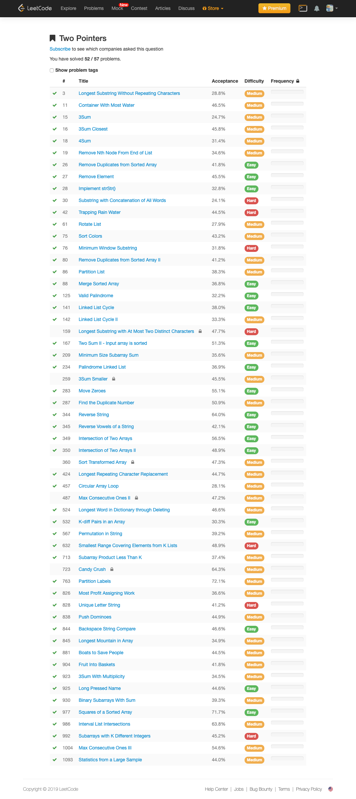
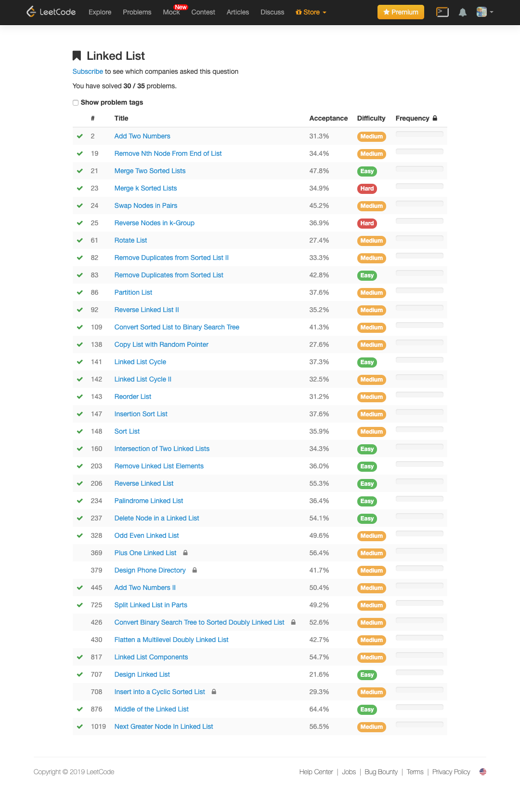
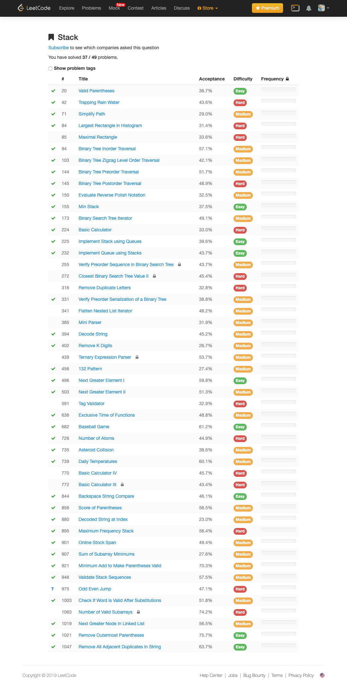
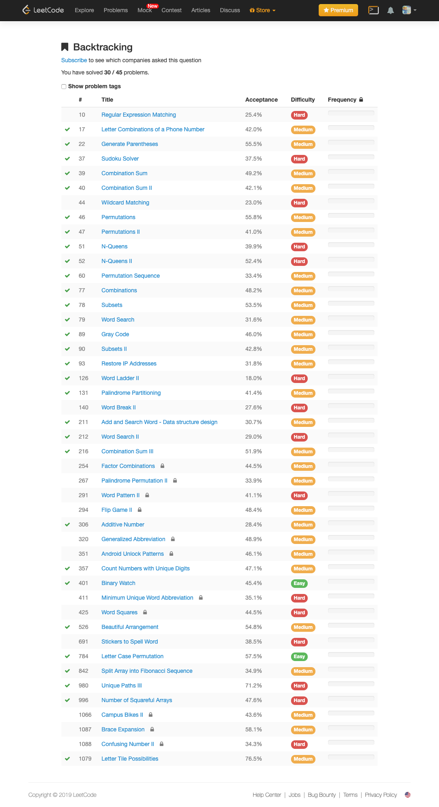
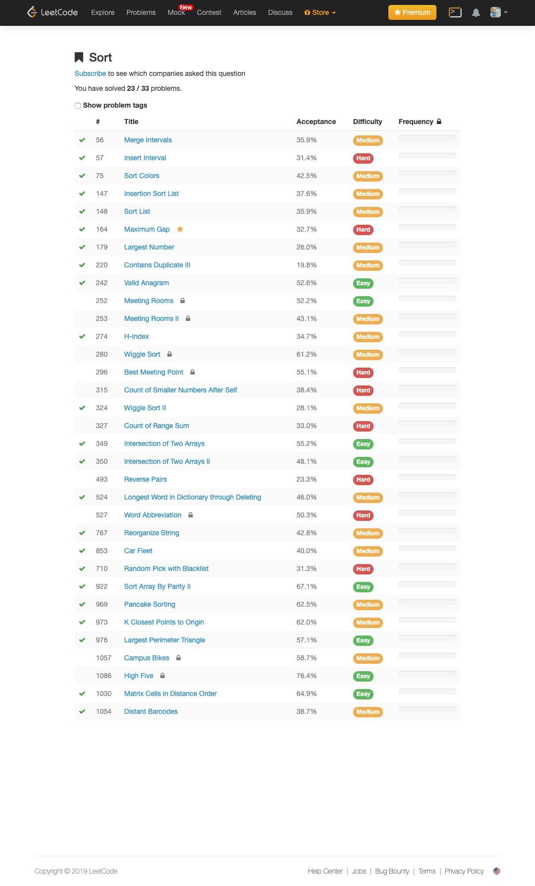

# LeetCode by Go
[LeetCode Online Judge] (https://leetcode.com/) is a website containing many **algorithm questions**. Most of them are real interview questions of **Google, Facebook, LinkedIn, Apple**, etc. This repo shows my solutions by Go with the code style strictly follows the [Google Golang Style Guide](https://github.com/golang/go/wiki/CodeReviewComments). Please feel free to reference and **STAR** to support this repo, thank you!


<p align='center'>

</p>

<p align='center'>
<a href="https://leetcode.com/halfrost/">


<a href="https://halfrost.com"></a>
<a href="http://weibo.com/halfrost"></a>
<a href="https://twitter.com/halffrost"></a>
<a href="http://www.jianshu.com/u/12201cdd5d7a"></a>
<a href="https://juejin.im/user/5692e1e000b09aa2e8dcd422"></a>
<a href="https://www.zhihu.com/people/halfrost/activities"></a>

<a href=""></a>

</p>

## Data Structures

> 标识了 (已全部做完) 的专题是完成所有题目了的，没有标识的是还没有做完所有题目的

* [Array](#array)
* [String](#string)
* [Two Pointers](#two-pointers-已全部做完)
* [Linked List](#linked-list-已全部做完)
* [Stack](#stack-已全部做完)
* [Tree](#tree)
* [Dynamic programming](#dynamic-programming)
* [Backtracking](#backtracking-已全部做完)
* [Depth-first search](#depth-first-search)
* [Breadth-first Search](#breadth-first-search)
* [Binary Search](#binary-search)
* [Math](#math)
* [Hash Table](#hash-table)
* [Sort](#sort-已全部做完)


| 数据结构 | 变种 | 相关题目 |
|:-------:|:-------|:------|
|顺序线性表：向量|||
|单链表|1.双链表<br>2.静态链表<br>3.对称矩阵<br>4.稀疏矩阵||
|栈|广义栈||
|队列|1.链表实现<br>2.循环数组实现<br>3.双端队列||
|字符串|1.KMP算法<br>2.有限状态自动机<br>3.模式匹配有限状态自动机<br>4.BM模式匹配算法<br>5.BM-KMP算法||
|树|1.二叉树<br>2.并查集<br>3.Huffman数||
|数组实现的堆|1.极大堆和极小堆<br>2.极大极小堆<br>3.双端堆<br>4.d叉堆||
|树实现的堆|1.左堆<br>2.扁堆<br>3.二项式堆<br>4.斐波那契堆<br>5.配对堆||
|查找|1.哈希表<br>2.跳跃表<br>3.排序二叉树<br>4.AVL树<br>5.B树<br>6.AA树<br>7.红黑树<br>8.排序二叉堆<br>9.Splay树<br>10.双链树<br>11.Trie树||


## 算法

## 一. 目录

| #    |  Title                                                       |  Solution                                                                                                                                           |  Acceptance |  Difficulty |  Frequency |
|:--------:|:--------------------------------------------------------------|:--------:|:--------:|:--------:|:--------:|
| 0001 |  Two Sum                                                     | [Go](https://github.com/halfrost/LeetCode-Go/tree/master/Algorithms/0001.%20Two%20Sum)                                                              | 44.30%      |  Easy       |            |
| 0002 |  Add Two Numbers                                             | [Go](https://github.com/halfrost/LeetCode-Go/tree/master/Algorithms/0002.%20Add-Two-Number)                                                         | 31.30%      |  Medium     |            |
| 0003 |  Longest Substring Without Repeating Characters              | [Go](https://github.com/halfrost/LeetCode-Go/tree/master/Algorithms/0003.%20Longest%20Substring%20Without%20Repeating%20Characters)                 | 28.50%      |  Medium     |            |
| 0004 |  Median of Two Sorted Arrays                                 |                                                                                                                                               | 26.60%      |  Hard       |            |
| 0005 |  Longest Palindromic Substring                               |                                                                                                                                               | 27.50%      |  Medium     |            |
| 0006 |  ZigZag Conversion                                           |                                                                                                                                               | 32.20%      |  Medium     |            |
| 0007 |  Reverse Integer                                             |                                                                                                                                               | 25.40%      |  Easy       |            |
| 0008 |  String to Integer (atoi)                                    |                                                                                                                                               | 14.70%      |  Medium     |            |
| 0009 |  Palindrome Number                                           |                                                                                                                                               | 43.70%      |  Easy       |            |
| 0010 |  Regular Expression Matching                                 |                                                                                                                                               | 25.40%      |  Hard       |            |
| 0011 |  Container With Most Water                                   | [Go](https://github.com/halfrost/LeetCode-Go/tree/master/Algorithms/0011.%20Container%20With%20Most%20Water)                                        | 45.10%      |  Medium     |            |
| 0012 |  Integer to Roman                                            |                                                                                                                                               | 51.30%      |  Medium     |            |
| 0013 |  Roman to Integer                                            |                                                                                                                                               | 52.60%      |  Easy       |            |
| 0014 |  Longest Common Prefix                                       |                                                                                                                                               | 33.70%      |  Easy       |            |
| 0015 |  3Sum                                                        | [Go](https://github.com/halfrost/LeetCode-Go/tree/master/Algorithms/0015.%203Sum)                                                                   | 24.20%      |  Medium     |            |
| 0016 |  3Sum Closest                                                | [Go](https://github.com/halfrost/LeetCode-Go/tree/master/Algorithms/0016.%203Sum%20Closest)                                                         | 45.80%      |  Medium     |            |
| 0017 |  Letter Combinations of a Phone Number                       | [Go](https://github.com/halfrost/LeetCode-Go/tree/master/Algorithms/0017.%20Letter%20Combinations%20of%20a%20Phone%20Number)                        | 41.90%      |  Medium     |            |
| 0018 |  4Sum                                                        | [Go](https://github.com/halfrost/LeetCode-Go/tree/master/Algorithms/0018.%204Sum)                                                                   | 30.80%      |  Medium     |            |
| 0019 |  Remove Nth Node From End of List                            | [Go](https://github.com/halfrost/LeetCode-Go/tree/master/Algorithms/0019.%20Remove%20Nth%20Node%20From%20End%20of%20List)                           | 34.30%      |  Medium     |            |
| 0020 |  Valid Parentheses                                           | [Go](https://github.com/halfrost/LeetCode-Go/tree/master/Algorithms/0020.%20Valid-Parentheses)                                                      | 36.70%      |  Easy       |            |
| 0021 |  Merge Two Sorted Lists                                      | [Go](https://github.com/halfrost/LeetCode-Go/tree/master/Algorithms/0021.%20Merge%20Two%20Sorted%20Lists)                                           | 47.70%      |  Easy       |            |
| 0022 |  Generate Parentheses                                        | [Go](https://github.com/halfrost/LeetCode-Go/tree/master/Algorithms/0022.%20Generate%20Parentheses)                                                 | 55.50%      |  Medium     |            |
| 0023 |  Merge k Sorted Lists                                        | [Go](https://github.com/halfrost/LeetCode-Go/tree/master/Algorithms/0023.%20Merge%20k%20Sorted%20Lists)                                             | 34.90%      |  Hard       |            |
| 0024 |  Swap Nodes in Pairs                                         | [Go](https://github.com/halfrost/LeetCode-Go/tree/master/Algorithms/0024.%20Swap%20Nodes%20in%20Pairs)                                              | 45.10%      |  Medium     |            |
| 0025 |  Reverse Nodes in k-Group                                    | [Go](https://github.com/halfrost/LeetCode-Go/tree/master/Algorithms/0025.%20Reverse%20Nodes%20in%20k%20Group)                                       | 36.80%      |  Hard       |            |
| 0026 |  Remove Duplicates from Sorted Array                         | [Go](https://github.com/halfrost/LeetCode-Go/tree/master/Algorithms/0026.%20Remove%20Duplicates%20from%20Sorted%20Array)                            | 41.00%      |  Easy       |            |
| 0027 |  Remove Element                                              | [Go](https://github.com/halfrost/LeetCode-Go/tree/master/Algorithms/0027.%20Remove%20Element)                                                       | 44.80%      |  Easy       |            |
| 0028 |  Implement strStr()                                          | [Go](https://github.com/halfrost/LeetCode-Go/tree/master/Algorithms/0028.%20Implement%20strStr())                                                   | 32.20%      |  Easy       |            |
| 0029 |  Divide Two Integers                                         |                                                                                                                                               | 16.10%      |  Medium     |            |
| 0030 |  Substring with Concatenation of All Words                   | [Go](https://github.com/halfrost/LeetCode-Go/tree/master/Algorithms/0030.%20Substring%20with%20Concatenation%20of%20All%20Words)(是否还有更优解)                    | 23.70%      |  Hard       |            |
| 0031 |  Next Permutation                                            |                                                                                                                                               | 30.60%      |  Medium     |            |
| 0032 |  Longest Valid Parentheses                                   |                                                                                                                                               | 25.70%      |  Hard       |            |
| 0033 |  Search in Rotated Sorted Array                              |                                                                                                                                               | 33.00%      |  Medium     |            |
| 0034 |  Find First and Last Position of Element in Sorted Array     |                                                                                                                                               | 33.70%      |  Medium     |            |
| 0035 |  Search Insert Position                                      |                                                                                                                                               | 40.90%      |  Easy       |            |
| 0036 |  Valid Sudoku                                                | [Go](https://github.com/halfrost/LeetCode-Go/tree/master/Algorithms/0036.%20Valid%20Sudoku)                                                         | 43.50%      |  Medium     |            |
| 0037 |  Sudoku Solver                                               | [Go](https://github.com/halfrost/LeetCode-Go/tree/master/Algorithms/0037.%20Sudoku%20Solver)                                                        | 37.40%      |  Hard       |            |
| 0038 |  Count and Say                                               |                                                                                                                                               | 40.80%      |  Easy       |            |
| 0039 |  Combination Sum                                             | [Go](https://github.com/halfrost/LeetCode-Go/tree/master/Algorithms/0039.%20Combination%20Sum)                                                      | 49.10%      |  Medium     |            |
| 0040 |  Combination Sum II                                          | [Go](https://github.com/halfrost/LeetCode-Go/tree/master/Algorithms/0040.%20Combination%20Sum%20II)                                                 | 42.10%      |  Medium     |            |
| 0041 |  First Missing Positive                                      | [Go](https://github.com/halfrost/LeetCode-Go/tree/master/Algorithms/0041.%20First-Missing-Positive)                                                 | 29.10%      |  Hard       |            |
| 0042 |  Trapping Rain Water                                         | [Go](https://github.com/halfrost/LeetCode-Go/tree/master/Algorithms/0042.%20Trapping%20Rain%20Water)                                                | 43.50%      |  Hard       |            |
| 0043 |  Multiply Strings                                            |                                                                                                                                               | 30.90%      |  Medium     |            |
| 0044 |  Wildcard Matching                                           |                                                                                                                                               | 23.00%      |  Hard       |            |
| 0045 |  Jump Game II                                                |                                                                                                                                               | 28.20%      |  Hard       |            |
| 0046 |  Permutations                                                | [Go](https://github.com/halfrost/LeetCode-Go/tree/master/Algorithms/0046.%20Permutations)                                                           | 55.70%      |  Medium     |            |
| 0047 |  Permutations II                                             | [Go](https://github.com/halfrost/LeetCode-Go/tree/master/Algorithms/0047.%20Permutations%20II)                                                      | 40.90%      |  Medium     |            |
| 0048 |  Rotate Image                                                | [Go](https://github.com/halfrost/LeetCode-Go/tree/master/Algorithms/0048.%20Rotate%20Image)                                                         | 49.00%      |  Medium     |            |
| 0049 |  Group Anagrams                                              | [Go](https://github.com/halfrost/LeetCode-Go/tree/master/Algorithms/0049.%20Group%20Anagrams)                                                       | 47.40%      |  Medium     |            |
| 0050 |  Pow(x, n)                                                       | [Go](https://github.com/halfrost/LeetCode-Go/tree/master/Algorithms/0050.%20Pow(x%2C%20n))                                                          | 28.10%      |  Medium    |
| 0051 |  N-Queens                                                    | [Go](https://github.com/halfrost/LeetCode-Go/tree/master/Algorithms/0051.%20N-Queens)                                                               | 39.80%      |  Hard       |            |
| 0052 |  N-Queens II                                                 | [Go](https://github.com/halfrost/LeetCode-Go/tree/master/Algorithms/0052.%20N-Queens%20II)                                                          | 52.40%      |  Hard       |            |
| 0053 |  Maximum Subarray                                            | [Go](https://github.com/halfrost/LeetCode-Go/tree/master/Algorithms/0053.%20Maximum%20Subarray)                                                     | 43.80%      |  Easy       |            |
| 0054 |  Spiral Matrix                                               | [Go](https://github.com/halfrost/LeetCode-Go/tree/master/Algorithms/0054.%20Spiral%20Matrix)                                                        | 30.70%      |  Medium     |            |
| 0055 |  Jump Game                                                   |                                                                                                                                               | 32.10%      |  Medium     |            |
| 0056 |  Merge Intervals                                             | [Go](https://github.com/halfrost/LeetCode-Go/tree/master/Algorithms/0056.%20Merge%20Intervals)                                                      | 35.90%      |  Medium     |            |
| 0057 |  Insert Interval                                             | [Go](https://github.com/halfrost/LeetCode-Go/tree/master/Algorithms/0057.%20Insert%20Interval)                                                      | 31.40%      |  Hard       |            |
| 0058 |  Length of Last Word                                         |                                                                                                                                               | 32.30%      |  Easy       |            |
| 0059 |  Spiral Matrix II                                            | [Go](https://github.com/halfrost/LeetCode-Go/tree/master/Algorithms/0059.%20Spiral%20Matrix%20II)                                                   | 47.00%      |  Medium     |            |
| 0060 |  Permutation Sequence                                        | [Go](https://github.com/halfrost/LeetCode-Go/tree/master/Algorithms/0060.%20Permutation%20Sequence)                                                 | 33.40%      |  Medium     |            |
| 0061 |  Rotate List                                                 | [Go](https://github.com/halfrost/LeetCode-Go/tree/master/Algorithms/0061.%20Rotate%20List)                                                          | 27.30%      |  Medium     |            |
| 0062 |  Unique Paths                                                | [Go](https://github.com/halfrost/LeetCode-Go/tree/master/Algorithms/0062.%20Unique%20Paths)                                                         | 48.00%      |  Medium     |            |
| 0063 |  Unique Paths II                                             | [Go](https://github.com/halfrost/LeetCode-Go/tree/master/Algorithms/0063.%20Unique%20Paths%20II)                                                    | 33.50%      |  Medium     |            |
| 0064 |  Minimum Path Sum                                            | [Go](https://github.com/halfrost/LeetCode-Go/tree/master/Algorithms/0064.%20Minimum%20Path%20Sum)                                                   | 47.30%      |  Medium     |            |
| 0065 |  Valid Number                                                |                                                                                                                                               | 14.10%      |  Hard       |            |
| 0066 |  Plus One                                                    |                                                                                                                                               | 41.40%      |  Easy       |            |
| 0067 |  Add Binary                                                  |                                                                                                                                               | 39.50%      |  Easy       |            |
| 0068 |  Text Justification                                          |                                                                                                                                               | 23.50%      |  Hard       |            |
| 0069 |  Sqrt(x)                                                     | [Go](https://github.com/halfrost/LeetCode-Go/tree/master/Algorithms/0069.%20Sqrt(x))                                                                | 31.50%      |  Easy       |            |
| 0070 |  Climbing Stairs                                             | [Go](https://github.com/halfrost/LeetCode-Go/tree/master/Algorithms/0070.%20Climbing%20Stairs)                                                      | 44.40%      |  Easy       |            |
| 0071 |  Simplify Path                                               | [Go](https://github.com/halfrost/LeetCode-Go/tree/master/Algorithms/0071.%20Simplify%20Path)                                                        | 29.00%      |  Medium     |            |
| 0072 |  Edit Distance                                               |                                                                                                                                               | 38.20%      |  Hard       |            |
| 0073 |  Set Matrix Zeroes                                           |                                                                                                                                               | 40.10%      |  Medium     |            |
| 0074 |  Search a 2D Matrix                                          |                                                                                                                                               | 35.00%      |  Medium     |            |
| 0075 |  Sort Colors                                                 | [Go](https://github.com/halfrost/LeetCode-Go/tree/master/Algorithms/0075.%20Sort%20Colors)                                                          | 42.40%      |  Medium     |            |
| 0076 |  Minimum Window Substring                                    | [Go](https://github.com/halfrost/LeetCode-Go/tree/master/Algorithms/0076.%20Minimum%20Window%20Substring)                                           | 31.10%      |  Hard       |            |
| 0077 |  Combinations                                                | [Go](https://github.com/halfrost/LeetCode-Go/tree/master/Algorithms/0077.%20Combinations)                                                           | 48.20%      |  Medium     |            |
| 0078 |  Subsets                                                     | [Go](https://github.com/halfrost/LeetCode-Go/tree/master/Algorithms/0078.%20Subsets)                                                                | 53.40%      |  Medium     |            |
| 0079 |  Word Search                                                 | [Go](https://github.com/halfrost/LeetCode-Go/tree/master/Algorithms/0079.%20Word%20Search)                                                          | 31.50%      |  Medium     |            |
| 0080 |  Remove Duplicates from Sorted Array II                      | [Go](https://github.com/halfrost/LeetCode-Go/tree/master/Algorithms/0080.%20Remove%20Duplicates%20from%20Sorted%20Array%20II)                       | 40.60%      |  Medium     |            |
| 0081 |  Search in Rotated Sorted Array II                           |                                                                                                                                               | 32.70%      |  Medium     |            |
| 0082 |  Remove Duplicates from Sorted List II                       | [Go](https://github.com/halfrost/LeetCode-Go/tree/master/Algorithms/0082.%20Remove%20Duplicates%20from%20Sorted%20List%20II)                        | 33.30%      |  Medium     |            |
| 0083 |  Remove Duplicates from Sorted List                          | [Go](https://github.com/halfrost/LeetCode-Go/tree/master/Algorithms/0083.%20Remove%20Duplicates%20from%20Sorted%20List)                             | 42.80%      |  Easy       |            |
| 0084 |  Largest Rectangle in Histogram                              | [Go](https://github.com/halfrost/LeetCode-Go/tree/master/Algorithms/0084.%20Largest%20Rectangle%20in%20Histogram)                                   | 31.40%      |  Hard       |            |
| 0085 |  Maximal Rectangle                                           |                                                                                                                                               | 33.60%      |  Hard       |            |
| 0086 |  Partition List                                              | [Go](https://github.com/halfrost/LeetCode-Go/tree/master/Algorithms/0086.%20Partition%20List)                                                       | 37.60%      |  Medium     |            |
| 0087 |  Scramble String                                             |                                                                                                                                               | 31.70%      |  Hard       |            |
| 0088 |  Merge Sorted Array                                          | [Go](https://github.com/halfrost/LeetCode-Go/tree/master/Algorithms/0088.%20Merge-Sorted-Array)                                                     | 36.00%      |  Easy       |            |
| 0089 |  Gray Code                                                   | [Go](https://github.com/halfrost/LeetCode-Go/tree/master/Algorithms/0089.%20Gray%20Code)                                                            | 46.00%      |  Medium     |            |
| 0090 |  Subsets II                                                  | [Go](https://github.com/halfrost/LeetCode-Go/tree/master/Algorithms/0090.%20Subsets%20II)                                                           | 42.70%      |  Medium     |            |
| 0091 |  Decode Ways                                                 | [Go](https://github.com/halfrost/LeetCode-Go/tree/master/Algorithms/0091.%20Decode%20Ways)                                                          | 22.50%      |  Medium     |            |
| 0092 |  Reverse Linked List II                                      | [Go](https://github.com/halfrost/LeetCode-Go/tree/master/Algorithms/0092.%20Reverse%20Linked%20List%20II)                                           | 35.20%      |  Medium     |            |
| 0093 |  Restore IP Addresses                                        | [Go](https://github.com/halfrost/LeetCode-Go/tree/master/Algorithms/0093.%20Restore%20IP%20Addresses)                                               | 31.70%      |  Medium     |            |
| 0094 |  Binary Tree Inorder Traversal                               | [Go](https://github.com/halfrost/LeetCode-Go/tree/master/Algorithms/0094.%20Binary%20Tree%20Inorder%20Traversal)                                    | 57.10%      |  Medium     |            |
| 0095 |  Unique Binary Search Trees II                               |                                                                                                                                               | 36.00%      |  Medium     |            |
| 0096 |  Unique Binary Search Trees                                  | [Go](https://github.com/halfrost/LeetCode-Go/tree/master/Algorithms/0096.%20Unique%20Binary%20Search%20Trees)                                       | 46.60%      |  Medium     |            |
| 0097 |  Interleaving String                                         |                                                                                                                                               | 28.20%      |  Hard       |            |
| 0098 |  Validate Binary Search Tree                                 | [Go](https://github.com/halfrost/LeetCode-Go/tree/master/Algorithms/0098.%20Validate%20Binary%20Search%20Tree)                                      | 25.90%      |  Medium     |            |
| 0099 |  Recover Binary Search Tree                                  | [Go](https://github.com/halfrost/LeetCode-Go/tree/master/Algorithms/0099.%20Recover%20Binary%20Search%20Tree)                                       | 34.90%      |  Hard       |            |
| 0100 |  Same Tree                                                   | [Go](https://github.com/halfrost/LeetCode-Go/tree/master/Algorithms/0100.%20Same%20Tree)                                                            | 50.20%      |  Easy       |            |
| 0101 |  Symmetric Tree                                              | [Go](https://github.com/halfrost/LeetCode-Go/tree/master/Algorithms/0101.%20Symmetric%20Tree)                                                       | 43.70%      |  Easy       |            |
| 0102 |  Binary Tree Level Order Traversal                           | [Go](https://github.com/halfrost/LeetCode-Go/tree/master/Algorithms/0102.%20Binary%20Tree%20Level%20Order%20Traversal)                              | 48.90%      |  Medium     |            |
| 0103 |  Binary Tree Zigzag Level Order Traversal                    | [Go](https://github.com/halfrost/LeetCode-Go/tree/master/Algorithms/0103.%20Binary%20Tree%20Zigzag%20Level%20Order%20Traversal)                     | 42.10%      |  Medium     |            |
| 0104 |  Maximum Depth of Binary Tree                                | [Go](https://github.com/halfrost/LeetCode-Go/tree/master/Algorithms/0104.%20Maximum%20Depth%20of%20Binary%20Tree)                                   | 60.90%      |  Easy       |            |
| 0105 |  Construct Binary Tree from Preorder and Inorder Traversal   |                                                                                                                                               | 41.60%      |  Medium     |            |
| 0106 |  Construct Binary Tree from Inorder and Postorder Traversal  |                                                                                                                                               | 39.70%      |  Medium     |            |
| 0107 |  Binary Tree Level Order Traversal II                        | [Go](https://github.com/halfrost/LeetCode-Go/tree/master/Algorithms/0107.%20Binary%20Tree%20Level%20Order%20Traversal%20II)                         | 47.20%      |  Easy       |            |
| 0108 |  Convert Sorted Array to Binary Search Tree                  | [Go](https://github.com/halfrost/LeetCode-Go/tree/master/Algorithms/0108.%20Convert%20Sorted%20Array%20to%20Binary%20Search%20Tree)                 | 51.20%      |  Easy       |            |
| 0109 |  Convert Sorted List to Binary Search Tree                   | [Go](https://github.com/halfrost/LeetCode-Go/tree/master/Algorithms/0109.%20Convert%20Sorted%20List%20to%20Binary%20Search%20Tree)                  | 41.20%      |  Medium     |            |
| 0110 |  Balanced Binary Tree                                        | [Go](https://github.com/halfrost/LeetCode-Go/tree/master/Algorithms/0110.%20Balanced%20Binary%20Tree)                                               | 41.20%      |  Easy       |            |
| 0111 |  Minimum Depth of Binary Tree                                | [Go](https://github.com/halfrost/LeetCode-Go/tree/master/Algorithms/0111.%20Minimum%20Depth%20of%20Binary%20Tree)                                   | 35.40%      |  Easy       |            |
| 0112 |  Path Sum                                                    | [Go](https://github.com/halfrost/LeetCode-Go/tree/master/Algorithms/0112.%20Path%20Sum)                                                             | 38.00%      |  Easy       |            |
| 0113 |  Path Sum II                                                 | [Go](https://github.com/halfrost/LeetCode-Go/tree/master/Algorithms/0113.%20Path%20Sum%20II)                                                        | 41.00%      |  Medium     |            |
| 0114 |  Flatten Binary Tree to Linked List                          | [Go](https://github.com/halfrost/LeetCode-Go/tree/master/Algorithms/0114.%20Flatten%20Binary%20Tree%20to%20Linked%20List)                           | 42.80%      |  Medium     |            |
| 0115 |  Distinct Subsequences                                       |                                                                                                                                               | 35.20%      |  Hard       |            |
| 0116 |  Populating Next Right Pointers in Each Node                 |                                                                                                                                               | 38.20%      |  Medium     |            |
| 0117 |  Populating Next Right Pointers in Each Node II              |                                                                                                                                               | 34.70%      |  Medium     |            |
| 0118 |  Pascal's Triangle                                           |                                                                                                                                               | 46.50%      |  Easy       |            |
| 0119 |  Pascal's Triangle II                                        |                                                                                                                                               | 44.00%      |  Easy       |            |
| 0120 |  Triangle                                                    | [Go](https://github.com/halfrost/LeetCode-Go/tree/master/Algorithms/0120.%20Triangle)                                                               | 39.70%      |  Medium     |            |
| 0121 |  Best Time to Buy and Sell Stock                             | [Go](https://github.com/halfrost/LeetCode-Go/tree/master/Algorithms/0121.%20Best%20Time%20to%20Buy%20and%20Sell%20Stock)                            | 47.50%      |  Easy       |            |
| 0122 |  Best Time to Buy and Sell Stock II                          | [Go](https://github.com/halfrost/LeetCode-Go/tree/master/Algorithms/0122.%20Best%20Time%20to%20Buy%20and%20Sell%20Stock%20II)                       | 52.20%      |  Easy       |            |
| 0123 |  Best Time to Buy and Sell Stock III                         |                                                                                                                                               | 33.90%      |  Hard       |            |
| 0124 |  Binary Tree Maximum Path Sum                                | [Go](https://github.com/halfrost/LeetCode-Go/tree/master/Algorithms/0124.%20Binary%20Tree%20Maximum%20Path%20Sum)                                   | 30.20%      |  Hard       |            |
| 0125 |  Valid Palindrome                                            | [Go](https://github.com/halfrost/LeetCode-Go/tree/master/Algorithms/0125.%20Valid-Palindrome)                                                       | 31.40%      |  Easy       |            |
| 0126 |  Word Ladder II                                              | [Go](https://github.com/halfrost/LeetCode-Go/tree/master/Algorithms/0126.%20Word%20Ladder%20II)                                                     | 18.00%      |  Hard       |            |
| 0127 |  Word Ladder                                                 | [Go](https://github.com/halfrost/LeetCode-Go/tree/master/Algorithms/0127.%20Word%20Ladder)                                                          | 24.40%      |  Medium     |            |
| 0128 |  Longest Consecutive Sequence                                |                                                                                                                                               | 41.90%      |  Hard       |            |
| 0129 |  Sum Root to Leaf Numbers                                    | [Go](https://github.com/halfrost/LeetCode-Go/tree/master/Algorithms/0129.%20Sum%20Root%20to%20Leaf%20Numbers)                                       | 42.80%      |  Medium     |            |
| 0130 |  Surrounded Regions                                          |                                                                                                                                               | 23.10%      |  Medium     |            |
| 0131 |  Palindrome Partitioning                                     | [Go](https://github.com/halfrost/LeetCode-Go/tree/master/Algorithms/0131.%20Palindrome%20Partitioning)                                              | 41.30%      |  Medium     |            |
| 0132 |  Palindrome Partitioning II                                  |                                                                                                                                               | 27.60%      |  Hard       |            |
| 0133 |  Clone Graph                                                 |                                                                                                                                               | 27.00%      |  Medium     |            |
| 0134 |  Gas Station                                                 |                                                                                                                                               | 34.10%      |  Medium     |            |
| 0135 |  Candy                                                       |                                                                                                                                               | 28.60%      |  Hard       |            |
| 0136 |  Single Number                                               |                                                                                                                                               | 60.50%      |  Easy       |            |
| 0137 |  Single Number II                                            |                                                                                                                                               | 46.20%      |  Medium     |            |
| 0138 |  Copy List with Random Pointer                               |                                                                                                                                               | 27.50%      |  Medium     |            |
| 0139 |  Word Break                                                  |                                                                                                                                               | 35.60%      |  Medium     |            |
| 0140 |  Word Break II                                               |                                                                                                                                               | 27.50%      |  Hard       |            |
| 0141 |  Linked List Cycle                                           | [Go](https://github.com/halfrost/LeetCode-Go/tree/master/Algorithms/0141.%20Linked%20List%20Cycle)                                                  | 37.20%      |  Easy       |            |
| 0142 |  Linked List Cycle II                                        | [Go](https://github.com/halfrost/LeetCode-Go/tree/master/Algorithms/0142.%20Linked%20List%20Cycle%20II)                                             | 32.40%      |  Medium     |            |
| 0143 |  Reorder List                                                | [Go](https://github.com/halfrost/LeetCode-Go/tree/master/Algorithms/0143.%20Reorder%20List)                                                         | 31.20%      |  Medium     |            |
| 0144 |  Binary Tree Preorder Traversal                              | [Go](https://github.com/halfrost/LeetCode-Go/tree/master/Algorithms/0144.%20Binary%20Tree%20Preorder%20Traversal)                                   | 51.70%      |  Medium     |            |
| 0145 |  Binary Tree Postorder Traversal                             | [Go](https://github.com/halfrost/LeetCode-Go/tree/master/Algorithms/0145.%20Binary%20Tree%20Postorder%20Traversal)                                  | 48.90%      |  Hard       |            |
| 0146 |  LRU Cache                                                   |                                                                                                                                               | 25.90%      |  Medium     |            |
| 0147 |  Insertion Sort List                                         | [Go](https://github.com/halfrost/LeetCode-Go/tree/master/Algorithms/0147.%20Insertion%20Sort%20List)                                                | 37.60%      |  Medium     |            |
| 0148 |  Sort List                                                   | [Go](https://github.com/halfrost/LeetCode-Go/tree/master/Algorithms/0148.%20Sort%20List)                                                            | 35.80%      |  Medium     |            |
| 0149 |  Max Points on a Line                                        |                                                                                                                                               | 15.80%      |  Hard       |            |
| 0150 |  Evaluate Reverse Polish Notation                            | [Go](https://github.com/halfrost/LeetCode-Go/tree/master/Algorithms/0150.%20Evaluate%20Reverse%20Polish%20Notation)                                 | 32.50%      |  Medium     |            |
| 0151 |  Reverse Words in a String                                   |                                                                                                                                               | 17.00%      |  Medium     |            |
| 0152 |  Maximum Product Subarray                                    | [Go](https://github.com/halfrost/LeetCode-Go/tree/master/Algorithms/0152.%20Maximum%20Product%20Subarray)                                           | 29.40%      |  Medium     |            |
| 0153 |  Find Minimum in Rotated Sorted Array                        |                                                                                                                                               | 43.10%      |  Medium     |            |
| 0154 |  Find Minimum in Rotated Sorted Array II                     |                                                                                                                                               | 39.40%      |  Hard       |            |
| 0155 |  Min Stack                                                   | [Go](https://github.com/halfrost/LeetCode-Go/tree/master/Algorithms/0155.%20Min%20Stack)                                                            | 37.50%      |  Easy       |            |
| 0156 |  Binary Tree Upside Down                                     |                                                                                                                                               | 51.10%      |  Medium     |            |
| 0157 |  Read N Characters Given Read4                               |                                                                                                                                               | 29.70%      |  Easy       |            |
| 0158 |  Read N Characters Given Read4 II - Call multiple times      |                                                                                                                                               | 26.60%      |  Hard       |            |
| 0159 |  Longest Substring with At Most Two Distinct Characters      |                                                                                                                                               | 47.20%      |  Hard       |            |
| 0160 |  Intersection of Two Linked Lists                            | [Go](https://github.com/halfrost/LeetCode-Go/tree/master/Algorithms/0160.%20Intersection%20of%20Two%20Linked%20Lists)                               | 34.30%      |  Easy       |            |
| 0161 |  One Edit Distance                                           |                                                                                                                                               | 31.70%      |  Medium     |            |
| 0162 |  Find Peak Element                                           |                                                                                                                                               | 41.40%      |  Medium     |            |
| 0163 |  Missing Ranges                                              |                                                                                                                                               | 23.30%      |  Medium     |            |
| 0164 |  Maximum Gap                                                 | [Go](https://github.com/halfrost/LeetCode-Go/tree/master/Algorithms/0164.%20Maximum%20Gap)                                                          | 32.70%      |  Hard       |            |
| 0165 |  Compare Version Numbers                                     |                                                                                                                                               | 23.80%      |  Medium     |            |
| 0166 |  Fraction to Recurring Decimal                               |                                                                                                                                               | 19.60%      |  Medium     |            |
| 0167 |  Two Sum II - Input array is sorted                          | [Go](https://github.com/halfrost/LeetCode-Go/tree/master/Algorithms/0167.%20Two%20Sum%20II%20-%20Input%20array%20is%20sorted)                       | 50.60%      |  Easy       |            |
| 0168 |  Excel Sheet Column Title                                    |                                                                                                                                               | 29.10%      |  Easy       |            |
| 0169 |  Majority Element                                            |                                                                                                                                               | 53.00%      |  Easy       |            |
| 0170 |  Two Sum III - Data structure design                         |                                                                                                                                               | 30.60%      |  Easy       |            |
| 0171 |  Excel Sheet Column Number                                   |                                                                                                                                               | 51.70%      |  Easy       |            |
| 0172 |  Factorial Trailing Zeroes                                   |                                                                                                                                               | 37.40%      |  Easy       |            |
| 0173 |  Binary Search Tree Iterator                                 | [Go](https://github.com/halfrost/LeetCode-Go/tree/master/Algorithms/0173.%20Binary%20Search%20Tree%20Iterator)                                      | 49.00%      |  Medium     |            |
| 0174 |  Dungeon Game                                                |                                                                                                                                               | 27.30%      |  Hard       |            |
| 0175 |  Combine Two Tables                                          |                                                                                                                                               | 52.40%      |  Easy       |            |
| 0176 |  Second Highest Salary                                       |                                                                                                                                               | 27.50%      |  Easy       |            |
| 0177 |  Nth Highest Salary                                          |                                                                                                                                               | 26.60%      |  Medium     |            |
| 0178 |  Rank Scores                                                 |                                                                                                                                               | 37.10%      |  Medium     |            |
| 0179 |  Largest Number                                              | [Go](https://github.com/halfrost/LeetCode-Go/tree/master/Algorithms/0179.%20Largest%20Number)                                                       | 26.00%      |  Medium     |            |
| 0180 |  Consecutive Numbers                                         |                                                                                                                                               | 34.00%      |  Medium     |            |
| 0181 |  Employees Earning More Than Their Managers                  |                                                                                                                                               | 48.90%      |  Easy       |            |
| 0182 |  Duplicate Emails                                            |                                                                                                                                               | 55.20%      |  Easy       |            |
| 0183 |  Customers Who Never Order                                   |                                                                                                                                               | 45.40%      |  Easy       |            |
| 0184 |  Department Highest Salary                                   |                                                                                                                                               | 29.40%      |  Medium     |            |
| 0185 |  Department Top Three Salaries                               |                                                                                                                                               | 26.50%      |  Hard       |            |
| 0186 |  Reverse Words in a String II                                |                                                                                                                                               | 38.10%      |  Medium     |            |
| 0187 |  Repeated DNA Sequences                                      |                                                                                                                                               | 36.30%      |  Medium     |            |
| 0188 |  Best Time to Buy and Sell Stock IV                          |                                                                                                                                               | 26.40%      |  Hard       |            |
| 0189 |  Rotate Array                                                |                                                                                                                                               | 30.50%      |  Easy       |            |
| 0190 |  Reverse Bits                                                |                                                                                                                                               | 31.70%      |  Easy       |            |
| 0191 |  Number of 1 Bits                                            | [Go](https://github.com/halfrost/LeetCode-Go/tree/master/Algorithms/0191.%20Number%20of%201%20Bits)                                                 | 43.60%      |  Easy       |            |
| 0192 |  Word Frequency                                              |                                                                                                                                               | 26.80%      |  Medium     |            |
| 0193 |  Valid Phone Numbers                                         |                                                                                                                                               | 25.20%      |  Easy       |            |
| 0194 |  Transpose File                                              |                                                                                                                                               | 22.90%      |  Medium     |            |
| 0195 |  Tenth Line                                                  |                                                                                                                                               | 33.90%      |  Easy       |            |
| 0196 |  Delete Duplicate Emails                                     |                                                                                                                                               | 33.40%      |  Easy       |            |
| 0197 |  Rising Temperature                                          |                                                                                                                                               | 35.10%      |  Easy       |            |
| 0198 |  House Robber                                                | [Go](https://github.com/halfrost/LeetCode-Go/tree/master/Algorithms/0198.%20House%20Robber)                                                         | 41.10%      |  Easy       |            |
| 0199 |  Binary Tree Right Side View                                 | [Go](https://github.com/halfrost/LeetCode-Go/tree/master/Algorithms/0199.%20Binary%20Tree%20Right%20Side%20View)                                    | 48.30%      |  Medium     |            |
| 0200 |  Number of Islands                                           | [Go](https://github.com/halfrost/LeetCode-Go/tree/master/Algorithms/0200.%20Number%20of%20Islands)                                                  | 41.90%      |  Medium     |            |
| 0201 |  Bitwise AND of Numbers Range                                |                                                                                                                                               | 36.10%      |  Medium     |            |
| 0202 |  Happy Number                                                | [Go](https://github.com/halfrost/LeetCode-Go/tree/master/Algorithms/0202.%20Happy%20Number)                                                         | 45.60%      |  Easy       |            |
| 0203 |  Remove Linked List Elements                                 | [Go](https://github.com/halfrost/LeetCode-Go/tree/master/Algorithms/0203.%20Remove%20Linked%20List%20Elements)                                      | 35.90%      |  Easy       |            |
| 0204 |  Count Primes                                                |                                                                                                                                               | 29.20%      |  Easy       |            |
| 0205 |  Isomorphic Strings                                          | [Go](https://github.com/halfrost/LeetCode-Go/tree/master/Algorithms/0205.%20Isomorphic%20Strings)                                                   | 37.60%      |  Easy       |            |
| 0206 |  Reverse Linked List                                         | [Go](https://github.com/halfrost/LeetCode-Go/tree/master/Algorithms/0206.%20Reverse-Linked-List)                                                    | 55.30%      |  Easy       |            |
| 0207 |  Course Schedule                                             | [Go](https://github.com/halfrost/LeetCode-Go/tree/master/Algorithms/0207.%20Course%20Schedule)                                                      | 38.20%      |  Medium     |            |
| 0208 |  Implement Trie (Prefix Tree)                                | [Go](https://github.com/halfrost/LeetCode-Go/tree/master/Algorithms/0208.%20Implement%20Trie%20(Prefix%20Tree))                                     | 39.00%      |  Medium     |            |
| 0209 |  Minimum Size Subarray Sum                                   | [Go](https://github.com/halfrost/LeetCode-Go/tree/master/Algorithms/0209.%20Minimum%20Size%20Subarray%20Sum)                                        | 35.10%      |  Medium     |            |
| 0210 |  Course Schedule II                                          | [Go](https://github.com/halfrost/LeetCode-Go/tree/master/Algorithms/0210.%20Course%20Schedule%20II)                                                 | 35.20%      |  Medium     |            |
| 0211 |  Add and Search Word - Data structure design                 | [Go](https://github.com/halfrost/LeetCode-Go/tree/master/Algorithms/0211.%20Add%20and%20Search%20Word%20-%20Data%20structure%20design)              | 30.70%      |  Medium     |            |
| 0212 |  Word Search II                                              | [Go](https://github.com/halfrost/LeetCode-Go/tree/master/Algorithms/0212.%20Word%20Search%20II)                                                     | 29.00%      |  Hard       |            |
| 0213 |  House Robber II                                             | [Go](https://github.com/halfrost/LeetCode-Go/tree/master/Algorithms/0213.%20House%20Robber%20II)                                                    | 35.40%      |  Medium     |            |
| 0214 |  Shortest Palindrome                                         |                                                                                                                                               | 27.70%      |  Hard       |            |
| 0215 |  Kth Largest Element in an Array                             | [Go](https://github.com/halfrost/LeetCode-Go/tree/master/Algorithms/0215.%20Kth%20Largest%20Element%20in%20an%20Array)                              | 48.30%      |  Medium     |            |
| 0216 |  Combination Sum III                                         | [Go](https://github.com/halfrost/LeetCode-Go/tree/master/Algorithms/0216.%20Combination%20Sum%20III)                                                | 51.90%      |  Medium     |            |
| 0217 |  Contains Duplicate                                          | [Go](https://github.com/halfrost/LeetCode-Go/tree/master/Algorithms/0217.%20Contains%20Duplicate)                                                   | 52.30%      |  Easy       |            |
| 0218 |  The Skyline Problem                                         |                                                                                                                                               | 31.80%      |  Hard       |            |
| 0219 |  Contains Duplicate II                                       | [Go](https://github.com/halfrost/LeetCode-Go/tree/master/Algorithms/0219.%20Contains%20Duplicate%20II)                                              | 35.50%      |  Easy       |            |
| 0220 |  Contains Duplicate III                                      | [Go](https://github.com/halfrost/LeetCode-Go/tree/master/Algorithms/0220.%20Contains%20Duplicate%20III)                                             | 19.80%      |  Medium     |            |
| 0221 |  Maximal Square                                              |                                                                                                                                               | 33.30%      |  Medium     |            |
| 0222 |  Count Complete Tree Nodes                                   | [Go](https://github.com/halfrost/LeetCode-Go/tree/master/Algorithms/0222.%20Count%20Complete%20Tree%20Nodes)                                        | 34.40%      |  Medium     |            |
| 0223 |  Rectangle Area                                              |                                                                                                                                               | 36.00%      |  Medium     |            |
| 0224 |  Basic Calculator                                            | [Go](https://github.com/halfrost/LeetCode-Go/tree/master/Algorithms/0224.%20Basic%20Calculator)                                                     | 33.00%      |  Hard       |            |
| 0225 |  Implement Stack using Queues                                | [Go](https://github.com/halfrost/LeetCode-Go/tree/master/Algorithms/0225.%20Implement%20Stack%20using%20Queues)                                     | 39.60%      |  Easy       |            |
| 0226 |  Invert Binary Tree                                          | [Go](https://github.com/halfrost/LeetCode-Go/tree/master/Algorithms/0226.%20Invert%20Binary%20Tree)                                                 | 58.50%      |  Easy       |            |
| 0227 |  Basic Calculator II                                         |                                                                                                                                               | 33.70%      |  Medium     |            |
| 0228 |  Summary Ranges                                              |                                                                                                                                               | 36.20%      |  Medium     |            |
| 0229 |  Majority Element II                                         |                                                                                                                                               | 32.30%      |  Medium     |            |
| 0230 |  Kth Smallest Element in a BST                               | [Go](https://github.com/halfrost/LeetCode-Go/tree/master/Algorithms/0230.%20Kth%20Smallest%20Element%20in%20a%20BST)                                | 51.90%      |  Medium     |            |
| 0231 |  Power of Two                                                | [Go](https://github.com/halfrost/LeetCode-Go/tree/master/Algorithms/0231.%20Power%20of%20Two)                                                       | 42.10%      |  Easy       |            |
| 0232 |  Implement Queue using Stacks                                | [Go](https://github.com/halfrost/LeetCode-Go/tree/master/Algorithms/0232.%20Implement%20Queue%20using%20Stacks)                                     | 43.70%      |  Easy       |            |
| 0233 |  Number of Digit One                                         |                                                                                                                                               | 30.30%      |  Hard       |            |
| 0234 |  Palindrome Linked List                                      | [Go](https://github.com/halfrost/LeetCode-Go/tree/master/Algorithms/0234.%20Palindrome%20Linked%20List)                                             | 36.30%      |  Easy       |            |
| 0235 |  Lowest Common Ancestor of a Binary Search Tree              | [Go](https://github.com/halfrost/LeetCode-Go/tree/master/Algorithms/0235.%20Lowest%20Common%20Ancestor%20of%20a%20Binary%20Search%20Tree)           | 45.10%      |  Easy       |            |
| 0236 |  Lowest Common Ancestor of a Binary Tree                     | [Go](https://github.com/halfrost/LeetCode-Go/tree/master/Algorithms/0236.%20Lowest%20Common%20Ancestor%20of%20a%20Binary%20Tree)                    | 37.90%      |  Medium     |            |
| 0237 |  Delete Node in a Linked List                                | [Go](https://github.com/halfrost/LeetCode-Go/tree/master/Algorithms/0237.%20Delete%20Node%20in%20a%20Linked%20List)                                 | 54.00%      |  Easy       |            |
| 0238 |  Product of Array Except Self                                |                                                                                                                                               | 55.40%      |  Medium     |            |
| 0239 |  Sliding Window Maximum                                      | [Go](https://github.com/halfrost/LeetCode-Go/tree/master/Algorithms/0239.%20Sliding%20Window%20Maximum)                                             | 38.40%      |  Hard       |            |
| 0240 |  Search a 2D Matrix II                                       |                                                                                                                                               | 41.00%      |  Medium     |            |
| 0241 |  Different Ways to Add Parentheses                           |                                                                                                                                               | 50.30%      |  Medium     |            |
| 0242 |  Valid Anagram                                               | [Go](https://github.com/halfrost/LeetCode-Go/tree/master/Algorithms/0242.%20Valid%20Anagram)                                                        | 52.50%      |  Easy       |            |
| 0243 |  Shortest Word Distance                                      |                                                                                                                                               | 57.60%      |  Easy       |            |
| 0244 |  Shortest Word Distance II                                   |                                                                                                                                               | 47.60%      |  Medium     |            |
| 0245 |  Shortest Word Distance III                                  |                                                                                                                                               | 53.60%      |  Medium     |            |
| 0246 |  Strobogrammatic Number                                      |                                                                                                                                               | 42.40%      |  Easy       |            |
| 0247 |  Strobogrammatic Number II                                   |                                                                                                                                               | 44.60%      |  Medium     |            |
| 0248 |  Strobogrammatic Number III                                  |                                                                                                                                               | 36.70%      |  Hard       |            |
| 0249 |  Group Shifted Strings                                       |                                                                                                                                               | 49.10%      |  Medium     |            |
| 0250 |  Count Univalue Subtrees                                     |                                                                                                                                               | 49.10%      |  Medium     |            |
| 0251 |  Flatten 2D Vector                                           |                                                                                                                                               | 43.90%      |  Medium     |            |
| 0252 |  Meeting Rooms                                               |                                                                                                                                               | 52.30%      |  Easy       |            |
| 0253 |  Meeting Rooms II                                            |                                                                                                                                               | 43.10%      |  Medium     |            |
| 0254 |  Factor Combinations                                         |                                                                                                                                               | 44.50%      |  Medium     |            |
| 0255 |  Verify Preorder Sequence in Binary Search Tree              |                                                                                                                                               | 43.70%      |  Medium     |            |
| 0256 |  Paint House                                                 |                                                                                                                                               | 49.10%      |  Easy       |            |
| 0257 |  Binary Tree Paths                                           | [Go](https://github.com/halfrost/LeetCode-Go/tree/master/Algorithms/0257.%20Binary%20Tree%20Paths)                                                  | 46.30%      |  Easy       |            |
| 0258 |  Add Digits                                                  |                                                                                                                                               | 54.30%      |  Easy       |            |
| 0259 |  3Sum Smaller                                                |                                                                                                                                               | 45.10%      |  Medium     |            |
| 0260 |  Single Number III                                           |                                                                                                                                               | 57.30%      |  Medium     |            |
| 0261 |  Graph Valid Tree                                            |                                                                                                                                               | 40.00%      |  Medium     |            |
| 0262 |  Trips and Users                                             |                                                                                                                                               | 25.40%      |  Hard       |            |
| 0263 |  Ugly Number                                                 | [Go](https://github.com/halfrost/LeetCode-Go/tree/master/Algorithms/0263.%20Ugly%20Number)                                                          | 40.70%      |  Easy       |            |
| 0264 |  Ugly Number II                                              |                                                                                                                                               | 36.60%      |  Medium     |            |
| 0265 |  Paint House II                                              |                                                                                                                                               | 41.70%      |  Hard       |            |
| 0266 |  Palindrome Permutation                                      |                                                                                                                                               | 60.20%      |  Easy       |            |
| 0267 |  Palindrome Permutation II                                   |                                                                                                                                               | 33.90%      |  Medium     |            |
| 0268 |  Missing Number                                              |                                                                                                                                               | 48.60%      |  Easy       |            |
| 0269 |  Alien Dictionary                                            |                                                                                                                                               | 31.30%      |  Hard       |            |
| 0270 |  Closest Binary Search Tree Value                            |                                                                                                                                               | 44.00%      |  Easy       |            |
| 0271 |  Encode and Decode Strings                                   |                                                                                                                                               | 27.00%      |  Medium     |            |
| 0272 |  Closest Binary Search Tree Value II                         |                                                                                                                                               | 45.40%      |  Hard       |            |
| 0273 |  Integer to English Words                                    |                                                                                                                                               | 24.50%      |  Hard       |            |
| 0274 |  H-Index                                                     | [Go](https://github.com/halfrost/LeetCode-Go/tree/master/Algorithms/0274.%20H-Index)                                                                | 34.70%      |  Medium     |            |
| 0275 |  H-Index II                                                  |                                                                                                                                               | 35.50%      |  Medium     |            |
| 0276 |  Paint Fence                                                 |                                                                                                                                               | 36.60%      |  Easy       |            |
| 0277 |  Find the Celebrity                                          |                                                                                                                                               | 37.10%      |  Medium     |            |
| 0278 |  First Bad Version                                           |                                                                                                                                               | 30.30%      |  Easy       |            |
| 0279 |  Perfect Squares                                             |                                                                                                                                               | 42.30%      |  Medium     |            |
| 0280 |  Wiggle Sort                                                 |                                                                                                                                               | 61.20%      |  Medium     |            |
| 0281 |  Zigzag Iterator                                             |                                                                                                                                               | 56.10%      |  Medium     |            |
| 0282 |  Expression Add Operators                                    |                                                                                                                                               | 32.90%      |  Hard       |            |
| 0283 |  Move Zeroes                                                 | [Go](https://github.com/halfrost/LeetCode-Go/tree/master/Algorithms/0283.%20Move%20Zeroes)                                                          | 54.50%      |  Easy       |            |
| 0284 |  Peeking Iterator                                            |                                                                                                                                               | 40.90%      |  Medium     |            |
| 0285 |  Inorder Successor in BST                                    |                                                                                                                                               | 35.10%      |  Medium     |            |
| 0286 |  Walls and Gates                                             |                                                                                                                                               | 49.80%      |  Medium     |            |
| 0287 |  Find the Duplicate Number                                   | [Go](https://github.com/halfrost/LeetCode-Go/tree/master/Algorithms/0287.%20Find%20the%20Duplicate%20Number)                                        | 50.00%      |  Medium     |            |
| 0288 |  Unique Word Abbreviation                                    |                                                                                                                                               | 20.10%      |  Medium     |            |
| 0289 |  Game of Life                                                |                                                                                                                                               | 45.90%      |  Medium     |            |
| 0290 |  Word Pattern                                                | [Go](https://github.com/halfrost/LeetCode-Go/tree/master/Algorithms/0290.%20Word%20Pattern)                                                         | 35.20%      |  Easy       |            |
| 0291 |  Word Pattern II                                             |                                                                                                                                               | 41.10%      |  Hard       |            |
| 0292 |  Nim Game                                                    |                                                                                                                                               | 55.70%      |  Easy       |            |
| 0293 |  Flip Game                                                   |                                                                                                                                               | 59.00%      |  Easy       |            |
| 0294 |  Flip Game II                                                |                                                                                                                                               | 48.40%      |  Medium     |            |
| 0295 |  Find Median from Data Stream                                |                                                                                                                                               | 37.10%      |  Hard       |            |
| 0296 |  Best Meeting Point                                          |                                                                                                                                               | 55.00%      |  Hard       |            |
| 0297 |  Serialize and Deserialize Binary Tree                       |                                                                                                                                               | 41.30%      |  Hard       |            |
| 0298 |  Binary Tree Longest Consecutive Sequence                    |                                                                                                                                               | 44.20%      |  Medium     |            |
| 0299 |  Bulls and Cows                                              |                                                                                                                                               | 39.70%      |  Medium     |            |
| 0300 |  Longest Increasing Subsequence                              | [Go](https://github.com/halfrost/LeetCode-Go/tree/master/Algorithms/0300.%20Longest%20Increasing%20Subsequence)                                     | 41.00%      |  Medium     |            |
| 0301 |  Remove Invalid Parentheses                                  |                                                                                                                                               | 39.50%      |  Hard       |            |
| 0302 |  Smallest Rectangle Enclosing Black Pixels                   |                                                                                                                                               | 49.40%      |  Hard       |            |
| 0303 |  Range Sum Query - Immutable                                 |                                                                                                                                               | 38.40%      |  Easy       |            |
| 0304 |  Range Sum Query 2D - Immutable                              |                                                                                                                                               | 32.70%      |  Medium     |            |
| 0305 |  Number of Islands II                                        |                                                                                                                                               | 41.70%      |  Hard       |            |
| 0306 |  Additive Number                                             | [Go](https://github.com/halfrost/LeetCode-Go/tree/master/Algorithms/0306.%20Additive%20Number)                                                      | 28.40%      |  Medium     |            |
| 0307 |  Range Sum Query - Mutable                                   |                                                                                                                                               | 29.00%      |  Medium     |            |
| 0308 |  Range Sum Query 2D - Mutable                                |                                                                                                                                               | 32.20%      |  Hard       |            |
| 0309 |  Best Time to Buy and Sell Stock with Cooldown               | [Go](https://github.com/halfrost/LeetCode-Go/tree/master/Algorithms/0309.%20Best%20Time%20to%20Buy%20and%20Sell%20Stock%20with%20Cooldown)          | 44.20%      |  Medium     |            |
| 0310 |  Minimum Height Trees                                        |                                                                                                                                               | 30.30%      |  Medium     |            |
| 0311 |  Sparse Matrix Multiplication                                |                                                                                                                                               | 56.70%      |  Medium     |            |
| 0312 |  Burst Balloons                                              |                                                                                                                                               | 47.50%      |  Hard       |            |
| 0313 |  Super Ugly Number                                           |                                                                                                                                               | 41.70%      |  Medium     |            |
| 0314 |  Binary Tree Vertical Order Traversal                        |                                                                                                                                               | 41.20%      |  Medium     |            |
| 0315 |  Count of Smaller Numbers After Self                         |                                                                                                                                               | 38.40%      |  Hard       |            |
| 0316 |  Remove Duplicate Letters                                    |                                                                                                                                               | 32.80%      |  Hard       |            |
| 0317 |  Shortest Distance from All Buildings                        |                                                                                                                                               | 38.10%      |  Hard       |            |
| 0318 |  Maximum Product of Word Lengths                             |                                                                                                                                               | 48.70%      |  Medium     |            |
| 0319 |  Bulb Switcher                                               |                                                                                                                                               | 44.00%      |  Medium     |            |
| 0320 |  Generalized Abbreviation                                    |                                                                                                                                               | 48.90%      |  Medium     |            |
| 0321 |  Create Maximum Number                                       |                                                                                                                                               | 25.50%      |  Hard       |            |
| 0322 |  Coin Change                                                 | [Go](https://github.com/halfrost/LeetCode-Go/tree/master/Algorithms/0322.%20Coin%20Change)                                                          | 30.80%      |  Medium     |            |
| 0323 |  Number of Connected Components in an Undirected Graph       |                                                                                                                                               | 52.30%      |  Medium     |            |
| 0324 |  Wiggle Sort II                                              | [Go](https://github.com/halfrost/LeetCode-Go/tree/master/Algorithms/0324.%20Wiggle%20Sort%20II)                                                     | 28.10%      |  Medium     |            |
| 0325 |  Maximum Size Subarray Sum Equals k                          |                                                                                                                                               | 44.80%      |  Medium     |            |
| 0326 |  Power of Three                                              | [Go](https://github.com/halfrost/LeetCode-Go/tree/master/Algorithms/0326.%20Power%20of%20Three)                                                     | 41.70%      |  Easy       |            |
| 0327 |  Count of Range Sum                                          |                                                                                                                                               | 32.90%      |  Hard       |            |
| 0328 |  Odd Even Linked List                                        | [Go](https://github.com/halfrost/LeetCode-Go/tree/master/Algorithms/0328.%20Odd%20Even%20Linked%20List)                                             | 49.50%      |  Medium     |            |
| 0329 |  Longest Increasing Path in a Matrix                         |                                                                                                                                               | 40.30%      |  Hard       |            |
| 0330 |  Patching Array                                              |                                                                                                                                               | 33.40%      |  Hard       |            |
| 0331 |  Verify Preorder Serialization of a Binary Tree              | [Go](https://github.com/halfrost/LeetCode-Go/tree/master/Algorithms/0331.%20Verify%20Preorder%20Serialization%20of%20a%20Binary%20Tree)             | 38.80%      |  Medium     |            |
| 0332 |  Reconstruct Itinerary                                       |                                                                                                                                               | 31.70%      |  Medium     |            |
| 0333 |  Largest BST Subtree                                         |                                                                                                                                               | 33.20%      |  Medium     |            |
| 0334 |  Increasing Triplet Subsequence                              |                                                                                                                                               | 39.60%      |  Medium     |            |
| 0335 |  Self Crossing                                               |                                                                                                                                               | 27.00%      |  Hard       |            |
| 0336 |  Palindrome Pairs                                            |                                                                                                                                               | 31.10%      |  Hard       |            |
| 0337 |  House Robber III                                            |                                                                                                                                               | 48.30%      |  Medium     |            |
| 0338 |  Counting Bits                                               | [Go](https://github.com/halfrost/LeetCode-Go/tree/master/Algorithms/0338.%20Counting%20Bits)                                                        | 64.90%      |  Medium     |            |
| 0339 |  Nested List Weight Sum                                      |                                                                                                                                               | 68.50%      |  Easy       |            |
| 0340 |  Longest Substring with At Most K Distinct Characters        |                                                                                                                                               | 40.00%      |  Hard       |            |
| 0341 |  Flatten Nested List Iterator                                |                                                                                                                                               | 48.20%      |  Medium     |            |
| 0342 |  Power of Four                                               | [Go](https://github.com/halfrost/LeetCode-Go/tree/master/Algorithms/0342.%20Power%20of%20Four)                                                      | 40.40%      |  Easy       |            |
| 0343 |  Integer Break                                               | [Go](https://github.com/halfrost/LeetCode-Go/tree/master/Algorithms/0343.%20Integer%20Break)                                                        | 48.00%      |  Medium     |            |
| 0344 |  Reverse String                                              | [Go](https://github.com/halfrost/LeetCode-Go/tree/master/Algorithms/0344.%20Reverse%20String)                                                       | 63.50%      |  Easy       |            |
| 0345 |  Reverse Vowels of a String                                  | [Go](https://github.com/halfrost/LeetCode-Go/tree/master/Algorithms/0345.%20Reverse%20Vowels%20of%20a%20String)                                     | 41.70%      |  Easy       |            |
| 0346 |  Moving Average from Data Stream                             |                                                                                                                                               | 66.50%      |  Easy       |            |
| 0347 |  Top K Frequent Elements                                     | [Go](https://github.com/halfrost/LeetCode-Go/tree/master/Algorithms/0347.%20Top%20K%20Frequent%20Elements)                                          | 55.30%      |  Medium     |            |
| 0348 |  Design Tic-Tac-Toe                                          |                                                                                                                                               | 50.00%      |  Medium     |            |
| 0349 |  Intersection of Two Arrays                                  | [Go](https://github.com/halfrost/LeetCode-Go/tree/master/Algorithms/0349.%20Intersection%20of%20Two%20Arrays)                                       | 55.10%      |  Easy       |            |
| 0350 |  Intersection of Two Arrays II                               | [Go](https://github.com/halfrost/LeetCode-Go/tree/master/Algorithms/0350.%20Intersection%20of%20Two%20Arrays%20II)                                  | 48.10%      |  Easy       |            |
| 0351 |  Android Unlock Patterns                                     |                                                                                                                                               | 46.00%      |  Medium     |            |
| 0352 |  Data Stream as Disjoint Intervals                           |                                                                                                                                               | 43.70%      |  Hard       |            |
| 0353 |  Design Snake Game                                           |                                                                                                                                               | 30.80%      |  Medium     |            |
| 0354 |  Russian Doll Envelopes                                      |                                                                                                                                               | 34.10%      |  Hard       |            |
| 0355 |  Design Twitter                                              |                                                                                                                                               | 27.50%      |  Medium     |            |
| 0356 |  Line Reflection                                             |                                                                                                                                               | 30.90%      |  Medium     |            |
| 0357 |  Count Numbers with Unique Digits                            | [Go](https://github.com/halfrost/LeetCode-Go/tree/master/Algorithms/0357.%20Count%20Numbers%20with%20Unique%20Digits)                               | 47.10%      |  Medium     |            |
| 0358 |  Rearrange String k Distance Apart                           |                                                                                                                                               | 32.90%      |  Hard       |            |
| 0359 |  Logger Rate Limiter                                         |                                                                                                                                               | 65.40%      |  Easy       |            |
| 0360 |  Sort Transformed Array                                      |                                                                                                                                               | 46.90%      |  Medium     |            |
| 0361 |  Bomb Enemy                                                  |                                                                                                                                               | 43.60%      |  Medium     |            |
| 0362 |  Design Hit Counter                                          |                                                                                                                                               | 59.20%      |  Medium     |            |
| 0363 |  Max Sum of Rectangle No Larger Than K                       |                                                                                                                                               | 35.30%      |  Hard       |            |
| 0364 |  Nested List Weight Sum II                                   |                                                                                                                                               | 58.00%      |  Medium     |            |
| 0365 |  Water and Jug Problem                                       |                                                                                                                                               | 29.00%      |  Medium     |            |
| 0366 |  Find Leaves of Binary Tree                                  |                                                                                                                                               | 66.00%      |  Medium     |            |
| 0367 |  Valid Perfect Square                                        |                                                                                                                                               | 40.00%      |  Easy       |            |
| 0368 |  Largest Divisible Subset                                    |                                                                                                                                               | 34.90%      |  Medium     |            |
| 0369 |  Plus One Linked List                                        |                                                                                                                                               | 56.40%      |  Medium     |            |
| 0370 |  Range Addition                                              |                                                                                                                                               | 60.60%      |  Medium     |            |
| 0371 |  Sum of Two Integers                                         |                                                                                                                                               | 50.90%      |  Easy       |            |
| 0372 |  Super Pow                                                   |                                                                                                                                               | 35.70%      |  Medium     |            |
| 0373 |  Find K Pairs with Smallest Sums                             |                                                                                                                                               | 34.00%      |  Medium     |            |
| 0374 |  Guess Number Higher or Lower                                |                                                                                                                                               | 39.60%      |  Easy       |            |
| 0375 |  Guess Number Higher or Lower II                             |                                                                                                                                               | 37.80%      |  Medium     |            |
| 0376 |  Wiggle Subsequence                                          |                                                                                                                                               | 37.60%      |  Medium     |            |
| 0377 |  Combination Sum IV                                          |                                                                                                                                               | 43.70%      |  Medium     |            |
| 0378 |  Kth Smallest Element in a Sorted Matrix                     |                                                                                                                                               | 49.70%      |  Medium     |            |
| 0379 |  Design Phone Directory                                      |                                                                                                                                               | 41.70%      |  Medium     |            |
| 0380 |  Insert Delete GetRandom O(1)                                |                                                                                                                                               | 43.00%      |  Medium     |            |
| 0381 |  Insert Delete GetRandom O(1) - Duplicates allowed           |                                                                                                                                               | 32.10%      |  Hard       |            |
| 0382 |  Linked List Random Node                                     |                                                                                                                                               | 49.40%      |  Medium     |            |
| 0383 |  Ransom Note                                                 |                                                                                                                                               | 50.10%      |  Easy       |            |
| 0384 |  Shuffle an Array                                            |                                                                                                                                               | 50.30%      |  Medium     |            |
| 0385 |  Mini Parser                                                 |                                                                                                                                               | 31.90%      |  Medium     |            |
| 0386 |  Lexicographical Numbers                                     |                                                                                                                                               | 46.50%      |  Medium     |            |
| 0387 |  First Unique Character in a String                          |                                                                                                                                               | 50.20%      |  Easy       |            |
| 0388 |  Longest Absolute File Path                                  |                                                                                                                                               | 39.30%      |  Medium     |            |
| 0389 |  Find the Difference                                         |                                                                                                                                               | 53.20%      |  Easy       |            |
| 0390 |  Elimination Game                                            |                                                                                                                                               | 43.40%      |  Medium     |            |
| 0391 |  Perfect Rectangle                                           |                                                                                                                                               | 28.30%      |  Hard       |            |
| 0392 |  Is Subsequence                                              | [Go](https://github.com/halfrost/LeetCode-Go/tree/master/Algorithms/0392.%20Is%20Subsequence)                                                       | 46.90%      |  Medium     |            |
| 0393 |  UTF-8 Validation                                            |                                                                                                                                               | 36.00%      |  Medium     |            |
| 0394 |  Decode String                                               | [Go](https://github.com/halfrost/LeetCode-Go/tree/master/Algorithms/0394.%20Decode%20String)                                                        | 45.20%      |  Medium     |            |
| 0395 |  Longest Substring with At Least K Repeating Characters      |                                                                                                                                               | 38.80%      |  Medium     |            |
| 0396 |  Rotate Function                                             |                                                                                                                                               | 35.20%      |  Medium     |            |
| 0397 |  Integer Replacement                                         |                                                                                                                                               | 31.50%      |  Medium     |            |
| 0398 |  Random Pick Index                                           |                                                                                                                                               | 50.20%      |  Medium     |            |
| 0399 |  Evaluate Division                                           |                                                                                                                                               | 47.80%      |  Medium     |            |
| 0400 |  Nth Digit                                                   |                                                                                                                                               | 30.40%      |  Easy       |            |
| 0401 |  Binary Watch                                                | [Go](https://github.com/halfrost/LeetCode-Go/tree/master/Algorithms/0401.%20Binary%20Watch)                                                         | 45.40%      |  Easy       |            |
| 0402 |  Remove K Digits                                             | [Go](https://github.com/halfrost/LeetCode-Go/tree/master/Algorithms/0402.%20Remove%20K%20Digits)                                                    | 26.70%      |  Medium     |            |
| 0403 |  Frog Jump                                                   |                                                                                                                                               | 36.40%      |  Hard       |            |
| 0404 |  Sum of Left Leaves                                          | [Go](https://github.com/halfrost/LeetCode-Go/tree/master/Algorithms/0404.%20Sum%20of%20Left%20Leaves)                                               | 49.20%      |  Easy       |            |
| 0405 |  Convert a Number to Hexadecimal                             |                                                                                                                                               | 42.00%      |  Easy       |            |
| 0406 |  Queue Reconstruction by Height                              |                                                                                                                                               | 60.10%      |  Medium     |            |
| 0407 |  Trapping Rain Water II                                      |                                                                                                                                               | 39.40%      |  Hard       |            |
| 0408 |  Valid Word Abbreviation                                     |                                                                                                                                               | 29.60%      |  Easy       |            |
| 0409 |  Longest Palindrome                                          |                                                                                                                                               | 48.20%      |  Easy       |            |
| 0410 |  Split Array Largest Sum                                     |                                                                                                                                               | 42.60%      |  Hard       |            |
| 0411 |  Minimum Unique Word Abbreviation                            |                                                                                                                                               | 35.10%      |  Hard       |            |
| 0412 |  Fizz Buzz                                                   | [Go](https://github.com/halfrost/LeetCode-Go/tree/master/Algorithms/0412.%20Fizz-Buzz)                                                              | 59.70%      |  Easy       |            |
| 0413 |  Arithmetic Slices                                           |                                                                                                                                               | 56.00%      |  Medium     |            |
| 0414 |  Third Maximum Number                                        |                                                                                                                                               | 29.10%      |  Easy       |            |
| 0415 |  Add Strings                                                 |                                                                                                                                               | 43.90%      |  Easy       |            |
| 0416 |  Partition Equal Subset Sum                                  | [Go](https://github.com/halfrost/LeetCode-Go/tree/master/Algorithms/0416.%20Partition%20Equal%20Subset%20Sum)                                       | 40.90%      |  Medium     |            |
| 0417 |  Pacific Atlantic Water Flow                                 |                                                                                                                                               | 37.60%      |  Medium     |            |
| 0418 |  Sentence Screen Fitting                                     |                                                                                                                                               | 31.20%      |  Medium     |            |
| 0419 |  Battleships in a Board                                      |                                                                                                                                               | 65.90%      |  Medium     |            |
| 0420 |  Strong Password Checker                                     |                                                                                                                                               | 17.20%      |  Hard       |            |
| 0421 |  Maximum XOR of Two Numbers in an Array                      |                                                                                                                                               | 51.20%      |  Medium     |            |
| 0422 |  Valid Word Square                                           |                                                                                                                                               | 36.60%      |  Easy       |            |
| 0423 |  Reconstruct Original Digits from English                    |                                                                                                                                               | 45.70%      |  Medium     |            |
| 0424 |  Longest Repeating Character Replacement                     | [Go](https://github.com/halfrost/LeetCode-Go/tree/master/Algorithms/0424.%20Longest%20Repeating%20Character%20Replacement)                          | 44.30%      |  Medium     |            |
| 0425 |  Word Squares                                                |                                                                                                                                               | 44.50%      |  Hard       |            |
| 0426 |  Convert Binary Search Tree to Sorted Doubly Linked List     |                                                                                                                                               | 52.50%      |  Medium     |            |
| 0427 |  Construct Quad Tree                                         |                                                                                                                                               | 57.20%      |  Medium     |            |
| 0428 |  Serialize and Deserialize N-ary Tree                        |                                                                                                                                               | 54.20%      |  Hard       |            |
| 0429 |  N-ary Tree Level Order Traversal                            |                                                                                                                                               | 59.80%      |  Easy       |            |
| 0430 |  Flatten a Multilevel Doubly Linked List                     |                                                                                                                                               | 42.60%      |  Medium     |            |
| 0431 |  Encode N-ary Tree to Binary Tree                            |                                                                                                                                               | 64.20%      |  Hard       |            |
| 0432 |  All O`one Data Structure                                    |                                                                                                                                               | 29.70%      |  Hard       |            |
| 0433 |  Minimum Genetic Mutation                                    | [Go](https://github.com/halfrost/LeetCode-Go/tree/master/Algorithms/0433.%20Minimum%20Genetic%20Mutation)                                           | 38.40%      |  Medium     |            |
| 0434 |  Number of Segments in a String                              |                                                                                                                                               | 37.00%      |  Easy       |            |
| 0435 |  Non-overlapping Intervals                                   | [Go](https://github.com/halfrost/LeetCode-Go/tree/master/Algorithms/0435.%20Non-overlapping%20Intervals)                                            | 41.60%      |  Medium     |            |
| 0436 |  Find Right Interval                                         |                                                                                                                                               | 42.90%      |  Medium     |            |
| 0437 |  Path Sum III                                                | [Go](https://github.com/halfrost/LeetCode-Go/tree/master/Algorithms/0437.%20Path%20Sum%20III)                                                       | 43.00%      |  Easy       |            |
| 0438 |  Find All Anagrams in a String                               | [Go](https://github.com/halfrost/LeetCode-Go/tree/master/Algorithms/0438.%20Find%20All%20Anagrams%20in%20a%20String)                                | 37.50%      |  Easy       |            |
| 0439 |  Ternary Expression Parser                                   |                                                                                                                                               | 53.70%      |  Medium     |            |
| 0440 |  K-th Smallest in Lexicographical Order                      |                                                                                                                                               | 26.60%      |  Hard       |            |
| 0441 |  Arranging Coins                                             |                                                                                                                                               | 38.10%      |  Easy       |            |
| 0442 |  Find All Duplicates in an Array                             |                                                                                                                                               | 61.30%      |  Medium     |            |
| 0443 |  String Compression                                          |                                                                                                                                               | 37.90%      |  Easy       |            |
| 0444 |  Sequence Reconstruction                                     |                                                                                                                                               | 20.50%      |  Medium     |            |
| 0445 |  Add Two Numbers II                                          | [Go](https://github.com/halfrost/LeetCode-Go/tree/master/Algorithms/0445.%20Add%20Two%20Numbers%20II)                                               | 50.40%      |  Medium     |            |
| 0446 |  Arithmetic Slices II - Subsequence                          |                                                                                                                                               | 30.30%      |  Hard       |            |
| 0447 |  Number of Boomerangs                                        | [Go](https://github.com/halfrost/LeetCode-Go/tree/master/Algorithms/0447.%20Number%20of%20Boomerangs)                                               | 50.00%      |  Easy       |            |
| 0448 |  Find All Numbers Disappeared in an Array                    |                                                                                                                                               | 53.60%      |  Easy       |            |
| 0449 |  Serialize and Deserialize BST                               |                                                                                                                                               | 47.50%      |  Medium     |            |
| 0450 |  Delete Node in a BST                                        |                                                                                                                                               | 40.20%      |  Medium     |            |
| 0451 |  Sort Characters By Frequency                                | [Go](https://github.com/halfrost/LeetCode-Go/tree/master/Algorithms/0451.%20Sort%20Characters%20By%20Frequency)                                     | 56.40%      |  Medium     |            |
| 0452 |  Minimum Number of Arrows to Burst Balloons                  |                                                                                                                                               | 46.60%      |  Medium     |            |
| 0453 |  Minimum Moves to Equal Array Elements                       |                                                                                                                                               | 49.30%      |  Easy       |            |
| 0454 |  4Sum II                                                     | [Go](https://github.com/halfrost/LeetCode-Go/tree/master/Algorithms/0454.%204Sum%20II)                                                              | 50.80%      |  Medium     |            |
| 0455 |  Assign Cookies                                              | [Go](https://github.com/halfrost/LeetCode-Go/tree/master/Algorithms/0455.%20Assign%20Cookies)                                                       | 48.50%      |  Easy       |            |
| 0456 |  132 Pattern                                                 | [Go](https://github.com/halfrost/LeetCode-Go/tree/master/Algorithms/0456.%20132%20Pattern)                                                          | 27.40%      |  Medium     |            |
| 0457 |  Circular Array Loop                                         |                                                                                                                                               | 27.70%      |  Medium     |            |
| 0458 |  Poor Pigs                                                   |                                                                                                                                               | 45.50%      |  Hard       |            |
| 0459 |  Repeated Substring Pattern                                  |                                                                                                                                               | 40.00%      |  Easy       |            |
| 0460 |  LFU Cache                                                   |                                                                                                                                               | 29.00%      |  Hard       |            |
| 0461 |  Hamming Distance                                            |                                                                                                                                               | 70.40%      |  Easy       |            |
| 0462 |  Minimum Moves to Equal Array Elements II                    |                                                                                                                                               | 52.50%      |  Medium     |            |
| 0463 |  Island Perimeter                                            |                                                                                                                                               | 61.20%      |  Easy       |            |
| 0464 |  Can I Win                                                   |                                                                                                                                               | 27.30%      |  Medium     |            |
| 0465 |  Optimal Account Balancing                                   |                                                                                                                                               | 42.90%      |  Hard       |            |
| 0466 |  Count The Repetitions                                       |                                                                                                                                               | 27.30%      |  Hard       |            |
| 0467 |  Unique Substrings in Wraparound String                      |                                                                                                                                               | 34.10%      |  Medium     |            |
| 0468 |  Validate IP Address                                         |                                                                                                                                               | 21.40%      |  Medium     |            |
| 0469 |  Convex Polygon                                              |                                                                                                                                               | 35.50%      |  Medium     |            |
| 0470 |  Implement Rand10() Using Rand7()                            |                                                                                                                                               | 45.10%      |  Medium     |            |
| 0471 |  Encode String with Shortest Length                          |                                                                                                                                               | 45.20%      |  Hard       |            |
| 0472 |  Concatenated Words                                          |                                                                                                                                               | 35.10%      |  Hard       |            |
| 0473 |  Matchsticks to Square                                       |                                                                                                                                               | 36.00%      |  Medium     |            |
| 0474 |  Ones and Zeroes                                             |                                                                                                                                               | 39.80%      |  Medium     |            |
| 0475 |  Heaters                                                     |                                                                                                                                               | 31.90%      |  Easy       |            |
| 0476 |  Number Complement                                           |                                                                                                                                               | 62.50%      |  Easy       |            |
| 0477 |  Total Hamming Distance                                      |                                                                                                                                               | 49.00%      |  Medium     |            |
| 0478 |  Generate Random Point in a Circle                           |                                                                                                                                               | 36.90%      |  Medium     |            |
| 0479 |  Largest Palindrome Product                                  |                                                                                                                                               | 27.50%      |  Hard       |            |
| 0480 |  Sliding Window Median                                       | [Go](https://github.com/halfrost/LeetCode-Go/tree/master/Algorithms/0480.%20Sliding%20Window%20Median)                                              | 32.80%      |  Hard       |            |
| 0481 |  Magical String                                              |                                                                                                                                               | 46.30%      |  Medium     |            |
| 0482 |  License Key Formatting                                      |                                                                                                                                               | 41.10%      |  Easy       |            |
| 0483 |  Smallest Good Base                                          |                                                                                                                                               | 34.20%      |  Hard       |            |
| 0484 |  Find Permutation                                            |                                                                                                                                               | 57.80%      |  Medium     |            |
| 0485 |  Max Consecutive Ones                                        |                                                                                                                                               | 55.10%      |  Easy       |            |
| 0486 |  Predict the Winner                                          |                                                                                                                                               | 46.80%      |  Medium     |            |
| 0487 |  Max Consecutive Ones II                                     |                                                                                                                                               | 46.70%      |  Medium     |            |
| 0488 |  Zuma Game                                                   |                                                                                                                                               | 39.10%      |  Hard       |            |
| 0489 |  Robot Room Cleaner                                          |                                                                                                                                               | 64.70%      |  Hard       |            |
| 0490 |  The Maze                                                    |                                                                                                                                               | 47.60%      |  Medium     |            |
| 0491 |  Increasing Subsequences                                     |                                                                                                                                               | 42.20%      |  Medium     |            |
| 0492 |  Construct the Rectangle                                     |                                                                                                                                               | 48.80%      |  Easy       |            |
| 0493 |  Reverse Pairs                                               |                                                                                                                                               | 23.30%      |  Hard       |            |
| 0494 |  Target Sum                                                  |                                                                                                                                               | 45.40%      |  Medium     |            |
| 0495 |  Teemo Attacking                                             |                                                                                                                                               | 52.30%      |  Medium     |            |
| 0496 |  Next Greater Element I                                      | [Go](https://github.com/halfrost/LeetCode-Go/tree/master/Algorithms/0496.%20Next%20Greater%20Element%20I)                                           | 59.80%      |  Easy       |            |
| 0497 |  Random Point in Non-overlapping Rectangles                  |                                                                                                                                               | 35.90%      |  Medium     |            |
| 0498 |  Diagonal Traverse                                           |                                                                                                                                               | 45.40%      |  Medium     |            |
| 0499 |  The Maze III                                                |                                                                                                                                               | 37.40%      |  Hard       |            |
| 0500 |  Keyboard Row                                                |                                                                                                                                               | 62.40%      |  Easy       |            |
| 0501 |  Find Mode in Binary Search Tree                             |                                                                                                                                               | 39.60%      |  Easy       |            |
| 0502 |  IPO                                                         |                                                                                                                                               | 38.00%      |  Hard       |            |
| 0503 |  Next Greater Element II                                     | [Go](https://github.com/halfrost/LeetCode-Go/tree/master/Algorithms/0503.%20Next%20Greater%20Element%20II)                                          | 51.30%      |  Medium     |            |
| 0504 |  Base 7                                                      |                                                                                                                                               | 45.00%      |  Easy       |            |
| 0505 |  The Maze II                                                 |                                                                                                                                               | 44.10%      |  Medium     |            |
| 0506 |  Relative Ranks                                              |                                                                                                                                               | 48.40%      |  Easy       |            |
| 0507 |  Perfect Number                                              |                                                                                                                                               | 34.40%      |  Easy       |            |
| 0508 |  Most Frequent Subtree Sum                                   |                                                                                                                                               | 54.80%      |  Medium     |            |
| 0509 |  Fibonacci Number                                            |                                                                                                                                               | 66.70%      |  Easy       |            |
| 0510 |  Inorder Successor in BST II                                 |                                                                                                                                               | 53.30%      |  Medium     |            |
| 0511 |  Game Play Analysis I                                        |                                                                                                                                               | 74.40%      |  Easy       |            |
| 0512 |  Game Play Analysis II                                       |                                                                                                                                               | 56.80%      |  Easy       |            |
| 0513 |  Find Bottom Left Tree Value                                 |                                                                                                                                               | 58.60%      |  Medium     |            |
| 0514 |  Freedom Trail                                               |                                                                                                                                               | 40.70%      |  Hard       |            |
| 0515 |  Find Largest Value in Each Tree Row                         | [Go](https://github.com/halfrost/LeetCode-Go/tree/master/Algorithms/0515.%20Find%20Largest%20Value%20in%20Each%20Tree%20Row)                        | 58.00%      |  Medium     |            |
| 0516 |  Longest Palindromic Subsequence                             |                                                                                                                                               | 47.10%      |  Medium     |            |
| 0517 |  Super Washing Machines                                      |                                                                                                                                               | 37.00%      |  Hard       |            |
| 0518 |  Coin Change 2                                               |                                                                                                                                               | 43.10%      |  Medium     |            |
| 0519 |  Random Flip Matrix                                          |                                                                                                                                               | 33.00%      |  Medium     |            |
| 0520 |  Detect Capital                                              |                                                                                                                                               | 52.60%      |  Easy       |            |
| 0521 |  Longest Uncommon Subsequence I                              |                                                                                                                                               | 56.50%      |  Easy       |            |
| 0522 |  Longest Uncommon Subsequence II                             |                                                                                                                                               | 32.90%      |  Medium     |            |
| 0523 |  Continuous Subarray Sum                                     |                                                                                                                                               | 24.20%      |  Medium     |            |
| 0524 |  Longest Word in Dictionary through Deleting                 | [Go](https://github.com/halfrost/LeetCode-Go/tree/master/Algorithms/0524.%20Longest%20Word%20in%20Dictionary%20through%20Deleting)                  | 46.00%      |  Medium     |            |
| 0525 |  Contiguous Array                                            |                                                                                                                                               | 42.80%      |  Medium     |            |
| 0526 |  Beautiful Arrangement                                       | [Go](https://github.com/halfrost/LeetCode-Go/tree/master/Algorithms/0526.%20Beautiful%20Arrangement)                                                | 54.80%      |  Medium     |            |
| 0527 |  Word Abbreviation                                           |                                                                                                                                               | 50.20%      |  Hard       |            |
| 0528 |  Random Pick with Weight                                     |                                                                                                                                               | 42.80%      |  Medium     |            |
| 0529 |  Minesweeper                                                 |                                                                                                                                               | 53.10%      |  Medium     |            |
| 0530 |  Minimum Absolute Difference in BST                          |                                                                                                                                               | 50.70%      |  Easy       |            |
| 0531 |  Lonely Pixel I                                              |                                                                                                                                               | 57.60%      |  Medium     |            |
| 0532 |  K-diff Pairs in an Array                                    | [Go](https://github.com/halfrost/LeetCode-Go/tree/master/Algorithms/0532.%20K-diff%20Pairs%20in%20an%20Array)                                       | 30.00%      |  Easy       |            |
| 0533 |  Lonely Pixel II                                             |                                                                                                                                               | 46.20%      |  Medium     |            |
| 0534 |  Game Play Analysis III                                      |                                                                                                                                               | 64.60%      |  Medium     |            |
| 0535 |  Encode and Decode TinyURL                                   |                                                                                                                                               | 76.90%      |  Medium     |            |
| 0536 |  Construct Binary Tree from String                           |                                                                                                                                               | 45.20%      |  Medium     |            |
| 0537 |  Complex Number Multiplication                               |                                                                                                                                               | 65.70%      |  Medium     |            |
| 0538 |  Convert BST to Greater Tree                                 |                                                                                                                                               | 51.30%      |  Easy       |            |
| 0539 |  Minimum Time Difference                                     |                                                                                                                                               | 48.10%      |  Medium     |            |
| 0540 |  Single Element in a Sorted Array                            |                                                                                                                                               | 57.40%      |  Medium     |            |
| 0541 |  Reverse String II                                           |                                                                                                                                               | 45.70%      |  Easy       |            |
| 0542 |  01 Matrix                                                   | [Go](https://github.com/halfrost/LeetCode-Go/tree/master/Algorithms/0542.%2001%20Matrix)                                                            | 36.00%      |  Medium     |            |
| 0543 |  Diameter of Binary Tree                                     |                                                                                                                                               | 46.90%      |  Easy       |            |
| 0544 |  Output Contest Matches                                      |                                                                                                                                               | 73.50%      |  Medium     |            |
| 0545 |  Boundary of Binary Tree                                     |                                                                                                                                               | 35.30%      |  Medium     |            |
| 0546 |  Remove Boxes                                                |                                                                                                                                               | 38.50%      |  Hard       |            |
| 0547 |  Friend Circles                                              |                                                                                                                                               | 53.90%      |  Medium     |            |
| 0548 |  Split Array with Equal Sum                                  |                                                                                                                                               | 43.50%      |  Medium     |            |
| 0549 |  Binary Tree Longest Consecutive Sequence II                 |                                                                                                                                               | 44.50%      |  Medium     |            |
| 0550 |  Game Play Analysis IV                                       |                                                                                                                                               | 42.20%      |  Medium     |            |
| 0551 |  Student Attendance Record I                                 |                                                                                                                                               | 45.30%      |  Easy       |            |
| 0552 |  Student Attendance Record II                                |                                                                                                                                               | 33.30%      |  Hard       |            |
| 0553 |  Optimal Division                                            |                                                                                                                                               | 55.50%      |  Medium     |            |
| 0554 |  Brick Wall                                                  |                                                                                                                                               | 47.80%      |  Medium     |            |
| 0555 |  Split Concatenated Strings                                  |                                                                                                                                               | 40.00%      |  Medium     |            |
| 0556 |  Next Greater Element III                                    |                                                                                                                                               | 30.00%      |  Medium     |            |
| 0557 |  Reverse Words in a String III                               |                                                                                                                                               | 64.40%      |  Easy       |            |
| 0558 |  Quad Tree Intersection                                      |                                                                                                                                               | 41.10%      |  Easy       |            |
| 0559 |  Maximum Depth of N-ary Tree                                 |                                                                                                                                               | 65.60%      |  Easy       |            |
| 0560 |  Subarray Sum Equals K                                       |                                                                                                                                               | 42.30%      |  Medium     |            |
| 0561 |  Array Partition I                                           |                                                                                                                                               | 69.30%      |  Easy       |            |
| 0562 |  Longest Line of Consecutive One in Matrix                   |                                                                                                                                               | 43.80%      |  Medium     |            |
| 0563 |  Binary Tree Tilt                                            |                                                                                                                                               | 47.10%      |  Easy       |            |
| 0564 |  Find the Closest Palindrome                                 |                                                                                                                                               | 18.90%      |  Hard       |            |
| 0565 |  Array Nesting                                               |                                                                                                                                               | 52.80%      |  Medium     |            |
| 0566 |  Reshape the Matrix                                          | [Go](https://github.com/halfrost/LeetCode-Go/tree/master/Algorithms/0566.%20Reshape%20the%20Matrix)                                                 | 59.00%      |  Easy       |            |
| 0567 |  Permutation in String                                       | [Go](https://github.com/halfrost/LeetCode-Go/tree/master/Algorithms/0567.%20Permutation%20in%20String)                                              | 38.60%      |  Medium     |            |
| 0568 |  Maximum Vacation Days                                       |                                                                                                                                               | 38.30%      |  Hard       |            |
| 0569 |  Median Employee Salary                                      |                                                                                                                                               | 47.60%      |  Hard       |            |
| 0570 |  Managers with at Least 5 Direct Reports                     |                                                                                                                                               | 62.90%      |  Medium     |            |
| 0571 |  Find Median Given Frequency of Numbers                      |                                                                                                                                               | 46.80%      |  Hard       |            |
| 0572 |  Subtree of Another Tree                                     |                                                                                                                                               | 41.80%      |  Easy       |            |
| 0573 |  Squirrel Simulation                                         |                                                                                                                                               | 53.80%      |  Medium     |            |
| 0574 |  Winning Candidate                                           |                                                                                                                                               | 36.80%      |  Medium     |            |
| 0575 |  Distribute Candies                                          |                                                                                                                                               | 59.80%      |  Easy       |            |
| 0576 |  Out of Boundary Paths                                       |                                                                                                                                               | 32.30%      |  Medium     |            |
| 0577 |  Employee Bonus                                              |                                                                                                                                               | 59.90%      |  Easy       |            |
| 0578 |  Get Highest Answer Rate Question                            |                                                                                                                                               | 35.70%      |  Medium     |            |
| 0579 |  Find Cumulative Salary of an Employee                       |                                                                                                                                               | 34.30%      |  Hard       |            |
| 0580 |  Count Student Number in Departments                         |                                                                                                                                               | 42.90%      |  Medium     |            |
| 0581 |  Shortest Unsorted Continuous Subarray                       |                                                                                                                                               | 30.20%      |  Easy       |            |
| 0582 |  Kill Process                                                |                                                                                                                                               | 56.50%      |  Medium     |            |
| 0583 |  Delete Operation for Two Strings                            |                                                                                                                                               | 45.10%      |  Medium     |            |
| 0584 |  Find Customer Referee                                       |                                                                                                                                               | 67.90%      |  Easy       |            |
| 0585 |  Investments in 2016                                         |                                                                                                                                               | 47.70%      |  Medium     |            |
| 0586 |  Customer Placing the Largest Number of Orders               |                                                                                                                                               | 66.90%      |  Easy       |            |
| 0587 |  Erect the Fence                                             |                                                                                                                                               | 34.40%      |  Hard       |            |
| 0588 |  Design In-Memory File System                                |                                                                                                                                               | 40.00%      |  Hard       |            |
| 0589 |  N-ary Tree Preorder Traversal                               |                                                                                                                                               | 67.80%      |  Easy       |            |
| 0590 |  N-ary Tree Postorder Traversal                              |                                                                                                                                               | 67.90%      |  Easy       |            |
| 0591 |  Tag Validator                                               |                                                                                                                                               | 32.90%      |  Hard       |            |
| 0592 |  Fraction Addition and Subtraction                           |                                                                                                                                               | 47.20%      |  Medium     |            |
| 0593 |  Valid Square                                                |                                                                                                                                               | 40.60%      |  Medium     |            |
| 0594 |  Longest Harmonious Subsequence                              |                                                                                                                                               | 44.00%      |  Easy       |            |
| 0595 |  Big Countries                                               |                                                                                                                                               | 74.00%      |  Easy       |            |
| 0596 |  Classes More Than 5 Students                                |                                                                                                                                               | 35.80%      |  Easy       |            |
| 0597 |  Friend Requests I: Overall Acceptance Rate                  |                                                                                                                                               | 39.80%      |  Easy       |            |
| 0598 |  Range Addition II                                           |                                                                                                                                               | 48.70%      |  Easy       |            |
| 0599 |  Minimum Index Sum of Two Lists                              |                                                                                                                                               | 48.20%      |  Easy       |            |
| 0600 |  Non-negative Integers without Consecutive Ones              |                                                                                                                                               | 32.80%      |  Hard       |            |
| 0601 |  Human Traffic of Stadium                                    |                                                                                                                                               | 36.80%      |  Hard       |            |
| 0602 |  Friend Requests II: Who Has the Most Friends                |                                                                                                                                               | 45.40%      |  Medium     |            |
| 0603 |  Consecutive Available Seats                                 |                                                                                                                                               | 58.60%      |  Easy       |            |
| 0604 |  Design Compressed String Iterator                           |                                                                                                                                               | 34.90%      |  Easy       |            |
| 0605 |  Can Place Flowers                                           |                                                                                                                                               | 31.00%      |  Easy       |            |
| 0606 |  Construct String from Binary Tree                           |                                                                                                                                               | 51.70%      |  Easy       |            |
| 0607 |  Sales Person                                                |                                                                                                                                               | 57.30%      |  Easy       |            |
| 0608 |  Tree Node                                                   |                                                                                                                                               | 59.10%      |  Medium     |            |
| 0609 |  Find Duplicate File in System                               |                                                                                                                                               | 55.50%      |  Medium     |            |
| 0610 |  Triangle Judgement                                          |                                                                                                                                               | 61.60%      |  Easy       |            |
| 0611 |  Valid Triangle Number                                       |                                                                                                                                               | 45.40%      |  Medium     |            |
| 0612 |  Shortest Distance in a Plane                                |                                                                                                                                               | 54.00%      |  Medium     |            |
| 0613 |  Shortest Distance in a Line                                 |                                                                                                                                               | 73.20%      |  Easy       |            |
| 0614 |  Second Degree Follower                                      |                                                                                                                                               | 22.60%      |  Medium     |            |
| 0615 |  Average Salary: Departments VS Company                      |                                                                                                                                               | 38.00%      |  Hard       |            |
| 0616 |  Add Bold Tag in String                                      |                                                                                                                                               | 39.40%      |  Medium     |            |
| 0617 |  Merge Two Binary Trees                                      |                                                                                                                                               | 70.40%      |  Easy       |            |
| 0618 |  Students Report By Geography                                |                                                                                                                                               | 43.10%      |  Hard       |            |
| 0619 |  Biggest Single Number                                       |                                                                                                                                               | 39.10%      |  Easy       |            |
| 0620 |  Not Boring Movies                                           |                                                                                                                                               | 62.50%      |  Easy       |            |
| 0621 |  Task Scheduler                                              |                                                                                                                                               | 45.70%      |  Medium     |            |
| 0622 |  Design Circular Queue                                       |                                                                                                                                               | 39.70%      |  Medium     |            |
| 0623 |  Add One Row to Tree                                         |                                                                                                                                               | 47.40%      |  Medium     |            |
| 0624 |  Maximum Distance in Arrays                                  |                                                                                                                                               | 37.40%      |  Easy       |            |
| 0625 |  Minimum Factorization                                       |                                                                                                                                               | 32.00%      |  Medium     |            |
| 0626 |  Exchange Seats                                              |                                                                                                                                               | 54.80%      |  Medium     |            |
| 0627 |  Swap Salary                                                 |                                                                                                                                               | 69.20%      |  Easy       |            |
| 0628 |  Maximum Product of Three Numbers                            | [Go](https://github.com/halfrost/LeetCode-Go/tree/master/Algorithms/0628.%20Maximum%20Product%20of%20Three%20Numbers)                               | 46.20%      |  Easy       |            |
| 0629 |  K Inverse Pairs Array                                       |                                                                                                                                               | 29.30%      |  Hard       |            |
| 0630 |  Course Schedule III                                         |                                                                                                                                               | 31.90%      |  Hard       |            |
| 0631 |  Design Excel Sum Formula                                    |                                                                                                                                               | 29.30%      |  Hard       |            |
| 0632 |  Smallest Range                                              |                                                                                                                                               | 47.90%      |  Hard       |            |
| 0633 |  Sum of Square Numbers                                       |                                                                                                                                               | 32.70%      |  Easy       |            |
| 0634 |  Find the Derangement of An Array                            |                                                                                                                                               | 37.80%      |  Medium     |            |
| 0635 |  Design Log Storage System                                   |                                                                                                                                               | 54.40%      |  Medium     |            |
| 0636 |  Exclusive Time of Functions                                 | [Go](https://github.com/halfrost/LeetCode-Go/tree/master/Algorithms/0636.%20Exclusive%20Time%20of%20Functions)                                      | 48.80%      |  Medium     |            |
| 0637 |  Average of Levels in Binary Tree                            | [Go](https://github.com/halfrost/LeetCode-Go/tree/master/Algorithms/0637.%20Average%20of%20Levels%20in%20Binary%20Tree)                             | 59.00%      |  Easy       |            |
| 0638 |  Shopping Offers                                             |                                                                                                                                               | 48.90%      |  Medium     |            |
| 0639 |  Decode Ways II                                              |                                                                                                                                               | 25.30%      |  Hard       |            |
| 0640 |  Solve the Equation                                          |                                                                                                                                               | 40.40%      |  Medium     |            |
| 0641 |  Design Circular Deque                                       |                                                                                                                                               | 49.80%      |  Medium     |            |
| 0642 |  Design Search Autocomplete System                           |                                                                                                                                               | 38.20%      |  Hard       |            |
| 0643 |  Maximum Average Subarray I                                  |                                                                                                                                               | 39.70%      |  Easy       |            |
| 0644 |  Maximum Average Subarray II                                 |                                                                                                                                               | 28.70%      |  Hard       |            |
| 0645 |  Set Mismatch                                                |                                                                                                                                               | 40.80%      |  Easy       |            |
| 0646 |  Maximum Length of Pair Chain                                |                                                                                                                                               | 49.00%      |  Medium     |            |
| 0647 |  Palindromic Substrings                                      |                                                                                                                                               | 57.20%      |  Medium     |            |
| 0648 |  Replace Words                                               | [Go](https://github.com/halfrost/LeetCode-Go/tree/master/Algorithms/0648.%20Replace%20Words)                                                        | 52.20%      |  Medium     |            |
| 0649 |  Dota2 Senate                                                |                                                                                                                                               | 37.80%      |  Medium     |            |
| 0650 |  2 Keys Keyboard                                             |                                                                                                                                               | 46.80%      |  Medium     |            |
| 0651 |  4 Keys Keyboard                                             |                                                                                                                                               | 50.80%      |  Medium     |            |
| 0652 |  Find Duplicate Subtrees                                     |                                                                                                                                               | 45.90%      |  Medium     |            |
| 0653 |  Two Sum IV - Input is a BST                                 |                                                                                                                                               | 52.60%      |  Easy       |            |
| 0654 |  Maximum Binary Tree                                         |                                                                                                                                               | 76.40%      |  Medium     |            |
| 0655 |  Print Binary Tree                                           |                                                                                                                                               | 52.10%      |  Medium     |            |
| 0656 |  Coin Path                                                   |                                                                                                                                               | 27.00%      |  Hard       |            |
| 0657 |  Robot Return to Origin                                      |                                                                                                                                               | 71.70%      |  Easy       |            |
| 0658 |  Find K Closest Elements                                     |                                                                                                                                               | 38.20%      |  Medium     |            |
| 0659 |  Split Array into Consecutive Subsequences                   |                                                                                                                                               | 40.80%      |  Medium     |            |
| 0660 |  Remove 9                                                    |                                                                                                                                               | 51.60%      |  Hard       |            |
| 0661 |  Image Smoother                                              |                                                                                                                                               | 49.00%      |  Easy       |            |
| 0662 |  Maximum Width of Binary Tree                                |                                                                                                                                               | 39.60%      |  Medium     |            |
| 0663 |  Equal Tree Partition                                        |                                                                                                                                               | 38.10%      |  Medium     |            |
| 0664 |  Strange Printer                                             |                                                                                                                                               | 36.90%      |  Hard       |            |
| 0665 |  Non-decreasing Array                                        |                                                                                                                                               | 19.50%      |  Easy       |            |
| 0666 |  Path Sum IV                                                 |                                                                                                                                               | 52.50%      |  Medium     |            |
| 0667 |  Beautiful Arrangement II                                    |                                                                                                                                               | 52.10%      |  Medium     |            |
| 0668 |  Kth Smallest Number in Multiplication Table                 |                                                                                                                                               | 42.20%      |  Hard       |            |
| 0669 |  Trim a Binary Search Tree                                   |                                                                                                                                               | 60.50%      |  Easy       |            |
| 0670 |  Maximum Swap                                                |                                                                                                                                               | 39.80%      |  Medium     |            |
| 0671 |  Second Minimum Node In a Binary Tree                        |                                                                                                                                               | 43.30%      |  Easy       |            |
| 0672 |  Bulb Switcher II                                            |                                                                                                                                               | 50.10%      |  Medium     |            |
| 0673 |  Number of Longest Increasing Subsequence                    |                                                                                                                                               | 33.70%      |  Medium     |            |
| 0674 |  Longest Continuous Increasing Subsequence                   |                                                                                                                                               | 44.40%      |  Easy       |            |
| 0675 |  Cut Off Trees for Golf Event                                |                                                                                                                                               | 30.80%      |  Hard       |            |
| 0676 |  Implement Magic Dictionary                                  | [Go](https://github.com/halfrost/LeetCode-Go/tree/master/Algorithms/0676.%20Implement%20Magic%20Dictionary)                                         | 51.70%      |  Medium     |            |
| 0677 |  Map Sum Pairs                                               |                                                                                                                                               | 51.80%      |  Medium     |            |
| 0678 |  Valid Parenthesis String                                    |                                                                                                                                               | 32.90%      |  Medium     |            |
| 0679 |  24 Game                                                     |                                                                                                                                               | 43.00%      |  Hard       |            |
| 0680 |  Valid Palindrome II                                         |                                                                                                                                               | 34.30%      |  Easy       |            |
| 0681 |  Next Closest Time                                           |                                                                                                                                               | 42.70%      |  Medium     |            |
| 0682 |  Baseball Game                                               | [Go](https://github.com/halfrost/LeetCode-Go/tree/master/Algorithms/0682.%20Baseball%20Game)                                                        | 61.20%      |  Easy       |            |
| 0683 |  K Empty Slots                                               |                                                                                                                                               | 34.20%      |  Hard       |            |
| 0684 |  Redundant Connection                                        |                                                                                                                                               | 52.10%      |  Medium     |            |
| 0685 |  Redundant Connection II                                     |                                                                                                                                               | 30.80%      |  Hard       |            |
| 0686 |  Repeated String Match                                       |                                                                                                                                               | 31.50%      |  Easy       |            |
| 0687 |  Longest Univalue Path                                       |                                                                                                                                               | 33.90%      |  Easy       |            |
| 0688 |  Knight Probability in Chessboard                            |                                                                                                                                               | 44.60%      |  Medium     |            |
| 0689 |  Maximum Sum of 3 Non-Overlapping Subarrays                  |                                                                                                                                               | 44.20%      |  Hard       |            |
| 0690 |  Employee Importance                                         |                                                                                                                                               | 54.40%      |  Easy       |            |
| 0691 |  Stickers to Spell Word                                      |                                                                                                                                               | 38.50%      |  Hard       |            |
| 0692 |  Top K Frequent Words                                        |                                                                                                                                               | 46.00%      |  Medium     |            |
| 0693 |  Binary Number with Alternating Bits                         |                                                                                                                                               | 58.00%      |  Easy       |            |
| 0694 |  Number of Distinct Islands                                  |                                                                                                                                               | 51.40%      |  Medium     |            |
| 0695 |  Max Area of Island                                          |                                                                                                                                               | 57.60%      |  Medium     |            |
| 0696 |  Count Binary Substrings                                     |                                                                                                                                               | 53.60%      |  Easy       |            |
| 0697 |  Degree of an Array                                          |                                                                                                                                               | 50.60%      |  Easy       |            |
| 0698 |  Partition to K Equal Sum Subsets                            |                                                                                                                                               | 42.50%      |  Medium     |            |
| 0699 |  Falling Squares                                             |                                                                                                                                               | 40.10%      |  Hard       |            |
| 0700 |  Search in a Binary Search Tree                              |                                                                                                                                               | 68.60%      |  Easy       |            |
| 0701 |  Insert into a Binary Search Tree                            |                                                                                                                                               | 76.10%      |  Medium     |            |
| 0702 |  Search in a Sorted Array of Unknown Size                    |                                                                                                                                               | 59.30%      |  Medium     |            |
| 0703 |  Kth Largest Element in a Stream                             |                                                                                                                                               | 46.60%      |  Easy       |            |
| 0704 |  Binary Search                                               |                                                                                                                                               | 48.00%      |  Easy       |            |
| 0705 |  Design HashSet                                              |                                                                                                                                               | 53.90%      |  Easy       |            |
| 0706 |  Design HashMap                                              |                                                                                                                                               | 56.30%      |  Easy       |            |
| 0707 |  Design Linked List                                          |[Go](https://github.com/halfrost/LeetCode-Go/tree/master/Algorithms/0707.%20Design%20Linked%20List)                                                                                                                                               | 21.60%      |  Easy       |            |
| 0708 |  Insert into a Cyclic Sorted List                            |                                                                                                                                               | 29.20%      |  Medium     |            |
| 0709 |  To Lower Case                                               |                                                                                                                                               | 77.00%      |  Easy       |            |
| 0710 |  Random Pick with Blacklist                                  |[Go](https://github.com/halfrost/LeetCode-Go/tree/master/Algorithms/0710.%20Random%20Pick%20with%20Blacklist)                                                                                                                                                | 31.30%      |  Hard       |            |
| 0711 |  Number of Distinct Islands II                               |                                                                                                                                               | 46.20%      |  Hard       |            |
| 0712 |  Minimum ASCII Delete Sum for Two Strings                    |                                                                                                                                               | 54.80%      |  Medium     |            |
| 0713 |  Subarray Product Less Than K                                | [Go](https://github.com/halfrost/LeetCode-Go/tree/master/Algorithms/0713.%20Subarray%20Product%20Less%20Than%20K)                                   | 36.80%      |  Medium     |            |
| 0714 |  Best Time to Buy and Sell Stock with Transaction Fee        | [Go](https://github.com/halfrost/LeetCode-Go/tree/master/Algorithms/0714.%20Best%20Time%20to%20Buy%20and%20Sell%20Stock%20with%20Transaction%20Fee) | 50.60%      |  Medium     |            |
| 0715 |  Range Module                                                |                                                                                                                                               | 35.70%      |  Hard       |            |
| 0716 |  Max Stack                                                   |                                                                                                                                               | 40.20%      |  Easy       |            |
| 0717 |  1-bit and 2-bit Characters                                  |                                                                                                                                               | 49.20%      |  Easy       |            |
| 0718 |  Maximum Length of Repeated Subarray                         |                                                                                                                                               | 46.30%      |  Medium     |            |
| 0719 |  Find K-th Smallest Pair Distance                            |                                                                                                                                               | 29.30%      |  Hard       |            |
| 0720 |  Longest Word in Dictionary                                  | [Go](https://github.com/halfrost/LeetCode-Go/tree/master/Algorithms/0720.%20Longest%20Word%20in%20Dictionary)                                       | 45.00%      |  Easy       |            |
| 0721 |  Accounts Merge                                              |                                                                                                                                               | 40.80%      |  Medium     |            |
| 0722 |  Remove Comments                                             |                                                                                                                                               | 31.40%      |  Medium     |            |
| 0723 |  Candy Crush                                                 |                                                                                                                                               | 63.40%      |  Medium     |            |
| 0724 |  Find Pivot Index                                            |                                                                                                                                               | 41.30%      |  Easy       |            |
| 0725 |  Split Linked List in Parts                                  | [Go](https://github.com/halfrost/LeetCode-Go/tree/master/Algorithms/0725.%20Split%20Linked%20List%20in%20Parts)                                     | 49.10%      |  Medium     |            |
| 0726 |  Number of Atoms                                             | [Go](https://github.com/halfrost/LeetCode-Go/tree/master/Algorithms/0726.%20Number%20of%20Atoms)                                                    | 44.90%      |  Hard       |            |
| 0727 |  Minimum Window Subsequence                                  |                                                                                                                                               | 37.50%      |  Hard       |            |
| 0728 |  Self Dividing Numbers                                       |                                                                                                                                               | 70.50%      |  Easy       |            |
| 0729 |  My Calendar I                                               |                                                                                                                                               | 47.60%      |  Medium     |            |
| 0730 |  Count Different Palindromic Subsequences                    |                                                                                                                                               | 39.20%      |  Hard       |            |
| 0731 |  My Calendar II                                              |                                                                                                                                               | 44.80%      |  Medium     |            |
| 0732 |  My Calendar III                                             |                                                                                                                                               | 55.20%      |  Hard       |            |
| 0733 |  Flood Fill                                                  |                                                                                                                                               | 51.10%      |  Easy       |            |
| 0734 |  Sentence Similarity                                         |                                                                                                                                               | 40.80%      |  Easy       |            |
| 0735 |  Asteroid Collision                                          | [Go](https://github.com/halfrost/LeetCode-Go/tree/master/Algorithms/0735.%20Asteroid%20Collision)                                                   | 38.60%      |  Medium     |            |
| 0736 |  Parse Lisp Expression                                       |                                                                                                                                               | 44.30%      |  Hard       |            |
| 0737 |  Sentence Similarity II                                      |                                                                                                                                               | 43.60%      |  Medium     |            |
| 0738 |  Monotone Increasing Digits                                  |                                                                                                                                               | 42.00%      |  Medium     |            |
| 0739 |  Daily Temperatures                                          | [Go](https://github.com/halfrost/LeetCode-Go/tree/master/Algorithms/0739.%20Daily%20Temperatures)                                                   | 60.10%      |  Medium     |            |
| 0740 |  Delete and Earn                                             |                                                                                                                                               | 46.10%      |  Medium     |            |
| 0741 |  Cherry Pickup                                               |                                                                                                                                               | 30.10%      |  Hard       |            |
| 0742 |  Closest Leaf in a Binary Tree                               |                                                                                                                                               | 39.40%      |  Medium     |            |
| 0743 |  Network Delay Time                                          |                                                                                                                                               | 42.40%      |  Medium     |            |
| 0744 |  Find Smallest Letter Greater Than Target                    |                                                                                                                                               | 44.10%      |  Easy       |            |
| 0745 |  Prefix and Suffix Search                                    | [Go](https://github.com/halfrost/LeetCode-Go/tree/master/Algorithms/0745.%20Prefix%20and%20Suffix%20Search)                                         | 30.90%      |  Hard       |            |
| 0746 |  Min Cost Climbing Stairs                                    | [Go](https://github.com/halfrost/LeetCode-Go/tree/master/Algorithms/0746.%20Min%20Cost%20Climbing%20Stairs)                                         | 47.50%      |  Easy       |            |
| 0747 |  Largest Number At Least Twice of Others                     |                                                                                                                                               | 40.70%      |  Easy       |            |
| 0748 |  Shortest Completing Word                                    |                                                                                                                                               | 54.50%      |  Easy       |            |
| 0749 |  Contain Virus                                               |                                                                                                                                               | 41.40%      |  Hard       |            |
| 0750 |  Number Of Corner Rectangles                                 |                                                                                                                                               | 64.80%      |  Medium     |            |
| 0751 |  IP to CIDR                                                  |                                                                                                                                               | 59.70%      |  Easy       |            |
| 0752 |  Open the Lock                                               |                                                                                                                                               | 46.30%      |  Medium     |            |
| 0753 |  Cracking the Safe                                           |                                                                                                                                               | 46.60%      |  Hard       |            |
| 0754 |  Reach a Number                                              |                                                                                                                                               | 32.80%      |  Easy       |            |
| 0755 |  Pour Water                                                  |                                                                                                                                               | 40.80%      |  Medium     |            |
| 0756 |  Pyramid Transition Matrix                                   |                                                                                                                                               | 51.80%      |  Medium     |            |
| 0757 |  Set Intersection Size At Least Two                          |                                                                                                                                               | 37.00%      |  Hard       |            |
| 0758 |  Bold Words in String                                        |                                                                                                                                               | 42.70%      |  Easy       |            |
| 0759 |  Employee Free Time                                          |                                                                                                                                               | 61.50%      |  Hard       |            |
| 0760 |  Find Anagram Mappings                                       |                                                                                                                                               | 79.40%      |  Easy       |            |
| 0761 |  Special Binary String                                       |                                                                                                                                               | 52.00%      |  Hard       |            |
| 0762 |  Prime Number of Set Bits in Binary Representation           |                                                                                                                                               | 59.60%      |  Easy       |            |
| 0763 |  Partition Labels                                            | [Go](https://github.com/halfrost/LeetCode-Go/tree/master/Algorithms/0763.%20Partition%20Labels)                                                     | 70.80%      |  Medium     |            |
| 0764 |  Largest Plus Sign                                           |                                                                                                                                               | 43.50%      |  Medium     |            |
| 0765 |  Couples Holding Hands                                       |                                                                                                                                               | 51.70%      |  Hard       |            |
| 0766 |  Toeplitz Matrix                                             | [Go](https://github.com/halfrost/LeetCode-Go/tree/master/Algorithms/0766.%20Toeplitz%20Matrix)                                                      | 61.90%      |  Easy       |            |
| 0767 |  Reorganize String                                           | [Go](https://github.com/halfrost/LeetCode-Go/tree/master/Algorithms/0767.%20Reorganize%20String)                                                    | 42.70%      |  Medium     |            |
| 0768 |  Max Chunks To Make Sorted II                                |                                                                                                                                               | 46.10%      |  Hard       |            |
| 0769 |  Max Chunks To Make Sorted                                   |                                                                                                                                               | 51.90%      |  Medium     |            |
| 0770 |  Basic Calculator IV                                         |                                                                                                                                               | 45.70%      |  Hard       |            |
| 0771 |  Jewels and Stones                                           |                                                                                                                                               | 83.20%      |  Easy       |            |
| 0772 |  Basic Calculator III                                        |                                                                                                                                               | 43.40%      |  Hard       |            |
| 0773 |  Sliding Puzzle                                              |                                                                                                                                               | 52.90%      |  Hard       |            |
| 0774 |  Minimize Max Distance to Gas Station                        |                                                                                                                                               | 42.00%      |  Hard       |            |
| 0775 |  Global and Local Inversions                                 |                                                                                                                                               | 39.10%      |  Medium     |            |
| 0776 |  Split BST                                                   |                                                                                                                                               | 52.70%      |  Medium     |            |
| 0777 |  Swap Adjacent in LR String                                  |                                                                                                                                               | 33.40%      |  Medium     |            |
| 0778 |  Swim in Rising Water                                        |                                                                                                                                               | 47.80%      |  Hard       |            |
| 0779 |  K-th Symbol in Grammar                                      |                                                                                                                                               | 37.50%      |  Medium     |            |
| 0780 |  Reaching Points                                             |                                                                                                                                               | 27.60%      |  Hard       |            |
| 0781 |  Rabbits in Forest                                           |                                                                                                                                               | 51.80%      |  Medium     |            |
| 0782 |  Transform to Chessboard                                     |                                                                                                                                               | 39.80%      |  Hard       |            |
| 0783 |  Minimum Distance Between BST Nodes                          |                                                                                                                                               | 50.60%      |  Easy       |            |
| 0784 |  Letter Case Permutation                                     | [Go](https://github.com/halfrost/LeetCode-Go/tree/master/Algorithms/0784.%20Letter%20Case%20Permutation)                                            | 57.40%      |  Easy       |            |
| 0785 |  Is Graph Bipartite?                                         |                                                                                                                                               | 43.50%      |  Medium     |            |
| 0786 |  K-th Smallest Prime Fraction                                |                                                                                                                                               | 39.90%      |  Hard       |            |
| 0787 |  Cheapest Flights Within K Stops                             |                                                                                                                                               | 35.20%      |  Medium     |            |
| 0788 |  Rotated Digits                                              |                                                                                                                                               | 54.40%      |  Easy       |            |
| 0789 |  Escape The Ghosts                                           |                                                                                                                                               | 55.40%      |  Medium     |            |
| 0790 |  Domino and Tromino Tiling                                   |                                                                                                                                               | 36.00%      |  Medium     |            |
| 0791 |  Custom Sort String                                          |                                                                                                                                               | 62.30%      |  Medium     |            |
| 0792 |  Number of Matching Subsequences                             |                                                                                                                                               | 43.40%      |  Medium     |            |
| 0793 |  Preimage Size of Factorial Zeroes Function                  |                                                                                                                                               | 39.10%      |  Hard       |            |
| 0794 |  Valid Tic-Tac-Toe State                                     |                                                                                                                                               | 29.80%      |  Medium     |            |
| 0795 |  Number of Subarrays with Bounded Maximum                    |                                                                                                                                               | 43.40%      |  Medium     |            |
| 0796 |  Rotate String                                               |                                                                                                                                               | 49.10%      |  Easy       |            |
| 0797 |  All Paths From Source to Target                             |                                                                                                                                               | 70.70%      |  Medium     |            |
| 0798 |  Smallest Rotation with Highest Score                        |                                                                                                                                               | 40.40%      |  Hard       |            |
| 0799 |  Champagne Tower                                             |                                                                                                                                               | 34.20%      |  Medium     |            |
| 0800 |  Similar RGB Color                                           |                                                                                                                                               | 59.80%      |  Easy       |            |
| 0801 |  Minimum Swaps To Make Sequences Increasing                  |                                                                                                                                               | 34.90%      |  Medium     |            |
| 0802 |  Find Eventual Safe States                                   |                                                                                                                                               | 44.10%      |  Medium     |            |
| 0803 |  Bricks Falling When Hit                                     |                                                                                                                                               | 28.80%      |  Hard       |            |
| 0804 |  Unique Morse Code Words                                     |                                                                                                                                               | 74.90%      |  Easy       |            |
| 0805 |  Split Array With Same Average                               |                                                                                                                                               | 24.50%      |  Hard       |            |
| 0806 |  Number of Lines To Write String                             |                                                                                                                                               | 63.20%      |  Easy       |            |
| 0807 |  Max Increase to Keep City Skyline                           |                                                                                                                                               | 81.60%      |  Medium     |            |
| 0808 |  Soup Servings                                               |                                                                                                                                               | 37.50%      |  Medium     |            |
| 0809 |  Expressive Words                                            |                                                                                                                                               | 43.70%      |  Medium     |            |
| 0810 |  Chalkboard XOR Game                                         |                                                                                                                                               | 45.10%      |  Hard       |            |
| 0811 |  Subdomain Visit Count                                       |                                                                                                                                               | 65.60%      |  Easy       |            |
| 0812 |  Largest Triangle Area                                       |                                                                                                                                               | 56.30%      |  Easy       |            |
| 0813 |  Largest Sum of Averages                                     |                                                                                                                                               | 45.50%      |  Medium     |            |
| 0814 |  Binary Tree Pruning                                         |                                                                                                                                               | 71.20%      |  Medium     |            |
| 0815 |  Bus Routes                                                  |                                                                                                                                               | 40.30%      |  Hard       |            |
| 0816 |  Ambiguous Coordinates                                       |                                                                                                                                               | 44.20%      |  Medium     |            |
| 0817 |  Linked List Components                                      | [Go](https://github.com/halfrost/LeetCode-Go/tree/master/Algorithms/0817.%20Linked%20List%20Components)                                             | 54.80%      |  Medium     |            |
| 0818 |  Race Car                                                    |                                                                                                                                               | 35.20%      |  Hard       |            |
| 0819 |  Most Common Word                                            |                                                                                                                                               | 42.20%      |  Easy       |            |
| 0820 |  Short Encoding of Words                                     |                                                                                                                                               | 47.40%      |  Medium     |            |
| 0821 |  Shortest Distance to a Character                            |                                                                                                                                               | 63.60%      |  Easy       |            |
| 0822 |  Card Flipping Game                                          |                                                                                                                                               | 40.50%      |  Medium     |            |
| 0823 |  Binary Trees With Factors                                   |                                                                                                                                               | 32.60%      |  Medium     |            |
| 0824 |  Goat Latin                                                  |                                                                                                                                               | 57.90%      |  Easy       |            |
| 0825 |  Friends Of Appropriate Ages                                 |                                                                                                                                               | 36.50%      |  Medium     |            |
| 0826 |  Most Profit Assigning Work                                  | [Go](https://github.com/halfrost/LeetCode-Go/tree/master/Algorithms/0826.%20Most%20Profit%20Assigning%20Work)                                       | 35.90%      |  Medium     |            |
| 0827 |  Making A Large Island                                       |                                                                                                                                               | 43.40%      |  Hard       |            |
| 0828 |  Unique Letter String                                        |[Go](https://github.com/halfrost/LeetCode-Go/tree/master/Algorithms/0828.%20Unique%20Letter%20String)                                                                                                                                                | 39.80%      |  Hard       |            |
| 0829 |  Consecutive Numbers Sum                                     |                                                                                                                                               | 33.50%      |  Hard       |            |
| 0830 |  Positions of Large Groups                                   |                                                                                                                                               | 47.90%      |  Easy       |            |
| 0831 |  Masking Personal Information                                |                                                                                                                                               | 42.20%      |  Medium     |            |
| 0832 |  Flipping an Image                                           |                                                                                                                                               | 72.90%      |  Easy       |            |
| 0833 |  Find And Replace in String                                  |                                                                                                                                               | 46.50%      |  Medium     |            |
| 0834 |  Sum of Distances in Tree                                    |                                                                                                                                               | 39.70%      |  Hard       |            |
| 0835 |  Image Overlap                                               |                                                                                                                                               | 52.90%      |  Medium     |            |
| 0836 |  Rectangle Overlap                                           |                                                                                                                                               | 46.60%      |  Easy       |            |
| 0837 |  New 21 Game                                                 |                                                                                                                                               | 31.80%      |  Medium     |            |
| 0838 |  Push Dominoes                                               | [Go](https://github.com/halfrost/LeetCode-Go/tree/master/Algorithms/0838.%20Push%20Dominoes)                                                        | 44.00%      |  Medium     |            |
| 0839 |  Similar String Groups                                       |                                                                                                                                               | 34.70%      |  Hard       |            |
| 0840 |  Magic Squares In Grid                                       |                                                                                                                                               | 35.60%      |  Easy       |            |
| 0841 |  Keys and Rooms                                              |                                                                                                                                               | 60.50%      |  Medium     |            |
| 0842 |  Split Array into Fibonacci Sequence                         | [Go](https://github.com/halfrost/LeetCode-Go/tree/master/Algorithms/0842.%20Split%20Array%20into%20Fibonacci%20Sequence)                            | 34.90%      |  Medium     |            |
| 0843 |  Guess the Word                                              |                                                                                                                                               | 43.60%      |  Hard       |            |
| 0844 |  Backspace String Compare                                    | [Go](https://github.com/halfrost/LeetCode-Go/tree/master/Algorithms/0844.%20Backspace%20String%20Compare)                                           | 46.10%      |  Easy       |            |
| 0845 |  Longest Mountain in Array                                   | [Go](https://github.com/halfrost/LeetCode-Go/tree/master/Algorithms/0845.%20Longest%20Mountain%20in%20Array)                                        | 34.40%      |  Medium     |            |
| 0846 |  Hand of Straights                                           |                                                                                                                                               | 49.50%      |  Medium     |            |
| 0847 |  Shortest Path Visiting All Nodes                            |                                                                                                                                               | 47.10%      |  Hard       |            |
| 0848 |  Shifting Letters                                            |                                                                                                                                               | 41.00%      |  Medium     |            |
| 0849 |  Maximize Distance to Closest Person                         |                                                                                                                                               | 41.00%      |  Easy       |            |
| 0850 |  Rectangle Area II                                           |                                                                                                                                               | 45.00%      |  Hard       |            |
| 0851 |  Loud and Rich                                               |                                                                                                                                               | 47.80%      |  Medium     |            |
| 0852 |  Peak Index in a Mountain Array                              |                                                                                                                                               | 69.70%      |  Easy       |            |
| 0853 |  Car Fleet                                                   | [Go](https://github.com/halfrost/LeetCode-Go/tree/master/Algorithms/0853.%20Car%20Fleet)                                                            | 40.00%      |  Medium     |            |
| 0854 |  K-Similar Strings                                           |                                                                                                                                               | 33.80%      |  Hard       |            |
| 0855 |  Exam Room                                                   |                                                                                                                                               | 38.60%      |  Medium     |            |
| 0856 |  Score of Parentheses                                        | [Go](https://github.com/halfrost/LeetCode-Go/tree/master/Algorithms/0856.%20Score%20of%20Parentheses)                                               | 56.50%      |  Medium     |            |
| 0857 |  Minimum Cost to Hire K Workers                              |                                                                                                                                               | 47.60%      |  Hard       |            |
| 0858 |  Mirror Reflection                                           |                                                                                                                                               | 52.00%      |  Medium     |            |
| 0859 |  Buddy Strings                                               |                                                                                                                                               | 27.60%      |  Easy       |            |
| 0860 |  Lemonade Change                                             |                                                                                                                                               | 50.60%      |  Easy       |            |
| 0861 |  Score After Flipping Matrix                                 |                                                                                                                                               | 69.80%      |  Medium     |            |
| 0862 |  Shortest Subarray with Sum at Least K                       |                                                                                                                                               | 22.20%      |  Hard       |            |
| 0863 |  All Nodes Distance K in Binary Tree                         |                                                                                                                                               | 48.00%      |  Medium     |            |
| 0864 |  Shortest Path to Get All Keys                               |                                                                                                                                               | 36.20%      |  Hard       |            |
| 0865 |  Smallest Subtree with all the Deepest Nodes                 |                                                                                                                                               | 56.00%      |  Medium     |            |
| 0866 |  Prime Palindrome                                            |                                                                                                                                               | 20.30%      |  Medium     |            |
| 0867 |  Transpose Matrix                                            | [Go](https://github.com/halfrost/LeetCode-Go/tree/master/Algorithms/0867.%20Transpose%20Matrix)                                                     | 63.90%      |  Easy       |            |
| 0868 |  Binary Gap                                                  |                                                                                                                                               | 59.50%      |  Easy       |            |
| 0869 |  Reordered Power of 2                                        |                                                                                                                                               | 51.10%      |  Medium     |            |
| 0870 |  Advantage Shuffle                                           |                                                                                                                                               | 42.60%      |  Medium     |            |
| 0871 |  Minimum Number of Refueling Stops                           |                                                                                                                                               | 29.10%      |  Hard       |            |
| 0872 |  Leaf-Similar Trees                                          |                                                                                                                                               | 63.50%      |  Easy       |            |
| 0873 |  Length of Longest Fibonacci Subsequence                     |                                                                                                                                               | 46.40%      |  Medium     |            |
| 0874 |  Walking Robot Simulation                                    |                                                                                                                                               | 32.30%      |  Easy       |            |
| 0875 |  Koko Eating Bananas                                         |                                                                                                                                               | 46.20%      |  Medium     |            |
| 0876 |  Middle of the Linked List                                   | [Go](https://github.com/halfrost/LeetCode-Go/tree/master/Algorithms/0876.%20Middle%20of%20the%20Linked%20List)                                      | 64.40%      |  Easy       |            |
| 0877 |  Stone Game                                                  |                                                                                                                                               | 61.50%      |  Medium     |            |
| 0878 |  Nth Magical Number                                          |                                                                                                                                               | 25.60%      |  Hard       |            |
| 0879 |  Profitable Schemes                                          |                                                                                                                                               | 36.80%      |  Hard       |            |
| 0880 |  Decoded String at Index                                     | [Go](https://github.com/halfrost/LeetCode-Go/tree/master/Algorithms/0880.%20Decoded%20String%20at%20Index)                                          | 23.00%      |  Medium     |            |
| 0881 |  Boats to Save People                                        | [Go](https://github.com/halfrost/LeetCode-Go/tree/master/Algorithms/0881.%20Boats%20to%20Save%20People)                                             | 44.00%      |  Medium     |            |
| 0882 |  Reachable Nodes In Subdivided Graph                         |                                                                                                                                               | 38.30%      |  Hard       |            |
| 0883 |  Projection Area of 3D Shapes                                |                                                                                                                                               | 65.80%      |  Easy       |            |
| 0884 |  Uncommon Words from Two Sentences                           |                                                                                                                                               | 60.90%      |  Easy       |            |
| 0885 |  Spiral Matrix III                                           | [Go](https://github.com/halfrost/LeetCode-Go/tree/master/Algorithms/0885.%20Spiral%20Matrix%20III)                                                  | 64.40%      |  Medium     |            |
| 0886 |  Possible Bipartition                                        |                                                                                                                                               | 40.90%      |  Medium     |            |
| 0887 |  Super Egg Drop                                              |                                                                                                                                               | 24.80%      |  Hard       |            |
| 0888 |  Fair Candy Swap                                             |                                                                                                                                               | 56.80%      |  Easy       |            |
| 0889 |  Construct Binary Tree from Preorder and Postorder Traversal |                                                                                                                                               | 60.30%      |  Medium     |            |
| 0890 |  Find and Replace Pattern                                    |                                                                                                                                               | 71.30%      |  Medium     |            |
| 0891 |  Sum of Subsequence Widths                                   |[Go](https://github.com/halfrost/LeetCode-Go/tree/master/Algorithms/0891.%20Sum%20of%20Subsequence%20Widths)                                                                                                                                               | 29.10%      |  Hard       |            |
| 0892 |  Surface Area of 3D Shapes                                   |                                                                                                                                               | 56.10%      |  Easy       |            |
| 0893 |  Groups of Special-Equivalent Strings                        |                                                                                                                                               | 62.80%      |  Easy       |            |
| 0894 |  All Possible Full Binary Trees                              |                                                                                                                                               | 71.00%      |  Medium     |            |
| 0895 |  Maximum Frequency Stack                                     | [Go](https://github.com/halfrost/LeetCode-Go/tree/master/Algorithms/0895.%20Maximum%20Frequency%20Stack)                                            | 56.40%      |  Hard       |            |
| 0896 |  Monotonic Array                                             |                                                                                                                                               | 55.40%      |  Easy       |            |
| 0897 |  Increasing Order Search Tree                                |                                                                                                                                               | 64.90%      |  Easy       |            |
| 0898 |  Bitwise ORs of Subarrays                                    |                                                                                                                                               | 34.40%      |  Medium     |            |
| 0899 |  Orderly Queue                                               |                                                                                                                                               | 47.50%      |  Hard       |            |
| 0900 |  RLE Iterator                                                |                                                                                                                                               | 50.30%      |  Medium     |            |
| 0901 |  Online Stock Span                                           | [Go](https://github.com/halfrost/LeetCode-Go/tree/master/Algorithms/0901.%20Online%20Stock%20Span)                                                  | 49.40%      |  Medium     |            |
| 0902 |  Numbers At Most N Given Digit Set                           |                                                                                                                                               | 28.70%      |  Hard       |            |
| 0903 |  Valid Permutations for DI Sequence                          |                                                                                                                                               | 44.70%      |  Hard       |            |
| 0904 |  Fruit Into Baskets                                          | [Go](https://github.com/halfrost/LeetCode-Go/tree/master/Algorithms/0904.%20Fruit%20Into%20Baskets)                                                 | 41.60%      |  Medium     |            |
| 0905 |  Sort Array By Parity                                        |                                                                                                                                               | 72.60%      |  Easy       |            |
| 0906 |  Super Palindromes                                           |                                                                                                                                               | 30.40%      |  Hard       |            |
| 0907 |  Sum of Subarray Minimums                                    |[Go](https://github.com/halfrost/LeetCode-Go/tree/master/Algorithms/0907.%20Sum%20of%20Subarray%20Minimums)                                                                                                                                                | 27.60%      |  Medium     |            |
| 0908 |  Smallest Range I                                            |                                                                                                                                               | 64.60%      |  Easy       |            |
| 0909 |  Snakes and Ladders                                          |                                                                                                                                               | 33.80%      |  Medium     |            |
| 0910 |  Smallest Range II                                           |                                                                                                                                               | 23.70%      |  Medium     |            |
| 0911 |  Online Election                                             |                                                                                                                                               | 47.10%      |  Medium     |            |
| 0912 |  Sort an Array                                               |                                                                                                                                               | 63.60%      |  Medium     |            |
| 0913 |  Cat and Mouse                                               |                                                                                                                                               | 28.80%      |  Hard       |            |
| 0914 |  X of a Kind in a Deck of Cards                              |                                                                                                                                               | 34.10%      |  Easy       |            |
| 0915 |  Partition Array into Disjoint Intervals                     |                                                                                                                                               | 43.50%      |  Medium     |            |
| 0916 |  Word Subsets                                                |                                                                                                                                               | 45.40%      |  Medium     |            |
| 0917 |  Reverse Only Letters                                        |                                                                                                                                               | 55.90%      |  Easy       |            |
| 0918 |  Maximum Sum Circular Subarray                               |                                                                                                                                               | 32.00%      |  Medium     |            |
| 0919 |  Complete Binary Tree Inserter                               |                                                                                                                                               | 55.20%      |  Medium     |            |
| 0920 |  Number of Music Playlists                                   |                                                                                                                                               | 43.90%      |  Hard       |            |
| 0921 |  Minimum Add to Make Parentheses Valid                       | [Go](https://github.com/halfrost/LeetCode-Go/tree/master/Algorithms/0921.%20Minimum%20Add%20to%20Make%20Parentheses%20Valid)                        | 70.30%      |  Medium     |            |
| 0922 |  Sort Array By Parity II                                     | [Go](https://github.com/halfrost/LeetCode-Go/tree/master/Algorithms/0922.%20Sort%20Array%20By%20Parity%20II)                                        | 67.10%      |  Easy       |            |
| 0923 |  3Sum With Multiplicity                                      | [Go](https://github.com/halfrost/LeetCode-Go/tree/master/Algorithms/0923.%203Sum%20With%20Multiplicity)                                             | 33.90%      |  Medium     |            |
| 0924 |  Minimize Malware Spread                                     |                                                                                                                                               | 40.10%      |  Hard       |            |
| 0925 |  Long Pressed Name                                           | [Go](https://github.com/halfrost/LeetCode-Go/tree/master/Algorithms/0925.%20Long%20Pressed%20Name)                                                  | 44.50%      |  Easy       |            |
| 0926 |  Flip String to Monotone Increasing                          |                                                                                                                                               | 49.80%      |  Medium     |            |
| 0927 |  Three Equal Parts                                           |                                                                                                                                               | 30.40%      |  Hard       |            |
| 0928 |  Minimize Malware Spread II                                  |                                                                                                                                               | 39.50%      |  Hard       |            |
| 0929 |  Unique Email Addresses                                      |                                                                                                                                               | 70.50%      |  Easy       |            |
| 0930 |  Binary Subarrays With Sum                                   | [Go](https://github.com/halfrost/LeetCode-Go/tree/master/Algorithms/0930.%20Binary%20Subarrays%20With%20Sum)                                        | 38.20%      |  Medium     |            |
| 0931 |  Minimum Falling Path Sum                                    |                                                                                                                                               | 59.00%      |  Medium     |            |
| 0932 |  Beautiful Array                                             |                                                                                                                                               | 53.60%      |  Medium     |            |
| 0933 |  Number of Recent Calls                                      |                                                                                                                                               | 69.40%      |  Easy       |            |
| 0934 |  Shortest Bridge                                             |                                                                                                                                               | 44.20%      |  Medium     |            |
| 0935 |  Knight Dialer                                               |                                                                                                                                               | 41.10%      |  Medium     |            |
| 0936 |  Stamping The Sequence                                       |                                                                                                                                               | 36.20%      |  Hard       |            |
| 0937 |  Reorder Log Files                                           |                                                                                                                                               | 56.90%      |  Easy       |            |
| 0938 |  Range Sum of BST                                            |                                                                                                                                               | 78.80%      |  Easy       |            |
| 0939 |  Minimum Area Rectangle                                      |                                                                                                                                               | 50.50%      |  Medium     |            |
| 0940 |  Distinct Subsequences II                                    |                                                                                                                                               | 39.80%      |  Hard       |            |
| 0941 |  Valid Mountain Array                                        |                                                                                                                                               | 35.50%      |  Easy       |            |
| 0942 |  DI String Match                                             | [Go](https://github.com/halfrost/LeetCode-Go/tree/master/Algorithms/0942.%20DI%20String%20Match)                                                    | 70.00%      |  Easy       |            |
| 0943 |  Find the Shortest Superstring                               |                                                                                                                                               | 38.30%      |  Hard       |            |
| 0944 |  Delete Columns to Make Sorted                               |                                                                                                                                               | 69.40%      |  Easy       |            |
| 0945 |  Minimum Increment to Make Array Unique                      |                                                                                                                                               | 42.90%      |  Medium     |            |
| 0946 |  Validate Stack Sequences                                    | [Go](https://github.com/halfrost/LeetCode-Go/tree/master/Algorithms/0946.%20Validate%20Stack%20Sequences)                                           | 57.60%      |  Medium     |            |
| 0947 |  Most Stones Removed with Same Row or Column                 |                                                                                                                                               | 54.20%      |  Medium     |            |
| 0948 |  Bag of Tokens                                               |                                                                                                                                               | 39.30%      |  Medium     |            |
| 0949 |  Largest Time for Given Digits                               |                                                                                                                                               | 34.20%      |  Easy       |            |
| 0950 |  Reveal Cards In Increasing Order                            |                                                                                                                                               | 72.20%      |  Medium     |            |
| 0951 |  Flip Equivalent Binary Trees                                |                                                                                                                                               | 65.20%      |  Medium     |            |
| 0952 |  Largest Component Size by Common Factor                     |                                                                                                                                               | 26.60%      |  Hard       |            |
| 0953 |  Verifying an Alien Dictionary                               |                                                                                                                                               | 55.60%      |  Easy       |            |
| 0954 |  Array of Doubled Pairs                                      |                                                                                                                                               | 34.40%      |  Medium     |            |
| 0955 |  Delete Columns to Make Sorted II                            |                                                                                                                                               | 31.60%      |  Medium     |            |
| 0956 |  Tallest Billboard                                           |                                                                                                                                               | 38.40%      |  Hard       |            |
| 0957 |  Prison Cells After N Days                                   |                                                                                                                                               | 38.20%      |  Medium     |            |
| 0958 |  Check Completeness of a Binary Tree                         |                                                                                                                                               | 47.60%      |  Medium     |            |
| 0959 |  Regions Cut By Slashes                                      |                                                                                                                                               | 62.50%      |  Medium     |            |
| 0960 |  Delete Columns to Make Sorted III                           |                                                                                                                                               | 52.80%      |  Hard       |            |
| 0961 |  N-Repeated Element in Size 2N Array                         |                                                                                                                                               | 72.40%      |  Easy       |            |
| 0962 |  Maximum Width Ramp                                          |                                                                                                                                               | 41.80%      |  Medium     |            |
| 0963 |  Minimum Area Rectangle II                                   |                                                                                                                                               | 44.50%      |  Medium     |            |
| 0964 |  Least Operators to Express Number                           |                                                                                                                                               | 40.90%      |  Hard       |            |
| 0965 |  Univalued Binary Tree                                       |                                                                                                                                               | 66.90%      |  Easy       |            |
| 0966 |  Vowel Spellchecker                                          |                                                                                                                                               | 41.90%      |  Medium     |            |
| 0967 |  Numbers With Same Consecutive Differences                   |                                                                                                                                               | 37.10%      |  Medium     |            |
| 0968 |  Binary Tree Cameras                                         |                                                                                                                                               | 35.40%      |  Hard       |            |
| 0969 |  Pancake Sorting                                             | [Go](https://github.com/halfrost/LeetCode-Go/tree/master/Algorithms/0969.%20Pancake%20Sorting)                                                      | 62.40%      |  Medium     |            |
| 0970 |  Powerful Integers                                           |                                                                                                                                               | 39.30%      |  Easy       |            |
| 0971 |  Flip Binary Tree To Match Preorder Traversal                |                                                                                                                                               | 43.00%      |  Medium     |            |
| 0972 |  Equal Rational Numbers                                      |                                                                                                                                               | 40.20%      |  Hard       |            |
| 0973 |  K Closest Points to Origin                                  | [Go](https://github.com/halfrost/LeetCode-Go/tree/master/Algorithms/0973.%20K%20Closest%20Points%20to%20Origin)                                     | 62.20%      |  Medium     |            |
| 0974 |  Subarray Sums Divisible by K                                |                                                                                                                                               | 45.20%      |  Medium     |            |
| 0975 |  Odd Even Jump                                               |                                                                                                                                               | 47.20%      |  Hard       |            |
| 0976 |  Largest Perimeter Triangle                                  | [Go](https://github.com/halfrost/LeetCode-Go/tree/master/Algorithms/0976.%20Largest%20Perimeter%20Triangle)                                         | 57.20%      |  Easy       |            |
| 0977 |  Squares of a Sorted Array                                   | [Go](https://github.com/halfrost/LeetCode-Go/tree/master/Algorithms/0977.%20Squares%20of%20a%20Sorted%20Array)                                      | 72.00%      |  Easy       |            |
| 0978 |  Longest Turbulent Subarray                                  |                                                                                                                                               | 45.60%      |  Medium     |            |
| 0979 |  Distribute Coins in Binary Tree                             |                                                                                                                                               | 67.20%      |  Medium     |            |
| 0980 |  Unique Paths III                                            | [Go](https://github.com/halfrost/LeetCode-Go/tree/master/Algorithms/0980.%20Unique%20Paths%20III)                                                   | 71.20%      |  Hard       |            |
| 0981 |  Time Based Key-Value Store                                  |                                                                                                                                               | 50.80%      |  Medium     |            |
| 0982 |  Triples with Bitwise AND Equal To Zero                      |                                                                                                                                               | 54.00%      |  Hard       |            |
| 0983 |  Minimum Cost For Tickets                                    |                                                                                                                                               | 57.30%      |  Medium     |            |
| 0984 |  String Without AAA or BBB                                   |                                                                                                                                               | 33.90%      |  Medium     |            |
| 0985 |  Sum of Even Numbers After Queries                           |                                                                                                                                               | 63.40%      |  Easy       |            |
| 0986 |  Interval List Intersections                                 | [Go](https://github.com/halfrost/LeetCode-Go/tree/master/Algorithms/0986.%20Interval%20List%20Intersections)                                        | 63.30%      |  Medium     |            |
| 0987 |  Vertical Order Traversal of a Binary Tree                   |                                                                                                                                               | 31.80%      |  Medium     |            |
| 0988 |  Smallest String Starting From Leaf                          |                                                                                                                                               | 46.00%      |  Medium     |            |
| 0989 |  Add to Array-Form of Integer                                |                                                                                                                                               | 44.70%      |  Easy       |            |
| 0990 |  Satisfiability of Equality Equations                        |                                                                                                                                               | 40.10%      |  Medium     |            |
| 0991 |  Broken Calculator                                           |                                                                                                                                               | 40.40%      |  Medium     |            |
| 0992 |  Subarrays with K Different Integers                         | [Go](https://github.com/halfrost/LeetCode-Go/tree/master/Algorithms/0992.%20Subarrays%20with%20K%20Different%20Integers)                            | 45.20%      |  Hard       |            |
| 0993 |  Cousins in Binary Tree                                      | [Go](https://github.com/halfrost/LeetCode-Go/tree/master/Algorithms/0993.%20Cousins%20in%20Binary%20Tree)                                           | 52.40%      |  Easy       |            |
| 0994 |  Rotting Oranges                                             |                                                                                                                                               | 46.40%      |  Easy       |            |
| 0995 |  Minimum Number of K Consecutive Bit Flips                   |                                                                                                                                               | 48.40%      |  Hard       |            |
| 0996 |  Number of Squareful Arrays                                  | [Go](https://github.com/halfrost/LeetCode-Go/tree/master/Algorithms/0996.%20Number%20of%20Squareful%20Arrays)                                       | 47.80%      |  Hard       |            |
| 0997 |  Find the Town Judge                                         |                                                                                                                                               | 49.10%      |  Easy       |            |
| 0998 |  Maximum Binary Tree II                                      |                                                                                                                                               | 61.60%      |  Medium     |            |
| 0999 |  Available Captures for Rook                                 |                                                                                                                                               | 66.10%      |  Easy       |            |
| 1000 |  Minimum Cost to Merge Stones                                |                                                                                                                                               | 32.10%      |  Hard       |            |
| 1001 |  Grid Illumination                                           |                                                                                                                                               | 34.40%      |  Hard       |            |
| 1002 |  Find Common Characters                                      |                                                                                                                                               | 65.80%      |  Easy       |            |
| 1003 |  Check If Word Is Valid After Substitutions                  | [Go](https://github.com/halfrost/LeetCode-Go/tree/master/Algorithms/1003.%20Check%20If%20Word%20Is%20Valid%20After%20Substitutions)                 | 51.80%      |  Medium     |            |
| 1004 |  Max Consecutive Ones III                                    | [Go](https://github.com/halfrost/LeetCode-Go/tree/master/Algorithms/1004.%20Max%20Consecutive%20Ones%20III)                                         | 53.40%      |  Medium     |            |
| 1005 |  Maximize Sum Of Array After K Negations                     | [Go](https://github.com/halfrost/LeetCode-Go/tree/master/Algorithms/1005.%20Maximize%20Sum%20Of%20Array%20After%20K%20Negations)                    | 49.70%      |  Easy       |            |
| 1006 |  Clumsy Factorial                                            |                                                                                                                                               | 53.70%      |  Medium     |            |
| 1007 |  Minimum Domino Rotations For Equal Row                      |                                                                                                                                               | 47.90%      |  Medium     |            |
| 1008 |  Construct Binary Search Tree from Preorder Traversal        |                                                                                                                                               | 73.10%      |  Medium     |            |
| 1009 |  Complement of Base 10 Integer                               |                                                                                                                                               | 58.90%      |  Easy       |            |
| 1010 |  Pairs of Songs With Total Durations Divisible by 60         |                                                                                                                                               | 45.60%      |  Easy       |            |
| 1011 |  Capacity To Ship Packages Within D Days                     |                                                                                                                                               | 53.30%      |  Medium     |            |
| 1012 |  Numbers With Repeated Digits                                |                                                                                                                                               | 34.80%      |  Hard       |            |
| 1013 |  Partition Array Into Three Parts With Equal Sum             |                                                                                                                                               | 55.50%      |  Easy       |            |
| 1014 |  Best Sightseeing Pair                                       |                                                                                                                                               | 49.30%      |  Medium     |            |
| 1015 |  Smallest Integer Divisible by K                             |                                                                                                                                               | 28.40%      |  Medium     |            |
| 1016 |  Binary String With Substrings Representing 1 To N           |                                                                                                                                               | 60.70%      |  Medium     |            |
| 1017 |  Convert to Base -2                                          |                                                                                                                                               | 56.70%      |  Medium     |            |
| 1018 |  Binary Prefix Divisible By 5                                |                                                                                                                                               | 46.60%      |  Easy       |            |
| 1019 |  Next Greater Node In Linked List                            | [Go](https://github.com/halfrost/LeetCode-Go/tree/master/Algorithms/1019.%20Next%20Greater%20Node%20In%20Linked%20List)                             | 56.50%      |  Medium     |            |
| 1020 |  Number of Enclaves                                          |                                                                                                                                               | 54.70%      |  Medium     |            |
| 1021 |  Remove Outermost Parentheses                                | [Go](https://github.com/halfrost/LeetCode-Go/tree/master/Algorithms/1021.%20Remove%20Outermost%20Parentheses)                                       | 75.60%      |  Easy       |            |
| 1022 |  Sum of Root To Leaf Binary Numbers                          |                                                                                                                                               | 55.90%      |  Easy       |            |
| 1023 |  Camelcase Matching                                          |                                                                                                                                               | 56.50%      |  Medium     |            |
| 1024 |  Video Stitching                                             |                                                                                                                                               | 47.20%      |  Medium     |            |
| 1025 |  Divisor Game                                                | [Go](https://github.com/halfrost/LeetCode-Go/tree/master/Algorithms/1025.%20Divisor%20Game)                                                         | 63.30%      |  Easy       |            |
| 1026 |  Maximum Difference Between Node and Ancestor                |                                                                                                                                               | 59.60%      |  Medium     |            |
| 1027 |  Longest Arithmetic Sequence                                 |                                                                                                                                               | 47.90%      |  Medium     |            |
| 1028 |  Recover a Tree From Preorder Traversal                      |                                                                                                                                               | 70.20%      |  Hard       |            |
| 1029 |  Two City Scheduling                                         |                                                                                                                                               | 53.90%      |  Easy       |            |
| 1030 |  Matrix Cells in Distance Order                              | [Go](https://github.com/halfrost/LeetCode-Go/tree/master/Algorithms/1030.%20Matrix%20Cells%20in%20Distance%20Order)                                 | 65.20%      |  Easy       |            |
| 1031 |  Maximum Sum of Two Non-Overlapping Subarrays                |                                                                                                                                               | 55.30%      |  Medium     |            |
| 1032 |  Stream of Characters                                        |                                                                                                                                               | 41.30%      |  Hard       |            |
| 1033 |  Moving Stones Until Consecutive                             |                                                                                                                                               | 35.50%      |  Easy       |            |
| 1034 |  Coloring A Border                                           |                                                                                                                                               | 42.50%      |  Medium     |            |
| 1035 |  Uncrossed Lines                                             |                                                                                                                                               | 51.80%      |  Medium     |            |
| 1036 |  Escape a Large Maze                                         |                                                                                                                                               | 36.40%      |  Hard       |            |
| 1037 |  Valid Boomerang                                             |                                                                                                                                               | 37.60%      |  Easy       |            |
| 1038 |  Binary Search Tree to Greater Sum Tree                      |                                                                                                                                               | 79.70%      |  Medium     |            |
| 1039 |  Minimum Score Triangulation of Polygon                      |                                                                                                                                               | 41.50%      |  Medium     |            |
| 1040 |  Moving Stones Until Consecutive II                          |                                                                                                                                               | 46.20%      |  Medium     |            |
| 1041 |  Robot Bounded In Circle                                     |                                                                                                                                               | 43.40%      |  Easy       |            |
| 1042 |  Flower Planting With No Adjacent                            |                                                                                                                                               | 48.40%      |  Easy       |            |
| 1043 |  Partition Array for Maximum Sum                             |                                                                                                                                               | 62.40%      |  Medium     |            |
| 1044 |  Longest Duplicate Substring                                 |                                                                                                                                               | 22.80%      |  Hard       |            |
| 1045 |  Customers Who Bought All Products                           |                                                                                                                                               | 64.10%      |  Medium     |            |
| 1046 |  Last Stone Weight                                           |                                                                                                                                               | 62.40%      |  Easy       |            |
| 1047 |  Remove All Adjacent Duplicates In String                    | [Go](https://github.com/halfrost/LeetCode-Go/tree/master/Algorithms/1047.%20Remove%20All%20Adjacent%20Duplicates%20In%20String)                     | 63.60%      |  Easy       |            |
| 1048 |  Longest String Chain                                        |                                                                                                                                               | 47.30%      |  Medium     |            |
| 1049 |  Last Stone Weight II                                        |                                                                                                                                               | 39.90%      |  Medium     |            |
| 1050 |  Actors and Directors Who Cooperated At Least Three Times    |                                                                                                                                               | 75.40%      |  Easy       |            |
| 1051 |  Height Checker                                              |                                                                                                                                               | 69.40%      |  Easy       |            |
| 1052 |  Grumpy Bookstore Owner                                      |                                                                                                                                               | 52.00%      |  Medium     |            |
| 1053 |  Previous Permutation With One Swap                          |                                                                                                                                               | 47.10%      |  Medium     |            |
| 1054 |  Distant Barcodes                                            | [Go](https://github.com/halfrost/LeetCode-Go/tree/master/Algorithms/1054.%20Distant%20Barcodes)                                                     | 38.60%      |  Medium     |            |
| 1055 |  Shortest Way to Form String                                 |                                                                                                                                               | 58.20%      |  Medium     |            |
| 1056 |  Confusing Number                                            |                                                                                                                                               | 52.10%      |  Easy       |            |
| 1057 |  Campus Bikes                                                |                                                                                                                                               | 58.90%      |  Medium     |            |
| 1058 |  Minimize Rounding Error to Meet Target                      |                                                                                                                                               | 41.30%      |  Medium     |            |
| 1059 |  All Paths from Source Lead to Destination                   |                                                                                                                                               | 45.60%      |  Medium     |            |
| 1060 |  Missing Element in Sorted Array                             |                                                                                                                                               | 54.20%      |  Medium     |            |
| 1061 |  Lexicographically Smallest Equivalent String                |                                                                                                                                               | 59.30%      |  Medium     |            |
| 1062 |  Longest Repeating Substring                                 |                                                                                                                                               | 50.80%      |  Medium     |            |
| 1063 |  Number of Valid Subarrays                                   |                                                                                                                                               | 74.30%      |  Hard       |            |
| 1064 |  Fixed Point                                                 |                                                                                                                                               | 79.90%      |  Easy       |            |
| 1065 |  Index Pairs of a String                                     |                                                                                                                                               | 59.30%      |  Easy       |            |
| 1066 |  Campus Bikes II                                             |                                                                                                                                               | 43.30%      |  Medium     |            |
| 1067 |  Digit Count in Range                                        |                                                                                                                                               | 34.40%      |  Hard       |            |
| 1068 |  Product Sales Analysis I                                    |                                                                                                                                               | 77.50%      |  Easy       |            |
| 1069 |  Product Sales Analysis II                                   |                                                                                                                                               | 79.90%      |  Easy       |            |
| 1070 |  Product Sales Analysis III                                  |                                                                                                                                               | 42.70%      |  Medium     |            |
| 1071 |  Greatest Common Divisor of Strings                          |                                                                                                                                               | 53.60%      |  Easy       |            |
| 1072 |  Flip Columns For Maximum Number of Equal Rows               |                                                                                                                                               | 56.20%      |  Medium     |            |
| 1073 |  Adding Two Negabinary Numbers                               |                                                                                                                                               | 31.60%      |  Medium     |            |
| 1074 |  Number of Submatrices That Sum to Target                    |                                                                                                                                               | 58.50%      |  Hard       |            |
| 1075 |  Project Employees I                                         |                                                                                                                                               | 58.70%      |  Easy       |            |
| 1076 |  Project Employees II                                        |                                                                                                                                               | 52.80%      |  Easy       |            |
| 1077 |  Project Employees III                                       |                                                                                                                                               | 76.90%      |  Medium     |            |
| 1078 |  Occurrences After Bigram                                    |                                                                                                                                               | 67.40%      |  Easy       |            |
| 1079 |  Letter Tile Possibilities                                   |                                                                                                                                               | 76.50%      |  Medium     |            |
| 1080 |  Insufficient Nodes in Root to Leaf Paths                    |                                                                                                                                               | 41.10%      |  Medium     |            |
| 1081 |  Smallest Subsequence of Distinct Characters                 |                                                                                                                                               | 42.80%      |  Medium     |            |
| 1082 |  Sales Analysis I                                            |                                                                                                                                               | 74.20%      |  Easy       |            |
| 1083 |  Sales Analysis II                                           |                                                                                                                                               | 55.00%      |  Easy       |            |
| 1084 |  Sales Analysis III                                          |                                                                                                                                               | 57.80%      |  Easy       |            |
| 1085 |  Sum of Digits in the Minimum Number                         |                                                                                                                                               | 75.30%      |  Easy       |            |
| 1086 |  High Five                                                   |                                                                                                                                               | 76.90%      |  Easy       |            |
| 1087 |  Brace Expansion                                             |                                                                                                                                               | 57.50%      |  Medium     |            |
| 1088 |  Confusing Number II                                         |                                                                                                                                               | 34.10%      |  Hard       |            |
| 1089 |  Duplicate Zeros                                             |                                                                                                                                               | 58.80%      |  Easy       |            |
| 1090 |  Largest Values From Labels                                  |                                                                                                                                               | 56.00%      |  Medium     |            |
| 1091 |  Shortest Path in Binary Matrix                              |                                                                                                                                               | 35.90%      |  Medium     |            |
| 1092 |  Shortest Common Supersequence                               |                                                                                                                                               | 47.20%      |  Hard       |            |
| 1093 |  Statistics from a Large Sample                              |                                                                                                                                               | 41.10%      |  Medium     |            |
| 1094 |  Car Pooling                                                 |                                                                                                                                               | 57.10%      |  Medium     |            |
| 1095 |  Find in Mountain Array                                      |                                                                                                                                               | 32.50%      |  Hard       |            |
| 1096 |  Brace Expansion II                                          |                                                                                                                                               | 52.00%      |  Hard       |            |
| 1097 |  Game Play Analysis V                                        |                                                                                                                                               | 51.10%      |  Hard       |            |
| 1098 |  Unpopular Books                                             |                                                                                                                                               | 43.20%      |  Medium     |
|------------|-------------------------------------------------------|-------| ----------------| ---------------|-------------|

------------------------------------------------------------------

下面这些是免费的算法题，但是暂时还不能使用 Go 解答的：

- [116.Populating Next Right Pointers in Each Node](https://leetcode.com/problems/populating-next-right-pointers-in-each-node/)
- [117.Populating Next Right Pointers in Each Node II](https://leetcode.com/problems/populating-next-right-pointers-in-each-node-ii/)
- [133.Clone Graph](https://leetcode.com/problems/clone-graph/)
- [138.Copy List with Random Pointer](https://leetcode.com/problems/copy-list-with-random-pointer/)
- [141.Linked List Cycle](https://leetcode.com/problems/linked-list-cycle/)
- [142.Linked List Cycle II](https://leetcode.com/problems/linked-list-cycle-ii/)
- [151.Reverse Words in a String](https://leetcode.com/problems/reverse-words-in-a-string/)
- [160.Intersection of Two Linked Lists](https://leetcode.com/problems/intersection-of-two-linked-lists/)
- [173.Binary Search Tree Iterator](https://leetcode.com/problems/binary-search-tree-iterator/)
- [190.Reverse Bits](https://leetcode.com/problems/reverse-bits/)
- [191.Number of 1 Bits](https://leetcode.com/problems/number-of-1-bits/)
- [222.Count Complete Tree Nodes](https://leetcode.com/problems/count-complete-tree-nodes/)
- [235.Lowest Common Ancestor of a Binary Search Tree](https://leetcode.com/problems/lowest-common-ancestor-of-a-binary-search-tree/)
- [236.Lowest Common Ancestor of a Binary Tree](https://leetcode.com/problems/lowest-common-ancestor-of-a-binary-tree/)
- [237.Delete Node in a Linked List](https://leetcode.com/problems/delete-node-in-a-linked-list/)
- [278.First Bad Version](https://leetcode.com/problems/first-bad-version/)
- [284.Peeking Iterator](https://leetcode.com/problems/peeking-iterator/)
- [297.Serialize and Deserialize Binary Tree](https://leetcode.com/problems/serialize-and-deserialize-binary-tree/)
- [341.Flatten Nested List Iterator](https://leetcode.com/problems/flatten-nested-list-iterator/)
- [374.Guess Number Higher or Lower](https://leetcode.com/problems/guess-number-higher-or-lower/)
- [386.Lexicographical Numbers](https://leetcode.com/problems/lexicographical-numbers/)
- [449.Serialize and Deserialize BST](https://leetcode.com/problems/serialize-and-deserialize-bst/)
- [535.Encode and Decode TinyURL](https://leetcode.com/problems/encode-and-decode-tinyurl/)
- [690.Employee Importance](https://leetcode.com/problems/employee-importance/)
- [708.Insert into a Cyclic Sorted List](https://leetcode.com/problems/insert-into-a-cyclic-sorted-list/)


------------------------------------------------------------------


## 二.分类

## Array

| Title | Solution | Difficulty | Time | Space |收藏| 
| ----- | :--------: | :----------: | :----: | :-----: | :-----: |
|[1. Two Sum](https://leetcode.com/problems/two-sum/)| [Go](https://github.com/halfrost/LeetCode-Go/tree/master/Algorithms/0001.%20Two%20Sum)| Easy | O(n)| O(n)||
|[11. Container With Most Water](https://leetcode.com/problems/container-with-most-water/)| [Go](https://github.com/halfrost/LeetCode-Go/tree/master/Algorithms/0011.%20Container%20With%20Most%20Water)| Medium | O(n)| O(1)||
|[15. 3Sum](https://leetcode.com/problems/3sum)| [Go](https://github.com/halfrost/LeetCode-Go/tree/master/Algorithms/0015.%203Sum)| Medium | O(n^2)| O(n)|❤️|
|[16. 3Sum Closest](https://leetcode.com/problems/3sum-closest)| [Go](https://github.com/halfrost/LeetCode-Go/tree/master/Algorithms/0016.%203Sum%20Closest)| Medium | O(n^2)| O(1)|❤️|
|[18. 4Sum](https://leetcode.com/problems/4sum)| [Go](https://github.com/halfrost/LeetCode-Go/tree/master/Algorithms/0018.%204Sum)| Medium | O(n^3)| O(n^2)|❤️|
|[26. Remove Duplicates from Sorted Array](https://leetcode.com/problems/remove-duplicates-from-sorted-array)| [Go](https://github.com/halfrost/LeetCode-Go/tree/master/Algorithms/0026.%20Remove%20Duplicates%20from%20Sorted%20Array)| Easy | O(n)| O(1)||
|[27. Remove Element](https://leetcode.com/problems/remove-element)| [Go](https://github.com/halfrost/LeetCode-Go/tree/master/Algorithms/0027.%20Remove%20Element)| Easy | O(n)| O(1)||
|[39. Combination Sum](https://leetcode.com/problems/combination-sum)| [Go](https://github.com/halfrost/LeetCode-Go/tree/master/Algorithms/0039.%20Combination%20Sum)| Medium | O(n log n)| O(n)||
|[40. Combination Sum II](https://leetcode.com/problems/combination-sum-ii)| [Go](https://github.com/halfrost/LeetCode-Go/tree/master/Algorithms/0040.%20Combination%20Sum%20II)| Medium | O(n log n)| O(n)||
|[41. First Missing Positive](https://leetcode.com/problems/first-missing-positive)| [Go](https://github.com/halfrost/LeetCode-Go/tree/master/Algorithms/0041.%20First-Missing-Positive)| Hard | O(n)| O(n)||
|[42. Trapping Rain Water](https://leetcode.com/problems/trapping-rain-water)| [Go](https://github.com/halfrost/LeetCode-Go/tree/master/Algorithms/0042.%20Trapping%20Rain%20Water)| Hard | O(n)| O(1)|❤️|
|[48. Rotate Image](https://leetcode.com/problems/rotate-image)| [Go](https://github.com/halfrost/LeetCode-Go/tree/master/Algorithms/0048.%20Rotate%20Image)| Medium | O(n)| O(1)||
|[53. Maximum Subarray](https://leetcode.com/problems/maximum-subarray)| [Go](https://github.com/halfrost/LeetCode-Go/tree/master/Algorithms/0053.%20Maximum%20Subarray)| Easy | O(n)| O(n)||
|[54. Spiral Matrix](https://leetcode.com/problems/spiral-matrix)| [Go](https://github.com/halfrost/LeetCode-Go/tree/master/Algorithms/0054.%20Spiral%20Matrix)| Medium | O(n)| O(n^2)||
|[56. Merge Intervals](https://leetcode.com/problems/merge-intervals)| [Go](https://github.com/halfrost/LeetCode-Go/tree/master/Algorithms/0056.%20Merge%20Intervals)| Medium | O(n log n)| O(1)||
|[57. Insert Interval](https://leetcode.com/problems/insert-interval)| [Go](https://github.com/halfrost/LeetCode-Go/tree/master/Algorithms/0057.%20Insert%20Interval)| Hard | O(n)| O(1)||
|[59. Spiral Matrix II](https://leetcode.com/problems/spiral-matrix-ii)| [Go](https://github.com/halfrost/LeetCode-Go/tree/master/Algorithms/0059.%20Spiral%20Matrix%20II)| Medium | O(n)| O(n^2)||
|[62. Unique Paths](https://leetcode.com/problems/unique-paths)| [Go](https://github.com/halfrost/LeetCode-Go/tree/master/Algorithms/0062.%20Unique%20Paths)| Medium | O(n^2)| O(n^2)||
|[63. Unique Paths II](https://leetcode.com/problems/unique-paths-ii)| [Go](https://github.com/halfrost/LeetCode-Go/tree/master/Algorithms/0063.%20Unique%20Paths%20II)| Medium | O(n^2)| O(n^2)||
|[64. Minimum Path Sum](https://leetcode.com/problems/minimum-path-sum)| [Go](https://github.com/halfrost/LeetCode-Go/tree/master/Algorithms/0064.%20Minimum%20Path%20Sum)| Medium | O(n^2)| O(n^2)||
|[75. Sort Colors](https://leetcode.com/problems/sort-colors/)| [Go](https://github.com/halfrost/LeetCode-Go/tree/master/Algorithms/0075.%20Sort%20Colors)| Medium| O(n)| O(1)|❤️|
|[78. Subsets](https://leetcode.com/problems/subsets)| [Go](https://github.com/halfrost/LeetCode-Go/tree/master/Algorithms/0078.%20Subsets)| Medium | O(n^2)| O(n)||
|[79. Word Search](https://leetcode.com/problems/word-search)| [Go](https://github.com/halfrost/LeetCode-Go/tree/master/Algorithms/0079.%20Word%20Search)| Medium | O(n^2)| O(n^2)||
|[80. Remove Duplicates from Sorted Array II](https://leetcode.com/problems/remove-duplicates-from-sorted-array-ii)| [Go](https://github.com/halfrost/LeetCode-Go/tree/master/Algorithms/0080.%20Remove%20Duplicates%20from%20Sorted%20Array%20II)| Medium | O(n)| O(1||
|[84. Largest Rectangle in Histogram](https://leetcode.com/problems/largest-rectangle-in-histogram)| [Go](https://github.com/halfrost/LeetCode-Go/tree/master/Algorithms/0084.%20Largest%20Rectangle%20in%20Histogram)| Medium | O(n)| O(n)||
|[88. Merge Sorted Array](https://leetcode.com/problems/merge-sorted-array)| [Go](https://github.com/halfrost/LeetCode-Go/tree/master/Algorithms/0088.%20Merge-Sorted-Array)| Easy | O(n)| O(1)|❤️|
|[90. Subsets II](https://leetcode.com/problems/subsets-ii)| [Go](https://github.com/halfrost/LeetCode-Go/tree/master/Algorithms/0090.%20Subsets%20II)| Medium | O(n^2)| O(n)||
|[120. Triangle](https://leetcode.com/problems/triangle)| [Go](https://github.com/halfrost/LeetCode-Go/tree/master/Algorithms/0120.%20Triangle)| Medium | O(n^2)| O(n)||
|[121. Best Time to Buy and Sell Stock](https://leetcode.com/problems/best-time-to-buy-and-sell-stock)| [Go](https://github.com/halfrost/LeetCode-Go/tree/master/Algorithms/0121.%20Best%20Time%20to%20Buy%20and%20Sell%20Stock)| Easy | O(n)| O(1)||
|[122. Best Time to Buy and Sell Stock II](https://leetcode.com/problems/best-time-to-buy-and-sell-stock-ii)| [Go](https://github.com/halfrost/LeetCode-Go/tree/master/Algorithms/0122.%20Best%20Time%20to%20Buy%20and%20Sell%20Stock%20II)| Easy | O(n)| O(1)||
|[126. Word Ladder II](https://leetcode.com/problems/word-ladder-ii)| [Go](https://github.com/halfrost/LeetCode-Go/tree/master/Algorithms/0126.%20Word%20Ladder%20II)| Hard | O(n)| O(n^2)||
|[152. Maximum Product Subarray](https://leetcode.com/problems/maximum-product-subarray)| [Go](https://github.com/halfrost/LeetCode-Go/tree/master/Algorithms/0152.%20Maximum%20Product%20Subarray)| Medium | O(n)| O(1)||
|[167. Two Sum II - Input array is sorted](https://leetcode.com/problems/two-sum-ii-input-array-is-sorted)| [Go](https://github.com/halfrost/LeetCode-Go/tree/master/Algorithms/0167.%20Two%20Sum%20II%20-%20Input%20array%20is%20sorted)| Easy | O(n)| O(1)||
|[209. Minimum Size Subarray Sum](https://leetcode.com/problems/minimum-size-subarray-sum)| [Go](https://github.com/halfrost/LeetCode-Go/tree/master/Algorithms/0209.%20Minimum%20Size%20Subarray%20Sum)| Medium | O(n)| O(1)||
|[216. Combination Sum III](https://leetcode.com/problems/combination-sum-iii)| [Go](https://github.com/halfrost/LeetCode-Go/tree/master/Algorithms/0216.%20Combination%20Sum%20III)| Medium | O(n)| O(1)||
|[217. Contains Duplicate](https://leetcode.com/problems/contains-duplicate)| [Go](https://github.com/halfrost/LeetCode-Go/tree/master/Algorithms/0217.%20Contains%20Duplicate)| Easy | O(n)| O(n)||
|[219. Contains Duplicate II](https://leetcode.com/problems/contains-duplicate-ii)| [Go](https://github.com/halfrost/LeetCode-Go/tree/master/Algorithms/0219.%20Contains%20Duplicate%20II)| Easy | O(n)| O(n)||
|[283. Move Zeroes](https://leetcode.com/problems/move-zeroes)| [Go](https://github.com/halfrost/LeetCode-Go/tree/master/Algorithms/0283.%20Move%20Zeroes)| Easy | O(n)| O(1)||
|[287. Find the Duplicate Number](https://leetcode.com/problems/find-the-duplicate-number)| [Go](https://github.com/halfrost/LeetCode-Go/tree/master/Algorithms/0287.%20Find%20the%20Duplicate%20Number)| Easy | O(n)| O(1)|❤️|
|[532. K-diff Pairs in an Array](https://leetcode.com/problems/k-diff-pairs-in-an-array)| [Go](https://github.com/halfrost/LeetCode-Go/tree/master/Algorithms/0532.%20K-diff%20Pairs%20in%20an%20Array)| Easy | O(n)| O(n)||
|[566. Reshape the Matrix](https://leetcode.com/problems/reshape-the-matrix)| [Go](https://github.com/halfrost/LeetCode-Go/tree/master/Algorithms/0566.%20Reshape%20the%20Matrix)| Easy | O(n^2)| O(n^2)||
|[628. Maximum Product of Three Numbers](https://leetcode.com/problems/maximum-product-of-three-numbers)| [Go](https://github.com/halfrost/LeetCode-Go/tree/master/Algorithms/0628.%20Maximum%20Product%20of%20Three%20Numbers)| Easy | O(n)| O(1)||
|[713. Subarray Product Less Than K](https://leetcode.com/problems/subarray-product-less-than-k)| [Go](https://github.com/halfrost/LeetCode-Go/tree/master/Algorithms/0713.%20Subarray%20Product%20Less%20Than%20K)| Medium | O(n)| O(1)||
|[714. Best Time to Buy and Sell Stock with Transaction Fee](https://leetcode.com/problems/best-time-to-buy-and-sell-stock-with-transaction-fee)| [Go](https://github.com/halfrost/LeetCode-Go/tree/master/Algorithms/0714.%20Best%20Time%20to%20Buy%20and%20Sell%20Stock%20with%20Transaction%20Fee)| Medium | O(n)| O(1)||
|[746. Min Cost Climbing Stairs](https://leetcode.com/problems/min-cost-climbing-stairs)| [Go](https://github.com/halfrost/LeetCode-Go/tree/master/Algorithms/0746.%20Min%20Cost%20Climbing%20Stairs)| Easy | O(n)| O(1)||
|[766. Toeplitz Matrix](https://leetcode.com/problems/toeplitz-matrix)| [Go](https://github.com/halfrost/LeetCode-Go/tree/master/Algorithms/0766.%20Toeplitz%20Matrix)| Easy | O(n)| O(1)||
|[867. Transpose Matrix](https://leetcode.com/problems/transpose-matrix)| [Go](https://github.com/halfrost/LeetCode-Go/tree/master/Algorithms/0867.%20Transpose%20Matrix)| Easy | O(n)| O(1)||
|[891. Sum of Subsequence Widths](https://leetcode.com/problems/sum-of-subsequence-widths)| [Go](https://github.com/halfrost/LeetCode-Go/tree/master/Algorithms/0891.%20Sum%20of%20Subsequence%20Widths)| Hard | O(n log n)| O(1)||
|[907. Sum of Subarray Minimums](https://leetcode.com/problems/sum-of-subarray-minimums)| [Go](https://github.com/halfrost/LeetCode-Go/tree/master/Algorithms/0907.%20Sum%20of%20Subarray%20Minimums)| Medium | O(n)| O(n)||
|[922. Sort Array By Parity II](https://leetcode.com/problems/sum-of-subarray-minimums)| [Go]()| Medium | O(n)| O(1)||
|[969. Pancake Sorting](https://leetcode.com/problems/pancake-sorting)| [Go](https://github.com/halfrost/LeetCode-Go/tree/master/Algorithms/0969.%20Pancake%20Sorting)| Medium | O(n)| O(1)||
|[977. Squares of a Sorted Array](https://leetcode.com/problems/squares-of-a-sorted-array)| [Go](https://github.com/halfrost/LeetCode-Go/tree/master/Algorithms/0977.%20Squares%20of%20a%20Sorted%20Array)| Easy | O(n)| O(1)||
|-----------------------------------------------------------------|-------------|-------------| --------------------------| --------------------------|-------------|


## String

| Title | Solution | Difficulty | Time | Space |收藏| 
| ----- | :--------: | :----------: | :----: | :-----: | :-----: |
|[3. Longest Substring Without Repeating Characters](https://leetcode.com/problems/longest-substring-without-repeating-characters)| [Go](https://github.com/halfrost/LeetCode-Go/tree/master/Algorithms/0003.%20Longest%20Substring%20Without%20Repeating%20Characters)| Medium | O(n)| O(1)|❤️|
|[17. Letter Combinations of a Phone Number](https://leetcode.com/problems/letter-combinations-of-a-phone-number)| [Go](https://github.com/halfrost/LeetCode-Go/tree/master/Algorithms/0017.%20Letter%20Combinations%20of%20a%20Phone%20Number)| Medium | O(log n)| O(1)||
|[20. Valid Parentheses](https://leetcode.com/problems/valid-parentheses)| [Go](https://github.com/halfrost/LeetCode-Go/tree/master/Algorithms/0020.%20Valid-Parentheses)| Easy | O(log n)| O(1)||
|[22. Generate Parentheses](https://leetcode.com/problems/generate-parentheses)| [Go](https://github.com/halfrost/LeetCode-Go/tree/master/Algorithms/0022.%20Generate%20Parentheses)| Medium | O(log n)| O(1)||
|[28. Implement strStr()](https://leetcode.com/problems/implement-strstr)| [Go](https://github.com/halfrost/LeetCode-Go/tree/master/Algorithms/0028.%20Implement%20strStr())| Easy | O(n)| O(1)||
|[30. Substring with Concatenation of All Words](https://leetcode.com/problems/substring-with-concatenation-of-all-words)| [Go](https://github.com/halfrost/LeetCode-Go/tree/master/Algorithms/0030.%20Substring%20with%20Concatenation%20of%20All%20Words)| Hard | O(n)| O(n)|❤️|
|[49. Group Anagrams](https://leetcode.com/problems/group-anagrams)| [Go](https://github.com/halfrost/LeetCode-Go/tree/master/Algorithms/0049.%20Group%20Anagrams)| Medium | O(n log n)| O(n)||
|[71. Simplify Path](https://leetcode.com/problems/simplify-path)| [Go](https://github.com/halfrost/LeetCode-Go/tree/master/Algorithms/0071.%20Simplify%20Path)| Medium | O(n)| O(n)||
|[76. Minimum Window Substring](https://leetcode.com/problems/minimum-window-substring)| [Go](https://github.com/halfrost/LeetCode-Go/tree/master/Algorithms/0076.%20Minimum%20Window%20Substring)| Hard | O(n)| O(n)|❤️|
|[91. Decode Ways](https://leetcode.com/problems/decode-ways)| [Go](https://github.com/halfrost/LeetCode-Go/tree/master/Algorithms/0091.%20Decode%20Ways)| Medium | O(n)| O(n)||
|[93. Restore IP Addresses](https://leetcode.com/problems/restore-ip-addresses)| [Go](https://github.com/halfrost/LeetCode-Go/tree/master/Algorithms/0093.%20Restore%20IP%20Addresses)| Medium | O(log n)| O(n)||
|[125. Valid Palindrome](https://leetcode.com/problems/valid-palindrome)| [Go](https://github.com/halfrost/LeetCode-Go/tree/master/Algorithms/0125.%20Valid-Palindrome)| Easy | O(n)| O(1)||
|[126. Word Ladder II](https://leetcode.com/problems/word-ladder-ii)| [Go](https://github.com/halfrost/LeetCode-Go/tree/master/Algorithms/0126.%20Word%20Ladder%20II)| Hard | O(n)| O(n^2)||
|[344. Reverse String](https://leetcode.com/problems/reverse-string)| [Go](https://github.com/halfrost/LeetCode-Go/tree/master/Algorithms/0344.%20Reverse%20String)| Easy | O(n)| O(1)||
|[345. Reverse Vowels of a String](https://leetcode.com/problems/reverse-vowels-of-a-string)| [Go](https://github.com/halfrost/LeetCode-Go/tree/master/Algorithms/0345.%20Reverse%20Vowels%20of%20a%20String)| Easy | O(n)| O(1)||
|[767. Reorganize String](https://leetcode.com/problems/reorganize-string/)| [Go](https://github.com/halfrost/LeetCode-Go/tree/master/Algorithms/0767.%20Reorganize%20String)| Medium | O(n log n)| O(log n)  |❤️|
|[842. Split Array into Fibonacci Sequence](https://leetcode.com/problems/split-array-into-fibonacci-sequence)| [Go](https://github.com/halfrost/LeetCode-Go/tree/master/Algorithms/0842.%20Split%20Array%20into%20Fibonacci%20Sequence)| Medium | O(n^2)| O(1)||
|[856. Score of Parentheses](https://leetcode.com/problems/score-of-parentheses)| [Go](https://github.com/halfrost/LeetCode-Go/tree/master/Algorithms/0856.%20Score%20of%20Parentheses)| Medium | O(n)| O(n)||
|[925. Long Pressed Name](https://leetcode.com/problems/long-pressed-name)| [Go](https://github.com/halfrost/LeetCode-Go/tree/master/Algorithms/0925.%20Long%20Pressed%20Name)| Easy | O(n)| O(1)||
|[1003. Check If Word Is Valid After Substitutions](https://leetcode.com/problems/check-if-word-is-valid-after-substitutions)| [Go](https://github.com/halfrost/LeetCode-Go/tree/master/Algorithms/1003.%20Check%20If%20Word%20Is%20Valid%20After%20Substitutions)| Medium | O(n)| O(1)||
|-----------------------------------------------------------------|-------------|-------------| --------------------------| --------------------------|-------------|


## Two Pointers (已全部做完)



- 双指针滑动窗口的经典写法。右指针不断往右移，移动到不能往右移动为止(具体条件根据题目而定)。当右指针到最右边以后，开始挪动左指针，释放窗口左边界。第 3 题，第 76 题，第 209 题，第 438 题，第 567 题，第 713 题，第 763 题，第 845 题，第 881 题，第 904 题，第 992 题，第 1004 题。

```c
	left, right := 0, -1

	for left < len(s) {
		if right+1 < len(s) && freq[s[right+1]-'a'] == 0 {
			freq[s[right+1]-'a']++
			right++
		} else {
			freq[s[left]-'a']--
			left++
		}
		result = max(result, right-left+1)
	}
```

- 快慢指针可以查找重复数字，时间复杂度 O(n)，第 287 题。
- 替换字母以后，相同字母能出现连续最长的长度。第 424 题。
- SUM 问题集。第 1 题，第 15 题，第 16 题，第 18 题，第 167 题，第 923 题。

| Title | Solution | Difficulty | Time | Space |收藏| 
| ----- | :--------: | :----------: | :----: | :-----: | :-----: |
|[3. Longest Substring Without Repeating Characters](https://leetcode.com/problems/longest-substring-without-repeating-characters)| [Go](https://github.com/halfrost/LeetCode-Go/tree/master/Algorithms/0003.%20Longest%20Substring%20Without%20Repeating%20Characters)| Medium | O(n)| O(1)|❤️|
|[11. Container With Most Water](https://leetcode.com/problems/container-with-most-water)| [Go](https://github.com/halfrost/LeetCode-Go/tree/master/Algorithms/0011.%20Container%20With%20Most%20Water)| Medium | O(n)| O(1)||
|[15. 3Sum](https://leetcode.com/problems/3sum)| [Go](https://github.com/halfrost/LeetCode-Go/tree/master/Algorithms/0015.%203Sum)| Medium | O(n^2)| O(n)|❤️|
|[16. 3Sum Closest](https://leetcode.com/problems/3sum-closest)| [Go](https://github.com/halfrost/LeetCode-Go/tree/master/Algorithms/0016.%203Sum%20Closest)| Medium | O(n^2)| O(1)|❤️|
|[18. 4Sum](https://leetcode.com/problems/4sum)| [Go](https://github.com/halfrost/LeetCode-Go/tree/master/Algorithms/0018.%204Sum)| Medium | O(n^3)| O(n^2)|❤️|
|[19. Remove Nth Node From End of List](https://leetcode.com/problems/remove-nth-node-from-end-of-list/)| [Go](https://github.com/halfrost/LeetCode-Go/tree/master/Algorithms/0019.%20Remove%20Nth%20Node%20From%20End%20of%20List)| Medium | O(n)| O(1)||
|[26. Remove Duplicates from Sorted Array](https://leetcode.com/problems/remove-duplicates-from-sorted-array)| [Go](https://github.com/halfrost/LeetCode-Go/tree/master/Algorithms/0026.%20Remove%20Duplicates%20from%20Sorted%20Array)| Easy | O(n)| O(1)||
|[27. Remove Element](https://leetcode.com/problems/remove-element)| [Go](https://github.com/halfrost/LeetCode-Go/tree/master/Algorithms/0027.%20Remove%20Element)| Easy | O(n)| O(1)||
|[28. Implement strStr()](https://leetcode.com/problems/implement-strstr)| [Go](https://github.com/halfrost/LeetCode-Go/tree/master/Algorithms/0028.%20Implement%20strStr())| Easy | O(n)| O(1)||
|[30. Substring with Concatenation of All Words](https://leetcode.com/problems/substring-with-concatenation-of-all-words)| [Go](https://github.com/halfrost/LeetCode-Go/tree/master/Algorithms/0030.%20Substring%20with%20Concatenation%20of%20All%20Words)| Hard | O(n)| O(n)|❤️|
|[42. Trapping Rain Water](https://leetcode.com/problems/trapping-rain-water)| [Go](https://github.com/halfrost/LeetCode-Go/tree/master/Algorithms/0042.%20Trapping%20Rain%20Water)| Hard | O(n)| O(1)|❤️|
|[61. Rotate List](https://leetcode.com/problems/rotate-list/)| [Go](https://github.com/halfrost/LeetCode-Go/tree/master/Algorithms/0061.%20Rotate%20List)| Medium | O(n)| O(1)||
|[75. Sort Colors](https://leetcode.com/problems/sort-colors/)| [Go](https://github.com/halfrost/LeetCode-Go/tree/master/Algorithms/0075.%20Sort%20Colors)| Medium| O(n)| O(1)|❤️|
|[76. Minimum Window Substring](https://leetcode.com/problems/minimum-window-substring)| [Go](https://github.com/halfrost/LeetCode-Go/tree/master/Algorithms/0076.%20Minimum%20Window%20Substring)| Hard | O(n)| O(n)|❤️|
|[80. Remove Duplicates from Sorted Array II](https://leetcode.com/problems/remove-duplicates-from-sorted-array-ii)| [Go](https://github.com/halfrost/LeetCode-Go/tree/master/Algorithms/0080.%20Remove%20Duplicates%20from%20Sorted%20Array%20II)| Medium | O(n)| O(1||
|[86. Partition List](https://leetcode.com/problems/partition-list/)| [Go](https://github.com/halfrost/LeetCode-Go/tree/master/Algorithms/0086.%20Partition%20List)| Medium | O(n)| O(1)|❤️|
|[88. Merge Sorted Array](https://leetcode.com/problems/merge-sorted-array)| [Go](https://github.com/halfrost/LeetCode-Go/tree/master/Algorithms/0088.%20Merge-Sorted-Array)| Easy | O(n)| O(1)|❤️|
|[125. Valid Palindrome](https://leetcode.com/problems/valid-palindrome)| [Go](https://github.com/halfrost/LeetCode-Go/tree/master/Algorithms/0125.%20Valid-Palindrome)| Easy | O(n)| O(1)||
|[141. Linked List Cycle](https://leetcode.com/problems/linked-list-cycle/)| [Go](https://github.com/halfrost/LeetCode-Go/tree/master/Algorithms/0141.%20Linked%20List%20Cycle)| Easy | O(n)| O(1)|❤️|
|[142. Linked List Cycle II](https://leetcode.com/problems/linked-list-cycle-ii/)| [Go](https://github.com/halfrost/LeetCode-Go/tree/master/Algorithms/0142.%20Linked%20List%20Cycle%20II)| Medium | O(n)| O(1)|❤️|
|[167. Two Sum II - Input array is sorted](https://leetcode.com/problems/two-sum-ii-input-array-is-sorted)| [Go](https://github.com/halfrost/LeetCode-Go/tree/master/Algorithms/0167.%20Two%20Sum%20II%20-%20Input%20array%20is%20sorted)| Easy | O(n)| O(1)||
|[209. Minimum Size Subarray Sum](https://leetcode.com/problems/minimum-size-subarray-sum)| [Go](https://github.com/halfrost/LeetCode-Go/tree/master/Algorithms/0209.%20Minimum%20Size%20Subarray%20Sum)| Medium | O(n)| O(1)||
|[234. Palindrome Linked List](https://leetcode.com/problems/palindrome-linked-list/)| [Go](https://github.com/halfrost/LeetCode-Go/tree/master/Algorithms/0234.%20Palindrome%20Linked%20List)| Easy | O(n)| O(1)||
|[283. Move Zeroes](https://leetcode.com/problems/move-zeroes)| [Go](https://github.com/halfrost/LeetCode-Go/tree/master/Algorithms/0283.%20Move%20Zeroes)| Easy | O(n)| O(1)||
|[287. Find the Duplicate Number](https://leetcode.com/problems/find-the-duplicate-number)| [Go](https://github.com/halfrost/LeetCode-Go/tree/master/Algorithms/0287.%20Find%20the%20Duplicate%20Number)| Easy | O(n)| O(1)|❤️|
|[344. Reverse String](https://leetcode.com/problems/reverse-string)| [Go](https://github.com/halfrost/LeetCode-Go/tree/master/Algorithms/0344.%20Reverse%20String)| Easy | O(n)| O(1)||
|[345. Reverse Vowels of a String](https://leetcode.com/problems/reverse-vowels-of-a-string)| [Go](https://github.com/halfrost/LeetCode-Go/tree/master/Algorithms/0345.%20Reverse%20Vowels%20of%20a%20String)| Easy | O(n)| O(1)||
|[349. Intersection of Two Arrays](https://leetcode.com/problems/intersection-of-two-arrays/)| [Go](https://github.com/halfrost/LeetCode-Go/tree/master/Algorithms/0349.%20Intersection%20of%20Two%20Arrays)| Easy | O(n)| O(n) ||
|[350. Intersection of Two Arrays II](https://leetcode.com/problems/intersection-of-two-arrays-ii/)| [Go](https://github.com/halfrost/LeetCode-Go/tree/master/Algorithms/0350.%20Intersection%20of%20Two%20Arrays%20II)| Easy | O(n)| O(n) ||
|[424. Longest Repeating Character Replacement](https://leetcode.com/problems/longest-repeating-character-replacement)| [Go](https://github.com/halfrost/LeetCode-Go/tree/master/Algorithms/0424.%20Longest%20Repeating%20Character%20Replacement)| Medium | O(n)| O(1) ||
|[524. Longest Word in Dictionary through Deleting](https://leetcode.com/problems/longest-word-in-dictionary-through-deleting/)| [Go](https://github.com/halfrost/LeetCode-Go/tree/master/Algorithms/0524.%20Longest%20Word%20in%20Dictionary%20through%20Deleting)| Medium | O(n)| O(1) ||
|[532. K-diff Pairs in an Array](https://leetcode.com/problems/k-diff-pairs-in-an-array)| [Go](https://github.com/halfrost/LeetCode-Go/tree/master/Algorithms/0532.%20K-diff%20Pairs%20in%20an%20Array)| Easy | O(n)| O(n)||
|[567. Permutation in String](https://leetcode.com/problems/permutation-in-string)| [Go](https://github.com/halfrost/LeetCode-Go/tree/master/Algorithms/0567.%20Permutation%20in%20String)| Medium | O(n)| O(1)|❤️|
|[713. Subarray Product Less Than K](https://leetcode.com/problems/subarray-product-less-than-k)| [Go](https://github.com/halfrost/LeetCode-Go/tree/master/Algorithms/0713.%20Subarray%20Product%20Less%20Than%20K)| Medium | O(n)| O(1)||
|[763. Partition Labels](https://leetcode.com/problems/partition-labels)| [Go](https://github.com/halfrost/LeetCode-Go/tree/master/Algorithms/0763.%20Partition%20Labels)| Medium | O(n)| O(1)|❤️|
|[826. Most Profit Assigning Work](https://leetcode.com/problems/most-profit-assigning-work)| [Go](https://github.com/halfrost/LeetCode-Go/tree/master/Algorithms/0826.%20Most%20Profit%20Assigning%20Work)| Medium | O(n log n)| O(n)||
|[828. Unique Letter String](https://leetcode.com/problems/unique-letter-string)| [Go](https://github.com/halfrost/LeetCode-Go/tree/master/Algorithms/0828.%20Unique%20Letter%20String)| Hard | O(n)| O(1)|❤️|
|[838. Push Dominoes](https://leetcode.com/problems/push-dominoes)| [Go](https://github.com/halfrost/LeetCode-Go/tree/master/Algorithms/0838.%20Push%20Dominoes)| Medium | O(n)| O(n)||
|[844. Backspace String Compare](https://leetcode.com/problems/backspace-string-compare)| [Go](https://github.com/halfrost/LeetCode-Go/tree/master/Algorithms/0844.%20Backspace%20String%20Compare)| Easy | O(n)| O(n) ||
|[845. Longest Mountain in Array](https://leetcode.com/problems/longest-mountain-in-array)| [Go](https://github.com/halfrost/LeetCode-Go/tree/master/Algorithms/0845.%20Longest%20Mountain%20in%20Array)| Medium | O(n)| O(1) ||
|[881. Boats to Save People](https://leetcode.com/problems/boats-to-save-people)| [Go](https://github.com/halfrost/LeetCode-Go/tree/master/Algorithms/0881.%20Boats%20to%20Save%20People)| Medium | O(n log n)| O(1) ||
|[904. Fruit Into Baskets](https://leetcode.com/problems/fruit-into-baskets)| [Go](https://github.com/halfrost/LeetCode-Go/tree/master/Algorithms/0904.%20Fruit%20Into%20Baskets)| Medium | O(n log n)| O(1) ||
|[923. 3Sum With Multiplicity](https://leetcode.com/problems/3sum-with-multiplicity)| [Go](https://github.com/halfrost/LeetCode-Go/tree/master/Algorithms/0923.%203Sum%20With%20Multiplicity)| Medium | O(n^2)| O(n) ||
|[925. Long Pressed Name](https://leetcode.com/problems/long-pressed-name)| [Go](https://github.com/halfrost/LeetCode-Go/tree/master/Algorithms/0925.%20Long%20Pressed%20Name)| Easy | O(n)| O(1)||
|[930. Binary Subarrays With Sum](https://leetcode.com/problems/binary-subarrays-with-sum)| [Go](https://github.com/halfrost/LeetCode-Go/tree/master/Algorithms/0930.%20Binary%20Subarrays%20With%20Sum)| Medium | O(n)| O(n)  |❤️|
|[977. Squares of a Sorted Array](https://leetcode.com/problems/squares-of-a-sorted-array)| [Go](https://github.com/halfrost/LeetCode-Go/tree/master/Algorithms/0977.%20Squares%20of%20a%20Sorted%20Array)| Easy | O(n)| O(1)||
|[986. Interval List Intersections](https://leetcode.com/problems/interval-list-intersections)| [Go](https://github.com/halfrost/LeetCode-Go/tree/master/Algorithms/0986.%20Interval%20List%20Intersections)| Medium | O(n)| O(1)||
|[992. Subarrays with K Different Integers](https://leetcode.com/problems/subarrays-with-k-different-integers)| [Go](https://github.com/halfrost/LeetCode-Go/tree/master/Algorithms/0992.%20Subarrays%20with%20K%20Different%20Integers)| Hard | O(n)| O(n)|❤️|
|[1004. Max Consecutive Ones III](https://leetcode.com/problems/max-consecutive-ones-iii)| [Go](https://github.com/halfrost/LeetCode-Go/tree/master/Algorithms/1004.%20Max%20Consecutive%20Ones%20III)| Medium | O(n)| O(1) ||
|[1093. Statistics from a Large Sample](https://leetcode.com/problems/statistics-from-a-large-sample)| [Go](https://github.com/halfrost/LeetCode-Go/tree/master/Algorithms/1093.%20Statistics%20from%20a%20Large%20Sample)| Medium | O(n)| O(1) ||
|-----------------------------------------------------------------|-------------|-------------| --------------------------| --------------------------|-------------|


## Linked List (已全部做完)




- 巧妙的构造虚拟头结点。可以使遍历处理逻辑更加统一。
- 灵活使用递归。构造递归条件，使用递归可以巧妙的解题。不过需要注意有些题目不能使用递归，因为递归深度太深会导致超时和栈溢出。
- 链表区间逆序。第 92 题。
- 链表寻找中间节点。第 876 题。链表寻找倒数第 n 个节点。第 19 题。只需要一次遍历就可以得到答案。
- 合并 K 个有序链表。第 21 题，第 23 题。
- 链表归类。第 86 题，第 328 题。
- 链表排序，时间复杂度要求 O(n * log n)，空间复杂度 O(1)。只有一种做法，归并排序，至顶向下归并。第 148 题。
- 判断链表是否存在环，如果有环，输出环的交叉点的下标；判断 2 个链表是否有交叉点，如果有交叉点，输出交叉点。第 141 题，第 142 题，第 160 题。


| Title | Solution | Difficulty | Time | Space |收藏| 
| ----- | :--------: | :----------: | :----: | :-----: | :-----: |
|[2. Add Two Numbers](https://leetcode.com/problems/add-two-numbers)| [Go](https://github.com/halfrost/LeetCode-Go/tree/master/Algorithms/0002.%20Add-Two-Number)| Medium | O(n)| O(1)||
|[19. Remove Nth Node From End of List](https://leetcode.com/problems/remove-nth-node-from-end-of-list/)| [Go](https://github.com/halfrost/LeetCode-Go/tree/master/Algorithms/0019.%20Remove%20Nth%20Node%20From%20End%20of%20List)| Medium | O(n)| O(1)||
|[21. Merge Two Sorted Lists](https://leetcode.com/problems/merge-two-sorted-lists)| [Go](https://github.com/halfrost/LeetCode-Go/tree/master/Algorithms/0021.%20Merge%20Two%20Sorted%20Lists)| Easy | O(log n)| O(1)||
|[23. Merge k Sorted Lists](https://leetcode.com/problems/merge-k-sorted-lists/)| [Go](https://github.com/halfrost/LeetCode-Go/tree/master/Algorithms/0023.%20Merge%20k%20Sorted%20Lists)| Hard | O(log n)| O(1)|❤️|
|[24. Swap Nodes in Pairs](https://leetcode.com/problems/swap-nodes-in-pairs/)| [Go](https://github.com/halfrost/LeetCode-Go/tree/master/Algorithms/0024.%20Swap%20Nodes%20in%20Pairs)| Medium | O(n)| O(1)||
|[25. Reverse Nodes in k-Group](https://leetcode.com/problems/reverse-nodes-in-k-group/)| [Go](https://github.com/halfrost/LeetCode-Go/tree/master/Algorithms/0025.%20Reverse%20Nodes%20in%20k%20Group)| Hard | O(log n)| O(1)|❤️|
|[61. Rotate List](https://leetcode.com/problems/rotate-list/)| [Go](https://github.com/halfrost/LeetCode-Go/tree/master/Algorithms/0061.%20Rotate%20List)| Medium | O(n)| O(1)||
|[82. Remove Duplicates from Sorted List II](https://leetcode.com/problems/remove-duplicates-from-sorted-list-ii/)| [Go](https://github.com/halfrost/LeetCode-Go/tree/master/Algorithms/0082.%20Remove%20Duplicates%20from%20Sorted%20List%20II)| Medium | O(n)| O(1)||
|[83. Remove Duplicates from Sorted List](https://leetcode.com/problems/remove-duplicates-from-sorted-list/)| [Go](https://github.com/halfrost/LeetCode-Go/tree/master/Algorithms/0083.%20Remove%20Duplicates%20from%20Sorted%20List)| Easy | O(n)| O(1)||
|[86. Partition List](https://leetcode.com/problems/partition-list/)| [Go](https://github.com/halfrost/LeetCode-Go/tree/master/Algorithms/0086.%20Partition%20List)| Medium | O(n)| O(1)|❤️|
|[92. Reverse Linked List II](https://leetcode.com/problems/reverse-linked-list-ii/)| [Go](https://github.com/halfrost/LeetCode-Go/tree/master/Algorithms/0092.%20Reverse%20Linked%20List%20II)| Medium | O(n)| O(1)|❤️|
|[109. Convert Sorted List to Binary Search Tree](https://leetcode.com/problems/convert-sorted-list-to-binary-search-tree/)| [Go](https://github.com/halfrost/LeetCode-Go/tree/master/Algorithms/0109.%20Convert%20Sorted%20List%20to%20Binary%20Search%20Tree)| Medium | O(log n)| O(n)||
|[141. Linked List Cycle](https://leetcode.com/problems/linked-list-cycle/)| [Go](https://github.com/halfrost/LeetCode-Go/tree/master/Algorithms/0141.%20Linked%20List%20Cycle)| Easy | O(n)| O(1)|❤️|
|[142. Linked List Cycle II](https://leetcode.com/problems/linked-list-cycle-ii/)| [Go](https://github.com/halfrost/LeetCode-Go/tree/master/Algorithms/0142.%20Linked%20List%20Cycle%20II)| Medium | O(n)| O(1)|❤️|
|[143. Reorder List](https://leetcode.com/problems/reorder-list/)| [Go](https://github.com/halfrost/LeetCode-Go/tree/master/Algorithms/0143.%20Reorder%20List)| Medium | O(n)| O(1)|❤️|
|[147. Insertion Sort List](https://leetcode.com/problems/insertion-sort-list/)| [Go](https://github.com/halfrost/LeetCode-Go/tree/master/Algorithms/0147.%20Insertion%20Sort%20List)| Medium | O(n)| O(1)||
|[148. Sort List](https://leetcode.com/problems/sort-list/)| [Go](https://github.com/halfrost/LeetCode-Go/tree/master/Algorithms/0148.%20Sort%20List)| Medium | O(log n)| O(n)|❤️|
|[160. Intersection of Two Linked Lists](https://leetcode.com/problems/intersection-of-two-linked-lists/)| [Go](https://github.com/halfrost/LeetCode-Go/tree/master/Algorithms/0160.%20Intersection%20of%20Two%20Linked%20Lists)| Easy | O(n)| O(1)|❤️|
|[203. Remove Linked List Elements](https://leetcode.com/problems/remove-linked-list-elements/)| [Go](https://github.com/halfrost/LeetCode-Go/tree/master/Algorithms/0203.%20Remove%20Linked%20List%20Elements)| Easy | O(n)| O(1)||
|[206. Reverse Linked List](https://leetcode.com/problems/reverse-linked-list/)| [Go](https://github.com/halfrost/LeetCode-Go/tree/master/Algorithms/0206.%20Reverse-Linked-List)| Easy | O(n)| O(1)||
|[234. Palindrome Linked List](https://leetcode.com/problems/palindrome-linked-list/)| [Go](https://github.com/halfrost/LeetCode-Go/tree/master/Algorithms/0234.%20Palindrome%20Linked%20List)| Easy | O(n)| O(1)||
|[237. Delete Node in a Linked List](https://leetcode.com/problems/delete-node-in-a-linked-list/)| [Go](https://github.com/halfrost/LeetCode-Go/tree/master/Algorithms/0237.%20Delete%20Node%20in%20a%20Linked%20List)| Easy | O(n)| O(1)||
|[328. Odd Even Linked List](https://leetcode.com/problems/odd-even-linked-list/)| [Go](https://github.com/halfrost/LeetCode-Go/tree/master/Algorithms/0328.%20Odd%20Even%20Linked%20List)| Medium | O(n)| O(1)||
|[445. Add Two Numbers II](https://leetcode.com/problems/add-two-numbers-ii/)| [Go](https://github.com/halfrost/LeetCode-Go/tree/master/Algorithms/0445.%20Add%20Two%20Numbers%20II)| Medium | O(n)| O(n)||
|[725. Split Linked List in Parts](https://leetcode.com/problems/split-linked-list-in-parts/)| [Go](https://github.com/halfrost/LeetCode-Go/tree/master/Algorithms/0725.%20Split%20Linked%20List%20in%20Parts)| Medium | O(n)| O(1)||
|[817. Linked List Components](https://leetcode.com/problems/linked-list-components/)| [Go](https://github.com/halfrost/LeetCode-Go/tree/master/Algorithms/0817.%20Linked%20List%20Components)| Medium | O(n)| O(1)||
|[707. Design Linked List](https://leetcode.com/problems/design-linked-list/)| [Go](https://github.com/halfrost/LeetCode-Go/tree/master/Algorithms/0707.%20Design%20Linked%20List)| Easy | O(n)| O(1)||
|[876. Middle of the Linked List](https://leetcode.com/problems/middle-of-the-linked-list/)| [Go](https://github.com/halfrost/LeetCode-Go/tree/master/Algorithms/0876.%20Middle%20of%20the%20Linked%20List)| Easy | O(n)| O(1)|❤️|
|[1019. Next Greater Node In Linked List](https://leetcode.com/problems/next-greater-node-in-linked-list/)| [Go](https://github.com/halfrost/LeetCode-Go/tree/master/Algorithms/1019.%20Next%20Greater%20Node%20In%20Linked%20List)| Medium | O(n)| O(1)||
|----------------------------------------------------------------------------|-------------|-------------| -------------| -------------|-------------|


## Stack (已全部做完)




| Title | Solution | Difficulty | Time | Space |收藏| 
| ----- | :--------: | :----------: | :----: | :-----: | :-----: |
|[20. Valid Parentheses](https://leetcode.com/problems/valid-parentheses)| [Go](https://github.com/halfrost/LeetCode-Go/tree/master/Algorithms/0020.%20Valid-Parentheses)| Easy | O(log n)| O(1)||
|[42. Trapping Rain Water](https://leetcode.com/problems/trapping-rain-water)| [Go](https://github.com/halfrost/LeetCode-Go/tree/master/Algorithms/0042.%20Trapping%20Rain%20Water)| Hard | O(n)| O(1)|❤️|
|[71. Simplify Path](https://leetcode.com/problems/simplify-path)| [Go](https://github.com/halfrost/LeetCode-Go/tree/master/Algorithms/0071.%20Simplify%20Path)| Medium | O(n)| O(n)||
|[84. Largest Rectangle in Histogram](https://leetcode.com/problems/largest-rectangle-in-histogram)| [Go](https://github.com/halfrost/LeetCode-Go/tree/master/Algorithms/0084.%20Largest%20Rectangle%20in%20Histogram)| Medium | O(n)| O(n)||
|[94. Binary Tree Inorder Traversal](https://leetcode.com/problems/binary-tree-inorder-traversal)| [Go](https://github.com/halfrost/LeetCode-Go/tree/master/Algorithms/0094.%20Binary%20Tree%20Inorder%20Traversal)| Medium | O(n)| O(1)||
|[103. Binary Tree Zigzag Level Order Traversal](https://leetcode.com/problems/binary-tree-zigzag-level-order-traversal)| [Go](https://github.com/halfrost/LeetCode-Go/tree/master/Algorithms/0103.%20Binary%20Tree%20Zigzag%20Level%20Order%20Traversal)| Medium | O(n)| O(n)||
|[144. Binary Tree Preorder Traversal](https://leetcode.com/problems/binary-tree-preorder-traversal)| [Go](https://github.com/halfrost/LeetCode-Go/tree/master/Algorithms/0144.%20Binary%20Tree%20Preorder%20Traversal)| Medium | O(n)| O(1)||
|[145. Binary Tree Postorder Traversal](https://leetcode.com/problems/binary-tree-postorder-traversal)| [Go](https://github.com/halfrost/LeetCode-Go/tree/master/Algorithms/0145.%20Binary%20Tree%20Postorder%20Traversal)| Hard | O(n)| O(1)||
|[150. Evaluate Reverse Polish Notation](https://leetcode.com/problems/evaluate-reverse-polish-notation)| [Go](https://github.com/halfrost/LeetCode-Go/tree/master/Algorithms/0150.%20Evaluate%20Reverse%20Polish%20Notation)| Medium | O(n)| O(1)||
|[155. Min Stack](https://leetcode.com/problems/min-stack)| [Go](https://github.com/halfrost/LeetCode-Go/tree/master/Algorithms/0155.%20Min%20Stack)| Easy | O(n)| O(n)||
|[173. Binary Search Tree Iterator](https://leetcode.com/problems/binary-search-tree-iterator)| [Go](https://github.com/halfrost/LeetCode-Go/tree/master/Algorithms/0173.%20Binary%20Search%20Tree%20Iterator)| Medium | O(n)| O(1)||
|[224. Basic Calculator](https://leetcode.com/problems/basic-calculator)| [Go](https://github.com/halfrost/LeetCode-Go/tree/master/Algorithms/0224.%20Basic%20Calculator)| Hard | O(n)| O(n)||
|[225. Implement Stack using Queues](https://leetcode.com/problems/implement-stack-using-queues)| [Go](https://github.com/halfrost/LeetCode-Go/tree/master/Algorithms/0225.%20Implement%20Stack%20using%20Queues)| Easy | O(n)| O(n)||
|[232. Implement Queue using Stacks](https://leetcode.com/problems/implement-queue-using-stacks)| [Go](https://github.com/halfrost/LeetCode-Go/tree/master/Algorithms/0232.%20Implement%20Queue%20using%20Stacks)| Easy | O(n)| O(n)||
|[331. Verify Preorder Serialization of a Binary Tree](https://leetcode.com/problems/verify-preorder-serialization-of-a-binary-tree)| [Go](https://github.com/halfrost/LeetCode-Go/tree/master/Algorithms/0331.%20Verify%20Preorder%20Serialization%20of%20a%20Binary%20Tree)| Medium | O(n)| O(1)||
|[394. Decode String](https://leetcode.com/problems/decode-string)| [Go](https://github.com/halfrost/LeetCode-Go/tree/master/Algorithms/0394.%20Decode%20String)| Medium | O(n)| O(n)||
|[402. Remove K Digits](https://leetcode.com/problems/remove-k-digits)| [Go](https://github.com/halfrost/LeetCode-Go/tree/master/Algorithms/0402.%20Remove%20K%20Digits)| Medium | O(n)| O(1)||
|[456. 132 Pattern](https://leetcode.com/problems/132-pattern)| [Go](https://github.com/halfrost/LeetCode-Go/tree/master/Algorithms/0456.%20132%20Pattern)| Medium | O(n)| O(n)||
|[496. Next Greater Element I](https://leetcode.com/problems/next-greater-element-i)| [Go](https://github.com/halfrost/LeetCode-Go/tree/master/Algorithms/0496.%20Next%20Greater%20Element%20I)| Easy | O(n)| O(n)||
|[503. Next Greater Element II](https://leetcode.com/problems/next-greater-element-ii)| [Go](https://github.com/halfrost/LeetCode-Go/tree/master/Algorithms/0503.%20Next%20Greater%20Element%20II)| Medium | O(n)| O(n)||
|[636. Exclusive Time of Functions](https://leetcode.com/problems/exclusive-time-of-functions)| [Go](https://leetcode.com/problems/exclusive-time-of-functions)| Medium | O(n)| O(n)||
|[682. Baseball Game](https://leetcode.com/problems/baseball-game)| [Go](https://github.com/halfrost/LeetCode-Go/tree/master/Algorithms/0682.%20Baseball%20Game)| Easy | O(n)| O(n)||
|[726. Number of Atoms](https://leetcode.com/problems/number-of-atoms)| [Go](https://github.com/halfrost/LeetCode-Go/tree/master/Algorithms/0726.%20Number%20of%20Atoms)| Hard | O(n)| O(n) ||
|[735. Asteroid Collision](https://leetcode.com/problems/asteroid-collision)| [Go](https://github.com/halfrost/LeetCode-Go/tree/master/Algorithms/0735.%20Asteroid%20Collision)| Medium | O(n)| O(n) ||
|[739. Daily Temperatures](https://leetcode.com/problems/daily-temperatures)| [Go](https://github.com/halfrost/LeetCode-Go/tree/master/Algorithms/0739.%20Daily%20Temperatures)| Medium | O(n)| O(n) ||
|[844. Backspace String Compare](https://leetcode.com/problems/backspace-string-compare)| [Go](https://github.com/halfrost/LeetCode-Go/tree/master/Algorithms/0844.%20Backspace%20String%20Compare)| Easy | O(n)| O(n) ||
|[856. Score of Parentheses](https://leetcode.com/problems/score-of-parentheses)| [Go](https://github.com/halfrost/LeetCode-Go/tree/master/Algorithms/0856.%20Score%20of%20Parentheses)| Medium | O(n)| O(n)||
|[880. Decoded String at Index](https://leetcode.com/problems/decoded-string-at-index)| [Go](https://github.com/halfrost/LeetCode-Go/tree/master/Algorithms/0880.%20Decoded%20String%20at%20Index)| Medium | O(n)| O(n)||
|[895. Maximum Frequency Stack](https://leetcode.com/problems/maximum-frequency-stack)| [Go](https://github.com/halfrost/LeetCode-Go/tree/master/Algorithms/0895.%20Maximum%20Frequency%20Stack)| Hard | O(n)| O(n)  ||
|[901. Online Stock Span](https://leetcode.com/problems/online-stock-span)| [Go](https://github.com/halfrost/LeetCode-Go/tree/master/Algorithms/0901.%20Online%20Stock%20Span)| Medium | O(n)| O(n)  ||
|[907. Sum of Subarray Minimums](https://leetcode.com/problems/sum-of-subarray-minimums)| [Go](https://github.com/halfrost/LeetCode-Go/tree/master/Algorithms/0907.%20Sum%20of%20Subarray%20Minimums)| Medium | O(n)| O(n)||
|[921. Minimum Add to Make Parentheses Valid](https://leetcode.com/problems/minimum-add-to-make-parentheses-valid)| [Go](https://github.com/halfrost/LeetCode-Go/tree/master/Algorithms/0921.%20Minimum%20Add%20to%20Make%20Parentheses%20Valid)| Medium | O(n)| O(n)||
|[946. Validate Stack Sequences](https://leetcode.com/problems/validate-stack-sequences)| [Go](https://github.com/halfrost/LeetCode-Go/tree/master/Algorithms/0946.%20Validate%20Stack%20Sequences)| Medium | O(n)| O(n)||
|[1003. Check If Word Is Valid After Substitutions](https://leetcode.com/problems/check-if-word-is-valid-after-substitutions)| [Go](https://github.com/halfrost/LeetCode-Go/tree/master/Algorithms/1003.%20Check%20If%20Word%20Is%20Valid%20After%20Substitutions)| Medium | O(n)| O(1)||
|[1019. Next Greater Node In Linked List](https://leetcode.com/problems/next-greater-node-in-linked-list/)| [Go](https://github.com/halfrost/LeetCode-Go/tree/master/Algorithms/1019.%20Next%20Greater%20Node%20In%20Linked%20List)| Medium | O(n)| O(1)||
|[1021. Remove Outermost Parentheses](https://leetcode.com/problems/remove-outermost-parentheses)| [Go](https://github.com/halfrost/LeetCode-Go/tree/master/Algorithms/1021.%20Remove%20Outermost%20Parentheses)| Medium | O(n)| O(1)||
|[1047. Remove All Adjacent Duplicates In String](https://leetcode.com/problems/remove-all-adjacent-duplicates-in-string)| [Go](https://github.com/halfrost/LeetCode-Go/tree/master/Algorithms/1047.%20Remove%20All%20Adjacent%20Duplicates%20In%20String)| Medium | O(n)| O(1)||
|-----------------------------------------------------------------|-------------|-------------| --------------------------| --------------------------|-------------|


## Tree

| Title | Solution | Difficulty | Time | Space |收藏| 
| ----- | :--------: | :----------: | :----: | :-----: | :-----: |
|[94. Binary Tree Inorder Traversal](https://leetcode.com/problems/binary-tree-inorder-traversal)| [Go](https://github.com/halfrost/LeetCode-Go/tree/master/Algorithms/0094.%20Binary%20Tree%20Inorder%20Traversal)| Medium | O(n)| O(1)||
|[96. Unique Binary Search Trees](https://leetcode.com/problems/unique-binary-search-trees)| [Go](https://github.com/halfrost/LeetCode-Go/tree/master/Algorithms/0096.%20Unique%20Binary%20Search%20Trees)| Medium | O(n^2)| O(n)||
|[98. Validate Binary Search Tree](https://leetcode.com/problems/validate-binary-search-tree)| [Go](https://github.com/halfrost/LeetCode-Go/tree/master/Algorithms/0098.%20Validate%20Binary%20Search%20Tree)| Medium | O(n)| O(1)||
|[99. Recover Binary Search Tree](https://leetcode.com/problems/recover-binary-search-tree)| [Go](https://github.com/halfrost/LeetCode-Go/tree/master/Algorithms/0099.%20Recover%20Binary%20Search%20Tree)| Hard | O(n)| O(1)||
|[100. Same Tree](https://leetcode.com/problems/same-tree)| [Go](https://github.com/halfrost/LeetCode-Go/tree/master/Algorithms/0100.%20Same%20Tree)| Easy | O(n)| O(1)||
|[101. Symmetric Tree](https://leetcode.com/problems/symmetric-tree)| [Go](https://github.com/halfrost/LeetCode-Go/tree/master/Algorithms/0101.%20Symmetric%20Tree)| Easy | O(n)| O(1)||
|[102. Binary Tree Level Order Traversal](https://leetcode.com/problems/binary-tree-level-order-traversal)| [Go](https://github.com/halfrost/LeetCode-Go/tree/master/Algorithms/0102.%20Binary%20Tree%20Level%20Order%20Traversal)| Medium | O(n)| O(1)||
|[103. Binary Tree Zigzag Level Order Traversal](https://leetcode.com/problems/binary-tree-zigzag-level-order-traversal)| [Go](https://github.com/halfrost/LeetCode-Go/tree/master/Algorithms/0103.%20Binary%20Tree%20Zigzag%20Level%20Order%20Traversal)| Medium | O(n)| O(n)||
|[104. Maximum Depth of Binary Tree](https://leetcode.com/problems/maximum-depth-of-binary-tree)| [Go](https://github.com/halfrost/LeetCode-Go/tree/master/Algorithms/0104.%20Maximum%20Depth%20of%20Binary%20Tree)| Easy | O(n)| O(1)||
|[107. Binary Tree Level Order Traversal II](https://leetcode.com/problems/binary-tree-level-order-traversal-ii)| [Go](https://github.com/halfrost/LeetCode-Go/tree/master/Algorithms/0107.%20Binary%20Tree%20Level%20Order%20Traversal%20II)| Easy | O(n)| O(1)||
|[108. Convert Sorted Array to Binary Search Tree](https://leetcode.com/problems/convert-sorted-array-to-binary-search-tree)| [Go](https://github.com/halfrost/LeetCode-Go/tree/master/Algorithms/0108.%20Convert%20Sorted%20Array%20to%20Binary%20Search%20Tree)| Easy | O(n)| O(1)||
|[110. Balanced Binary Tree](https://leetcode.com/problems/balanced-binary-tree)| [Go](https://github.com/halfrost/LeetCode-Go/tree/master/Algorithms/0110.%20Balanced%20Binary%20Tree)| Easy | O(n)| O(1)||
|[111. Minimum Depth of Binary Tree](https://leetcode.com/problems/minimum-depth-of-binary-tree)| [Go](https://github.com/halfrost/LeetCode-Go/tree/master/Algorithms/0111.%20Minimum%20Depth%20of%20Binary%20Tree)| Easy | O(n)| O(1)||
|[112. Path Sum](https://leetcode.com/problems/path-sum)| [Go](https://github.com/halfrost/LeetCode-Go/tree/master/Algorithms/0112.%20Path%20Sum)| Easy | O(n)| O(1)||
|[113. Path Sum II](https://leetcode.com/problems/path-sum-ii)| [Go](https://github.com/halfrost/LeetCode-Go/tree/master/Algorithms/0113.%20Path%20Sum%20II)| Medium | O(n)| O(1)||
|[114. Flatten Binary Tree to Linked List](https://leetcode.com/problems/flatten-binary-tree-to-linked-list)| [Go](https://github.com/halfrost/LeetCode-Go/tree/master/Algorithms/0114.%20Flatten%20Binary%20Tree%20to%20Linked%20List)| Medium | O(n)| O(1)||
|[124. Binary Tree Maximum Path Sum](https://leetcode.com/problems/binary-tree-maximum-path-sum)| [Go](https://github.com/halfrost/LeetCode-Go/tree/master/Algorithms/0124.%20Binary%20Tree%20Maximum%20Path%20Sum)| Hard | O(n)| O(1)||
|[129. Sum Root to Leaf Numbers](https://leetcode.com/problems/sum-root-to-leaf-numbers)| [Go](https://github.com/halfrost/LeetCode-Go/tree/master/Algorithms/0129.%20Sum%20Root%20to%20Leaf%20Numbers)| Medium | O(n)| O(1)||
|[144. Binary Tree Preorder Traversal](https://leetcode.com/problems/binary-tree-preorder-traversal)| [Go](https://github.com/halfrost/LeetCode-Go/tree/master/Algorithms/0144.%20Binary%20Tree%20Preorder%20Traversal)| Medium | O(n)| O(1)||
|[145. Binary Tree Postorder Traversal](https://leetcode.com/problems/binary-tree-postorder-traversal)| [Go](https://github.com/halfrost/LeetCode-Go/tree/master/Algorithms/0145.%20Binary%20Tree%20Postorder%20Traversal)| Hard | O(n)| O(1)||
|[173. Binary Search Tree Iterator](https://leetcode.com/problems/binary-search-tree-iterator)| [Go](https://github.com/halfrost/LeetCode-Go/tree/master/Algorithms/0173.%20Binary%20Search%20Tree%20Iterator)| Medium | O(n)| O(1)||
|[199. Binary Tree Right Side View](https://leetcode.com/problems/binary-tree-right-side-view)| [Go](https://github.com/halfrost/LeetCode-Go/tree/master/Algorithms/0199.%20Binary%20Tree%20Right%20Side%20Views)| Medium | O(n)| O(1)||
|[222. Count Complete Tree Nodes](https://leetcode.com/problems/count-complete-tree-nodes)| [Go](https://github.com/halfrost/LeetCode-Go/tree/master/Algorithms/0222.%20Count%20Complete%20Tree%20Nodes)| Medium | O(n)| O(1)||
|[226. Invert Binary Tree](https://leetcode.com/problems/invert-binary-tree)| [Go](https://github.com/halfrost/LeetCode-Go/tree/master/Algorithms/0226.%20Invert%20Binary%20Tree)| Easy | O(n)| O(1)||
|[230. Kth Smallest Element in a BST](https://leetcode.com/problems/kth-smallest-element-in-a-bst)| [Go](https://github.com/halfrost/LeetCode-Go/tree/master/Algorithms/0230.%20Kth%20Smallest%20Element%20in%20a%20BST)| Medium | O(n)| O(1)||
|[235. Lowest Common Ancestor of a Binary Search Tree](https://leetcode.com/problems/lowest-common-ancestor-of-a-binary-search-tree)| [Go](https://github.com/halfrost/LeetCode-Go/tree/master/Algorithms/0235.%20Lowest%20Common%20Ancestor%20of%20a%20Binary%20Search%20Tree)| Easy | O(n)| O(1)||
|[236. Lowest Common Ancestor of a Binary Tree](https://leetcode.com/problems/lowest-common-ancestor-of-a-binary-tree)| [Go](https://github.com/halfrost/LeetCode-Go/tree/master/Algorithms/0236.%20Lowest%20Common%20Ancestor%20of%20a%20Binary%20Tree)| Medium | O(n)| O(1)||
|[257. Binary Tree Paths](https://leetcode.com/problems/binary-tree-paths)| [Go](https://github.com/halfrost/LeetCode-Go/tree/master/Algorithms/0257.%20Binary%20Tree%20Paths)| Easy | O(n)| O(1)||
|[404. Sum of Left Leaves](https://leetcode.com/problems/sum-of-left-leaves)| [Go](https://github.com/halfrost/LeetCode-Go/tree/master/Algorithms/0404.%20Sum%20of%20Left%20Leaves)| Easy | O(n)| O(1)||
|[437. Path Sum III](https://leetcode.com/problems/path-sum-iii)| [Go](https://github.com/halfrost/LeetCode-Go/tree/master/Algorithms/0437.%20Path%20Sum%20III)| Easy | O(n)| O(1)||
|[515. Find Largest Value in Each Tree Row](https://leetcode.com/problems/find-largest-value-in-each-tree-row)| [Go](https://github.com/halfrost/LeetCode-Go/tree/master/Algorithms/0515.%20Find%20Largest%20Value%20in%20Each%20Tree%20Row)| Medium | O(n)| O(n)||
|[637. Average of Levels in Binary Tree](https://leetcode.com/problems/average-of-levels-in-binary-tree)| [Go](https://github.com/halfrost/LeetCode-Go/tree/master/Algorithms/0637.%20Average%20of%20Levels%20in%20Binary%20Tree)| Easy | O(n)| O(n)||
|[993. Cousins in Binary Tree](https://leetcode.com/problems/cousins-in-binary-tree)| [Go](https://github.com/halfrost/LeetCode-Go/tree/master/Algorithms/0993.%20Cousins%20in%20Binary%20Tree)| Easy | O(n)| O(1)||
|-----------------------------------------------------------------|-------------|-------------| --------------------------| --------------------------|-------------|


## Dynamic Programming

| Title | Solution | Difficulty | Time | Space |收藏| 
| ----- | :--------: | :----------: | :----: | :-----: | :-----: |
|[53. Maximum Subarray](https://leetcode.com/problems/maximum-subarray)| [Go](https://github.com/halfrost/LeetCode-Go/tree/master/Algorithms/0053.%20Maximum%20Subarray)| Easy | O(n)| O(n)||
|[62. Unique Paths](https://leetcode.com/problems/unique-paths)| [Go](https://github.com/halfrost/LeetCode-Go/tree/master/Algorithms/0062.%20Unique%20Paths)| Medium | O(n^2)| O(n^2)||
|[63. Unique Paths II](https://leetcode.com/problems/unique-paths-ii)| [Go](https://github.com/halfrost/LeetCode-Go/tree/master/Algorithms/0063.%20Unique%20Paths%20II)| Medium | O(n^2)| O(n^2)||
|[64. Minimum Path Sum](https://leetcode.com/problems/minimum-path-sum)| [Go](https://github.com/halfrost/LeetCode-Go/tree/master/Algorithms/0064.%20Minimum%20Path%20Sum)| Medium | O(n^2)| O(n^2)||
|[70. Climbing Stairs](https://leetcode.com/problems/climbing-stairs)| [Go](https://github.com/halfrost/LeetCode-Go/tree/master/Algorithms/0070.%20Climbing%20Stairs)| Easy | O(n)| O(n)||
|[91. Decode Ways](https://leetcode.com/problems/decode-ways)| [Go](https://github.com/halfrost/LeetCode-Go/tree/master/Algorithms/0091.%20Decode%20Ways)| Medium | O(n)| O(n)||
|[96. Unique Binary Search Trees](https://leetcode.com/problems/unique-binary-search-trees)| [Go](https://github.com/halfrost/LeetCode-Go/tree/master/Algorithms/0096.%20Unique%20Binary%20Search%20Trees)| Medium | O(n)| O(n)||
|[120. Triangle](https://leetcode.com/problems/triangle)| [Go](https://github.com/halfrost/LeetCode-Go/tree/master/Algorithms/0120.%20Triangle)| Medium | O(n^2)| O(n)||
|[121. Best Time to Buy and Sell Stock](https://leetcode.com/problems/best-time-to-buy-and-sell-stock)| [Go](https://github.com/halfrost/LeetCode-Go/tree/master/Algorithms/0121.%20Best%20Time%20to%20Buy%20and%20Sell%20Stock)| Easy | O(n)| O(1)||
|[152. Maximum Product Subarray](https://leetcode.com/problems/maximum-product-subarray)| [Go](https://github.com/halfrost/LeetCode-Go/tree/master/Algorithms/0152.%20Maximum%20Product%20Subarray)| Medium | O(n)| O(1)||
|[198. House Robber](https://leetcode.com/problems/house-robber)| [Go](https://github.com/halfrost/LeetCode-Go/tree/master/Algorithms/0198.%20House%20Robber)| Easy | O(n)| O(n)||
|[213. House Robber II](https://leetcode.com/problems/house-robber-ii)| [Go](https://github.com/halfrost/LeetCode-Go/tree/master/Algorithms/0213.%20House%20Robber%20II)| Medium | O(n)| O(n)||
|[300. Longest Increasing Subsequence](https://leetcode.com/problems/longest-increasing-subsequence)| [Go](https://github.com/halfrost/LeetCode-Go/tree/master/Algorithms/0300.%20Longest%20Increasing%20Subsequence)| Medium | O(n log n)| O(n)||
|[309. Best Time to Buy and Sell Stock with Cooldown](https://leetcode.com/problems/best-time-to-buy-and-sell-stock-with-cooldown)| [Go](https://github.com/halfrost/LeetCode-Go/tree/master/Algorithms/0309.%20Best%20Time%20to%20Buy%20and%20Sell%20Stock%20with%20Cooldown)| Medium | O(n)| O(n)||
|[322. Coin Change](https://leetcode.com/problems/coin-change)| [Go](https://github.com/halfrost/LeetCode-Go/tree/master/Algorithms/0322.%20Coin%20Change)| Medium | O(n)| O(n)||
|[338. Counting Bits](https://leetcode.com/problems/counting-bits)| [Go](https://github.com/halfrost/LeetCode-Go/tree/master/Algorithms/0338.%20Counting%20Bits)| Medium | O(n)| O(n)||
|[343. Integer Break](https://leetcode.com/problems/integer-break)| [Go](https://github.com/halfrost/LeetCode-Go/tree/master/Algorithms/0343.%20Integer%20Break)| Medium | O(n^2)| O(n)||
|[357. Count Numbers with Unique Digits](https://leetcode.com/problems/count-numbers-with-unique-digits)| [Go](https://github.com/halfrost/LeetCode-Go/tree/master/Algorithms/0357.%20Count%20Numbers%20with%20Unique%20Digits)| Medium | O(1)| O(1)||
|[392. Is Subsequence](https://leetcode.com/problems/is-subsequence)| [Go](https://github.com/halfrost/LeetCode-Go/tree/master/Algorithms/0392.%20Is%20Subsequence)| Medium | O(n)| O(1)||
|[416. Partition Equal Subset Sum](https://leetcode.com/problems/partition-equal-subset-sum)| [Go](https://github.com/halfrost/LeetCode-Go/tree/master/Algorithms/0416.%20Partition%20Equal%20Subset%20Sum)| Medium | O(n^2)| O(n)||
|[714. Best Time to Buy and Sell Stock with Transaction Fee](https://leetcode.com/problems/best-time-to-buy-and-sell-stock-with-transaction-fee)| [Go](https://github.com/halfrost/LeetCode-Go/tree/master/Algorithms/0714.%20Best%20Time%20to%20Buy%20and%20Sell%20Stock%20with%20Transaction%20Fee)| Medium | O(n)| O(1)||
|[746. Min Cost Climbing Stairs](https://leetcode.com/problems/min-cost-climbing-stairs)| [Go](https://github.com/halfrost/LeetCode-Go/tree/master/Algorithms/0746.%20Min%20Cost%20Climbing%20Stairs)| Easy | O(n)| O(1)||
|[838. Push Dominoes](https://leetcode.com/problems/push-dominoes)| [Go](https://github.com/halfrost/LeetCode-Go/tree/master/Algorithms/0838.%20Push%20Dominoes)| Medium | O(n)| O(n)||
|[1025. Divisor Game](https://leetcode.com/problems/divisor-game)| [Go](https://github.com/halfrost/LeetCode-Go/tree/master/Algorithms/1025.%20Divisor%20Game)| Easy | O(1)| O(1)||
|[891. Sum of Subsequence Widths](https://leetcode.com/problems/sum-of-subsequence-widths)| [Go](https://github.com/halfrost/LeetCode-Go/tree/master/Algorithms/0891.%20Sum%20of%20Subsequence%20Widths)| Hard | O(n log n)| O(1)||
|[942. DI String Match](https://leetcode.com/problems/di-string-match)| [Go](https://github.com/halfrost/LeetCode-Go/tree/master/Algorithms/0942.%20DI%20String%20Match)| Easy | O(n)| O(1)||
|-----------------------------------------------------------------|-------------|-------------| --------------------------| --------------------------|-------------|


## Backtracking (已全部做完)




| Title | Solution | Difficulty | Time | Space |收藏| 
| ----- | :--------: | :----------: | :----: | :-----: | :-----: |


|-----------------------------------------------------------------|-------------|-------------| --------------------------| --------------------------|-------------|


## Depth-first Search


| Title | Solution | Difficulty | Time | Space |收藏| 
| ----- | :--------: | :----------: | :----: | :-----: | :-----: |
|[98. Validate Binary Search Tree](https://leetcode.com/problems/validate-binary-search-tree)| [Go](https://github.com/halfrost/LeetCode-Go/tree/master/Algorithms/0098.%20Validate%20Binary%20Search%20Tree)| Medium | O(n)| O(1)||
|[99. Recover Binary Search Tree](https://leetcode.com/problems/recover-binary-search-tree)| [Go](https://github.com/halfrost/LeetCode-Go/tree/master/Algorithms/0099.%20Recover%20Binary%20Search%20Tree)| Hard | O(n)| O(1)||
|[100. Same Tree](https://leetcode.com/problems/same-tree)| [Go](https://github.com/halfrost/LeetCode-Go/tree/master/Algorithms/0100.%20Same%20Tree)| Easy | O(n)| O(1)||
|[101. Symmetric Tree](https://leetcode.com/problems/symmetric-tree)| [Go](https://github.com/halfrost/LeetCode-Go/tree/master/Algorithms/0101.%20Symmetric%20Tree)| Easy | O(n)| O(1)||
|[104. Maximum Depth of Binary Tree](https://leetcode.com/problems/maximum-depth-of-binary-tree)| [Go](https://github.com/halfrost/LeetCode-Go/tree/master/Algorithms/0104.%20Maximum%20Depth%20of%20Binary%20Tree)| Easy | O(n)| O(1)||
|[108. Convert Sorted Array to Binary Search Tree](https://leetcode.com/problems/convert-sorted-array-to-binary-search-tree)| [Go](https://github.com/halfrost/LeetCode-Go/tree/master/Algorithms/0108.%20Convert%20Sorted%20Array%20to%20Binary%20Search%20Tree)| Easy | O(n)| O(1)||
|[109. Convert Sorted List to Binary Search Tree](https://leetcode.com/problems/convert-sorted-list-to-binary-search-tree/)| [Go](https://github.com/halfrost/LeetCode-Go/tree/master/Algorithms/0109.%20Convert%20Sorted%20List%20to%20Binary%20Search%20Tree)| Medium | O(log n)| O(n)||
|[110. Balanced Binary Tree](https://leetcode.com/problems/balanced-binary-tree)| [Go](https://github.com/halfrost/LeetCode-Go/tree/master/Algorithms/0110.%20Balanced%20Binary%20Tree)| Easy | O(n)| O(1)||
|[111. Minimum Depth of Binary Tree](https://leetcode.com/problems/minimum-depth-of-binary-tree)| [Go](https://github.com/halfrost/LeetCode-Go/tree/master/Algorithms/0111.%20Minimum%20Depth%20of%20Binary%20Tree)| Easy | O(n)| O(1)||
|[112. Path Sum](https://leetcode.com/problems/path-sum)| [Go](https://github.com/halfrost/LeetCode-Go/tree/master/Algorithms/0112.%20Path%20Sum)| Easy | O(n)| O(1)||
|[113. Path Sum II](https://leetcode.com/problems/path-sum-ii)| [Go](https://github.com/halfrost/LeetCode-Go/tree/master/Algorithms/0113.%20Path%20Sum%20II)| Medium | O(n)| O(1)||
|[114. Flatten Binary Tree to Linked List](https://leetcode.com/problems/flatten-binary-tree-to-linked-list)| [Go](https://github.com/halfrost/LeetCode-Go/tree/master/Algorithms/0114.%20Flatten%20Binary%20Tree%20to%20Linked%20List)| Medium | O(n)| O(1)||
|[124. Binary Tree Maximum Path Sum](https://leetcode.com/problems/binary-tree-maximum-path-sum)| [Go](https://github.com/halfrost/LeetCode-Go/tree/master/Algorithms/0124.%20Binary%20Tree%20Maximum%20Path%20Sum)| Hard | O(n)| O(1)||
|[129. Sum Root to Leaf Numbers](https://leetcode.com/problems/sum-root-to-leaf-numbers)| [Go](https://github.com/halfrost/LeetCode-Go/tree/master/Algorithms/0129.%20Sum%20Root%20to%20Leaf%20Numbers)| Medium | O(n)| O(1)||
|[199. Binary Tree Right Side View](https://leetcode.com/problems/binary-tree-right-side-view)| [Go](https://github.com/halfrost/LeetCode-Go/tree/master/Algorithms/0199.%20Binary%20Tree%20Right%20Side%20Views)| Medium | O(n)| O(1)||
|[200. Number of Islands](https://leetcode.com/problems/number-of-islands)| [Go](https://github.com/halfrost/LeetCode-Go/tree/master/Algorithms/0200.%20Number%20of%20Islands)| Medium | O(n^2)| O(n^2)||
|[207. Course Schedule](https://leetcode.com/problems/course-schedule)| [Go](https://github.com/halfrost/LeetCode-Go/tree/master/Algorithms/0207.%20Course%20Schedule)| Medium | O(n^2)| O(n^2)||
|[210. Course Schedule II](https://leetcode.com/problems/course-schedule-ii)| [Go](https://github.com/halfrost/LeetCode-Go/tree/master/Algorithms/0210.%20Course%20Schedule%20II)| Medium | O(n^2)| O(n^2)||
|[257. Binary Tree Paths](https://leetcode.com/problems/binary-tree-paths)| [Go](https://github.com/halfrost/LeetCode-Go/tree/master/Algorithms/0257.%20Binary%20Tree%20Paths)| Easy | O(n)| O(1)||
|[394. Decode String](https://leetcode.com/problems/decode-string)| [Go](https://github.com/halfrost/LeetCode-Go/tree/master/Algorithms/0394.%20Decode%20String)| Medium | O(n)| O(n)||
|[515. Find Largest Value in Each Tree Row](https://leetcode.com/problems/find-largest-value-in-each-tree-row)| [Go](https://github.com/halfrost/LeetCode-Go/tree/master/Algorithms/0515.%20Find%20Largest%20Value%20in%20Each%20Tree%20Row)| Medium | O(n)| O(n)||
|[542. 01 Matrix](https://leetcode.com/problems/01-matrix)| [Go](https://github.com/halfrost/LeetCode-Go/tree/master/Algorithms/0542.%2001%20Matrix)| Medium | O(n)| O(1)||
|[980. Unique Paths III](https://leetcode.com/problems/unique-paths-iii)| [Go](https://github.com/halfrost/LeetCode-Go/tree/master/Algorithms/0980.%20Unique%20Paths%20III)| Medium | O(n log n)| O(n)||
|-----------------------------------------------------------------|-------------|-------------| --------------------------| --------------------------|-------------|


## Breadth-first Search


| Title | Solution | Difficulty | Time | Space |收藏| 
| ----- | :--------: | :----------: | :----: | :-----: | :-----: |
|[101. Symmetric Tree](https://leetcode.com/problems/symmetric-tree)| [Go](https://github.com/halfrost/LeetCode-Go/tree/master/Algorithms/0101.%20Symmetric%20Tree)| Easy | O(n)| O(1)||
|[102. Binary Tree Level Order Traversal](https://leetcode.com/problems/binary-tree-level-order-traversal)| [Go](https://github.com/halfrost/LeetCode-Go/tree/master/Algorithms/0102.%20Binary%20Tree%20Level%20Order%20Traversal)| Medium | O(n)| O(1)||
|[103. Binary Tree Zigzag Level Order Traversal](https://leetcode.com/problems/binary-tree-zigzag-level-order-traversal)| [Go](https://github.com/halfrost/LeetCode-Go/tree/master/Algorithms/0103.%20Binary%20Tree%20Zigzag%20Level%20Order%20Traversal)| Medium | O(n)| O(n)||
|[107. Binary Tree Level Order Traversal II](https://leetcode.com/problems/binary-tree-level-order-traversal-ii)| [Go](https://github.com/halfrost/LeetCode-Go/tree/master/Algorithms/0107.%20Binary%20Tree%20Level%20Order%20Traversal%20II)| Easy | O(n)| O(1)||
|[111. Minimum Depth of Binary Tree](https://leetcode.com/problems/minimum-depth-of-binary-tree)| [Go](https://github.com/halfrost/LeetCode-Go/tree/master/Algorithms/0111.%20Minimum%20Depth%20of%20Binary%20Tree)| Easy | O(n)| O(1)||
|[126. Word Ladder II](https://leetcode.com/problems/word-ladder-ii)| [Go](https://github.com/halfrost/LeetCode-Go/tree/master/Algorithms/0126.%20Word%20Ladder%20II)| Hard | O(n)| O(n^2)||
|[127. Word Ladder](https://leetcode.com/problems/word-ladder)| [Go](https://github.com/halfrost/LeetCode-Go/tree/master/Algorithms/0127.%20Word%20Ladder)| Medium | O(n)| O(n)||
|[199. Binary Tree Right Side View](https://leetcode.com/problems/binary-tree-right-side-view)| [Go](https://github.com/halfrost/LeetCode-Go/tree/master/Algorithms/0199.%20Binary%20Tree%20Right%20Side%20Views)| Medium | O(n)| O(1)||
|[200. Number of Islands](https://leetcode.com/problems/number-of-islands)| [Go](https://github.com/halfrost/LeetCode-Go/tree/master/Algorithms/0200.%20Number%20of%20Islands)| Medium | O(n^2)| O(n^2)||
|[207. Course Schedule](https://leetcode.com/problems/course-schedule)| [Go](https://github.com/halfrost/LeetCode-Go/tree/master/Algorithms/0207.%20Course%20Schedule)| Medium | O(n^2)| O(n^2)||
|[210. Course Schedule II](https://leetcode.com/problems/course-schedule-ii)| [Go](https://github.com/halfrost/LeetCode-Go/tree/master/Algorithms/0210.%20Course%20Schedule%20II)| Medium | O(n^2)| O(n^2)||
|[515. Find Largest Value in Each Tree Row](https://leetcode.com/problems/find-largest-value-in-each-tree-row)| [Go](https://github.com/halfrost/LeetCode-Go/tree/master/Algorithms/0515.%20Find%20Largest%20Value%20in%20Each%20Tree%20Row)| Medium | O(n)| O(n)||
|[542. 01 Matrix](https://leetcode.com/problems/01-matrix)| [Go](https://github.com/halfrost/LeetCode-Go/tree/master/Algorithms/0542.%2001%20Matrix)| Medium | O(n)| O(1)||
|[993. Cousins in Binary Tree](https://leetcode.com/problems/cousins-in-binary-tree)| [Go](https://github.com/halfrost/LeetCode-Go/tree/master/Algorithms/0993.%20Cousins%20in%20Binary%20Tree)| Easy | O(n)| O(1)||
|-----------------------------------------------------------------|-------------|-------------| --------------------------| --------------------------|-------------|


## Binary Search

| Title | Solution | Difficulty | Time | Space |收藏| 
| ----- | :--------: | :----------: | :----: | :-----: | :-----: |
|[50. Pow(x, n)](https://leetcode.com/problems/powx-n)| [Go](https://github.com/halfrost/LeetCode-Go/tree/master/Algorithms/0050.%20Pow(x%2C%20n))| Medium | O(log n)| O(1)||
|[69. Sqrt(x)](https://leetcode.com/problems/sqrtx)| [Go](https://github.com/halfrost/LeetCode-Go/tree/master/Algorithms/0069.%20Sqrt(x))| Easy | O(log n)| O(1)||
|[167. Two Sum II - Input array is sorted](https://leetcode.com/problems/two-sum-ii-input-array-is-sorted)| [Go](https://github.com/halfrost/LeetCode-Go/tree/master/Algorithms/0167.%20Two%20Sum%20II%20-%20Input%20array%20is%20sorted)| Easy | O(n)| O(1)||
|[209. Minimum Size Subarray Sum](https://leetcode.com/problems/minimum-size-subarray-sum)| [Go](https://github.com/halfrost/LeetCode-Go/tree/master/Algorithms/0209.%20Minimum%20Size%20Subarray%20Sum)| Medium | O(n)| O(1)||
|[222. Count Complete Tree Nodes](https://leetcode.com/problems/count-complete-tree-nodes)| [Go](https://github.com/halfrost/LeetCode-Go/tree/master/Algorithms/0222.%20Count%20Complete%20Tree%20Nodes)| Medium | O(n)| O(1)||
|[230. Kth Smallest Element in a BST](https://leetcode.com/problems/kth-smallest-element-in-a-bst)| [Go](https://github.com/halfrost/LeetCode-Go/tree/master/Algorithms/0230.%20Kth%20Smallest%20Element%20in%20a%20BST)| Medium | O(n)| O(1)||
|[287. Find the Duplicate Number](https://leetcode.com/problems/find-the-duplicate-number)| [Go](https://github.com/halfrost/LeetCode-Go/tree/master/Algorithms/0287.%20Find%20the%20Duplicate%20Number)| Easy | O(n)| O(1)|❤️|
|[300. Longest Increasing Subsequence](https://leetcode.com/problems/longest-increasing-subsequence)| [Go](https://github.com/halfrost/LeetCode-Go/tree/master/Algorithms/0300.%20Longest%20Increasing%20Subsequence)| Medium | O(n log n)| O(n)||
|[349. Intersection of Two Arrays](https://leetcode.com/problems/intersection-of-two-arrays/)| [Go](https://github.com/halfrost/LeetCode-Go/tree/master/Algorithms/0349.%20Intersection%20of%20Two%20Arrays)| Easy | O(n)| O(n) ||
|[350. Intersection of Two Arrays II](https://leetcode.com/problems/intersection-of-two-arrays-ii/)| [Go](https://github.com/halfrost/LeetCode-Go/tree/master/Algorithms/0350.%20Intersection%20of%20Two%20Arrays%20II)| Easy | O(n)| O(n) ||
|[392. Is Subsequence](https://leetcode.com/problems/is-subsequence)| [Go](https://github.com/halfrost/LeetCode-Go/tree/master/Algorithms/0392.%20Is%20Subsequence)| Medium | O(n)| O(1)||
|[454. 4Sum II](https://leetcode.com/problems/4sum-ii)| [Go](https://github.com/halfrost/LeetCode-Go/tree/master/Algorithms/0454.%204Sum%20II)| Medium | O(n^2)| O(n) ||
|[710. Random Pick with Blacklist](https://leetcode.com/problems/random-pick-with-blacklist/)| [Go](https://github.com/halfrost/LeetCode-Go/tree/master/Algorithms/0710.%20Random%20Pick%20with%20Blacklist)| Hard | O(n)| O(n)  ||
|-----------------------------------------------------------------|-------------|-------------| --------------------------| --------------------------|-------------|


## Math


| Title | Solution | Difficulty | Time | Space |收藏| 
| ----- | :--------: | :----------: | :----: | :-----: | :-----: |
|[2. Add Two Numbers](https://leetcode.com/problems/add-two-numbers)| [Go](https://github.com/halfrost/LeetCode-Go/tree/master/Algorithms/0002.%20Add-Two-Number)| Medium | O(n)| O(1)||
|[50. Pow(x, n)](https://leetcode.com/problems/powx-n)| [Go](https://github.com/halfrost/LeetCode-Go/tree/master/Algorithms/0050.%20Pow(x%2C%20n))| Medium | O(log n)| O(1)||
|[60. Permutation Sequence](https://leetcode.com/problems/permutation-sequence)| [Go](https://github.com/halfrost/LeetCode-Go/tree/master/Algorithms/0060.%20Permutation%20Sequence)| Medium | O(n log n)| O(1)||
|[69. Sqrt(x)](https://leetcode.com/problems/sqrtx)| [Go](https://github.com/halfrost/LeetCode-Go/tree/master/Algorithms/0069.%20Sqrt(x))| Easy | O(log n)| O(1)||
|[202. Happy Number](https://leetcode.com/problems/happy-number)| [Go](https://github.com/halfrost/LeetCode-Go/tree/master/Algorithms/0202.%20Happy%20Number)| Easy | O(log n)| O(1)||
|[224. Basic Calculator](https://leetcode.com/problems/basic-calculator)| [Go](https://github.com/halfrost/LeetCode-Go/tree/master/Algorithms/0224.%20Basic%20Calculator)| Hard | O(n)| O(n)||
|[231. Power of Two](https://leetcode.com/problems/power-of-twor)| [Go](https://github.com/halfrost/LeetCode-Go/tree/master/Algorithms/0231.%20Power%20of%20Two)| Easy | O(1)| O(1)||
|[263. Ugly Number](https://leetcode.com/problems/ugly-number)| [Go](https://github.com/halfrost/LeetCode-Go/tree/master/Algorithms/0263.%20Ugly%20Number)| Easy | O(log n)| O(1)||
|[326. Power of Three](https://leetcode.com/problems/power-of-three)| [Go](https://github.com/halfrost/LeetCode-Go/tree/master/Algorithms/0326.%20Power%20of%20Three)| Easy | O(1)| O(1)||
|[343. Integer Break](https://leetcode.com/problems/integer-break)| [Go](https://github.com/halfrost/LeetCode-Go/tree/master/Algorithms/0343.%20Integer%20Break)| Medium | O(n^2)| O(n)||
|[357. Count Numbers with Unique Digits](https://leetcode.com/problems/count-numbers-with-unique-digits)| [Go](https://github.com/halfrost/LeetCode-Go/tree/master/Algorithms/0357.%20Count%20Numbers%20with%20Unique%20Digits)| Medium | O(1)| O(1)||
|[628. Maximum Product of Three Numbers](https://leetcode.com/problems/maximum-product-of-three-numbers)| [Go](https://github.com/halfrost/LeetCode-Go/tree/master/Algorithms/0628.%20Maximum%20Product%20of%20Three%20Numbers)| Easy | O(n)| O(1)||
|[885. Spiral Matrix III](https://leetcode.com/problems/spiral-matrix-iii)| [Go](https://github.com/halfrost/LeetCode-Go/tree/master/Algorithms/0885.%20Spiral%20Matrix%20III)| Medium | O(n^2)| O(1)||
|[891. Sum of Subsequence Widths](https://leetcode.com/problems/sum-of-subsequence-widths)| [Go](https://github.com/halfrost/LeetCode-Go/tree/master/Algorithms/0891.%20Sum%20of%20Subsequence%20Widths)| Hard | O(n log n)| O(1)||
|[942. DI String Match](https://leetcode.com/problems/di-string-match)| [Go](https://github.com/halfrost/LeetCode-Go/tree/master/Algorithms/0942.%20DI%20String%20Match)| Easy | O(n)| O(1)||
|[976. Largest Perimeter Triangle](https://leetcode.com/problems/largest-perimeter-triangle/)| [Go](https://github.com/halfrost/LeetCode-Go/tree/master/Algorithms/0976.%20Largest%20Perimeter%20Triangle)| Easy | O(n log n)| O(log n) ||
|[996. Number of Squareful Arrays](https://leetcode.com/problems/number-of-squareful-arrays)| [Go](https://github.com/halfrost/LeetCode-Go/tree/master/Algorithms/0996.%20Number%20of%20Squareful%20Arrays)| Hard | O(n log n)| O(n) ||
|[1025. Divisor Game](https://leetcode.com/problems/divisor-game)| [Go](https://github.com/halfrost/LeetCode-Go/tree/master/Algorithms/1025.%20Divisor%20Game)| Easy | O(1)| O(1)||
|-----------------------------------------------------------------|-------------|-------------| --------------------------| --------------------------|-------------|


## Hash Table


| Title | Solution | Difficulty | Time | Space |收藏| 
| ----- | :--------: | :----------: | :----: | :-----: | :-----: |
|[1. Two Sum](https://leetcode.com/problems/two-sum/)| [Go](https://github.com/halfrost/LeetCode-Go/tree/master/Algorithms/0001.%20Two%20Sum)| Easy | O(n)| O(n)||
|[3. Longest Substring Without Repeating Characters](https://leetcode.com/problems/longest-substring-without-repeating-characters)| [Go](https://github.com/halfrost/LeetCode-Go/tree/master/Algorithms/0003.%20Longest%20Substring%20Without%20Repeating%20Characters)| Medium | O(n)| O(1)|❤️|
|[18. 4Sum](https://leetcode.com/problems/4sum)| [Go](https://github.com/halfrost/LeetCode-Go/tree/master/Algorithms/0018.%204Sum)| Medium | O(n^3)| O(n^2)|❤️|
|[30. Substring with Concatenation of All Words](https://leetcode.com/problems/substring-with-concatenation-of-all-words)| [Go](https://github.com/halfrost/LeetCode-Go/tree/master/Algorithms/0030.%20Substring%20with%20Concatenation%20of%20All%20Words)| Hard | O(n)| O(n)|❤️|
|[36. Valid Sudoku](https://leetcode.com/problems/valid-sudoku)| [Go](https://github.com/halfrost/LeetCode-Go/tree/master/Algorithms/0036.%20Valid%20Sudoku)| Medium | O(n^2)| O(n^2)||
|[37. Sudoku Solver](https://leetcode.com/problems/sudoku-solver)| [Go](https://github.com/halfrost/LeetCode-Go/tree/master/Algorithms/0037.%20Sudoku%20Solver)| Hard | O(n^2)| O(n^2)||
|[49. Group Anagrams](https://leetcode.com/problems/group-anagrams)| [Go](https://github.com/halfrost/LeetCode-Go/tree/master/Algorithms/0049.%20Group%20Anagrams)| Medium | O(n log n)| O(n)||
|[76. Minimum Window Substring](https://leetcode.com/problems/minimum-window-substring)| [Go](https://github.com/halfrost/LeetCode-Go/tree/master/Algorithms/0076.%20Minimum%20Window%20Substring)| Hard | O(n)| O(n)|❤️|
|[94. Binary Tree Inorder Traversal](https://leetcode.com/problems/binary-tree-inorder-traversal)| [Go](https://github.com/halfrost/LeetCode-Go/tree/master/Algorithms/0094.%20Binary%20Tree%20Inorder%20Traversal)| Medium | O(n)| O(1)||
|[138. Copy List with Random Pointer](https://leetcode.com/problems/copy-list-with-random-pointer)| [Go]()| Medium | O(n)| O(1)||
|[202. Happy Number](https://leetcode.com/problems/happy-number)| [Go](https://github.com/halfrost/LeetCode-Go/tree/master/Algorithms/0202.%20Happy%20Number)| Easy | O(log n)| O(1)||
|[205. Isomorphic Strings](https://leetcode.com/problems/isomorphic-strings)| [Go](https://github.com/halfrost/LeetCode-Go/tree/master/Algorithms/0205.%20Isomorphic%20Strings)| Easy | O(log n)| O(n)||
|[217. Contains Duplicate](https://leetcode.com/problems/contains-duplicate)| [Go](https://github.com/halfrost/LeetCode-Go/tree/master/Algorithms/0217.%20Contains%20Duplicate)| Easy | O(n)| O(n)||
|[219. Contains Duplicate II](https://leetcode.com/problems/contains-duplicate-ii)| [Go](https://github.com/halfrost/LeetCode-Go/tree/master/Algorithms/0219.%20Contains%20Duplicate%20II)| Easy | O(n)| O(n)||
|[242. Valid Anagram](https://leetcode.com/problems/valid-anagram/)| [Go](https://github.com/halfrost/LeetCode-Go/tree/master/Algorithms/0242.%20Valid%20Anagram)| Easy | O(n)| O(n) ||
|[274. H-Index](https://leetcode.com/problems/h-index/)| [Go](https://github.com/halfrost/LeetCode-Go/tree/master/Algorithms/0274.%20H-Index)| Medium |  O(n)| O(n) ||
|[290. Word Pattern](https://leetcode.com/problems/word-pattern)| [Go](https://github.com/halfrost/LeetCode-Go/tree/master/Algorithms/0290.%20Word%20Pattern)| Easy |  O(n)| O(n) ||
|[347. Top K Frequent Elements](https://leetcode.com/problems/top-k-frequent-elements)| [Go](https://github.com/halfrost/LeetCode-Go/tree/master/Algorithms/0347.%20Top%20K%20Frequent%20Elements)| Medium |  O(n)| O(n) ||
|[349. Intersection of Two Arrays](https://leetcode.com/problems/intersection-of-two-arrays/)| [Go](https://github.com/halfrost/LeetCode-Go/tree/master/Algorithms/0349.%20Intersection%20of%20Two%20Arrays)| Easy | O(n)| O(n) ||
|[350. Intersection of Two Arrays II](https://leetcode.com/problems/intersection-of-two-arrays-ii/)| [Go](https://github.com/halfrost/LeetCode-Go/tree/master/Algorithms/0350.%20Intersection%20of%20Two%20Arrays%20II)| Easy | O(n)| O(n) ||
|[438. Find All Anagrams in a String](https://leetcode.com/problems/find-all-anagrams-in-a-string)| [Go](https://github.com/halfrost/LeetCode-Go/tree/master/Algorithms/0438.%20Find%20All%20Anagrams%20in%20a%20String)| Easy | O(n)| O(1) ||
|[447. Number of Boomerangs](https://leetcode.com/problems/number-of-boomerangs)| [Go](https://github.com/halfrost/LeetCode-Go/tree/master/Algorithms/0447.%20Number%20of%20Boomerangs)| Easy | O(n)| O(1) ||
|[451. Sort Characters By Frequency](https://leetcode.com/problems/sort-characters-by-frequency)| [Go](https://github.com/halfrost/LeetCode-Go/tree/master/Algorithms/0451.%20Sort%20Characters%20By%20Frequency)| Medium | O(n log n)| O(1) ||
|[454. 4Sum II](https://leetcode.com/problems/4sum-ii)| [Go](https://github.com/halfrost/LeetCode-Go/tree/master/Algorithms/0454.%204Sum%20II)| Medium | O(n^2)| O(n) ||
|[648. Replace Words](https://leetcode.com/problems/replace-words)| [Go](https://github.com/halfrost/LeetCode-Go/tree/master/Algorithms/0648.%20Replace%20Words)| Medium | O(n)| O(n) ||
|[676. Implement Magic Dictionary](https://leetcode.com/problems/implement-magic-dictionary)| [Go](https://github.com/halfrost/LeetCode-Go/tree/master/Algorithms/0676.%20Implement%20Magic%20Dictionary)| Medium | O(n)| O(n) ||
|[720. Longest Word in Dictionary](https://leetcode.com/problems/longest-word-in-dictionary)| [Go](https://github.com/halfrost/LeetCode-Go/tree/master/Algorithms/0720.%20Longest%20Word%20in%20Dictionary)| Easy | O(n)| O(n) ||
|[726. Number of Atoms](https://leetcode.com/problems/number-of-atoms)| [Go](https://github.com/halfrost/LeetCode-Go/tree/master/Algorithms/0726.%20Number%20of%20Atoms)| Hard | O(n)| O(n) ||
|[739. Daily Temperatures](https://leetcode.com/problems/daily-temperatures)| [Go](https://github.com/halfrost/LeetCode-Go/tree/master/Algorithms/0739.%20Daily%20Temperatures)| Medium | O(n)| O(n) ||
|[710. Random Pick with Blacklist](https://leetcode.com/problems/random-pick-with-blacklist/)| [Go](https://github.com/halfrost/LeetCode-Go/tree/master/Algorithms/0710.%20Random%20Pick%20with%20Blacklist)| Hard | O(n)| O(n)  ||
|[895. Maximum Frequency Stack](https://leetcode.com/problems/maximum-frequency-stack)| [Go](https://github.com/halfrost/LeetCode-Go/tree/master/Algorithms/0895.%20Maximum%20Frequency%20Stack)| Hard | O(n)| O(n)  ||
|[930. Binary Subarrays With Sum](https://leetcode.com/problems/binary-subarrays-with-sum)| [Go](https://github.com/halfrost/LeetCode-Go/tree/master/Algorithms/0930.%20Binary%20Subarrays%20With%20Sum)| Medium | O(n)| O(n)  |❤️|
|[992. Subarrays with K Different Integers](https://leetcode.com/problems/subarrays-with-k-different-integers)| [Go](https://github.com/halfrost/LeetCode-Go/tree/master/Algorithms/0992.%20Subarrays%20with%20K%20Different%20Integers)| Hard | O(n)| O(n)  |❤️|
|-----------------------------------------------------------------|-------------|-------------| --------------------------| --------------------------|-------------|


## Sort (已全部做完)



- 深刻的理解多路快排。第 75 题。
- 链表的排序，插入排序(第 147 题)和归并排序(第 148 题)
- 桶排序和基数排序。第 164 题。
- "摆动排序"。第 324 题。
- 两两不相邻的排序。第 767 题，第 1054 题。
- "饼子排序"。第 969 题。

| Title | Solution | Difficulty | Time | Space | 收藏 |
| ----- | :--------: | :----------: | :----: | :-----: |:-----: |
|[56. Merge Intervals](https://leetcode.com/problems/merge-intervals/)| [Go](https://github.com/halfrost/LeetCode-Go/tree/master/Algorithms/0056.%20Merge%20Intervals)| Medium | O(n log n)| O(log n)||
|[57. Insert Interval](https://leetcode.com/problems/insert-interval/)| [Go](https://github.com/halfrost/LeetCode-Go/tree/master/Algorithms/0057.%20Insert%20Interval)| Hard | O(n)| O(1)||
|[75. Sort Colors](https://leetcode.com/problems/sort-colors/)| [Go](https://github.com/halfrost/LeetCode-Go/tree/master/Algorithms/0075.%20Sort%20Colors)| Medium| O(n)| O(1)|❤️|
|[147. Insertion Sort List](https://leetcode.com/problems/insertion-sort-list/)| [Go](https://github.com/halfrost/LeetCode-Go/tree/master/Algorithms/0147.%20Insertion%20Sort%20List)| Medium | O(n)| O(1) |❤️|
|[148. Sort List](https://leetcode.com/problems/sort-list/)| [Go](https://github.com/halfrost/LeetCode-Go/tree/master/Algorithms/0148.%20Sort%20List)| Medium |O(n log n)| O(log n)|❤️|
|[164. Maximum Gap](https://leetcode.com/problems/maximum-gap/)| [Go](https://github.com/halfrost/LeetCode-Go/tree/master/Algorithms/0164.%20Maximum%20Gap)| Hard | O(n log n)| O(log n) |❤️|
|[179. Largest Number](https://leetcode.com/problems/largest-number/)| [Go](https://github.com/halfrost/LeetCode-Go/tree/master/Algorithms/0179.%20Largest%20Number)| Medium | O(n log n)| O(log n) |❤️|
|[220. Contains Duplicate III](https://leetcode.com/problems/contains-duplicate-iii/)| [Go](https://github.com/halfrost/LeetCode-Go/tree/master/Algorithms/0220.%20Contains%20Duplicate%20III)| Medium | O(n^2)| O(1) ||
|[242. Valid Anagram](https://leetcode.com/problems/valid-anagram/)| [Go](https://github.com/halfrost/LeetCode-Go/tree/master/Algorithms/0242.%20Valid%20Anagram)| Easy | O(n)| O(n) ||
|[274. H-Index](https://leetcode.com/problems/h-index/)| [Go](https://github.com/halfrost/LeetCode-Go/tree/master/Algorithms/0274.%20H-Index)| Medium |  O(n)| O(n) ||
|[324. Wiggle Sort II](https://leetcode.com/problems/wiggle-sort-ii/)| [Go](https://github.com/halfrost/LeetCode-Go/tree/master/Algorithms/0324.%20Wiggle%20Sort%20II)| Medium| O(n)| O(n)|❤️|
|[349. Intersection of Two Arrays](https://leetcode.com/problems/intersection-of-two-arrays/)| [Go](https://github.com/halfrost/LeetCode-Go/tree/master/Algorithms/0349.%20Intersection%20of%20Two%20Arrays)| Easy | O(n)| O(n) ||
|[350. Intersection of Two Arrays II](https://leetcode.com/problems/intersection-of-two-arrays-ii/)| [Go](https://github.com/halfrost/LeetCode-Go/tree/master/Algorithms/0350.%20Intersection%20of%20Two%20Arrays%20II)| Easy | O(n)| O(n) ||
|[524. Longest Word in Dictionary through Deleting](https://leetcode.com/problems/longest-word-in-dictionary-through-deleting/)| [Go](https://github.com/halfrost/LeetCode-Go/tree/master/Algorithms/0524.%20Longest%20Word%20in%20Dictionary%20through%20Deleting)| Medium | O(n)| O(1) ||
|[767. Reorganize String](https://leetcode.com/problems/reorganize-string/)| [Go](https://github.com/halfrost/LeetCode-Go/tree/master/Algorithms/0767.%20Reorganize%20String)| Medium | O(n log n)| O(log n)  |❤️|
|[853. Car Fleet](https://leetcode.com/problems/car-fleet/)| [Go](https://github.com/halfrost/LeetCode-Go/tree/master/Algorithms/0853.%20Car%20Fleet)| Medium | O(n log n)| O(log n)  ||
|[710. Random Pick with Blacklist](https://leetcode.com/problems/random-pick-with-blacklist/)| [Go](https://github.com/halfrost/LeetCode-Go/tree/master/Algorithms/0710.%20Random%20Pick%20with%20Blacklist)| Hard | O(n)| O(n)  ||
|[922. Sort Array By Parity II](https://leetcode.com/problems/sort-array-by-parity-ii/)| [Go](https://github.com/halfrost/LeetCode-Go/tree/master/Algorithms/0922.%20Sort%20Array%20By%20Parity%20II)| Easy | O(n)| O(1) ||
|[969. Pancake Sorting](https://leetcode.com/problems/pancake-sorting/)| [Go](https://github.com/halfrost/LeetCode-Go/tree/master/Algorithms/0969.%20Pancake%20Sorting)| Medium | O(n log n)| O(log n) |❤️|
|[973. K Closest Points to Origin](https://leetcode.com/problems/k-closest-points-to-origin/)| [Go](https://github.com/halfrost/LeetCode-Go/tree/master/Algorithms/0973.%20K%20Closest%20Points%20to%20Origin)| Medium | O(n log n)| O(log n) ||
|[976. Largest Perimeter Triangle](https://leetcode.com/problems/largest-perimeter-triangle/)| [Go](https://github.com/halfrost/LeetCode-Go/tree/master/Algorithms/0976.%20Largest%20Perimeter%20Triangle)| Easy | O(n log n)| O(log n) ||
|[1030. Matrix Cells in Distance Order](https://leetcode.com/problems/matrix-cells-in-distance-order/)| [Go](https://github.com/halfrost/LeetCode-Go/tree/master/Algorithms/1030.%20Matrix%20Cells%20in%20Distance%20Order)| Easy | O(n^2)| O(1) ||
|[1054. Distant Barcodes](https://leetcode.com/problems/distant-barcodes/)| [Go](https://github.com/halfrost/LeetCode-Go/tree/master/Algorithms/1054.%20Distant%20Barcodes)| Medium | O(n log n)| O(log n) ||
|-----------------------------------------------------------------|-------------|-------------| --------------------------| --------------------------|-------------|


----------------------------------------------------------------------------------------
